# MQ之ActiveMQ

## 1.目录结构

(1) 课程地址：https://www.bilibili.com/video/av55976700

(2) 课程机构：尚硅谷

(3) 课程名称：javaEE培训班中的activeMQ

(4) 老师名称：周阳

(5) 课程日期：2019-06

(6) 课程的周期：3到4天。

(7) 课程的思维导图：

链接：https://pan.baidu.com/s/1sScGwyrp3k2PuTprCN2EeA

提取码：k6oa

(8) 课程的笔记：http://note.youdao.com/noteshare?id=39fb9a2ff543d021d619885806a15f05&sub=47A2CDABEBFE47A3A05C8B9BB9F19CBC

(9) 课程的源码：https://github.com/elstic/ActiveMQ

(10)   课程的大纲：


 

## 2. 入门概述

### 2.1  MQ的产品种类和对比

MQ就是消息中间件。MQ是一种理念，ActiveMQ是MQ的落地产品。不管是哪款消息中间件，都有如下一些技术维度：


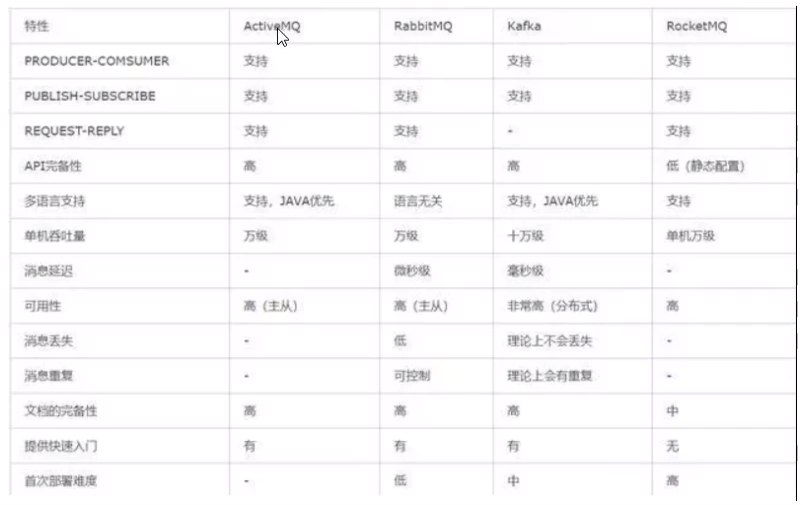

(1) kafka

编程语言：scala。

大数据领域的主流MQ。

(2) rabbitmq

编程语言：erlang

基于erlang语言，不好修改底层，不好查找问题的原因，不建议选用。

(3) rocketmq

编程语言：java

适用于大型项目。适用于集群。

(4) activemq

编程语言：java

适用于中小型项目。

### 2.2  MQ的产生背景

系统之间直接调用存在的问题？

微服务架构后，`链式调用`是我们在写程序时候的一般流程，为了完成一个整体功能会将其拆分成多个函数(或子模块)，比如模块A调用模块B，模块B调用模块C，模块C调用模块D。但在大型分布式应用中，系统间的RPC交互繁杂，一个功能背后要调用上百个接口并非不可能，从单机架构过渡到分布式微服务架构的通例。这些架构会有哪些问题？

**(1)**  **系统之间接口耦合比较严重**

每新增一个下游功能，都要对上游的相关接口进行改造；

举个例子：如果系统A要发送数据给系统B和系统C，发送给每个系统的数据可能有差异，因此系统A对要发送给每个系统的数据进行了组装，然后逐一发送；

当代码上线后又新增了一个需求：把数据也发送给D，新上了一个D系统也要接受A系统的数据，此时就需要修改A系统，让他感知到D系统的存在，同时把数据处理好再给D。在这个过程你会看到，每接入一个下游系统，都要对系统A进行代码改造，开发联调的效率很低。其整体架构如下图：

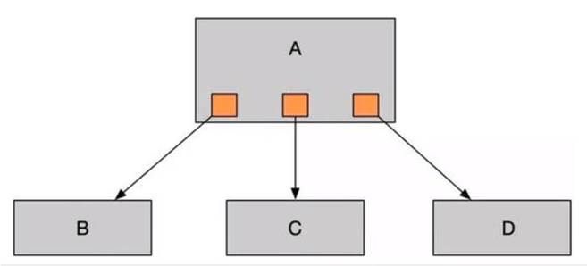

 

 

**(2)**  **面对大流量并发时，容易被冲垮**

每个接口模块的吞吐能力是有限的，这个上限能力如果是堤坝，当大流量（洪水）来临时，容易被冲垮。

举个例子秒杀业务：上游系统发起下单购买操作，就是下单一个操作，很快就完成。然而，下游系统要完成秒杀业务后面的所有逻辑（读取订单，库存检查，库存冻结，余额检查，余额冻结，订单生产，余额扣减，库存减少，生成流水，余额解冻，库存解冻）。

**(3)**  **等待同步存在性能问题**

RPC接口上基本都是同步调用，整体的服务性能遵循“木桶理论”，即整体系统的耗时取决于链路中最慢的那个接口。比如A调用B/C/D都是50ms，但此时B又调用了B1，花费2000ms，那么直接就拖累了整个服务性能。

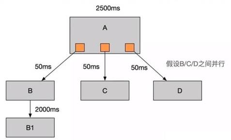

 

 

根据上述的几个问题，在设计系统时可以明确要达到的目标：

1. 要做到系统解耦，当新的模块接进来时，可以做到代码改动最小；**能够解耦**

2. 设置流量缓冲池，可以让后端系统按照自身吞吐能力进行消费，不被冲垮；**能削峰**

3. 强弱依赖梳理能将非关键调用链路的操作异步化并提升整体系统的吞吐能力；**能够异步**

###  2.3  MQ的主要作用

(1) **异步**——调用者无需等待。

(2) **解耦**——解决了系统之间耦合调用的问题。

(3) **消峰**——抵御洪峰流量，保护了主业务。

### 2.4  MQ的定义

**面向消息的中间件（message-oriented middleware）MOM**能够很好的解决以上问题。

**MQ**是指利用高效可靠的消息传递机制与平台无关的数据交流，并基于数据通信来进行分布式系统的集成。通过提供**消息传递**和**消息排队**模型在分布式环境下提供应用解耦，弹性伸缩，冗余存储、流量削峰，异步通信，数据同步等功能。

大致的过程是这样的：

发送者把消息发送给消息服务器，消息服务器将消息存放在若干**队列/主题**中，在合适的时候，消息服务器回将消息转发给接受者。在这个过程中，**发送和接收是`异步`的**，也就是发送无需等待，而且发送者和接受者的生命周期也没有必然的关系；尤其在发布pub/订阅sub模式下，也可以完成一对多的通信，即让一个消息有多个接受者。

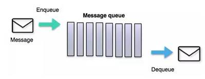

### 2.5  MQ的特点

#### **(1)  采用异步处理模式**

消息发送者可以发送一个消息而无须等待响应。消息发送者将消息发送到一条虚拟的通道（主题或者队列）上；

消息接收者则订阅或者监听该爱通道。一条消息可能最终转发给一个或者多个消息接收者，这些消息接收者都无需对消息发送者做出同步回应。整个过程都是异步的。

案例：

也就是说，一个系统跟另一个系统之间进行通信的时候，假如系统A希望发送一个消息给系统B，让他去处理。但是系统A不关注系统B到底怎么处理或者有没有处理好，所以系统A把消息发送给MQ，然后就不管这条消息的“死活了”，接着系统B从MQ里面消费出来处理即可。至于怎么处理，是否处理完毕，什么时候处理，都是系统B的事儿，与系统A无关。

 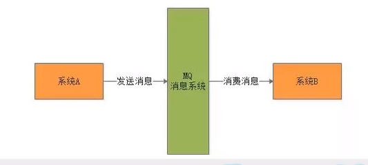

#### **(2)  应用系统之间解耦合**

发送者和接受者不必了解对方，只需要确认消息。

发送者和接受者不必同时在线。

#### **(3)  案例整体架构**

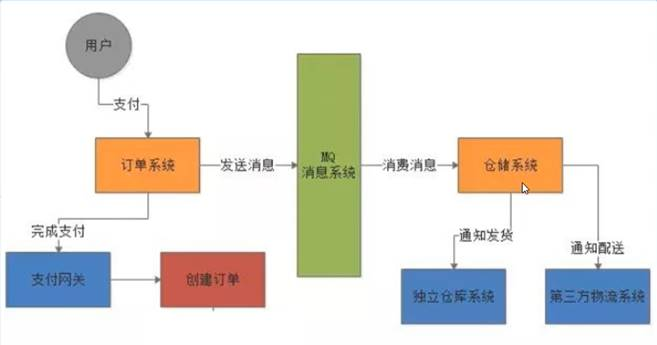

 

#### **(4)  MQ的缺点**

两个系统之间不能同步调用，不能实时回复，不能响应某个调用的回复。

## 3.  ActiveMQ安装和控制台

### 3.1  ActiveMQ安装

#### **(1)   官方下载**

官网地址： http://activemq.apache.org/

点击下面，开始下载。

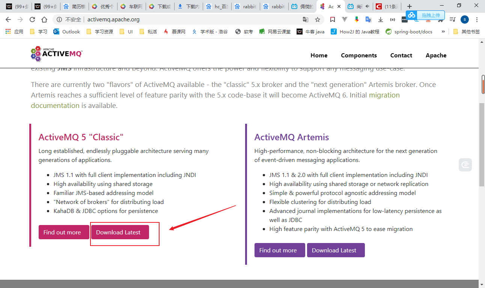

 

#### **(2)   安装步骤**

我按照这网址安装的：http://blog.csdn.net/gebitan505/article/details/55096222。我个人感觉这个博客要比老师介绍的更详细。

安装步骤：

①　创建目录

```shell
[root@iz2zecamxg0abujhfi0y7iz ~]# cd /usr/local/
[root@iz2zecamxg0abujhfi0y7iz local]# mkdir activemq
[root@iz2zecamxg0abujhfi0y7iz local]# cd activemq
```

②　上传安装包

```shell
[root@iz2zecamxg0abujhfi0y7iz local]# rz
```

③　解压

```shell
[root@iz2zecamxg0abujhfi0y7iz activemq]# tar -xzvf apache-activemq-5.15.13-bin.tar.gz 
```

④　在/etc/init.d/目录增加增加activemq文件

```shell
[root@iz2zecamxg0abujhfi0y7iz activemq]# cd /etc/init.d/

[root@iz2zecamxg0abujhfi0y7iz init.d]# vi activemq
```

注意：将下面内容全部复制。 要先安装jdk，在下面配置jdk的安装目录。

```shell
#!/bin/sh
#
# /etc/init.d/activemq
# chkconfig: 345 63 37
# description: activemq servlet container.
# processname: activemq 5.14.3 
# Source function library.
#. /etc/init.d/functions
# source networking configuration.
#. /etc/sysconfig/network 
export JAVA_HOME=/usr/local/jdk1.8.0_131
export CATALINA_HOME=/usr/local/activemq/apache-activemq-5.15.13 
case $1 in    
	start)        
		sh $CATALINA_HOME/bin/activemq start   
        ;; 
    stop)
    	sh $CATALINA_HOME/bin/activemq stop
        ;;  
    restart)
    	sh $CATALINA_HOME/bin/activemq stop
        sleep 1
        sh $CATALINA_HOME/bin/activemq start    
        ;; 
esac
exit 0
```

```shell
[root@iz2zecamxg0abujhfi0y7iz init.d]# chmod 777 activemq
```

⑤　设置开机启动

```shell
[root@iz2zecamxg0abujhfi0y7iz init.d]# chkconfig activemq on
```

⑥　启动ActiveMQ

```shell
[root@iz2zecamxg0abujhfi0y7iz init.d]# service activemq start
```

> 普通同启动方式：进入activemq目录中的bin目录，输入`./activemq start`
>
> `activemq的默认进程端口是61616`    注意是进程端口号哦
>
> `ps -ef|grep activemq|grep -v grep`查看进程，后边`|grep -v grep`是屏蔽掉因为该命令出现的进程
>
> `netstat -anp|grep 61616`查看端口
>
> `lsof -i:66616` 查看61616端口被哪个进程占用
>
> 普通方式关闭：`./activemq stop`
>
> 重启： `./activemq restart`

⑦　访问activemq管理页面地址：http://IP地址:8161/  

账户admin 密码admin

⑧　查看activemq状态

​      service activemq status

​    关闭activemq服务

​      service activemq stop

> 注意：④-⑤是非必须的，
>
> `带日志形式启动`  `./activemq start > /myactivemq/run-activemq.log`

#### **(3)   因为主机名不符合规范导致无法启动activemq**

https://blog.csdn.net/qq_39056805/article/details/80749337

 

#### **(4)   启动时指定日志输出文件（重要）**

activemq日志默认的位置是在：`%activemq安装目录%/data/activemq.log`

这是我们启动时指定日志输出文件：

```shell
[root@VM_0_14_centos raohao]# service activemq start > /usr/local/raohao/activemq.log
```

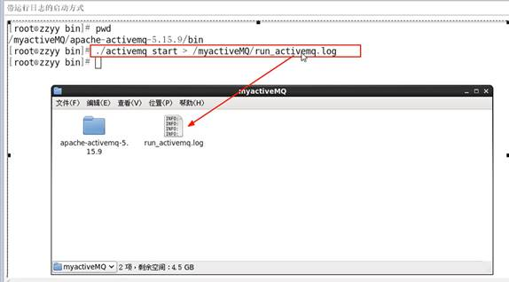

 

#### **(5)   查看程序启动是否成功的3种方式（通用）**

方式1：查看进程

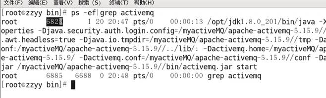

方式2：查看端口是否被占用

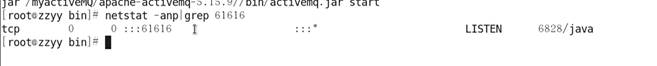

方式3：查看端口是否被占用

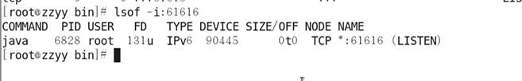

 

### 3.2  ActiveMQ控制台

(1) 访问activemq管理页面地址：http://112.74.166.69:8161/  

账户admin 密码admin

(2) 进入

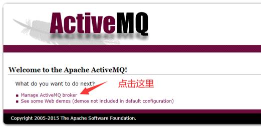

 

(3) 其他的，我们在后面实战中再去详细讲解。

> 备注：采用61616端口提供JMS服务
>
> ​				采用8161端口提供管理控制台服务

## 4.入门案例、MQ标准、API详解

### 4.1  pom.xml导入依赖

```xml
    <dependencies>
        <!--activemq  所需要的jar 包-->
        <dependency>
            <groupId>org.apache.activemq</groupId>
            <artifactId>activemq-all</artifactId>
            <version>5.15.13</version>
        </dependency>
        <!--activemq 和 spring 整合的基础包-->
        <dependency>
            <groupId>org.apache.xbean</groupId>
            <artifactId>xbean-spring</artifactId>
            <version>3.16</version>
        </dependency>
        <!--以下是junit/log4j等基础通用配置-->
        <dependency>
            <groupId>org.slf4j</groupId>
            <artifactId>slf4j-api</artifactId>
            <version>1.7.25</version>
        </dependency>
        <dependency>
            <groupId>ch.qos.logback</groupId>
            <artifactId>logback-classic</artifactId>
            <version>1.2.3</version>
        </dependency>
        <dependency>
            <groupId>org.projectlombok</groupId>
            <artifactId>lombok</artifactId>
            <version>1.18.10</version>
            <scope>provided</scope>
        </dependency>
        <dependency>
            <groupId>junit</groupId>
            <artifactId>junit</artifactId>
            <version>4.12</version>
        </dependency>
    </dependencies>
```


### 4.2  JMS编码总体规范

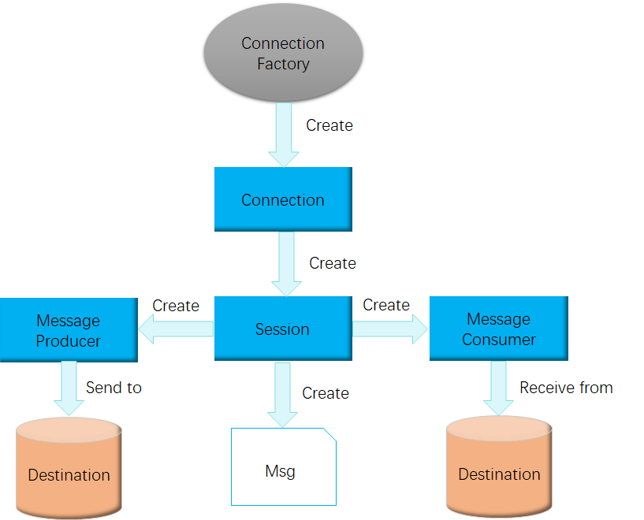


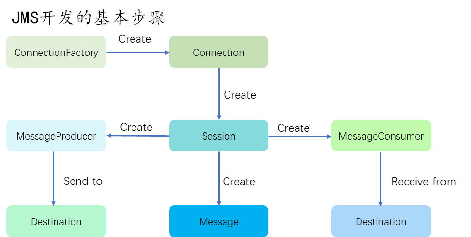

 

 **JMS开发的基本步骤**

1. 创建一个connection factory

2. 通过connection factory创建JMS connection

3. 启动JMS connection

4. 通过connection创建JMS session

5. 创建JMS destination

6. 创建JMS producer或者创建JMSMessage并设置destination

7. 创建JMS consumer或者是注册一个JMS message listener

8. 发送或者接受JSM message(s)

9. 关闭所有的JMS资源

（connection session producer consumer等）

### 4.3  Destination简介

Destination是目的地。下面拿jvm和mq，做个对比。目的地，我们可以理解为是数据存储的地方。

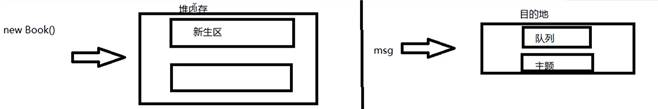

Destination分为两种：队列和主题。

> 在点对点的消息传递域中，目的地被称为队列（queue）
>
> 在发布订阅小子传递域中，目的地被称为主题（topic）

下图介绍：

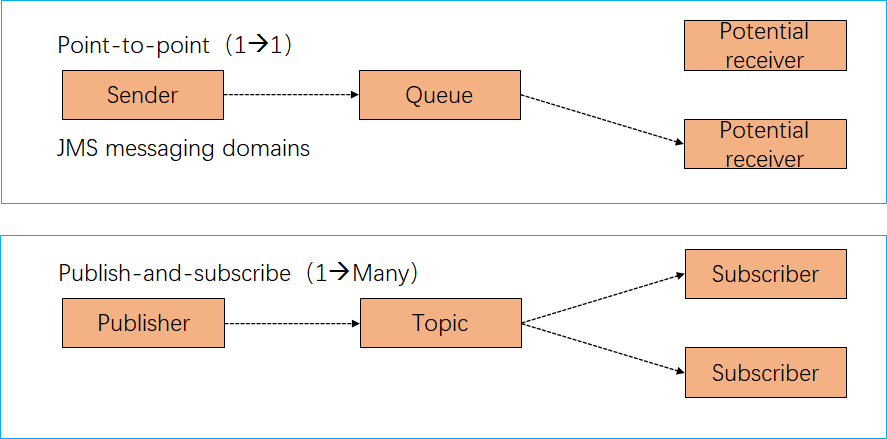


 

 

### 4.4  队列消息生产者的入门案例

```java
package com.szimo.activemq.demo;


import org.apache.activemq.ActiveMQConnectionFactory;

import javax.jms.*;


/**
 * @author shensr
 * @date 2020/7/12
 **/

public class JmsProduce {
    /**
     * linux 上部署的activemq的IP地址+activemq的端口号
     */

    public static final String ACTIVEMQ_URL = "tcp://112.74.166.69:61616";
    /**
     * 目的地的名称
     */
    public static final String QUEUE_NAME = "jdbc01";

    public static void main(String[] args) throws Exception {
        // 1 按照给定的url创建连接工厂，这个构造器采用默认的用户名密码。该类的其他构造方法可以指定用户名和密码。
        ActiveMQConnectionFactory activeMQConnectionFactory = new ActiveMQConnectionFactory(ACTIVEMQ_URL);
        // 2 通过连接工厂，获得连接 connection 并启动访问
        Connection connection = activeMQConnectionFactory.createConnection();
        connection.start();
        // 3 创建会话session 。第一参数是是否开启事务， 第二参数是消息签收的方式
        Session session = connection.createSession(false, Session.AUTO_ACKNOWLEDGE);
        // 4 创建目的地（两种 ：队列/主题）。Destination是Queue和Topic的父类
        Queue queue = session.createQueue(QUEUE_NAME);
        // 5 创建消息的生产者
        MessageProducer messageProducer = session.createProducer(queue);
        // 6 通过messageProducer 生产 3 条 消息发送到消息队列中
        for (int i = 1; i < 4; i++) {
            //  // 7 创建消息
            TextMessage textMessage = session.createTextMessage("msg--" + i);
            // 8 通过messageProducer发送给mq
            messageProducer.send(textMessage);
        }
        // 9 关闭资源
        messageProducer.close();
        session.close();
        connection.close();
        System.out.println("**** 消息发送到MQ完成 ****");
    }
}

```

 

 

### 4.5  ActiveMQ控制台之队列

运行上面代码，控制台显示如下：

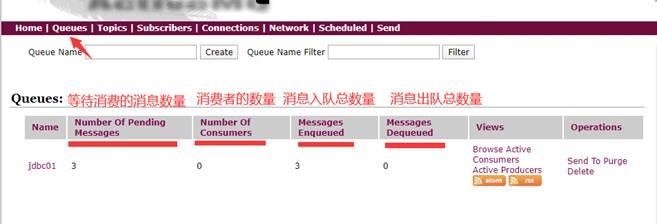

|            Name            |      解释      | 备注                                             |
| :------------------------: | :------------: | ------------------------------------------------ |
| Number Of Pending Messages | 等待消费的消息 | 这个是未出队列的数量。`公式=总接收数-总出队列数` |
|    Number Of Consumers     |   消费者数量   | 消费者端的消费者数量                             |
|     Messages Enqueued      |   进队消息数   | 进入队列的总数量，包括出队列的。这个数只增不减。 |
|     Messages Dequeued      |   出队消息数   | 可以理解为是消费者消费掉的数量                   |

总结：

当有一个消息进入这个队列时，等待消费的消息是1，进入队列的消息是1。

当消息消费后，等待消费的消息是0，进入队列的消息是1，出队列的消息是1。

当再来一条消息时，等待消费的消息是1，进入队列的消息就是2。

 

 

### 4.6  队列消息消费者的入门案例（同步阻塞方式）

```java
package com.szimo.activemq.demo;

import org.apache.activemq.ActiveMQConnectionFactory;

import javax.jms.*;

/**
 * 消息消费者
 *
 * @author shensr
 * @date 2020/7/12
 **/

public class JmsConsumer {

    /**
     * linux 上部署的activemq的IP地址+activemq的端口号
     */

    public static final String ACTIVEMQ_URL = "tcp://112.74.166.69:61616";
    /**
     * 目的地的名称
     */
    public static final String QUEUE_NAME = "jdbc01";

    public static void main(String[] args) throws JMSException {

        // 1 按照给定的url创建连接工厂，这个构造器采用默认的用户名密码。该类的其他构造方法可以指定用户名和密码。
        ActiveMQConnectionFactory activeMQConnectionFactory = new ActiveMQConnectionFactory(ACTIVEMQ_URL);
        // 2 通过连接工厂，获得连接 connection 并启动访问
        Connection connection = activeMQConnectionFactory.createConnection();
        connection.start();
        // 3 创建会话session 。第一参数是是否开启事务， 第二参数是消息签收的方式
        Session session = connection.createSession(false, Session.AUTO_ACKNOWLEDGE);
        // 4 创建目的地（两种 ：队列/主题）。Destination是Queue和Topic的父类
        Queue queue = session.createQueue(QUEUE_NAME);
        // 5 创建消费者
        MessageConsumer consumer = session.createConsumer(queue);
        while (true) {
            // reveive() 一直等待接收消息，在能够接收到消息之前将一直阻塞。 是同步阻塞方式 。和socket的accept方法类似的。
            // reveive(Long time) : 等待n毫秒之后还没有收到消息，就是结束阻塞。
            // 因为消息发送者是 TextMessage，所以消息接受者也要是TextMessage
            TextMessage message = (TextMessage) consumer.receive();
            if (message != null) {
                System.out.println("****消费者的消息：" + message.getText());
            } else {
                break;
            }
        }
        consumer.close();
        session.close();
        connection.close();

    }
}

```

控制台显示：

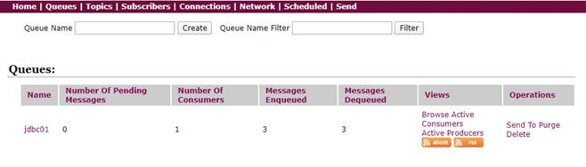

 

 

### 4.7  异步监听式消费者（MessageListener）

```java
package com.szimo.activemq.demo;

import org.apache.activemq.ActiveMQConnectionFactory;

import javax.jms.*;

/**
 * 消息消费者
 *
 * @author shensr
 * @date 2020/7/12
 **/

public class JmsConsumer {

    /**
     * linux 上部署的activemq的IP地址+activemq的端口号
     */

    public static final String ACTIVEMQ_URL = "tcp://112.74.166.69:61616";
    /**
     * 目的地的名称
     */
    public static final String QUEUE_NAME = "jdbc01";

    public static void main(String[] args) throws Exception {

        // 1 按照给定的url创建连接工厂，这个构造器采用默认的用户名密码。该类的其他构造方法可以指定用户名和密码。
        ActiveMQConnectionFactory activeMQConnectionFactory = new ActiveMQConnectionFactory(ACTIVEMQ_URL);
        // 2 通过连接工厂，获得连接 connection 并启动访问
        Connection connection = activeMQConnectionFactory.createConnection();
        connection.start();
        // 3 创建会话session 。第一参数是是否开启事务， 第二参数是消息签收的方式
        Session session = connection.createSession(false, Session.AUTO_ACKNOWLEDGE);
        // 4 创建目的地（两种 ：队列/主题）。Destination是Queue和Topic的父类
        Queue queue = session.createQueue(QUEUE_NAME);
        // 5 创建消费者
        MessageConsumer consumer = session.createConsumer(queue);
         /**
          * 通过监听的方式来消费消息，是异步非阻塞的方式消费消息。
          * 通过messageConsumer 的setMessageListener 注册一个监听器，
          * 当有消息发送来时，系统自动调用MessageListener 的 onMessage 方法处理消息
          *
          */
        consumer.setMessageListener(message -> {
            //  instanceof 判断是否A对象是否是B类的子类
            if (null != message && message instanceof TextMessage) {

                TextMessage textMessage = (TextMessage) message;

                try {

                    System.out.println("****消费者的消息：" + textMessage.getText());

                } catch (JMSException e) {

                    e.printStackTrace();

                }

            }

        });

        // 让主线程不要结束。因为一旦主线程结束了，其他的线程（如此处的监听消息的线程）也都会被迫结束。

        // 实际开发中，我们的程序会一直运行，这句代码System.in.read();都会省略。

        System.in.read();

        consumer.close();
        session.close();
        connection.close();

    }
}

```

 

 

### 4.8  队列消息（Queue）总结

#### (1)    两种消费方式

- 同步阻塞方式(receive)

  订阅者或接收者使用MessageConsumer的receive()方法来接收消息，receive方法在能接收到消息之前（或超时之前）将一直阻塞。

- 异步非阻塞方式（监听器onMessage()）

  订阅者或接收者通过MessageConsumer的setMessageListener(MessageListener listener)注册一个消息监听器，当消息到达之后，系统会自动调用监听器MessageListener的onMessage(Message message)方法。


#### (2)    队列的特点

**点对点消息传递域的特点**

- 每个消息只能有一个消费者，类似1对1的关系，好比个人取快递：自己领取自己的。
- 消息的生产者和消费者之间`没有时间上的相关性`。无论消费者在生产者发送消息的时候是否处于运行状态，消费者都可以提取消息，好比我们的发送短信，发送者发送后不见得接收者会即收即看。
- 消息被消费后队列中`不会再存储`，所以消费者`不会消费到已经被消费掉的消息`。

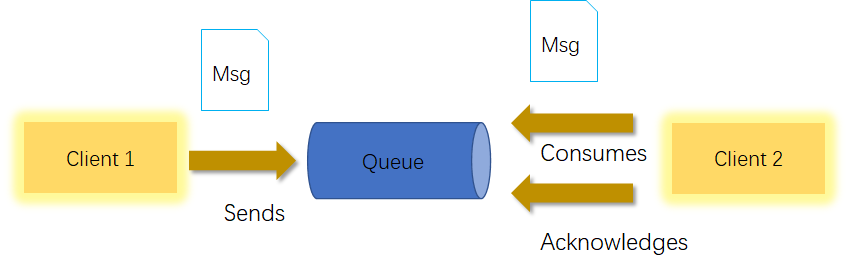


#### (3)   消息消费情况

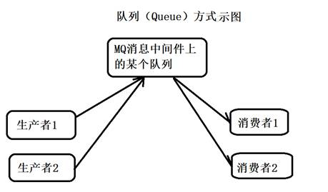

情况1：只启动消费者1。

结果：消费者1会消费所有的数据。

情况2：先启动消费者1，再启动消费者2。

结果：消费者1消费所有的数据。消费者2不会消费到消息。

情况3：生产者发布6条消息，在此之前已经启动了消费者1和消费者2。

结果：消费者1和消费者2平摊了消息。各自消费3条消息，轮询消费。

疑问：怎么去将消费者1和消费者2不平均分摊呢？而是按照各自的消费能力去消费。我觉得，现在activemq就是这样的机制。

#### (4) JMS开发流程——见4.2节JMS编码总体规范

见4.2节JMS编码总体规范

###  4.9  Topic介绍入门案例、控制台

#### (1)   topic介绍

在发布订阅消息传递域中，目的地被称为`主题（topic）`

**发布/订阅消息传递域的特点如下：**

- 生产者将消息发布到topic中，每个消息可以有多个消费者，属于1：N的关系；

- 生产者和消费者之间`有时间上`的相关性。订阅某一个主题的消费者只能消费`自它订阅之后发布的消息`。

- 生产者生产时，topic`不保存消息`它是`无状态`的不落地，假如无人订阅就去生产，那就是一条废消息，所以，**一般先启动消费者再启动生产者**。

 默认情况下如上所述，但是JMS规范允许客户创建`持久订阅`，这在一定程度上放松了时间上的相关性要求。持久订阅允许消费者消费它在未处于激活状态时发送的消息。**一句话，好比我们的微信公众号订阅**

 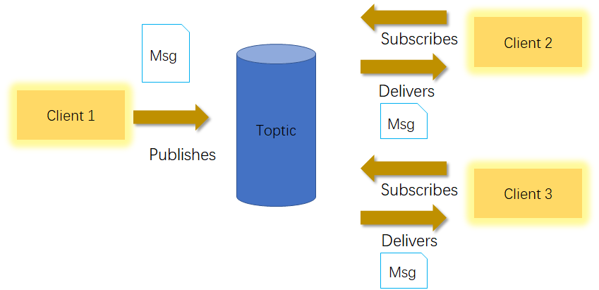

 

#### (2)   生产者案例

 

```java
package com.szimo.activemq.topic;


import org.apache.activemq.ActiveMQConnectionFactory;

import javax.jms.*;


/**
 * @author shensr
 * @date 2020/7/12
 */
public class JmsProduceTopic {


    public static final String ACTIVEMQ_URL = "tcp://112.74.166.69:61616";

    public static final String TOPIC_NAME = "topic01";


    public static void main(String[] args) throws Exception {

        ActiveMQConnectionFactory activeMQConnectionFactory = new ActiveMQConnectionFactory(ACTIVEMQ_URL);
        Connection connection = activeMQConnectionFactory.createConnection();
        connection.start();
        Session session = connection.createSession(false, Session.AUTO_ACKNOWLEDGE);
        Topic topic = session.createTopic(TOPIC_NAME);
        MessageProducer messageProducer = session.createProducer(topic);
        for (int i = 1; i < 4; i++) {
            TextMessage textMessage = session.createTextMessage("topic_name--" + i);
            messageProducer.send(textMessage);
            MapMessage mapMessage = session.createMapMessage();

        }
        messageProducer.close();
        session.close();
        connection.close();
        System.out.println("  **** TOPIC_NAME消息发送到MQ完成 ****");

    }

}
```

 

#### (3)   消费者入门案例

```java
package com.szimo.activemq.topic;

import org.apache.activemq.ActiveMQConnectionFactory;

import javax.jms.*;

/**
 * @author shensr
 * @date 2020/7/12
 */
public class JmsConsumerTopic {

    public static final String ACTIVEMQ_URL = "tcp://112.74.166.69:61616";

    public static final String TOPIC_NAME = "topic01";

    public static void main(String[] args) throws Exception {

        ActiveMQConnectionFactory activeMQConnectionFactory = new ActiveMQConnectionFactory(ACTIVEMQ_URL);
        Connection connection = activeMQConnectionFactory.createConnection();
        connection.start();
        Session session = connection.createSession(false, Session.AUTO_ACKNOWLEDGE);

        // 4 创建目的地 （两种 ： 队列/主题   这里用主题）
        Topic topic = session.createTopic(TOPIC_NAME);
        MessageConsumer messageConsumer = session.createConsumer(topic);
        // MessageListener接口只有一个方法，可以使用lambda表达式
        messageConsumer.setMessageListener((message) -> {
            if (null != message && message instanceof TextMessage) {
                TextMessage textMessage = (TextMessage) message;
                try {
                    System.out.println("****消费者text的消息：" + textMessage.getText());
                } catch (JMSException e) {
                    e.printStackTrace();
                }

            }

        });

        System.in.read();
        messageConsumer.close();
        session.close();
        connection.close();
    }

}
```

存在多个消费者，每个消费者都能收到，自从自己启动后所有生产的消息。

 

#### (4)    ActiveMQ控制台

topic有多个消费者时，消费消息的数量 ≈ 在线消费者数量*生产消息的数量。

下图展示了：我们先启动了3个消费者，再启动一个生产者，并生产了3条消息。


 

 

### 4.10  tpoic和queue对比


| 比较项目   | Topic模式队列                                                | Queue模式队列                                                |
| ---------- | ------------------------------------------------------------ | ------------------------------------------------------------ |
| 工作模式   | “订阅-发布”模式，如果当前没有订阅者，消息将会丢弃。如果有多个订阅者，那么这些订阅者都会收到消息 | “负载均衡”模式，吐过当前没有消费者，消息也不会丢弃；如果有多个消费者，那么一条消息也只会发送给其中一个消费者，并且要求消费者ack信息。 |
| 有无状态   | 无状态                                                       | Queue数据默认会在mq服务器上以文件形式保存，比如Active MQ一般保存在$AMQ_HOME\data\kr-store\\data下面。也可以配置成DB存储 |
| 传递完整性 | 如果没有订阅者，消息会被丢弃                                 | 消息会不丢弃                                                 |
| 处理效率   | 由于消息要按照订阅者的数量进行复制，所以处理性能会随着订阅者的增加二明显降低，并且还要结合不同消息协议自身的性能差异 | 由于一条消息只能发送给一个消费者，所以就算消费者再多，性能也不会明显降低。当然不同消息写一的具体性能也是有差异的。 |

 

## 5. JMS规范

### 5.1  JMS是什么

什么是Java消息服务？

Java消息服务指的是两个应用程序之间进行异步通信的API，它为标准协议和消息服务提供了一组通用接口，包括创建、发送、读取消息等，用于支持Java应用程序开发。在JavaEE中，当两个应用程序使用JMS进行通信时，它们之间不是直接相连的，而是通过一个共同的消息收发服务组件关联起来以达到解耦/异步削峰的效果。

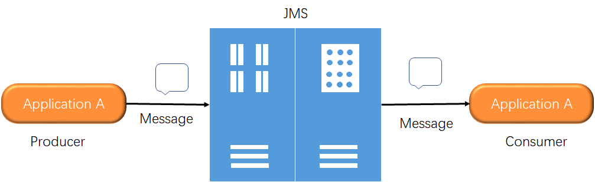


### 5.2 JMS的组成结构和特点

- `JMS Provider`——实现JMS接口和规范的消息中间件，也就是我们说的MQ服务器
- `JMS Producer`——消息生产者，创建和发送JMS消息的客户端应用
- `JMS Consumer`——消息消费者，接收和处理JMS消息的客户端应用
- `JMS Message`——**消息头、消息属性、消息体**

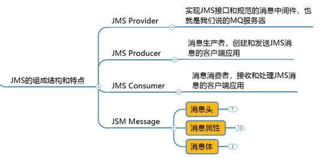

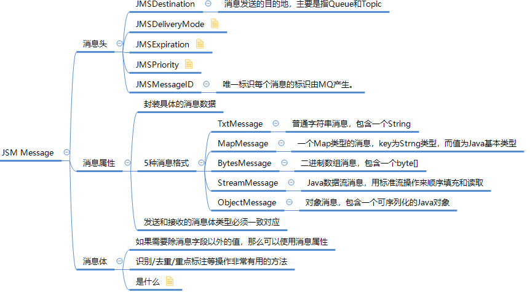

#### 5.2.1  消息头

JMS的消息头有哪些属性：

**JMSDestination**：消息发送的目的地，主要是指Queue和Topic

**JMSDeliveryMode**：消息持久化模式

`持久模式`和`非持久模式`

- 
  一条持久性的消息：应该被传送“一次仅仅一次”，这就意味着如果JMS提供者出现故障，该消息并不会丢失，它会在服务器恢复之后再次传递。


- 
  一条非持久的消息：最多会传递一次，这意味着服务器出现故障，该消息将会永远丢失。

**JMSExpiration**：消息过期时间

可以设置消息在一定时间后过期，默认是`永不过期`

- 
  消息过期时间，等于Destination的send方法中的timeToLive值加上发送时刻的GMT时间值。


- 
  如果timeToLive值等于0，则JMSExpiration被设为0，表示该消息永不过期。


- 
  如果发送后，在消息过期时间之后还没有被发送到目的地，则该消息被清除。

**JMSPriority**：消息的优先级

消息优先级，从0-9十个级别，0-4是普通消息5-9是加急消息。

- JMS`不要求`MQ严格按照这十个优先级发送消息但必须保证加急消息要先于普通消息到达。`默认是4级。`

**JMSMessageID**：消息的唯一标识符。后面我们会介绍如何解决幂等性。

说明： 消息的生产者可以set这些属性，消息的消费者可以get这些属性。

这些属性在send方法里面也可以设置。

```java
package com.szimo.activemq.topic;


import org.apache.activemq.ActiveMQConnectionFactory;

import javax.jms.*;


/**
 * @author shensr
 * @date 2020/7/12
 */
public class JmsProduceTopic {


    public static final String ACTIVEMQ_URL = "tcp://112.74.166.69:61616";

    public static final String TOPIC_NAME = "topic01";


    public static void main(String[] args) throws Exception {

        ActiveMQConnectionFactory activeMQConnectionFactory = new ActiveMQConnectionFactory(ACTIVEMQ_URL);
        Connection connection = activeMQConnectionFactory.createConnection();
        connection.start();
        Session session = connection.createSession(false, Session.AUTO_ACKNOWLEDGE);
        Topic topic = session.createTopic(TOPIC_NAME);
        MessageProducer messageProducer = session.createProducer(topic);
        for (int i = 1; i < 4; i++) {
            TextMessage textMessage = session.createTextMessage("topic_name--" + i);
            // 这里可以指定每个消息的目的地
            textMessage.setJMSDestination(topic);
            //持久模式和非持久模式。 值为2是持久的（源码中查看）
            textMessage.setJMSDeliveryMode(0);
            // 可以设置消息在一定时间后过期，默认是永不过期。
            textMessage.setJMSExpiration(1000);
            // 消息优先级，从0-9十个级别，0-4是普通消息5-9是加急消息。
            textMessage.setJMSPriority(10);
            // 唯一标识每个消息的标识。MQ会给我们默认生成一个，我们也可以自己指定。
            textMessage.setJMSMessageID("ABCD");
            messageProducer.send(textMessage);       
        }
        messageProducer.close();
        session.close();
        connection.close();
        System.out.println("  **** TOPIC_NAME消息发送到MQ完成 ****");

    }

}
```

 

#### 5.2.2  消息体

**消息体**：封装具体的消息数据，发送和接收的消息体类型必须一致对应

**5种消息体格式**

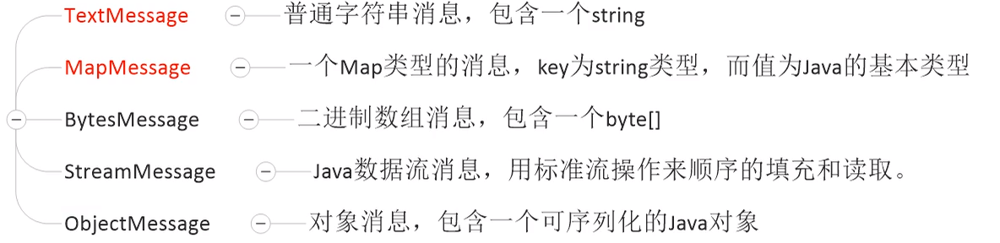

常用的就是`TextMessage`和`MapMessage`（约95%）

 下面我们演示TextMessage和MapMessage的用法。

```java
package com.szimo.activemq.topic;
import org.apache.activemq.ActiveMQConnectionFactory;
import javax.jms.*;


/**
 * 生产者
 * @author shensr
 * @date 2020/7/12
 */
public class JmsProduceTopic {
    
    public static final String ACTIVEMQ_URL = "tcp://112.74.166.69:61616";
    public static final String TOPIC_NAME = "topic01";

    public static void main(String[] args) throws Exception {

        ActiveMQConnectionFactory activeMQConnectionFactory = new ActiveMQConnectionFactory(ACTIVEMQ_URL);
        Connection connection = activeMQConnectionFactory.createConnection();
        connection.start();
        Session session = connection.createSession(false, Session.AUTO_ACKNOWLEDGE);
        Topic topic = session.createTopic(TOPIC_NAME);
        MessageProducer messageProducer = session.createProducer(topic);
        for (int i = 1; i < 4; i++) {
            // 发送TextMessage消息体
            TextMessage textMessage = session.createTextMessage("topic_name--" + i);
            messageProducer.send(textMessage);
            // 发送MapMessage消息体。set方法: 添加，get方式：获取
            MapMessage mapMessage = session.createMapMessage();
            mapMessage.setString("name", "张三" + i);
            mapMessage.setInt("age", 18 + i);
            messageProducer.send(mapMessage);
        }
        messageProducer.close();
        session.close();
        connection.close();
        System.out.println("  **** TOPIC_NAME消息发送到MQ完成 ****");

    }

}
```

 

```java
package com.szimo.activemq.topic;
import org.apache.activemq.ActiveMQConnectionFactory;
import javax.jms.*;

/**
 * 消费者
 * @author shensr
 * @date 2020/7/12
 */
public class JmsConsumerTopic {

    public static final String ACTIVEMQ_URL = "tcp://112.74.166.69:61616";

    public static final String TOPIC_NAME = "topic01";
    public static void main(String[] args) throws Exception {

        ActiveMQConnectionFactory activeMQConnectionFactory = new ActiveMQConnectionFactory(ACTIVEMQ_URL);
        Connection connection = activeMQConnectionFactory.createConnection();
        connection.start();
        Session session = connection.createSession(false, Session.AUTO_ACKNOWLEDGE);

        // 4 创建目的地 （两种 ： 队列/主题   这里用主题）
        Topic topic = session.createTopic(TOPIC_NAME);
        MessageConsumer messageConsumer = session.createConsumer(topic);
        // MessageListener接口只有一个方法，可以使用lambda表达式
        messageConsumer.setMessageListener((message) -> {
            // 判断消息是哪种类型之后，再强转。
            if (message instanceof TextMessage) {
                TextMessage textMessage = (TextMessage) message;
                try {
                    System.out.println("****消费者text的消息：" + textMessage.getText());
                } catch (JMSException e) {
                    e.printStackTrace();
                }
            }

            //null != message 不用判断message是否为空，instanceof运算符左操作数为空，结果为false
            if (message instanceof MapMessage) {
                MapMessage mapMessage = (MapMessage) message;
                try {
                    System.out.println("****消费者的map消息：" + mapMessage.getString("name"));
                    System.out.println("****消费者的map消息：" + mapMessage.getInt("age"));
                } catch (JMSException e) {
                    e.printStackTrace();
                }

            }


        });

        System.in.read();
        messageConsumer.close();
        session.close();
        connection.close();
    }

}
```


#### 5.2.3  消息属性

如果需要除消息头字段之外的值，那么可以使用消息属性。他是识别/去重/重点标注等操作，非常有用的方法。

他们是以`属性名`和`属性值`对的形式制定的。可以将属性是为消息头得扩展，属性指定一些消息头没有包括的附加信息，比如可以在属性里指定消息选择器。消息的属性就像可以分配给一条消息的附加消息头一样。它们允许开发者添加有关消息的不透明附加信息。它们还用于暴露消息选择器在消息过滤时使用的数据。

下图是设置消息属性的API：

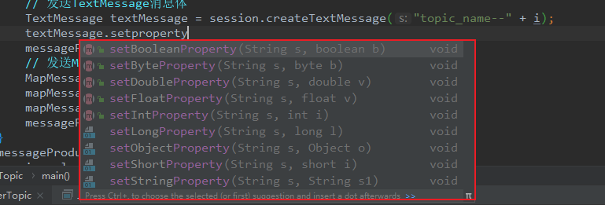

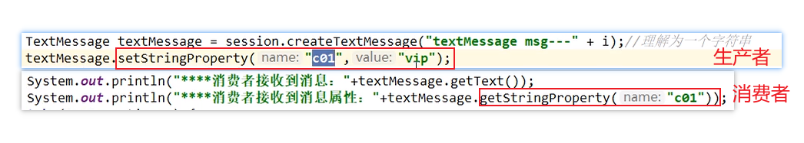

### 5.3 JMS的可靠性

#### 5.3.1 消息的持久化（PERSISTENT）

保证消息只被传送一次和成功使用一次。在持久性消息传送至目标时，消息服务将其放入持久性数据存储。如果消息服务由于某种原因导致失败，它可以恢复此消息并将此消息传送至相应的消费者。虽然这样增加了消息传送的开销，但却增加了可靠性。

我的理解：在消息生产者将消息成功发送给MQ消息中间件之后。无论是出现任何问题，如：MQ服务器宕机、消费者掉线等。都保证（topic要之前注册过，queue不用）消息消费者，能够成功消费消息。如果消息生产者发送消息就失败了，那么消费者也不会消费到该消息。

**参数设置说明**

- **非持久化**：当服务器宕机，消息不存在

  ```java
  MessageProducer messageProducer = session.createProducer(topic);
  messageProducer.setDeliveryMode(DeliveryMode.NON_PERSISTENT);
  ```

- **持久化**：当服务器宕机，消息依然存在

  ```java
  messageProducer.setDeliveryMode(DeliveryMode.PERSISTENT);
  ```

- **Queue默认是持久化的**

 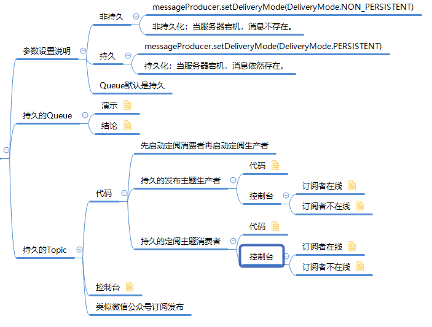

 

##### （1）queue消息非持久和持久

**queue非持久**：当服务器宕机，消息不存在（消息丢失了）。即便是非持久，消费者不在线的话，消息也不会丢失，等待消费者在线，还是能够收到消息的。

**queue持久化**：当服务器宕机，消息依然存在。queue消息默认是持久化的。

持久化消息，保证这些消息只被传送一次和成功使用一次。对于这些消息，可靠性是优先考虑的因素。

可靠性的另一个重要方面是确保持久性消息传送至目标后，消息服务在向消费者传送它们之前不会丢失这些消息。

 

 

##### （2）topic消息持久化

topic默认就是非持久化的，因为生产者生产消息时，消费者也要在线，这样消费者才能消费到消息。

topic消息持久化，只要消费者向MQ服务器注册过，所有生产者发布成功的消息，该消费者都能收到，不管是MQ服务器宕机还是消费者不在线。

 

> 注意：
>
> 1. 一定要先运行一次消费者，等于向MQ注册，类似我订阅了这个主题。
> 2. 然后再运行生产者发送消息。
> 3. 之后无论消费者是否在线，都会收到消息。如果不在线的话，下次连接的时候，会把没有收过的消息都接收过来。


```java
package com.szimo.activemq.persist;


import org.apache.activemq.ActiveMQConnectionFactory;

import javax.jms.*;


/**
 * @author shensr
 * @date 2020/7/12
 */
public class JmsProduceTopicPersist {

    public static final String ACTIVEMQ_URL = "tcp://112.74.166.69:61616";
    public static final String TOPIC_NAME = "topic-persist";

    public static void main(String[] args) throws Exception {

        ActiveMQConnectionFactory activeMQConnectionFactory = new ActiveMQConnectionFactory(ACTIVEMQ_URL);
        Connection connection = activeMQConnectionFactory.createConnection();

        Session session = connection.createSession(false, Session.AUTO_ACKNOWLEDGE);
        Topic topic = session.createTopic(TOPIC_NAME);
        MessageProducer messageProducer = session.createProducer(topic);
        messageProducer.setDeliveryMode(DeliveryMode.PERSISTENT);
        connection.start();
        for (int i = 1; i < 4; i++) {
            // 发送TextMessage消息体
            TextMessage textMessage = session.createTextMessage("持久化消息topic_name--" + i);
            messageProducer.send(textMessage);

        }
        messageProducer.close();
        session.close();
        connection.close();
        System.out.println("  **** TOPIC_NAME消息发送到MQ完成 ****");

    }

}
```


```java
package com.szimo.activemq.persist;


import org.apache.activemq.ActiveMQConnectionFactory;

import javax.jms.*;

/**
 * @author shensr
 * @date 2020/7/12
 */
public class JmsConsumerTopicPersist {

    public static final String ACTIVEMQ_URL = "tcp://112.74.166.69:61616";

    public static final String TOPIC_NAME = "topic-persist";


    public static void main(String[] args) throws Exception {

        ActiveMQConnectionFactory activeMQConnectionFactory = new ActiveMQConnectionFactory(ACTIVEMQ_URL);
        // 2 通过连接工厂获得连接connection，但是不要启动访问
        Connection connection = activeMQConnectionFactory.createConnection();
        connection.setClientID("z3");
        // 3 创建会话session 两个参数 第一个事务 第二个签收
        Session session = connection.createSession(false, Session.AUTO_ACKNOWLEDGE);
        // 4 创建目的地 （两种 ： 队列/主题   这里用主题）
        Topic topic = session.createTopic(TOPIC_NAME);
        TopicSubscriber topicSubscriber = session.createDurableSubscriber(topic,"remark...");

        connection.start();

        topicSubscriber.setMessageListener((message) -> {
            // 判断消息是哪种类型之后，再强转。
            if (message instanceof TextMessage) {
                TextMessage textMessage = (TextMessage) message;
                try {
                    System.out.println("****持久化的消息：" + textMessage.getText());
                } catch (JMSException e) {
                    e.printStackTrace();
                }
            }

        });

        System.in.read();
        topicSubscriber.close();
        session.close();
        connection.close();
    }

}
```

 

控制台介绍：

topic页面还是和之前的一样。另外在subscribers页面也会显示。如下：

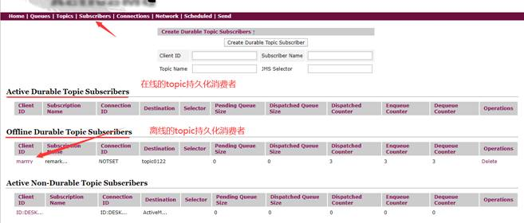

 

#### 5.3.2  消息的事务性

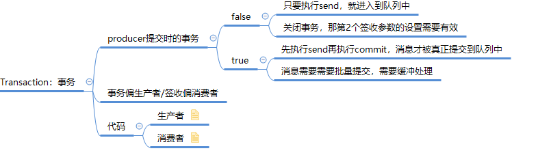


(1) 生产者开启事务后，执行commit方法，这批消息才真正的被提交。不执行commit方法，这批消息不会提交。执行rollback方法，之前的消息会回滚掉。生产者的事务机制，要高于签收机制，当生产者开启事务，签收机制不再重要。

 (2) 消费者开启事务后，执行commit方法，这批消息才算真正的被消费。不执行commit方法，这些消息不会标记已消费，下次还会被消费。执行rollback方法，是不能回滚之前执行过的业务逻辑，但是能够回滚之前的消息，回滚后的消息，下次还会被消费。消费者利用commit和rollback方法，甚至能够违反一个消费者只能消费一次消息的原理。

(3) 问：消费者和生产者需要同时操作事务才行吗？ 

答：消费者和生产者的事务，完全没有关联，各自是各自的事务。


> **事务偏生产者，签收偏消费者**

```java
package com.szimo.activemq.tx;

import org.apache.activemq.ActiveMQConnectionFactory;

import javax.jms.*;

public class Jms_TX_Producer {
    private static final String ACTIVEMQ_URL = "tcp://192.168.10.130:61616";
    private static final String ACTIVEMQ_QUEUE_NAME = "Queue-TX";

    public static void main(String[] args) throws JMSException {
        ActiveMQConnectionFactory activeMQConnectionFactory = new ActiveMQConnectionFactory(ACTIVEMQ_URL);
        Connection connection = activeMQConnectionFactory.createConnection();
        connection.start();
        //1.创建会话session，两个参数transacted=事务,acknowledgeMode=确认模式(签收)
        //设置为开启事务
        Session session = connection.createSession(true, Session.AUTO_ACKNOWLEDGE);
        Queue queue = session.createQueue(ACTIVEMQ_QUEUE_NAME);
        MessageProducer producer = session.createProducer(queue);
        try {
            for (int i = 0; i < 3; i++) {
                TextMessage textMessage = session.createTextMessage("tx msg--" + i);
                producer.send(textMessage);
                if (i == 2) {
                    throw new RuntimeException("GG.....");
                }
            }
            // 2. 开启事务后，使用commit提交事务，这样这批消息才能真正的被提交。
            session.commit();
            System.out.println("消息发送完成");
        } catch (Exception e) {
            System.out.println("出现异常,消息回滚");
            // 3. 工作中一般，当代码出错，我们在catch代码块中回滚。这样这批发送的消息就能回滚。
            session.rollback();
        } finally {
            //4. 关闭资源
            producer.close();
            session.close();
            connection.close();
        }
    }

}
```

```java
package com.szimo.activemq.tx;

import org.apache.activemq.ActiveMQConnectionFactory;

import javax.jms.*;

import java.io.IOException;

public class Jms_TX_Consumer {
    private static final String ACTIVEMQ_URL = "tcp://118.24.20.3:61626";
    private static final String ACTIVEMQ_QUEUE_NAME = "Queue-TX";

    public static void main(String[] args) throws JMSException, IOException {

        ActiveMQConnectionFactory activeMQConnectionFactory = new ActiveMQConnectionFactory(ACTIVEMQ_URL);
        Connection connection = activeMQConnectionFactory.createConnection();
        connection.start();
        // 创建会话session，两个参数transacted=事务,acknowledgeMode=确认模式(签收)
        // 消费者开启了事务就必须手动提交，不然会重复消费消息
        final Session session = connection.createSession(true, Session.AUTO_ACKNOWLEDGE);
        Queue queue = session.createQueue(ACTIVEMQ_QUEUE_NAME);
        MessageConsumer messageConsumer = session.createConsumer(queue);
        messageConsumer.setMessageListener(new MessageListener() {

            int a = 0;
            @Override
            public void onMessage(Message message) {

                if (message instanceof TextMessage) {
                    try {
                        TextMessage textMessage = (TextMessage) message;
                        System.out.println("***消费者接收到的消息:   " + textMessage.getText());
                        if (a == 0) {
                            System.out.println("commit");
                            session.commit();
                        }
                        if (a == 2) {
                            System.out.println("rollback");
                            session.rollback();
                        }
                        a++;
                    } catch (Exception e) {
                        System.out.println("出现异常，消费失败，放弃消费");
                        try {
                            session.rollback();
                        } catch (JMSException ex) {
                            ex.printStackTrace();
                        }
                    }
                }
            }
        });
        //关闭资源
        System.in.read();
        messageConsumer.close();
        session.close();
        connection.close();
    }
}
```


#### 5.3.3 消息的签收机制

##### （1）签收的几种方式

①　**自动签收**（`Session.AUTO_ACKNOWLEDGE`）：该方式是`默认`的。该种方式，无需我们程序做任何操作，框架会帮我们自动签收收到的消息。

②　**手动签收**（`Session.CLIENT_ACKNOWLEDGE`）：手动签收。该种方式，需要我们手动调用Message.acknowledge()，来签收消息。如果不签收消息，该消息会被我们反复消费，只到被签收。

③　**允许重复消息**（`Session.DUPS_OK_ACKNOWLEDGE`）：多线程或多个消费者同时消费到一个消息，因为线程不安全，可能会重复消费。该种方式很少使用到。

④　**事务下的签收**（`Session.SESSION_TRANSACTED`）：开始事务的情况下，可以使用该方式。**该种方式很少使用到。**

#####  （2）事务和签收的关系

①　在事务性会话中，当一个事务被成功提交则消息被自动签收。如果事务回滚，则消息会被再次传送。`事务优先于签收`，开始事务后，签收机制不再起任何作用。

②　非事务性会话中，消息何时被确认取决于创建会话时的应答模式。

③　`生产者事务开启，只有commit后才能将全部消息变为已消费`。

④　`事务偏向生产者，签收偏向消费者`。也就是说，生产者使用事务更好点，消费者使用签收机制更好点。

##### （3）代码演示

非事务下的生产者。

```java
package com.szimo.activemq.ack;


import org.apache.activemq.ActiveMQConnectionFactory;

import javax.jms.*;


public class Jms_TX_Producer {

  
    private static final String ACTIVEMQ_URL = "tcp://118.24.20.3:61626";

    private static final String ACTIVEMQ_QUEUE_NAME = "Queue-ACK";


    public static void main(String[] args) throws JMSException {

        ActiveMQConnectionFactory activeMQConnectionFactory = new ActiveMQConnectionFactory(ACTIVEMQ_URL);

        Connection connection = activeMQConnectionFactory.createConnection();

        connection.start();

        Session session = connection.createSession(false, Session.AUTO_ACKNOWLEDGE);

        Queue queue = session.createQueue(ACTIVEMQ_QUEUE_NAME);

        MessageProducer producer = session.createProducer(queue);

        try {

            for (int i = 0; i < 3; i++) {

                TextMessage textMessage = session.createTextMessage("tx msg--" + i);

                producer.send(textMessage);

            }

            System.out.println("消息发送完成");

        } catch (Exception e) {

            e.printStackTrace();

        } finally {

            producer.close();

            session.close();

            connection.close();

        }

    }

}
```

非事务下的消费者

```java
package com.szimo.activemq.ack;


import org.apache.activemq.ActiveMQConnectionFactory;

import javax.jms.*;

import java.io.IOException;


public class Jms_TX_Consumer {

    private static final String ACTIVEMQ_URL = "tcp://118.24.20.3:61626";

    private static final String ACTIVEMQ_QUEUE_NAME = "Queue-ACK";


    public static void main(String[] args) throws JMSException, IOException {

        ActiveMQConnectionFactory activeMQConnectionFactory = new ActiveMQConnectionFactory(ACTIVEMQ_URL);

        Connection connection = activeMQConnectionFactory.createConnection();

        connection.start();

        Session session = connection.createSession(false, Session.CLIENT_ACKNOWLEDGE);

        Queue queue = session.createQueue(ACTIVEMQ_QUEUE_NAME);

        MessageConsumer messageConsumer = session.createConsumer(queue);

        messageConsumer.setMessageListener(new MessageListener() {

            @Override

            public void onMessage(Message message) {

                if (message instanceof TextMessage) {

                    try {

                        TextMessage textMessage = (TextMessage) message;

                        System.out.println("***消费者接收到的消息:   " + textMessage.getText());

                        /* 设置为Session.CLIENT_ACKNOWLEDGE后，要调用该方法，标志着该消息已被签收（消费）。

                            如果不调用该方法，该消息的标志还是未消费，下次启动消费者或其他消费者还会收到改消息。

                         */

                        textMessage.acknowledge();

                    } catch (Exception e) {

                        System.out.println("出现异常，消费失败，放弃消费");

                    }

                }

            }

        });

        System.in.read();

        messageConsumer.close();

        session.close();

        connection.close();

    }

}
```


### 5.4 JMS的点对点总结

- 点对点模型是基于队列的，生产者发消息到队列，消费者从队列接收消息，队列的存在使得消息的`异步`传输成为可能。和我们平时给朋友发送短信类似。
- 如果在Session关闭时有部分消息己被收到但还没有被签收(acknowledged),那当消费者下次连接到相同的队列时，这些消息还会被再次接收
- 队列可以长久地保存消息直到消费者收到消息。消费者不需要因为担心消息会丢失而时刻和队列保持激活的连接状态，充分体现了`异步传输模式的优势`

### 5.5  JMS的发布订阅总结

(1) JMS的发布订阅总结

- JMS Pub/Sub 模型定义了如何向一个内容节点发布和订阅消息，这些节点被称作topic。
- 主题可以被认为是消息的传输中介，发布者（publisher）发布消息到主题，订阅者（subscribe）从主题订阅消息。
- 主题使得消息订阅者和消息发布者保持互相独立，不需要解除即可保证消息的传送

(2) 非持久订阅

- 非持久订阅只有当客户端处于激活状态，也就是和MQ保持连接状态才能收发到某个主题的消息。
- 如果消费者处于离线状态，生产者发送的主题消息将会丢失作废，消费者永远不会收到。
-   **一句话：先订阅注册才能接受到发布，只给订阅者发布消息。**

(3) 持久订阅

- 客户端首先向MQ注册一个自己的身份ID识别号，当这个客户端处于离线时，生产者会为这个ID保存所有发送到主题的消息，当客户再次连接到MQ的时候，会根据消费者的ID得到所有当自己处于离线时发送到主题的消息
- 当持久订阅状态下，不能恢复或重新派送一个未签收的消息。
- 持久订阅才能恢复或重新派送一个未签收的消息。

(4) 非持久和持久化订阅如何选择

- 当所有的消息必须被接收，则用持久化订阅。
- 当消息丢失能够被容忍，则用非持久订阅。

## 6. ActiveMQ的broker

### 6.1 broker是什么

相当于一个`ActiveMQ服务器实例`。

说白了，Broker其实就是实现了用代码的形式启动ActiveMQ将MQ嵌入到Java代码中，以便随时用随时启动，在用的时候再去启动这样能节省了资源，也保证了可用性。这种方式，我们实际开发中很少采用，因为他缺少太多了东西，如：日志，数据存储等等。

###  6.2 启动broker时指定配置文件

启动broker时指定配置文件，可以帮助我们在一台服务器上启动多个broker。实际工作中一般一台服务器只启动一个broker。

```shell
./activemq start xbean:file:/activemq.conf的文件路径
```

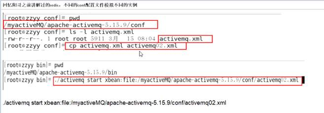

###  6.3 嵌入式的broker启动

用ActiveMQ Broker作为独立的消息服务器来构建Java应用。

ActiveMQ也支持在vm中通信基于嵌入的broker，能够无缝的集成其他java应用。

示例：

pom.xml依赖

```xml
<dependency>
    <groupId>com.fasterxml.jackson.core</groupId>
    <artifactId>jackson-databind</artifactId>
    <version>2.10.1</version>
</dependency>
```

嵌入式broker的启动类，启动后会在本机创建一个MQ实例哦

```java
package com.szimo.activemq.broker;

import org.apache.activemq.broker.BrokerService;
/**
 * 嵌入式broke的启动类
 *
 * @author shensr
 */
public class EmbedBroker {

    public static void main(String[] args) throws Exception {

        //ActiveMQ也支持在vm中通信基于嵌入的broker
        BrokerService brokerService = new BrokerService();
        brokerService.setPopulateJMSXUserID(true);
        brokerService.addConnector("tcp://127.0.0.1:61616");//启动后会在本机创建一个MQ实例哦
        brokerService.start();
    }

}
```

## 7. Spring整合ActiveMQ

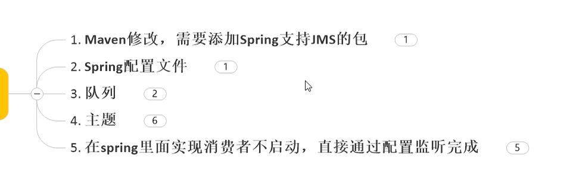

我个人的理解：我们之前介绍的内容也很重要，他更灵活，他支持各种自定义功能，可以满足我们工作中复杂的需求。很多activemq的功能，我们要看官方文档或者博客，这些功能大多是在上面代码的基础上修改完善的。如果非要把这些功能强行整合到spring，就有些缘木求鱼了。我认为另一种方式整合spring更好，就是将上面的类注入到Spring中，其他不变。这样既能保持原生的代码，又能集成到spring。

下面我们将的Spring和SpringBoot整合ActiveMQ也重要，他给我们提供了一个模板，简化了代码，减少我们工作中遇到坑，能够满足开发中90%以上的功能。

 

### 7.1  pom.xml添加依赖


```xml
<dependencies>
        <!--activemq核心依赖包-->
        <dependency>
            <groupId>org.apache.activemq</groupId>
            <artifactId>activemq-all</artifactId>
            <version>5.15.13</version>
        </dependency>
        <!--activemq连连接池-->
        <dependency>
            <groupId>org.apache.activemq</groupId>
            <artifactId>activemq-pool</artifactId>
            <version>5.15.13</version>
        </dependency>
        <dependency>
            <groupId>org.apache.xbean</groupId>
            <artifactId>xbean-spring</artifactId>
            <version>3.16</version>
        </dependency>
        <dependency>
            <groupId>com.fasterxml.jackson.core</groupId>
            <artifactId>jackson-databind</artifactId>
            <version>2.10.1</version>
        </dependency>
        <dependency>
            <groupId>org.springframework</groupId>
            <artifactId>spring-jms</artifactId>
            <version>5.2.1.RELEASE</version>
        </dependency>
        <dependency>
            <groupId>org.springframework</groupId>
            <artifactId>spring-aop</artifactId>
            <version>5.2.1.RELEASE</version>
        </dependency>
    </dependencies>
```


### 7.2  Spring的ActiveMQ配置文件

applicationContext.xml

```xml
<?xml version="1.0" encoding="UTF-8"?>
<beans xmlns="http://www.springframework.org/schema/beans"
       xmlns:xsi="http://www.w3.org/2001/XMLSchema-instance"
       xmlns:context="http://www.springframework.org/schema/context"
       xsi:schemaLocation="http://www.springframework.org/schema/beans http://www.springframework.org/schema/beans/spring-beans.xsd http://www.springframework.org/schema/context https://www.springframework.org/schema/context/spring-context.xsd">

    <!--开启包的自动扫描-->
    <context:component-scan base-package="com.szimo.activemq.spring"/>
    <!--配置生产者-->
    <bean id="jmsFactory" class="org.apache.activemq.pool.PooledConnectionFactory" destroy-method="stop">
        <property name="connectionFactory">
            <!--正真可以生产Connection的ConnectionFactory,由对应的JMS服务商提供-->
            <bean class="org.apache.activemq.spring.ActiveMQConnectionFactory">
                <property name="brokerURL" value="tcp://112.74.166.69:61616"/>
            </bean>
        </property>
        <property name="maxConnections" value="100"/>
    </bean>

    <!-- 这个是队列目的地,点对点的Queue-->
    <bean id="destinationQueue" class="org.apache.activemq.command.ActiveMQQueue">
        <!--通过构造注入Queue名-->
        <constructor-arg index="0" value="spring-active-queue"/>
    </bean>

    <!--这个是队列目的地, 发布订阅的主题Topic-->
    <bean id="destinationTopic" class="org.apache.activemq.command.ActiveMQTopic">
        <constructor-arg index="0" value="spring-active-topic"/>
    </bean>

    <!--Spring提供的JMS工具类,他可以进行消息发送,接收等-->
    <bean id="jmsTemplate" class="org.springframework.jms.core.JmsTemplate">
        <!--传入连接工厂-->
        <property name="connectionFactory" ref="jmsFactory"/>
        <!--传入目的地-->
        <property name="defaultDestination" ref="destinationQueue"/>
        <!--消息自动转换器 -->
        <property name="messageConverter">
            <bean class="org.springframework.jms.support.converter.SimpleMessageConverter"/>
        </property>
    </bean>

</beans>
```

### 7.3  队列生产者

```java
package com.szimo.activemq.spring;

import org.apache.xbean.spring.context.ClassPathXmlApplicationContext;
import org.springframework.beans.factory.annotation.Autowired;
import org.springframework.context.ApplicationContext;
import org.springframework.jms.core.JmsTemplate;
import org.springframework.stereotype.Service;

import javax.jms.TextMessage;

/**
 * 生产者
 *
 * @author shensr
 * @date 2020/7/14
 **/
@Service
public class MQProducer {

    @Autowired
    private JmsTemplate jmsTemplate;

    public static void main(String[] args) {
        ApplicationContext applicationContext = new ClassPathXmlApplicationContext("applicationContext.xml");
        MQProducer producer = applicationContext.getBean(MQProducer.class);
        producer.jmsTemplate.send(session -> {
                    TextMessage textMessage = session.createTextMessage("***spring和activemq整合消息");
                    return textMessage;
                }
        );
        System.out.println("********send task over");

    }
}

```


### 7.4  队列消费者

```java
package com.szimo.activemq.spring;

import org.springframework.beans.factory.annotation.Autowired;
import org.springframework.context.ApplicationContext;
import org.springframework.context.support.ClassPathXmlApplicationContext;
import org.springframework.jms.core.JmsTemplate;
import org.springframework.stereotype.Service;

/**
 * 消费者
 *
 * @author shensr
 * @date 2020/7/14
 **/

@Service
public class MQConsumer {
    @Autowired
    private JmsTemplate jmsTemplate;

    public static void main(String[] args) {
        ApplicationContext ctx = new ClassPathXmlApplicationContext("applicationContext.xml");
        MQConsumer consumer = ctx.getBean(MQConsumer.class);
        String retValue = (String) consumer.jmsTemplate.receiveAndConvert();
        System.out.println("消费者收到消息：" + retValue);
    }
}

```

### 7.5  主题生产者和消费者

只需要修改配置文件中的目的地即可，不修改生产者和消费者的代码

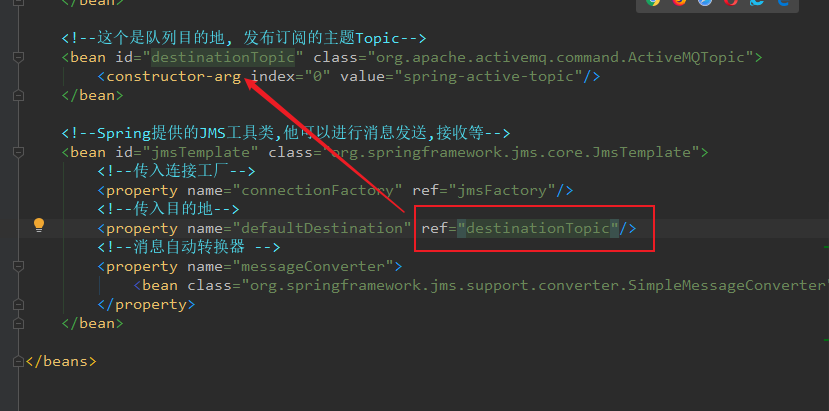


### 7.6  配置消费者的监听类

在Spring里面实现消费者不启动，直接通过配置监听完成

①编写监听类

```java
package com.szimo.activemq.spring;

import org.springframework.stereotype.Component;

import javax.jms.JMSException;
import javax.jms.Message;
import javax.jms.MessageListener;
import javax.jms.TextMessage;

/**
 * @author shensr
 * @date 2020/7/14
 **/
@Component
public class MyMessageListener implements MessageListener {
    @Override
    public void onMessage(Message message) {
        if (message instanceof TextMessage){
            try {
                System.out.println(((TextMessage) message).getText());
            } catch (JMSException e) {
                e.printStackTrace();
            }
        }
    }
}

```

②在applicationContext.xml文件中配置监听程序

```xml
    <!--配置监听程序-->
    <bean id="jmsContainer" class="org.springframework.jms.listener.DefaultMessageListenerContainer">
        <property name="connectionFactory" ref="jmsFactory"/>
        <property name="destination" ref="destinationQueue"/>
        <!--public class MyMessageListener implements MessageListener-->
        <property name="messageListener" ref="myMessageListener"/>
    </bean>
```


③注意监听的是Queue还是Toptic 

## 8. SpringBoot整合ActiveMQ

我个人不太赞成使用这种方式SpringBoot整合ActiveMQ，因为这样做会失去原生代码的部分功能和灵活性。但是工作中，这种做能够满足我们常见的需求，也方便和简化我们的代码，也为了适应工作中大家的习惯。

课程的源码：https://github.com/elstic/ActiveMQ

 

### 8.1  queue生产者

#### (1)   新建Spring Boot项目

 

#### (2)   pom.xml

 

```xml
<?xml version="1.0" encoding="UTF-8"?>
<project xmlns="http://maven.apache.org/POM/4.0.0"
         xmlns:xsi="http://www.w3.org/2001/XMLSchema-instance"
         xsi:schemaLocation="http://maven.apache.org/POM/4.0.0 http://maven.apache.org/xsd/maven-4.0.0.xsd">
    <modelVersion>4.0.0</modelVersion>

    <groupId>com.szimo</groupId>
    <artifactId>activemq03</artifactId>
    <version>1.0-SNAPSHOT</version>
    <packaging>jar</packaging>

    <name>course01</name>
    <description>Demo project for Spring Boot</description>

    <parent>
        <groupId>org.springframework.boot</groupId>
        <artifactId>spring-boot-starter-parent</artifactId>
        <version>2.1.7.RELEASE</version>
        <relativePath/> <!-- lookup parent from repository -->
    </parent>

    <properties>
        <project.build.sourceEncoding>UTF-8</project.build.sourceEncoding>
        <project.reporting.outputEncoding>UTF-8</project.reporting.outputEncoding>
        <java.version>1.8</java.version>
    </properties>

    <dependencies>
        <dependency>
            <groupId>org.springframework.boot</groupId>
            <artifactId>spring-boot-starter-web</artifactId>
        </dependency>
        <dependency>
            <groupId>org.springframework.boot</groupId>
            <artifactId>spring-boot-starter-test</artifactId>
            <scope>test</scope>
        </dependency>

        <dependency>
            <groupId>org.springframework.boot</groupId>
            <artifactId>spring-boot-starter-activemq</artifactId>
        </dependency>

    </dependencies>

    <build>
        <plugins>
            <plugin>
                <groupId>org.springframework.boot</groupId>
                <artifactId>spring-boot-maven-plugin</artifactId>
            </plugin>
        </plugins>
    </build>
</project>
```

#### (3)   application.yml

```yaml
server:
  port: 7777

spring:
  activemq:
    broker-url: tcp://112.74.166.69:61616
    user: admin
    password: admin
  jms:
    pub-sub-domain: false # false 队列  true 订阅 默认值false

#定义自己队列名称
myqueue: boot-activemq-queue
```

 

#### (4)   配置目的地的bean

```java
package com.szimo.activemq.spring.boot.config;


import org.apache.activemq.command.ActiveMQQueue;
import org.springframework.beans.factory.annotation.Value;
import org.springframework.context.annotation.Bean;
import org.springframework.stereotype.Component;

import javax.jms.Queue;

/**
 * @author shensr
 * @date 2020/7/14
 **/

@Component
public class ConfigBean {

    @Value("${myqueue}")
    private String  myQueue;

    /**
     * 配置bean 类似于spring框架的applicationContext.xml文件
     */
    @Bean
    public Queue queue(){
        return new ActiveMQQueue(myQueue);
    }
}

```

 

#### (5)   队列生产者代码

 

```java
package com.szimo.activemq.spring.boot.producer;

import org.springframework.beans.factory.annotation.Autowired;
import org.springframework.jms.core.JmsMessagingTemplate;
import org.springframework.scheduling.annotation.Scheduled;
import org.springframework.stereotype.Component;

import javax.jms.Queue;
import java.util.UUID;

/**
 * @author shensr
 */
@Component
public class QueueProducer {

    /**
     * JMS模板
     */
    @Autowired
    private JmsMessagingTemplate jmsMessagingTemplate;

    /**
     * 这个是我们配置的队列目的地
     */
    @Autowired
    private Queue queue;

    /**
     * 发送消息
     */
    public void produceMessage() {
        // 一参是目的地，二参是消息的内容
        jmsMessagingTemplate.convertAndSend(queue, "****" + UUID.randomUUID().toString().substring(0, 6));
    }

    /**
     * 定时任务。每3秒执行一次。非必须代码，仅为演示。作为测试
     */
    @Scheduled(fixedDelay = 3000)
    public void produceMessageScheduled() {
        produceMessage();
    }

}
```

(6)   主启动类

```java
package com.szimo.activemq.spring.boot;

import org.springframework.boot.SpringApplication;
import org.springframework.boot.autoconfigure.SpringBootApplication;
import org.springframework.jms.annotation.EnableJms;
import org.springframework.scheduling.annotation.EnableScheduling;

/**
 * @author shensr
 * @date 2020/7/14
 **/

@SpringBootApplication
@EnableScheduling //开启定时任务
@EnableJms //开启JMS
public class Application {
    public static void main(String[] args) {
        SpringApplication.run(Application.class,args);
    }

}

```

 

#### (5)   单元测试

①直接启动springboot项目，定时任务可以测试

②编写测试类

```java
@SpringBootTest(classes = Application.class)
@RunWith(SpringJUnit4ClassRunner.class)
@WebAppConfiguration
public class TestActiveMQ {

    @Autowired
    private QueueProducer queueProducer;

    @Test
    public void testSend() throws Exception{
        queueProducer.produceMessage();
    }
}

```


 

 

### 8.2  queue消费者

项目源码地址：https://github.com/elstic/ActiveMQ/tree/master/boot_mq_consummer

pom.xml和application.yml文件和前面一样。唯一不同就是下面代码

```java
package com.activemq.spring.boot.consumer.consumer;

import org.springframework.beans.factory.annotation.Value;
import org.springframework.jms.annotation.JmsListener;
import org.springframework.stereotype.Component;

import javax.jms.TextMessage;

/**
 * @author shensr
 */
@Component
public class QueueConsumer {

    /**
     * 注册一个监听器。destination指定监听的主题。
     */
    @JmsListener(destination = "${myqueue}")
    public void receive(TextMessage textMessage) throws Exception {
        System.out.println(" ***  消费者收到消息  ***" + textMessage.getText());
    }

}
```

 

 

### 8.3  topic生产者

项目源码地址：https://github.com/elstic/ActiveMQ/tree/master/boot_mq_topic_produce

 

#### (1)   pom.xml

和上面一样。

#### (2)   application.yml

设置 pub-sub-main: true

```yaml
server:
  port: 7777

spring:
  activemq:
    broker-url: tcp://112.74.166.69:61616
    user: admin
    password: admin
  jms:
    pub-sub-domain: true # false 队列  true 订阅 默认值false

#定义自己队列名称
myqueue: boot-activemq-queue
```

 

#### (3)   配置目的地的bean和开启JMS功能

```java
package com.activemq.spring.boot.producer.config;


import org.apache.activemq.command.ActiveMQQueue;
import org.apache.activemq.command.ActiveMQTopic;
import org.springframework.beans.factory.annotation.Value;
import org.springframework.context.annotation.Bean;
import org.springframework.stereotype.Component;

import javax.jms.Queue;
import javax.jms.Topic;

/**
 * @author shensr
 * @date 2020/7/14
 **/

@Component
public class ConfigBean {

    @Value("${myqueue}")
    private String myQueue;

    @Value("${mytopic}")
    private String topicName;

    /**
     * 配置bean 类似于spring框架的applicationContext.xml文件
     */
    @Bean
    public Queue queue() {
        return new ActiveMQQueue(myQueue);
    }

    @Bean
    public Topic topic() {
        return new ActiveMQTopic(topicName);
    }
}

```


#### (4)   生产者代码

```java
package com.activemq.spring.boot.producer.producer;

import org.springframework.beans.factory.annotation.Autowired;
import org.springframework.jms.core.JmsMessagingTemplate;
import org.springframework.scheduling.annotation.Scheduled;
import org.springframework.stereotype.Component;

import javax.jms.Topic;
import java.util.UUID;

/**
 * @author shensr
 * @date 2020/7/14
 **/

@Component
public class TopicProducer {

    @Autowired
    private JmsMessagingTemplate jmsMessagingTemplate;

    @Autowired
    private Topic topic;

    public void produceTopic() {
        jmsMessagingTemplate.convertAndSend(topic, "topic message：" + UUID.randomUUID().toString().substring(0, 6));
    }
    
    @Scheduled(fixedDelay = 3000)
    public void sechedulWork(){
        produceTopic();
    }


}

```


### 8.4  topic消费者

#### (1)   pom.xml

和上面一样。

#### (2)   application.yml

和上面一样。

#### (3)   消费者代码

```java
package com.activemq.spring.boot.consumer.consumer;

import org.springframework.jms.annotation.JmsListener;
import org.springframework.stereotype.Component;

import javax.jms.TextMessage;

/**
 * @author shensr
 * @date 2020/7/14
 **/
@Component
public class TopicConsumer {

    @JmsListener(destination = "${mytopic}")
    public void receive(TextMessage textMessage) throws Exception{
        System.out.println("消费者收到订阅的主题："+textMessage.getText());
    }
}

```

 

问题：可以同时接收或发送主题和队列吗？？

## 9. ActiveMQ的传输协议

p44还没有

### 9.1  简介

ActiveMQ支持的client-broker通讯协议有：TCP、NIO、UDP、SSL、Http(s)、VM。其中配置Transport Connector的文件在ActiveMQ安装目录的conf/activemq.xml中的`<transportConnectors>`标签之内。

activemq传输协议的官方文档：http://activemq.apache.org/configuring-version-5-transports.html

 

| 这些协议参见文件：%activeMQ安装目录%/conf/activemq.xml，下面是文件的重要的内容 |
| ------------------------------------------------------------ |
| <transportConnectors><transportConnector name="openwire" uri="tcp://0.0.0.0:61616?maximumConnections=1000&amp;wireFormat.maxFrameSize=104857600"/><transportConnector name="amqp" uri="amqp://0.0.0.0:5672?maximumConnections=1000&amp;wireFormat.maxFrameSize=104857600"/><transportConnector name="stomp" uri="stomp://0.0.0.0:61613?maximumConnections=1000&amp;wireFormat.maxFrameSize=104857600"/>   <transportConnector name="mqtt" uri="mqtt://0.0.0.0:1884?maximumConnections=1000&amp;wireFormat.maxFrameSize=104857600"/>   <transportConnector name="ws" uri="ws://0.0.0.0:61614?maximumConnections=1000&amp;wireFormat.maxFrameSize=104857600"/></transportConnectors> |

在上文给出的配置信息中，URI描述信息的头部都是采用协议名称：例如

描述amqp协议的监听端口时，采用的URI描述格式为“amqp://······”；

描述Stomp协议的监听端口时，采用URI描述格式为“stomp://······”；

唯独在进行openwire协议描述时，URI头却采用的“tcp://······”。这是因为ActiveMQ中默认的消息协议就是openwire

 

 

**9.2**  **支持的传输协议**

个人说明：除了tcp和nio协议，其他的了解就行。各种协议有各自擅长该协议的中间件，工作中一般不会使用activemq去实现这些协议。如： mqtt是物联网专用协议，采用的中间件一般是mosquito。ws是websocket的协议，是和前端对接常用的，一般在java代码中内嵌一个基站（中间件）。stomp好像是邮箱使用的协议的，各大邮箱公司都有基站（中间件）。

注意：协议不同，我们的代码都会不同。

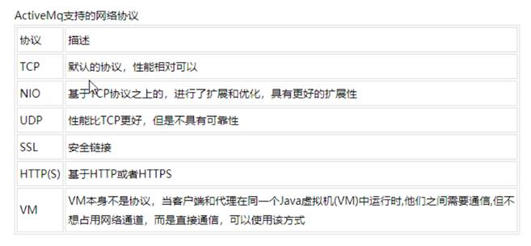

 

 

**9.2.1  TCP****协议**

(1) Transmission Control Protocol(TCP)是默认的。TCP的Client监听端口61616

(2) 在网络传输数据前，必须要先序列化数据，消息是通过一个叫wire protocol的来序列化成字节流。

(3) TCP连接的URI形式如：tcp://HostName:port?key=value&key=value，后面的参数是可选的。

(4) TCP传输的的优点：

TCP协议传输可靠性高，稳定性强

高效率：字节流方式传递，效率很高

有效性、可用性：应用广泛，支持任何平台

(5) 关于Transport协议的可选配置参数可以参考官网http://activemq.apache.org/tcp-transport-reference

 

 

**9.2.2  NIO****协议**

(1) New I/O API Protocol(NIO)

(2) NIO协议和TCP协议类似，但NIO更侧重于底层的访问操作。它允许开发人员对同一资源可有更多的client调用和服务器端有更多的负载。

(3) 适合使用NIO协议的场景：

可能有大量的Client去连接到Broker上，一般情况下，大量的Client去连接Broker是被操作系统的线程所限制的。因此，NIO的实现比TCP需要更少的线程去运行，所以建议使用NIO协议。

可能对于Broker有一个很迟钝的网络传输，NIO比TCP提供更好的性能。

(4) NIO连接的URI形式：nio://hostname:port?key=value&key=value

(5) 关于Transport协议的可选配置参数可以参考官网http://activemq.apache.org/configuring-version-5-transports.html

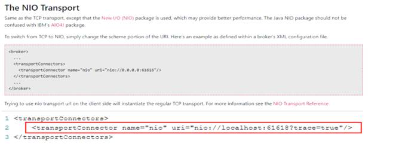

 

 

**9.2.3  AMQP****协议**

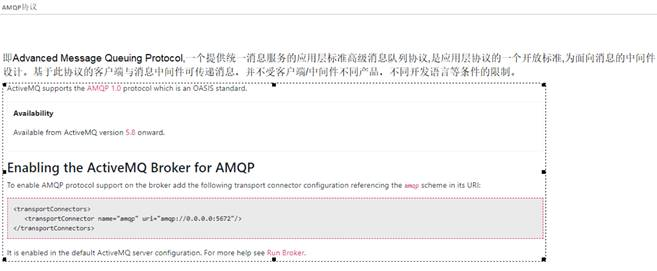

 

 

**9.2.4  STOMP****协议**

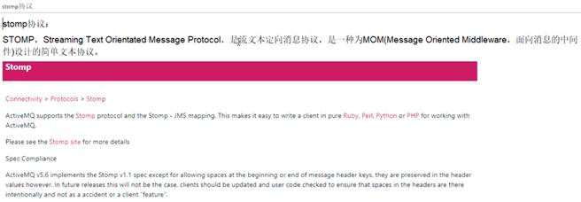

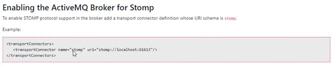

 

 

**9.2.5  MQTT****协议**

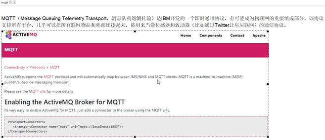

 

 

**9.3  NIO****协议案例**

ActiveMQ这些协议传输的底层默认都是使用BIO网络的IO模型。只有当我们指定使用nio才使用NIO的IO模型。

 

**(1)**   **修改配置文件****activemq.xml**

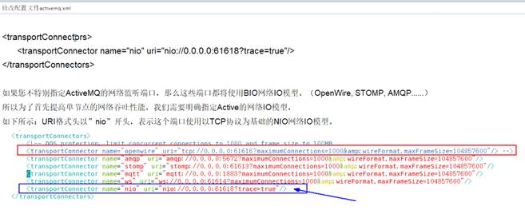

①　修改配置文件activemq.xml在 <transportConnectors>节点下添加如下内容：

<transportConnector name="nio" uri="nio://0.0.0.0:61618?trace=true" />

②　修改完成后重启activemq: 

service activemq restart

③　查看管理后台，可以看到页面多了nio

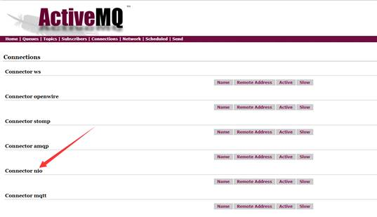

 

 

**(2)**    **代码**

| 生产者。除灰色背景外，其他代码都和之前一样                   |
| ------------------------------------------------------------ |
| **package** com.activemq.demo;      **import** org.apache.activemq.ActiveMQConnectionFactory;   **import** javax.jms.*;      **public class** Jms_TX_Producer {    **private static final** String **ACTIVEMQ_URL** = **"nio://118.24.20.3:61618"**;      **private static final** String **ACTIVEMQ_QUEUE_NAME** = **"nio-test"**;      **public static void** main(String[] args) **throws** JMSException {     ActiveMQConnectionFactory activeMQConnectionFactory = **new** ActiveMQConnectionFactory(**ACTIVEMQ_URL**);     Connection connection = activeMQConnectionFactory.createConnection();     connection.start();     Session session = connection.createSession(**false**, Session.**AUTO_ACKNOWLEDGE**);     Queue queue = session.createQueue(**ACTIVEMQ_QUEUE_NAME**);     MessageProducer producer = session.createProducer(queue);     **try** {       **for** (**int** i = 0; i < 3; i++) {         TextMessage textMessage = session.createTextMessage(**"tx msg--"** + i);         producer.send(textMessage);       }       System.**out**.println(**"消息发送完成"**);     } **catch** (Exception e) {       e.printStackTrace();     } **finally** {        *//8.关闭资源*       producer.close();       session.close();       connection.close();     }   } } |
| 消费者。除灰色背景外，其他代码都和之前一样                   |
| **package** com.activemq.demo;      **import** org.apache.activemq.ActiveMQConnectionFactory;   **import** javax.jms.*;   **import** java.io.IOException;      **public class** Jms_TX_Consumer {   **private static final** String **ACTIVEMQ_URL** = **"nio://118.24.20.3:61618"**;   **private static final** String **ACTIVEMQ_QUEUE_NAME** = **"nio-test"**;      **public static void** main(String[] args) **throws** JMSException, IOException {     ActiveMQConnectionFactory activeMQConnectionFactory = **new** ActiveMQConnectionFactory(**ACTIVEMQ_URL**);     Connection connection = activeMQConnectionFactory.createConnection();     connection.start();     Session session = connection.createSession(**false**, Session.**AUTO_ACKNOWLEDGE**);     Queue queue = session.createQueue(**ACTIVEMQ_QUEUE_NAME**);     MessageConsumer messageConsumer = session.createConsumer(queue);     messageConsumer.setMessageListener(**new** MessageListener() {          **public void** onMessage(Message message) {         **if** (message **instanceof** TextMessage) {           **try** {             TextMessage textMessage = (TextMessage) message;             System.**out**.println(**"\**\*消费者接收到的消息:  "** + textMessage.getText());           } **catch** (Exception e) {             System.**out**.println(**"出现异常，消费失败，放弃消费"**);           }         }       }     });     System.**in**.read();     messageConsumer.close();     session.close();     connection.close();   } } |

 

 

**9.4  NIO****协议案例增强**

**(1)**   **目的**

上面是Openwire协议传输底层使用NIO网络IO模型。 如何让其他协议传输底层也使用NIO网络IO模型呢？

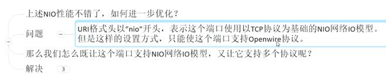

 


 

**(2)**   **修改配置文件****activemq.xml**

<transportConnectors><transportConnector name="openwire" uri="tcp://0.0.0.0:61626?maximumConnections=1000&amp;wireFormat.maxFrameSize=104857600"/><transportConnector name="amqp" uri="amqp://0.0.0.0:5682?maximumConnections=1000&amp;wireFormat.maxFrameSize=104857600"/><transportConnector name="stomp" uri="stomp://0.0.0.0:61623?maximumConnections=1000&amp;wireFormat.maxFrameSize=104857600"/><transportConnector name="mqtt" uri="mqtt://0.0.0.0:1893?maximumConnections=1000&amp;wireFormat.maxFrameSize=104857600"/><transportConnector name="ws" uri="ws://0.0.0.0:61624?maximumConnections=1000&amp;wireFormat.maxFrameSize=104857600"/><transportConnector name="nio" uri="nio://0.0.0.0:61618?trace=true" /> <transportConnector name="auto+nio" uri="auto+nio://0.0.0.0:61608?maximumConnections=1000&amp;wireFormat.maxFrameSize=104857600&amp;org.apache.activemq.transport.nio.SelectorManager.corePoolSize=20&amp;org.apache.activemq.transport.nio.Se1ectorManager.maximumPoo1Size=50"/></transportConnectors>

auto  : 针对所有的协议，他会识别我们是什么协议。

nio   ：使用NIO网络IO模型

修改配置文件后重启activemq。

 

**(3)**   **代码**

| 使用nio模型的tcp协议生产者。除灰色背景外，其他代码和之前一样 |
| ------------------------------------------------------------ |
| **public class** Jms_TX_Producer {   **private static final** String **ACTIVEMQ_URL** = **"****tcp://118.24.20.3:61608****"**;   **private static final** String **ACTIVEMQ_QUEUE_NAME** = **"auto-nio"**;    **public static void** main(String[] args) **throws** JMSException {        ......   } } |
| 使用nio模型的tcp协议消费者。除灰色背景外，其他代码和之前一样 |
| **public class** Jms_TX_Consumer {   **private static final** String **ACTIVEMQ_URL** = **"****tcp://118.24.20.3:61608****"**;   **private static final** String **ACTIVEMQ_QUEUE_NAME** = **"auto-nio"**;      **public static void** main(String[] args) **throws** JMSException, IOException {     ......  } } |
| 使用nio模型的nio协议生产者。除灰色背景外，其他代码和之前一样 |
| **public class** Jms_TX_Producer {   **private static final** String **ACTIVEMQ_URL** = **"****nio://118.24.20.3:61608****"**;   **private static final** String **ACTIVEMQ_QUEUE_NAME** = **"auto-nio"**;      **public static void** main(String[] args) **throws** JMSException {     ......  } } |
| 使用nio模型的nio协议消费者。除灰色背景外，其他代码和之前一样 |
| **public class** Jms_TX_Consumer {   **private static final** String **ACTIVEMQ_URL** = **"nio://118.24.20.3:61608"**;   **private static final** String **ACTIVEMQ_QUEUE_NAME** = **"auto-nio"**;      **public static void** main(String[] args) **throws** JMSException, IOException {      ......  } } |

 

----------------课件对应的视频：48_ActiveMQ消息持久化理论简介.avi------始---------