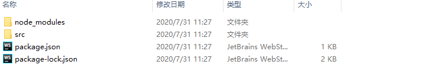

# React入门

## npm、yarn介绍

### Node
Node.js 是一个基于Chrome V8引擎的javaScript运行环境，相当于一个看不见的黑盒子（没有界面）    
作用：

- 前端开发环境： webpack + npm插件 + Server
- 服务端动态编程语言： Java Web ，Php Web， Node Web

### NPM的使用
[NPM官网](https://www.npmjs.com/)

*概念*：NPM是包管理器

*用法*：

- `npm -v`  查看版本号
- `npm init` 初始化配置信息  生成package.json
- `npm install | npm install -g`   局部安装 | 全局安装

#### npm插件发布

首先需要注册账号，

- `cd [要发布插件的目录]`

- `npm adduser | npm pushlish`  用户登录 | 推送本地的代码到npm库
- `npm config set registry https://registry.npmjs.org/` 发布插件的时候需要设置为该项，不能使用淘宝的，否者会报错
- `npm config set registry https://registry.npm.taobao.org/` 设置淘宝的地址
- `npm unpublish [包名] -force` 删除包

#### npm创建react项目  
- `mkdir frontWorkspace` 创建前端项目工作空间

- `cd frontWorkspace` 进入工作空间

- `npm init` 初始化,package.json已经创建完成 （需要选择一些信息，可以默认）

- `ls` 列出目录下文件

- `mkdir src` 创建src目录

- `cd src`  进入src目录

- 创建index.js 入口文件

- `npm install react --save`  安装react 并保存到package.json中，生成了node_modules文件夹
  
  
  
  - 这时package.json会自动生成依赖代码   
  ``"dependencies": {
        "react": "^16.13.1"
      }
  ``
  - 如果没有node_modules文件夹，而package.json中有react依赖，执行`npm install（简写npm i）`命令，react也会被同步进来
  
### Yarn

#### Yarn概念

- 前端的包管理器 
- 特点 `速度快`  `更安全` `更可靠`

#### Yarn安装

- 中文文档：[https://yarn.bootcss.com/](https://yarn.bootcss.com/)

- `npm install yarn -g ` //全局安装
- `npm install yarn@1.xx.x -g` //安装指定版本 @后面为版本号
- `npm upgrade yarn -g`  //全局更新

#### Yarn用法

- `yarn -v` 查看版本

- `yarn init`

- `yarn install` 

- `yarn add/remove xxx` 安装新插件/移除 （等效npm install xxx ）

- `yarn publish/login/logout`  发布插件到npm平台

- `yarn run` 运行脚本
  
  - 例:修改package.json下脚本，执行yarn run npm_version 脚本   
  ````json
  "scripts": {
      "npm_version": "npm -v"
    }
  ````


## React介绍

### 主流前端框架
- `vue(mvvm)` 
- `react (mvvm)`
- `angular(mvc)`

### React介绍

#### 特性
- 声明式：如声明变量，在react中可以声明组件、变量等
- 组件化
  - 独立的模块开发成小组件，在不同的页面进行嵌套，类似堆积木的方式
  - 任何大的项目都可以拆分成无数小的项目，小的项目可以拆分成一个个小零件
  - 将积木拼在一起堆成一个大的项目
  - **模块化和组件化的区别**：*模块化相对于功能（如支付，订单做成独立的功能），组件化侧重于UI*
- 灵活
  - 支持单页面和多页面，通过路由分发出不同的页面
  - 支持服务端渲染，把react丢到node.js中去，渲染出多个页面
  - React Native，App开发
  
#### 引入方式
cdn
- https://unpkg.com/react@16/umd/react.development.js
- https://unpkg.com/react-dom@16/umd/react-dom.development.js
- https://unpkg.com/babel-standalone@6/babel.min.js

#### 基本语法
- `ReactDOM.render()` 渲染元素 如 div 等
- `React.createElement()` 创建元素（虚拟dom模拟真实dom进行对比差异，然后渲染），react核心库提供各种api操作dom
- `React.Component` ES6语法，开发中经常使用extents继承React.Component

### 编写Hello World
1. 首先vi命令 touch index.html创建程序入口（windows用户直接创建）
2. cdn或者npm方式引入react
````html
<html lang="en">
<head>
    <meta charset="UTF-8">
    <meta name="viewport" content="width=device-width, initial-scale=1.0">
    <meta http-equiv="X-UA-Compatible" content="ie=edge">
    <title>React demo 4</title>
    <!-- cdn方式引入-->
    <script src="https://unpkg.com/react@16/umd/react.development.js"></script>
    <script src="https://unpkg.com/react-dom@16/umd/react-dom.development.js"></script> 
    <!-- 引入babel -->
    <script src="https://unpkg.com/babel-standalone@6/babel.min.js"></script> 
    
    <!-- 或者npm 方式引入 -->
    <!-- <script src="./node_modules/react/umd/react.development.js"></script>
    <script src="./node_modules/react-dom/umd/react-dom.development.js"></script> -->
</head>
<body>
    <div id = "app"></div>
    <script>
        var hello = React.createElement('h1',{},"Hello world!");
        ReactDOM.render(hello,document.getElementById('app'));
    </script>
</body>
</html>
````
- ES6语法糖
  - 引入babel 并且在div下script下添加type="text/babel"属性，即可在script下直接写html标签
  ````html
  <head>
    ...
    <!-- 引入babel -->
      <script src="https://unpkg.com/babel-standalone@6/babel.min.js"></script> 
    ...
  </head> 
   
   ...
   
  <body>
      <div id = "app"></div>
      <script type = "text/babel">
          // var hello = React.createElement('h1',{},"Hello world!");
          // ReactDOM.render(hello,document.getElementById('app'));
          ReactDOM.render(
              <h1>Hello,World</h1>,
          document.getElementById('app'));
      </script>
  </body>

  ````
  
### JSX语法介绍
1. 即在js中编写html代码
````html
    // 1 js中插入html代码
    //原生方式 
    // var hello = React.createElement('h1',
    // {
    //     className:'red',
    //     name:'jack'
    // },
    // "Hello world!");
    // ReactDOM.render(hello,document.getElementById('app'));

    //语法糖    
    ReactDOM.render(
        <h1 className="red" name="jack">Hello,React</h1>,
    document.getElementById('app'));
````
2.  同时html中也可以嵌套js代码  

````html
    // 2 html中插入js代码
    var name = 'jack';
    var ele = <h1 className="red" name="jack">Hello,{name}</h1>;
    ReactDOM.render(
        ele,
    document.getElementById('app'));
````

###  元素渲染
- React 只会更新必要的部分
- 值得注意的是 React DOM 首先会比较元素内容先后的不同，而在渲染过程中只会更新改变了的部分。
- 修改代码，每隔1s重新渲染一次，查看chrome控制台
````html
// 元素渲染
        function tick(params) {
            var time = new Date().toLocaleTimeString();
            var ele = <div>
                    <h1 className="red" name="jack">Hello,jack</h1>
                    <h2> 现在是，{time} </h2>
                </div>

            ReactDOM.render(
                ele,
             document.getElementById('app'));
        }
        setInterval(() => {
            tick();
        }, 1000);   
````
- 可以看到，只会重新渲染改变的节点，而不会重新渲染整个标签
- vue是双向绑定，react是单向绑定

### 组件和Props

#### 基本语法

- ~~React.createClass()~~
- 函数式组件（无状态组件）
- `React.Component`(有状态的组件，含有生命周期)

公共UI，比如页面头部组件、底部组件、面包屑等，属于多个页面都需要用到的，这个时候需要将它做成（抽离成）组件，一次修改，其他地方都跟着改变，提高开发效率   

**创建方式** 

- 函数式组件（无状态组件，没有生命周期）
  - 属性通过 props.name方式取得
- 继承自React.Component （有状态组件，有生命周期）
  - 有状态组件，属性通过this.props.name 方式取得  

````html
//5 组件和props
        //5.1 函数式组件，无状态
        // function Hello(props) {
        //     return <div>
        //                 <h1>Hello,{props.name}</h1>
        //                 <p>年龄：{props.age}</p>
        //                 <p>擅长：Everything</p>
        //             </div>
        // }
        // ReactDOM.render(
        //             <Hello name ="jack" age = "29"/>,
        //         document.getElementById('app'));
        
        //5.2 标准组件（带状态）
        class HelloJack extends React.Component{
            render(){
                return <div>
                        <h1>Hello,{this.props.name}</h1>
                        <p>年龄：{this.props.age}</p>
                        <p>擅长：Everything</p>
                    </div>
            }
        }
        ReactDOM.render(
                    <HelloJack name ="jack" age = "29"/>,
                document.getElementById('app'));
    
````

### React生命周期
*四个阶段*

- 1）组件初始化阶段
    - 属性初始化
    - 状态初始化
- 2）组件加载阶段
    - 获取属性值
- 3）数据更新阶段
    - 组件属性值发生变化
- 4）组件销毁阶段

*流程*


*示例代码*

````javascript
// 6. React生命周期
        class HelloJack extends React.Component{
            
            // 构造函数 可以省略
            constructor(props){
                console.log('初始化阶段')
                // 初始化props
                super(props);
                //初始化状态
                this.state = {
                    name:'jack',
                    age:25
                }
               //this.updateUser=this.updateUser.bind(this)
            }

            componentWillMount(){
                console.log('组件加载前')
                //可以进行ajax请求，请求数据操作
            }

            componentDidMount(){
                console.log('组件加载后')
            }

            // 必须使用箭头函数，否者找不到this指针，如果非要使用普通函数，则需要在构造函数中绑定this指针
            //即在constructor中加入  this.updateUser=this.updateUser.bind(this)
            updateUser =()=>{
                //错误的语法，该语法不会触发render
                //this.state.name = 'Time';
                this.setState({
                    name:'Tim',
                    age:32
                })
            } 

            shouldComponentUpdate(){
                //一般默认true
                //根据具体业务场景，可以增加判断条件，比如登录了就更新，未登录就不更新
                console.log('数据是否需要更新')
                return true;
            }

            componentWillUpdate(){
                console.log('数据将要更新')
            }

            componentDidUpdate(){
                console.log('数据已经更新')
            }

            render(){
                // 组件发生变化，就会执行render
                console.log('组件加载 或 数据更新')
                return <div>
                        <h1>Hello,{this.state.name}</h1>
                        <p>年龄：{this.state.age}</p>
                        <p>擅长：Everything</p>
                        {/*绑定updateUser函数 不能加括号，即不能写成updateUser（）*/}
                        <button onClick={this.updateUser}>更新数据</button>
                    </div>
            }
        }
        ReactDOM.render(
                    <HelloJack />,
                document.getElementById('app'));
````

### 事件处理
事件名称为驼峰式命名，如onClick等    

*四种方式*

- 方式1 箭头函数动态绑定 如果写成updateUser(){...}，就会undefined
- 方式2 初始化阶段绑定updateUser2对象，（设定指针）
- 方式3 onClick中 箭头函数直接绑定函数
- 方式4 onClick中 this.updateUser3.bind(this)

````html
//7. 事件处理
        class HelloJack extends React.Component{
            
            // 构造函数 可以省略
            constructor(props){
                // 初始化props
                super(props);
                //初始化状态
                this.state = {
                    name:'jack',
                    age:25
                }
                this.updateUser2 = this.updateUser2.bind(this);
            }

            // 方式1 箭头函数动态绑定 如果写成updateUser(){...}，就会undefined
            updateUser =()=>{
                console.log(this);
                this.setState({
                    name:'Tim',
                    age:32
                })
            } 

            //方式2 初始化阶段绑定updateUser2对象，（设定指针,即在构造函数中完成）
            updateUser2(){
                console.log(this);
                this.setState({
                    name:'Joy',
                    age:33
                })
            } 

            // 方式3 onClick中 箭头函数直接绑定函数
            // 方式4 onClick中 this.updateUser3.bind(this)
            updateUser3(){
                console.log(this);
                this.setState({
                    name:'Stephen',
                    age:30
                })
            }

            render(){
                return <div>
                        <h1>Hello,{this.state.name}</h1>
                        <p>年龄：{this.state.age}</p>
                        <p>擅长：Everything</p>
                        <button onClick={this.updateUser}>更新数据</button><br/>
                        <button onClick={this.updateUser2}>更新数据2</button><br/>
                        <button onClick={()=>this.updateUser3()}>更新数据3</button><br/>
                        <button onClick={this.updateUser3.bind(this)}>更新数据4</button>
                    </div>
            }
        }
        ReactDOM.render(
                    <HelloJack />,
                document.getElementById('app'));
````

### 条件处理
####  if else 和三元表达式
````javascript
//8.条件处理

        function Login(){
            return <button >登录</button>
        }

        function LogOut(){
            return <button>登出</button>
        }

        class App extends React.Component{
            
            state = {
                isLogin:false
            }

            updateUser =()=>{
                console.log(this);
                this.setState({
                    isLogin:true
                })
            } 

            render(){
                // 获取状态
                const isLogin = this.state.isLogin;
                //或者
                // const{isLogin} = this.state;
                
                //1.if else
                // let ele;//声明为let 如果是const 则其值不能改变
                // if (isLogin) {
                //     ele = <Login/>
                // }else{
                //     ele = <LogOut/>
                // }

                return <div>
                        <h1>Hello,{this.state.name}</h1>
                        {/*{ele}*/}
                        {/* 2. 三元表达式*/}
                        {isLogin?<Login/>:<LogOut/>}
                        <br/>
                        <button onClick={this.updateUser}>更新数据</button><br/>
                    </div>
            }
        }
        ReactDOM.render(
                    <App />,
                document.getElementById('app'));
````
#### 子组件触发父组件的方法
````javascript
        function Login(props){
            //子组件通过props属性接收updateUser方法
            return <button onClick={props.updateUser}>登录</button>
        }

        function LogOut(props){
            return <button onClick={props.updateUser}>登出</button>
        }

        class App extends React.Component{
            
            state = {
                isLogin:false
            }

            updateUser =()=>{
                console.log(this);
                this.setState({
                    isLogin:!this.state.isLogin
                })
            } 

            render(){
                const isLogin = this.state.isLogin;
                
                return <div>
                        <h1>Hello,{this.state.name}</h1>
                        {/*将updateUser方法传递给子组件*/}
                        {isLogin
                            ?<Login updateUser={this.updateUser}/>
                            :<LogOut updateUser={this.updateUser}/>}
                        <br/>
                    </div>
            }
        }
        ReactDOM.render(
                    <App />,
                document.getElementById('app'));
````

### 列表渲染
````javascript
//9. 列表渲染
        class List extends React.Component{
            
            state = {
                list:[1,2,3,4,5],
                list2:[
                    {id:1,text:'java'},
                    {id:2,text:'js'},
                    {id:3,text:'php'},
                    {id:4,text:'python'},
                    {id:5,text:'node'}
                ]
            }

            render(){
                const arr = this.state.list;
                const arr2 = this.state.list2;
                const listItem = []
                const listItem2 = []
                //map方式遍历
                arr.map((item)=>{
                    let li = <li>{item}</li>;
                    listItem.push(li);
                })
                //或for循环
                // for (let i = 0; i < arr.length; i++) {
                //     let li = <li>{arr[i]}</li>;
                //     listItem.push(li);
                // }
                for (let i = 0; i < arr2.length; i++) {
                    let li = <li key={arr2[i].id}>{arr2[i].text}</li>;
                    listItem2.push(li);
                }
                return <div>
                        <ul>
                            {listItem}
                            {listItem2}
                        </ul>
                    </div>
            }
        }
        ReactDOM.render(
                    <List />,
                document.getElementById('app'));
````

### 表单应用
````javascript
//10.表单应用
        class ToDoList extends React.Component{
            
            state = {
                value:'',
                list:[]
            }

            handleAdd = ()=>{
                const val = this.state.value;
                const list = this.state.list;
                //或 es6结构语法
                // const{val,list} = this.state;
                list.push(val);
                this.setState({
                    list:list
                    //es6中 当list和value相等时，可以省略key
                    //由list:list 简写为 list
                })
            }

            handleInput = (event)=>{
                this.setState({
                    value:event.target.value
                })
            }

            render(){
                const val = this.state.value;
                const arr = this.state.list;
                const listItem = []
                arr.map((item,index)=>{
                    let li = <li key = {index}>{item}</li>;
                    listItem.push(li);
                })

                return <div>
                        <div>
                            <input type = "text" value={val} onChange={this.handleInput}/>
                            <button onClick={this.handleAdd}>添加条目</button>    
                        </div>
                        <ul>
                            {listItem}
                        </ul>
                    </div>
            }
        }
        ReactDOM.render(
                    <ToDoList />,
                document.getElementById('app'));


 
````


## React单页面应用

### 脚手架使用

-  `npm install -g create-react-app`     方式1
- `yarn add -g create-react-app`    方式2
- 然后 `create-react-app react-demo` 创建应用
- `create-react-app --version` 查看版本

### 编写Hello World
- sass支持
    - 将App.css修改为App.scss ， 这样css将支持嵌套语法
    - 安装sass：`yarn add node-sass --save`（或yarn add node-sass -S）
- 运行项目：根据package.json配置 执行yarn start/yarn run start
````json
"scripts": {
    "start": "react-scripts start",
    "build": "react-scripts build",
    "test": "react-scripts test",
    "eject": "react-scripts eject"
  },
````

**App.scss**
````scss
//复合样式
div {
  text-align: center;
  font-size:32px;
  h1 {
    color: red;
    font-size: 30px;
  }
}
````
**App.js**
````javascript
import React from 'react';
import './App.scss';

class App extends React.Component{

    state = {
        val:'',
        list:[]
    }

    handleChange=(event)=>{
        let val = event.target.value;
        this.setState({
            val
        })
    }


    handleAdd=()=>{
        let {val,list} = this.state;
        list.push(val);
        this.setState({
            list
        })
    }

    render() {
        const {val,list} = this.state;
        return <div>
            <p>欢迎学习react</p>
            <h1>Hello World</h1>
            <input type="text" value ={val} onChange={this.handleChange}/>
            <button onClick={this.handleAdd}>添加</button>
            <ul>
                {list.map((item)=>{
                    return <li>{item}</li>
                })}
            </ul>
        </div>
    }
}


export default App;

````

###  AntD UI框架使用 

[Ant Design](https://ant.design/docs/react/introduce-cn)

#### 安装    
- `npm install antd --save` 或者 `npm install antd --S`
- `yarn add antd -S`
- babel-plugin-import 按需加载

#### 代码
````javascript
import React from 'react';
import {Input,Button,Select} from "antd";
import 'antd/dist/antd.css'

const Search = Input.Search;
const Option = Select.Option;
class AntD extends React.Component{

    state = {
        val:'',
        list:[]
    }

    handleChange=(event)=>{
        let val = event.target.value;
        this.setState({
            val
        })
    }


    handleAdd=()=>{
        let {val,list} = this.state;
        list.push(val);
        this.setState({
            list
        })
    }

    handleSearch=(value)=>{
        let {list} = this.state;
        list.push(value);
        this.setState({
            list
        })
    }

    render() {
        const {val,list} = this.state;
        const options =[];
        const optionList = list.map((item, index) => {
            let items = <option key={index}>{item}</option>;
            options.push(items);
            return <li key={index}>{item}</li>
        });
      
        //width 是一个object对象
        const width = {width:300};

        return <div>
            <p>欢迎学习react</p>
            <h1>Hello World</h1>
            <Input type="text" value ={val} style={width} onChange={this.handleChange}/>
            <Button type={"primary"} onClick={this.handleAdd}>添加</Button>
            <ul>
                {list.map((item,index)=>{
                    options.push(<Option key={index}>{item}</Option>)
                    return <li key={index}>{item}</li>
                })}
            </ul>
            <div>
                <Search
                    style={width}
                    enterButton={"搜索"}
                    onSearch={this.handleSearch}/>
                    <br/>
                <Select style={{width:200}} >
                    {options}
                </Select>
            </div>
        </div>
    }
}

export default AntD;

````

## React路由&Hooks

### 路由基本配置
- BrowserRouter/HashRouter
  - BrowserRouter /xx 方式访问  
  - HashRouter #/xxx 方式访问
- Switch:react 4.0 新增特性，目前已更新到5.0+版本
  - 匹配
- Route-exect/path/component
  - 根据地址精确匹配  
- Link/NavLink
  - 路由封装
  
#### 安装
-  `yarn add react-router-dom`

#### 完整代码
- src下新建pages包演示多页面路由功能
- 在pages下新建simplerouter包编写代码
**①首先在src下新建router.js**
````javascript
// import {BrowserRouter as Router,Route,Switch} from "react-router-dom";
import {HashRouter as Router,Route,Switch} from "react-router-dom";
import React from 'react'
import App from "./pages/simplerouter/app";
import Login from "./pages/simplerouter/login";
import Home from "./pages/simplerouter/home";

/**
 * @Description: 路由
 * @author dongshuhuan
 * @date 2020-05-16
 */
export default function IRouter(){
    return  <Router>
            {/*普通方式，根据path匹配,但是App的内容会出现在Login上方 ->图1所示*/}
            {/*<Route path = "/" component={App}></Route>*/}
            {/*<Route path = "/login" component={Login}></Route>*/}
            {/*<Route path = "/home" component={Home}></Route>*/}

        {/*如果用swithc，浏览器输入/home也只会加载App页，因为/home先匹配了/*/}
        {/*加上 exact 可以精准匹配 ->图2所示*/}
        {/*如果导入的是HashRouter，会自动加上# 如 http://localhost:3000/login#/ ->图3所示*/}
        <Switch>
            <Route exact path = "/" component={App}></Route>
            <Route path = "/login" component={Login}></Route>
            <Route path = "/home" component={Home}></Route>
        </Switch>

    </Router>
}
````

**②src下修改index.js**

````javascript
import React from 'react';
import ReactDOM from 'react-dom';
import * as serviceWorker from './serviceWorker';
import Router from "./router";

ReactDOM.render(
  <React.StrictMode>
    <Router/>
  </React.StrictMode>,
  document.getElementById('root')
);

serviceWorker.unregister();

````
**③pages/simplerouter/app.js**
````javascript
import React from 'react'
import {Link} from "react-router-dom";
import './app.scss'
import {Button} from 'antd'
import 'antd/dist/antd.css'

/**
 * @Description:
 * @author dongshuhuan
 * @date 2020-05-16
 */

// export default function App() {
//     return <div  class="container">
//         <h1>欢迎来到React的世界</h1>
//         {/*Link的使用*/}
//         {/*如果是HashRouter  浏览器地址栏输入http://localhost:3000/#/login#/即可跳转到登录页 */}
//         <Link to="/login">点击跳转到登录页</Link>
//         <br/>
//         <Link to="/home">点击跳转到主页面</Link>
//         <br/>
//     </div>
// }


//有状态组件
export default class App extends React.Component{

    handleJump=()=>{
        this.props.history.push("/login");
    }

    render() {
        return <div className="container">
            <h1>欢迎来到React的世界</h1>
            {/*Link的使用*/}
            {/*如果是HashRouter  浏览器地址栏输入http://localhost:3000/#/login#/即可跳转到登录页 */}
            <Link to="/login">点击跳转到登录页</Link>
            <br/>
            <Link to="/home">点击跳转到主页面</Link>
            <br/>
            <Button onClick={this.handleJump}>登录跳转登录</Button>
        </div>
    }
}
````
**④pages/simplerouter/home.js**
````javascript
import React from 'react'

export default function Home() {
    return <div>This is Home</div>
}
````
**⑤pages/simplerouter/login.js**
````javascript
import React from 'react'

export default function Login() {
    return <div>This is Login</div>
}
````

### 路由动态配置
- /detail/2020
- Redirect/404
- JS中路由跳转
**router.js中新增以下代码**
````javascript
 {/*动态路由 浏览器输入http://localhost:3000/#/detail/123 即可看到效果*/}
    <Route path = "/detail/:goodsId" component={Detail}/>
    {/*重定向*/}
    <Route path = "/detail/:goodsId" component={Detail}>
        <Redirect to={'/login'}/>
    </Route>
    {/*404* 如果都没匹配到  输入http://localhost:3000/#/goods等不存在的路径即可看到效果 */}
    <Route path = "*" component={NoMatch}/>
````
**detail.js & 404.js**

````javascript
export default class Detail extends React.Component{

    render() {
        return <div className="container">
            <h1>this is detail</h1>
        </div>
    }
}

export default function NoMacth() {
    return <div style={{color:'red'}}>404！！！</div>
}
````

### React Hooks & 路由Hooks
#### React Hooks
用于解决函数式组件无状态问题
- useState： 解决状态问题
- useEffect：类似生命周期,didmount 和 didupdate中执行
**修改app.js**
````
export default function App() {
    //useState,效果与有状态组件state={}相同
    const [count,setCount] = useState(10);
    //useEffect 第二个参数传递空数组 log只会打印一次
    //可以在serCount修改初始值
    useEffect(()=>{
        console.log("执行了useEffect");
        setCount(100);
    },[])

    return <div  class="container">
        <h1>欢迎来到React的世界</h1>
        {/*Link的使用*/}
        {/*如果是HashRouter  浏览器地址栏输入http://localhost:3000/#/login#/即可跳转到登录页 */}
        <Link to="/login">点击跳转到登录页</Link>
        <br/>
        <Link to="/home">点击跳转到主页面</Link>
        <br/>
        {/*useState*/}
        <p>
            当前count次数:{count}
        </p>
        <Button onClick={()=>{setCount(count+1)}}>更新次数</Button>
    </div>
}
````

#### 路由Hooks
- useParams：获取参数（内部封装）
- useHistory：通过js api操作路由跳转

**useParams 下图所示**


**useHistory**
**完整代码，修改detail.js**
````
import {useParams,useHistory} from "react-router-dom";

export default function Detail() {
    //React Hooks
    // 1、useParams 使用 查看图5所示
    const params = useParams();
    //2、useHistory
    const history = useHistory();
    return <div  className="container">
        {/*useParams */}
        {/*<h1>this is detail</h1>*/}
        {/*<p>当前的参数json数据为：{JSON.stringify(params)}</p>*/}
        {/*<p>当前的参数值为：{params.goodsId}</p>*/}

        {/*useHistory*/}
        <h1>this is detail</h1>
        <p>当前的参数值为：{params.goodsId}</p>
        <Button onClick={()=>{
            history.push('/')
        }}>跳转</Button>
    </div>
}


//有状态组件
// export default class Detail extends React.Component{
//
//     jumpHome=()=>{
//         this.props.history.push('/')
//     }
//
//     render() {
//         return <div className="container">
//             <h1>this is detail</h1>
//             {/*根据地址获取参数 图4所示 */}
//             <p>当前的参数值为：{this.props.match.params.goodsId}</p>
//             <Button onClick={this.jumpHome}>跳转</Button>
//         </div>
//     }
// }
````