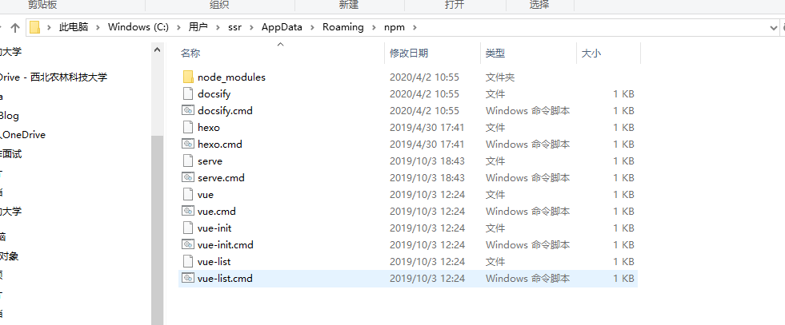
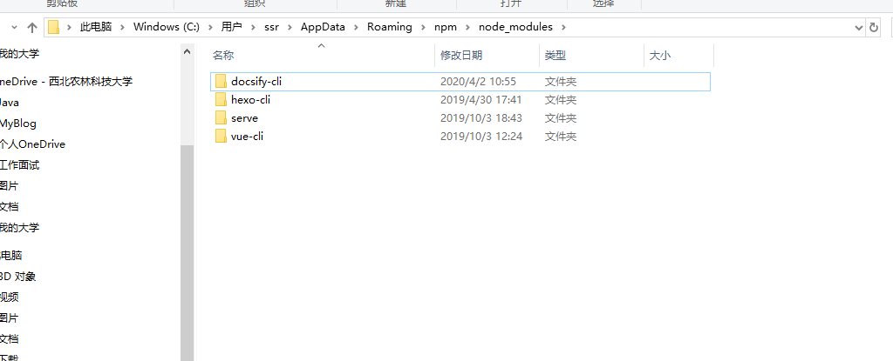

管理员启动 cmd

node -v

npm -v

npm install  cnpm -g #-g全局安装

npm install --registry=https://registry.npm.taobao.org # 使用时安装

cnpm install vue-cli -g

vue list  

能使用npm就使用npm  不能使用npm在使用cnpm

进入相应目录 创建vue程序 使用vue-cli

vue init webpack myvue 创建vue程序

用户（id,用户名，密码，地区编码，邮箱，电话，角色id，用户简介，特长）

角色（id,角色名，描述）

用户搜索记录（id，用户Id，搜索名称）

供求信息（id，名称，种类，数量，开始时间，结束时间，发布时间，图片，类型（1：供应，2：采购），用户id，浏览数量，联系地址）

课程（id,课程名，课程图片，课程介绍，课程目录，用户Id（专家），得分）

课程评价(id，评价内容，打分，用户id，课程id)

帖子（id,标题，内容，发布者id,发布时间）

评论（id，p_id(父id),评价内容，评价用户id，帖子ID，评价时间）

农产品（id,图片，名称，简介，省，市，县，）

