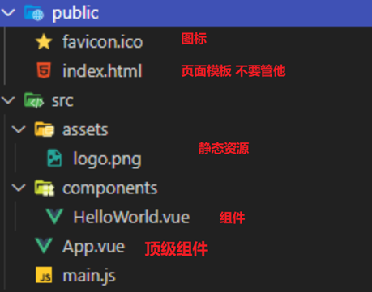

管理员启动 cmd

node -v

npm -v

npm install  cnpm -g #-g全局安装

npm install --registry=https://registry.npm.taobao.org # 使用时安装


cnpm install vue-cli -g

vue list  

能使用npm就使用npm  不能使用npm在使用cnpm

进入相应目录 创建vue程序 使用vue-cli

vue init webpack myvue 创建vue程序


```bash
启动vue
npm run serve
# OR
yarn serve

```


用户（id,用户名，密码，地区编码，邮箱，电话，角色id，用户简介，特长）

角色（id,角色名，描述）

用户搜索记录（id，用户Id，搜索名称）

供求信息（id，名称，种类，数量，开始时间，结束时间，发布时间，图片，类型（1：供应，2：采购），用户id，浏览数量，联系地址）

课程（id,课程名，课程图片，课程介绍，课程目录，用户Id（专家），得分）

课程评价(id，评价内容，打分，用户id，课程id)

帖子（id,标题，内容，发布者id,发布时间）

评论（id，p_id(父id),评价内容，评价用户id，帖子ID，评价时间）

农产品（id,图片，名称，简介，省，市，县，）

专家问题（）


http://autumnfish.cn/webmusic/

## ES6

**let**

- 和 var 关键字的用法基本一致
- 没有 变量提升

**模板字符串**

- 使用 ``` ` 包裹文本 
- 在需要替换的位置使用 ${} 占位,并填入内容即可 

**对象简化赋值**

- 如果属性名和变量名**相同**，可以简写
- 方法可以省略 **function** 关键字

**箭头函数**

- **function** 省略掉，替换为 **=>**
- 参数只有**一个**时，可以省略 **( )**
- 函数体只有**一行**时，可以省略 **{ }**
- 函数体只有**一行**,并且**有返回值**时，如果省略了{},必须省略 return

**箭头函数的****this**

- 创建时的**this**是谁，运行的时候**this**就是谁

## 单文件组件

后缀名是 `.vue` ,可以同时编写结构，逻辑和样式

`template` 标签中写结构

`script` 标签中写逻辑

`style` 标签中写样式

安装了 `vetur` 插件可以通过 `<vue` 生成基础结构【VScode】

## 快速原型开发

**环境配置**

安装 `Node.js` 全部使用默认的设置，一路下一步即可 

打开命令行工具，输入命令 `node –v` 以及 `npm -v` 检查是否安装成功

通过命令 `npm install -g @vue/cli-service-global` 安装一个小工具

**基本使用**

保证 `环境配置` 成功之后

在 `.vue` 文件所在的路径下打开终端 输入 `vue serve 文件名`

等待 `解析`，然后在浏览器访问出现的 `地址` 即可

> **注意:**
>
> 1. template中必须有一个根节点
>
> 2. script 中的 data 写成函数，内部返回一个对象
>
> 3. 如果要使用写好的样式，直接 import 即可

**axios**

使用 `npm` 下载别人写好的 包（模块，库）

比如 `axios` ，下载的命令是 `npm install axios` 或者缩写为 `npm i axios`

在要使用的组件中，使用 `import` 导入 下载的 包（模块，库）

比如 `axios`: 导入的代码是 `import axios from ‘axios’`

**组件抽取**

创建 `components` 文件夹 创建一个文件 叫做 `player.vue`

把播放器的代码 `剪切` 进去,并调整 `图片`、`css` 文件的路径

`App.vue`中 使用 `import` 导入 播放器组件

在 `components` 中添加（注册） 播放器组件

页面上使用 `注册的名字` 当做标签名即可使用 播放器组件

通过 `chrome` 的 `vue` 插件 可以更好地检查，以及调试代码

直接拖入到chrome中的 更多工具 扩展程序 重启浏览器即可

在使用 `vue` 的项目中插件会自动亮起，在开发者界面中通过 `vue` 分栏即可使用

## vue-cli(脚手架)

[https://cli.vuejs.org/zh/](https://cli.vuejs.org/zh/)

**环境配置**

保证 `Node.js` 安装成功的情况下

通过命令 `npm install -g @vue/cli`安装一个小工具

如果失败了:

先输入 `npm install -g cnpm` 安装一个小工具(cnpm)

成功之后再输入 `cnpm install -g @vue/cli` 通过刚刚安装的工具 来安装 vue-cli

**项目创建及运行**

在想要创建项目的文件夹下输入 `vue create 项目名`

调整一下设置，然后回车

如果成功了，依次输入最后出现的 `提示代码`

使用 `npm run serve`运行项目

稍等片刻，在浏览器中输入出现的 `地址` 即可访问

**文件结构**

自己创建，或者用创建好的项目，然后运行起来

重点关注 `src` 文件夹

`public`目录下可以替换图标



## vue-router

用它可以做 `SPA`

`Single Page Application` 单页面应用

[https://router.vuejs.org/zh/](https://router.vuejs.org/zh/)

### **安装**

在项目的 `根目录` 打开 终端 【根目录就是项目所在目录 例如本项目的根目录就是IPlayer】

通过命令 `npm install vue-router` 下载

`main.js` 中

1. 导入

2. use一下

3. 创建路由

4. 挂载到Vue实例上

```javascript

// 1. 导入
import VueRouter from 'vue-router'
// 2. use一下
Vue.use(VueRouter)
// 3. 创建路由
let router = new VueRouter();

new Vue({
    render: h => h(App),
    // 4. 挂载到Vue实例上
    router: router
}).$mount('#app')
```

### **配置规则**

通过 `routes` 属性 配置 `地址` 和 路由管理的 `组件` 关系

`main.js` 中

1. 导入组件

2. `routes` 属性中进行配置关系

3. `path`:设置地址

4. `component`：设置组件

5. 可以配置 `多个`

```
// 配置路由
// 导入 需要通过路由管理的组件
import discovery from './components/03discovery'

// 创建路由
let router = new VueRouter({
    // 配置地址 和组件的对应关系
    routes: [
        {
            //地址
            path: "/discovery",
            // 组件
            component: discovery
        },
    ]
});
```


### **路由出口**

希望匹配到的组件显示在哪里，就在哪里设置一个 `router-view` 标签

多配置几组对应关系

`discovery`:发现音乐

`playlists`:推荐歌单

`songs`: 最新音乐

`mvs`: 最新mv

### **声明式导航**

通过 `router-link` 标签 设置 `to` 属性为地址 可以实现点击切换

```html
<router-link to="/discovery">发现音乐</router-link>
```

### **编程式导航**

组件中通过 `this.$router.push(地址)` 可以通过代码实现切换

```html
  //    如果为空 提示
  if(this.inputValue==''){
     alert("请输入内容")
     //    否则 跳转
  }else {
     this.$router.push('/result')
  }

```


### **路由传参**

在地址的后面 写上 ？分隔

通过 `key=value&key2=value` 的方式添加参数

```html
this.$router.push('/result?q='+this.inputValue)
// this.$router.push(`/result?q=${this.inputValue}`) // ES6语法
```

组件中通过 `this.$route.query` 访问对应的 `key` 即可获取数据【`$route`中没有字母`r`】

## Element-ui

### **安装**

在项目的 `根目录` 打开 终端

通过命令 `npm i element-ui` 下载

[https://element.eleme.cn/#/zh-CN/component/installation](https://element.eleme.cn/#/zh-CN/component/installation)

`main.js` 中

1. 导入 Element-ui

2. 导入 样式

3. use一下

```javascript
// 导入Element UI
import ElementUI from 'element-ui';
// 导入elementui的样式
import 'element-ui/lib/theme-chalk/index.css';
Vue.use(ElementUI)
```

[https://element.eleme.cn/#/zh-CN/component/quickstart](https://element.eleme.cn/#/zh-CN/component/quickstart)

## 发现音乐

项目已经 `创建完毕`

`布局` 已经写好，`路由` 和 `Element-ui` 已经整合完毕

项目跑起来（`npm run serve`）

### **轮播图**

安装 并导入 `axios`

```javascript

<script>
    // 导入axios
    import axios from 'axios'

    export default {
        name: 'discovery',
        data() {
            return {
                // 轮播图
                banners: [],
                // 推荐歌单
                songs: [],
                // 最新音乐
                musics:[]
            }
        },
        created() {
            // 获取轮播图
            axios({
                url: "https://autumnfish.cn/banner",
                method: 'get',
                params: {}
            }).then(res => {
                this.banners = res.data.banners
            })
            // 推荐歌单
            axios({
                url: "https://autumnfish.cn/personalized",
                method: "get",
                params: {
                    limit: 10
                }
            }).then(res => {
                // console.log(res)
                this.songs = res.data.result
            })
            // 最新音乐
            axios({
                url: "https://autumnfish.cn/personalized/newsong",
                method: "get",
                params: {}
            }).then(res => {
                console.log(res)
                this.musics = res.data.result
            })
        }
    };
</script>
```

在 `created` 生命周期函数中调用 `轮播图` 接口 【created在组件一加载的时候执行】

获取到数据并渲染到页面上

## 推荐歌单


### **点击播放**

为 `播放按钮` 绑定 `点击` 事件

调用 获取 `播放歌曲` 接口

把获取到的播放地址，通过 `$parent` 传递给 `父组件`

```javascript
playMusic(id){
                console.log(id)
                axios({
                    url:" https://autumnfish.cn/song/url",
                    method:"get",
                    params:{id}
                }).then(res=>{
                    console.log(res)
                    let url = res.data.data[0].url
                    // 设置父组件的播放地址
                    this.$parent.musicUrl=url;
                    // console.log(this.$parent.musicUrl.console);
                })
            }
```

### **分类切换**

点击分类时，`高亮` 当前分类

顶部数据切换，底部数据切换

在数据改变的时候要执行逻辑，可以使用侦听器 `watch` 来实现

### **数据分页**

歌单列表获取到之后，设置 `总条数` 给 `分页组件`

为分页组件绑定 `页码` 和 `页容量` ，以便进行联动,在调用接口时，一起传递

切换分类时，获取 `第一页` 的数据

分页组件 `页码切换` 时，获取对应页的数据

## 最新音乐

### **歌曲列表**

在 `created` 调用 `最新音乐` 接口

获取到数据之后 渲染到页面上

歌曲的时间默认的是`毫秒`数，我们需要处理一下，变成 `分秒` 的形式