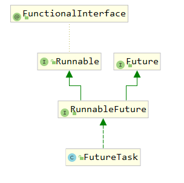
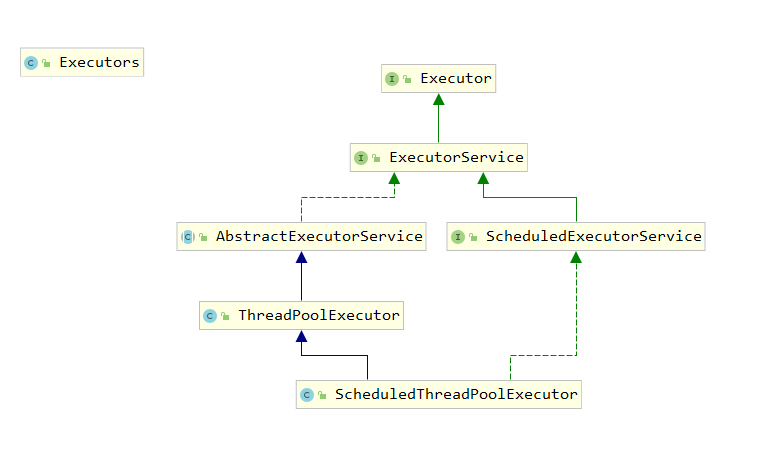
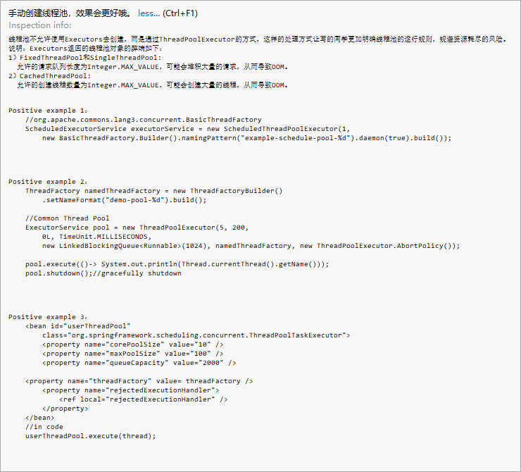
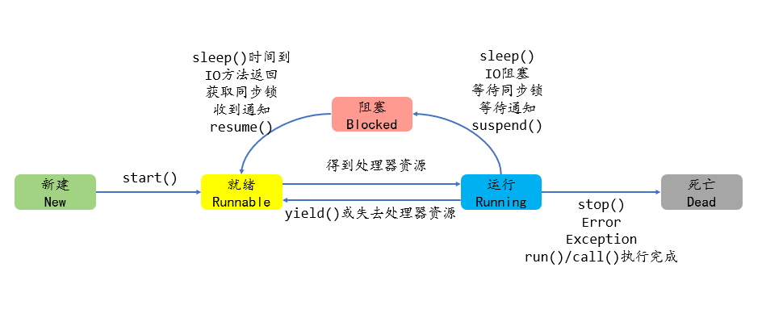

# Java多线程

> 作者：子墨同学 
>
> 时间: 2020-04-05

## 目录

## 概述

### 并发与并行

> **并行：**指在同一时刻，有多条指令在多个处理器上**同时执行**；
>
> **并发：**指在同一时刻只能有一条指令执行，但多个进程指令被快速轮换执行，使得在**宏观上**具有多个进程同时执行的效果。


### 进程、线程

> 几乎所有的操作系统都支持进程的概念，所有运行中的任务通常对应一个进程（Process）。当一个程序进入内存运行时，即变成一个进程。进程是处于运行过程中的程序，并且具有一定的独立功能，**进程是系统进行资源分配和调度的一个独立单位**。

**进程：**

- 进程是正在运行的**程序的实例**。
- 进程是线程的容器，即一个进程中可以开启多个线程。
- 比如打开一个浏览器、打开一个word等操作，都会创建进程。

进程包含如下3个特征。

- **独立性**：进程是系统中独立存在的实体，它可以拥有自己独立的资源，每一个进程都拥有自己私有的地址空间。在没有经过进程本身允许的情况下，一个用户进程不可以直接访问其他进程的地址空间。
- **动态性**：进程与程序的区别在于，程序只是一个静态的指令集合，而进程是一个正在系统中活动的指令集合。在进程中加入了时间的概念。进程具有自己的生命周期和各种不同的状态，这些概念在程序中都是不具备的。
-  **并发性**：多个进程可以在单个处理器上并发执行，多个进程之间不会互相影响。

**线程**：

- 线程是进程内部的一个**独立执行单元**；
- 一个进程可以同时**并发**运行多个线程；
- 比如进程可以理解为医院，线程是挂号、就诊、缴费、拿药等业务活动

线程是进程的组成部分，一个进程可以拥有多个线程，一个线程必须有一个父进程。线程可以拥有自己的堆栈、自己的程序计数器和自己的局部变量，但不拥有系统资源，它与父进程的其他线程共享该进程所拥有的全部资源。

**多线程**：

多个线程并发执行。

> 操作系统可以同时执行多个任务，每个任务就是进程；进程可以同时执行多个任务，每个任务就是线程。

###  线程创建

**Java中线程有四种创建方式：**

- **继承Thread类**
- **实现Runnable接口**
- **实现Callable接口**
- **线程池**

#### 继承Thread类

**步骤**

（1）定义`Thread`类的子类，并重写该类的`run()`方法，该`run()`方法的方法体就代表了线程需要完成的任务。因此把`run()`方法称为**线程执行体**。

（2）创建`Thread`子类的实例，即创建了线程对象。

（3）调用线程对象的`start()`方法来启动该线程。

**示例**

```java
/**
* 创建MyThread类，继承Thread类
*/
public class MyThread extends Thread{
    private int i;
    @Override
    public void run() {
        for (; i <5 ; i++) {
            System.out.println(getName()+":"+i);
        }
    }

    public static void main(String[] args) {
        // 新建线程0和线程1
        MyThread thread = new MyThread();
        thread.setName("线程0");
        MyThread thread1 = new MyThread();
        thread1.setName("线程1");
        //  启动线程0和线程1
        thread.start();
        thread1.start();
    }
}
/*
输出结果：
线程1:0
线程0:0
线程0:1
线程0:2
线程0:3
线程0:4
线程1:1
线程1:2
线程1:3
线程1:4
 */
```


> 注意：**使用继承Thread类的方法来创建线程类时，多个线程之间无法共享线程类的实例变量。**

####  实现Runnable接口

**步骤**

（1）定义`Runnable`接口的实现类，并重写该接口的`run()`方法，该`run()`方法的方法体同样是该线程的线程执行体。

（2）创建`Runnable`实现类的实例，并以此实例作为`Thread`的`target`来创建`Thread`对象，该`Thread`对象才是真正的线程对象。

**示例**

```java
package com.thread.two;

/**
 * 创建MyRunnable类，实现Runnable接口
 */
public class MyRunnable implements Runnable {
    private int i;

    @Override
    public void run() {
        for (; i < 5; i++) {
            // 当线程类实现Runnable接口时，获取当前线程只能使用Thread.currentThread()
            System.out.println(Thread.currentThread().getName() + ":" + i);
        }
    }

    public static void main(String[] args) {
        // 新建线程0和线程1
        MyRunnable runnable = new MyRunnable();
        Thread thread = new Thread(runnable, "线程0");
        Thread thread1 = new Thread(runnable, "线程1");
        thread.start();
        thread1.start();
    }
}

/*
输出结果：
线程1:0
线程0:0
线程1:1
线程0:2
线程1:3
线程0:4
 */
```

> 从上述例子的输出结果可以看出，两个子线程的i变量是连续的，也就是采用Runnable接口的方式创建的多个线程可以共享线程类的实例属性。这是因为在这种方式下，程序所创建的Runnable对象只是线程的target，而多个线程可以共享同一个target，所以多个线程可以共享同一个线程类（实际上应该是线程的target类）的实例属性。

#### 实现Callable接口

`Callable`接口提供了一个`call()`方法可以作为线程执行体，但`call()`方法比`run()`方法功能更强大。

- `call()`方法可以有返回值。
-  `call()`方法可以声明抛出异常。

Callable需要使用FutureTask类帮助执行，FutureTask类结构如下：



**Future接口：**

-  boolean cancel(boolean mayInterruptIfRunning)：试图取消该Future里关联的Callable任务。
-  V get()：返回Callable任务里call()方法的返回值。调用该方法将导致程序阻塞，必须等到子线程结束后才会得到返回值。
-  V get(long timeout, TimeUnit unit)：返回Callable任务里call()方法的返回值。该方法让程序最多阻塞timeout和unit指定的时间，如果经过指定时间后Callable任务依然没有返回值，将会抛出TimeoutException异常。
-  boolean isCancelled()：如果在Callable任务正常完成前被取消，则返回true。
- boolean isDone()：如果Callable任务已完成，则返回true。

```java
@FunctionalInterface
public interface Callable<V> {
    /**
     * Computes a result, or throws an exception if unable to do so.
     *
     * @return computed result
     * @throws Exception if unable to compute a result
     */
    V call() throws Exception;
}
```


> 注意：从Callable接口源码可以看出，Callable接口有泛型限制，Callable接口里的泛型形参类型与call()方法返回值类型相同。

**步骤**

（1）创建`Callable`接口的实现类，并实现call()方法，该call()方法将作为线程执行体，且该call()方法有返回值。

（2）创建Callable实现类的实例，使用FutureTask类来包装Callable对象，该FutureTask对象封装了该Callable对象的call()方法的返回值。

（3）使用FutureTask对象作为Thread对象的target创建并启动新线程。

（4）调用FutureTask对象的get()方法来获得子线程执行结束后的返回值。

**示例**

```java
public class MyCallable implements Callable<Integer> {
    private int i;

    @Override
    public Integer call() throws Exception {
        for (; i < 5; i++) {
            // 当线程类实现Callable接口时，获取当前线程只能使用Thread.currentThread()
            System.out.println(Thread.currentThread().getName() + ":" + i);
        }
        return i;
    }

    public static void main(String[] args) {
        // 创建Callable对象
        MyCallable myCallable = new MyCallable();
        // 使用FutureTask对象作为Thread对象的target创建并启动新线程。
        FutureTask<Integer> futureTask =  new FutureTask<>(myCallable);
        new Thread(futureTask, "线程0").start();

        // 调用FutureTask对象的get()方法来获得子线程执行结束后的返回值。
        try {
            System.out.println("i变量最终值："+futureTask.get());
        } catch (InterruptedException e) {
            e.printStackTrace();
        } catch (ExecutionException e) {
            e.printStackTrace();
        }
    }
}

/*
输出结果：
线程0:0
线程0:1
线程0:2
线程0:3
线程0:4
i变量最终值：5
 */
```


#### 线程池-Executor

> 系统启动一个新线程的成本是比较高的，因为它涉及与操作系统交互。在这种情形下，使用线程池可以很好地提高性能，尤其是当程序中需要创建大量生存期很短暂的线程时，更应该考虑使用线程池。
>
> 线程池在系统启动时即创建大量空闲的线程，程序将一个Runnable对象或Callable对象传给线程池，线程池就会启动一个线程来执行它们的run()或call()方法，当run()或call()方法执行结束后，该线程并不会死亡，而是再次返回线程池中成为空闲状态，等待执行下一个Runnable对象的run()或call()方法。 

#### 线程池线类关系图



**Executor接口：**

声明了execute(Runnable runnable)方法，执行任务代码

**ExecutorService接口：**

继承Executor接口，声明方法：submit、invokeAll、invokeAny以及shutDown等

**AbstractExecutorService抽象类：**

实现ExecutorService接口，基本实现ExecutorService中声明的所有方法

**ScheduledExecutorService接口：**

继承ExecutorService接口，声明定时执行任务方法

**ThreadPoolExecutor类：**

继承类AbstractExecutorService，实现execute、submit、shutdown、shutdownNow方法

**ScheduledThreadPoolExecutor类：**

继承ThreadPoolExecutor类，实现ScheduledExecutorService接口并实现其中的方法

**Executors类：**

提供快速创建线程池的方法

**步骤**

（1）调用`Executors`类的静态工厂方法创建一个`ExecutorService`对象，该对象代表一个线程池。

（2）创建`Runnable`实现类或`Callable`实现类的实例，作为线程执行任务。

（3）调用`ExecutorService`对象的`submit()`方法来提交`Runnable`实例或`Callable`实例。

（4）当不想提交任何任务时，调用`ExecutorService`对象的`shutdown()`方法来关闭线程池。

**示例**

```java
public class MyRunnable implements Runnable {
    @Override
    public void run() {
        for (int i = 0; i < 5; i++) {
            System.out.println(Thread.currentThread().getName() + ":" + i);
        }
    }

    public static void main(String[] args) {
        // 使用线程池创建线程
        // 使用Executors获取线程池对象
        ExecutorService executorService = Executors.newFixedThreadPool(10);
        // 向线程池中提交线程
        executorService.submit(new MyRunnable());
        executorService.submit(new MyRunnable());

        //关闭线程
        executorService.shutdown();
    }

/*
输出结果
pool-1-thread-1:0
pool-1-thread-2:0
pool-1-thread-2:1
pool-1-thread-2:2
pool-1-thread-2:3
pool-1-thread-2:4
pool-1-thread-1:1
pool-1-thread-1:2
pool-1-thread-1:3
pool-1-thread-1:4
 */
}


```

>  阿里巴巴JAVA开发手册不允许使用`Executors`创建线程，推荐使用`ThreadPoolExecutor`的方式创建，这样的处理方式让编写者更明确线程池的运行规则，规避资源耗尽的风险。
>
> 使用Executors返回线程池对象的弊端：
>
> 1）`FixedThreadPool`和`SingleThreadPool`：
>
> 允许的求情队列长度为`Integer.MAX_VALUE`,可能会堆积大量的请求，从而导致`OOM`。
>
> 2）`CachedThreadPool`：
>
> 允许的创建线程数量为`Integer.MAX_VALUE`,可能会堆积大量的请求，从而导致`OOM`。




#### 小结

**创建线程的三种方式对比**

1. 采用实现Runnable、Callable接口的方式创建多线程-  线程类只是实现了Runnable接口或Callable接口，还可以继承其他类。

- 在这种方式下，多个线程可以共享同一个target对象，所以非常适合多个相同线程来处理同一份资源的情况，从而可以将CPU、代码和数据分开，形成清晰的模型，较好地体现了面向对象的思想。

- 劣势是：编程稍稍复杂，如果需要访问当前线程，则必须使用Thread.currentThread()方法。

2. Thread类的方式创建多线程

-  劣势是：因为线程类已经继承了Thread类，所以不能再继承其他父类。
-  优势是：编写简单，如果需要访问当前线程，则无须使用Thread.currentThread()方法，直接使用this即可获得当前线程。鉴于上面分析，因此一般推荐采用实现Runnable接口、Callable接口的方式来创建多线程。

>  鉴于上面分析，因此一般推荐采用实现Runnable接口、Callable接口的方式来创建多线程

**实现接口和继承Thread类比较**

1. 实现接口

- 接口更适合多个相同的程序代码的线程去共享同一个资源。在这种方式下，多个线程可以共享同一个`target`对象，所以非常适合多个相同线程来处理同一份资源的情况，从而可以将CPU、代码和数据分开，形成清晰的模型，较好地体现了面向对象的思想。
- 接口可以避免`Java`中的单继承的局限性。线程类只是实现了`Runnable`接口或`Callable`接口，还可以继承其他类。
- 接口代码可以被多个线程共享，代码和线程独立。
- 线程池只能放入实现`Runable`或`Callable`接口的线程，不能直接放入继承`Thread`的类。

2. 继承Thread类

- 继承方式中，线程类已经继承了Thread类，所以不能再继承其他父类。


> **在Java中，每次程序运行至少启动2个线程。一个是main线程，一个是垃圾收集线程。**

**Runnable和Callable接口比较**

**相同点：**

- 两者都是接口；

- 两者都可用来编写多线程程序；

- 两者都需要调用`Thread.start()`启动线程；

**不同点：**

- 实现Callable接口的线程能返回执行结果；而实现Runnable接口的线程不能返回结果；

- Callable接口的call()方法允许抛出异常；而Runnable接口的run()方法的不允许抛异常；

- 实现Callable接口的线程可以调用Future.cancel取消执行 ，而实现Runnable接口的线程不能

**注意点：**

- **Callable接口支持返回执行结果，此时需要调用FutureTask.get()方法实现，此方法会阻塞主线程直到获取‘将来’结果；当不调用此方法时，主线程不会阻塞！**

> 鉴于上面分析，因此一般推荐采用实现Runnable接口、Callable接口的方式来创建多线程

###  线程生命周期

> 在线程的生命周期中，它要经过新建（`New`）、就绪（`Runnable`）、运行（`Running`）、阻塞（`Blocked`）和死亡（`Dead`） 5种状态。尤其是当线程启动以后，它不可能一直“霸占”着CPU独自运行，所以CPU需要在多条线程之间切换，于是线程状态也会多次在运行、阻塞之间切换。

 **线程状态转换图**


                                    

1. **新建**

-   new关键字创建了一个线程之后，该线程就处于新建状态

-   JVM为线程分配内存，初始化成员变量值

2. **就绪**

- 当线程对象调用了start()方法之后，该线程处于就绪状态
- JVM为线程创建方法调用栈和程序计数器，等待线程调度器调度
- 处于就绪状态中的线程并没有开始运行，只是表示该线程可以运行了。至于该线程何时开始运行，取决于JVM里线程调度器的调度。

> 注意：调用了线程的run()方法之后，该线程已经不再处于新建状态，不要再次调用线程对象的start()方法。只能对处于新建状态的线程调用start()方法，否则将引发IllegalThreadStateException异常。

> 提示：如果希望调用子线程的start()方法后子线程立即开始执行，程序可以使用Thread.sleep (1)来让当前运行的线程（主线程）睡眠1毫秒——1毫秒就够了，因为在这1毫秒内CPU不会空闲，它会去执行另一个处于就绪状态的线程，这样就可以让子线程立即开始执行。


3. **运行**

- 就绪状态的线程获得CPU资源，开始执行run()方法，该线程进入运行状态
- 如果计算机只有一个CPU，那么在任何时刻只有一个线程处于运行状态。

4. **阻塞**

当发生如下情况时，线程将会进入阻塞状态

- 线程调用sleep()方法主动放弃所占用的处理器资源。
- 线程调用了一个阻塞式IO方法，在该方法返回之前，该线程被阻塞。
- 线程试图获得一个同步监视器，但该同步监视器正被其他线程所持有。关于同步监视器的知识、后面将有更深入的介绍。
-  线程在等待某个通知（notify）。
- 程序调用了线程的suspend()方法将该线程挂起。但这个方法容易导致死锁，所以应该尽量避免使用该方法。

当发生如下特定的情况时可以解除上面的阻塞，让该线程重新进入就绪状态。

-  调用sleep()方法的线程经过了指定时间。
-  线程调用的阻塞式IO方法已经返回。
-  线程成功地获得了试图取得的同步监视器。
- 线程正在等待某个通知时，其他线程发出了一个通知。
-  处于挂起状态的线程被调用了resume()恢复方法。

5. **死亡**

线程会以如下3种方式结束，结束后就处于死亡状态：

- run()或call()方法执行完成，线程正常结束。

- 线程抛出一个未捕获的Exception或Error。

- 调用该线程stop()方法来结束该线程，该方法容易导致死锁，不推荐使用。

>  为了测试某个线程是否已经死亡，可以调用线程对象的isAlive()方法，当线程处于就绪、运行、阻塞3种状态时，该方法将返回true；当线程处于新建、死亡2种状态时，该方法将返回false。
>

> 注意：不要对处于死亡状态的线程调用start()方法，死亡就是死亡，该线程将不可再次作为线程执行。程序只能对新建状态的线程调用start()方法，对新建状态的线程两次调用start()方法也是错误的。这都会引发IllegalThreadState Exception异常。

## 6.   线程安全问题

### 6.1. 什么是线程安全

如果有多个线程同时运行同一个实现了Runnable接口的类，程序每次运行结果和单线程运行的结果是一样的，而且其他的变量的值也和预期的是一样的，就是线程安全的；反之，则是线程不安全的。

### 6.2. 问题演示

为了演示线程安全问题，我们采用多线程模拟多个窗口同时售卖《哪吒之魔童降世》电影票。

#### 6.2.1.   第一步：创建售票线程类

```java
package cn.edu.nwafu.safe;

public class Ticket implements Runnable {
    private int ticktNum = 100;
    
    public void run() {
        while(true){
            if(ticktNum > 0){
                //1.模拟出票时间
                try {
                    Thread.sleep(100);
                } catch (InterruptedException e) {
                    e.printStackTrace();
                }
                //2.打印进程号和票号，票数减1
                String name = Thread.currentThread().getName();
                System.out.println("线程"+name+"售票："+ticktNum--);
            }
        }
    }
}
```

 

#### 6.2.2.   第二步：创建测试类

```java
package cn.edu.nwafu.safe;

import cn.edu.nwafu.safe.Ticket;

public class TicketDemo {
    public static void main(String[] args){
        Ticket ticket = new Ticket();
        Thread thread1 = new Thread(ticket, "窗口1");
        Thread thread2 = new Thread(ticket, "窗口2");
        Thread thread3 = new Thread(ticket, "窗口3");
        thread1.start();
        thread2.start();
        thread3.start();
    }
}
```


## 6.3. 问题分析

线程安全问题都是由**全局变量**及**静态变量**引起的。

若每个线程对全局变量、静态变量只读，不写，一般来说，这个变量是线程安全的；

若有多个线程同时执行写操作，一般都需要考虑线程同步，否则的话就可能影响线程安全。

   

综上所述，线程安全问题根本原因：

- **多个线程在操作共享的数据**；

- **操作共享数据的线程代码有多条**；

- **多个线程对共享数据有写操作；**


## 6.4. 问题解决-线程同步

要解决以上线程问题，只要在某个线程修改共享资源的时候，其他线程不能修改该资源，等待修改完毕同步之后，才能去抢夺CPU资源，完成对应的操作，保证了数据的同步性，解决了线程不安全的现象。

为了保证每个线程都能正常执行共享资源操作,Java引入了***7***种线程同步机制。

1)         同步代码块（synchronized）

2)         同步方法（synchronized）

3)         同步锁（ReenreantLock）

4)         特殊域变量（volatile）

5)         局部变量（ThreadLocal）

6)         阻塞队列（LinkedBlockingQueue）

7)         原子变量（Atomic*）

 

### 6.4.1.   同步代码块（synchronized）

**同步代码块 ：**

synchronized 关键字可以用于方法中的某个区块中，表示只对这个区块的资源实行互斥访问。

**语法:**

```java
synchronized(同步锁){
    //TODO 需要同步操作的代码
}
```

**同步锁:**

对象的同步锁只是一个概念,可以想象为在对象上标记了一个锁.

- 锁对象可以是任意类型。

- **多个线程要使用同一把锁。**

***注意*：在任何时候,最多允许一个线程拥有同步锁,谁拿到锁就进入代码块,其他的线程只能在外等着(BLOCKED)。**

使用同步代码块代码如下：

```java
package cn.edu.nwafu.safe;

public class Ticket implements Runnable {
    private int ticktNum = 100;

    //定义锁对象
    Object obj = new Object();

    public void run() {
        while(true){
            synchronized (obj){
                if(ticktNum > 0){
                    //1.模拟出票时间
                    try {
                        Thread.sleep(100);
                    } catch (InterruptedException e) {
                        e.printStackTrace();
                    }
                    //2.打印进程号和票号，票数减1
                    String name = Thread.currentThread().getName();
                    System.out.println("线程"+name+"售票："+ticktNum--);
                }
            }
        }
    }
}
```

 

### 6.4.2.   同步方法（synchronized）

**同步方法：**

使用synchronized修饰的方法,就叫做**同步方法**,保证A线程执行该方法的时候,其他线程只能在方法外等着。

格式：

```java
public synchronized void method(){
    //TODO 可能会产生线程安全问题的代码 
}
```

**同步锁是谁?**

-   **对于非static方法,同步锁就是this。**

-   **对于static方法,同步锁是当前方法所在类的字节码对象(类名.class)。**

使用同步方法代码如下：

```java
package cn.edu.nwafu.safe;

/**
 * @author shensr
 * @version V1.0
 * @description: 电影票对象
 * @create 2019/9/15
 **/

public class Ticket implements Runnable {

    private int ticketNum = 50;//电影票数量
    private Object obj = new Object(); //锁对象，可以理解为钥匙，拿到钥匙可以执行代码
    //同步方法实现
    public void run() {
        while (true) {
            safeTicket();
        }
    }

    /**
     * 同步方法实现
     * 注意 ：对于static方法,同步锁是当前方法所在类的字节码对象(类名.class)。
     * 对于非static方法,同步锁就是this。
     */
    private synchronized void safeTicket() {
        if(ticketNum>0){
                    //邮票，线程睡眠1000ms，售票
                    try {
                        Thread.sleep(100);
                    } catch (InterruptedException e) {
                        e.printStackTrace();
                    }
                    System.out.println("线程"+Thread.currentThread().getName()+"售票："+ticketNum--);
                }
    }
}

```


### 6.4.3.   同步锁（ReenreantLock）

**同步锁：**

> java.util.concurrent.locks.Lock 机制提供了比synchronized代码块和synchronized方法更广泛的锁定操作，同步代码块/同步方法具有的功能Lock都有,除此之外更强大,更体现面向对象。

**同步锁方法：**

> public void lock() :加同步锁。
>
> public void unlock() :释放同步锁。

使用重入锁代码如下：

```java
package cn.edu.nwafu.safe;

import java.util.concurrent.locks.Lock;
import java.util.concurrent.locks.ReentrantLock;

/**
 * @author shensr
 * @version V1.0
 * @description: 电影票对象
 * @create 2019/9/15
 **/

public class Ticket implements Runnable {
    //3. 同步锁实现
    private int ticketNum = 50;//电影票数量
    //定义锁对象(重入锁)：构造函数参数为线程是否公平获取锁true-公平；
    //           false-不公平，即由某个线程独占，默认是false
    private Lock lock = new ReentrantLock(true);

    public void run() {
        while (true) {
            lock.lock();//加锁
            try {
                if (ticketNum > 0) {
                    //邮票，线程睡眠1000ms，售票
                    try {
                        Thread.sleep(100);
                    } catch (InterruptedException e) {
                        e.printStackTrace();
                    }
                    System.out.println("线程" + Thread.currentThread().getName() + "售票：" + ticketNum--);
                }
            }catch (Exception e){

            }finally {
                lock.unlock();//释放锁
            }

        }
    }
}

```


   **注意：一定要记得释放锁，否则会引发死锁。**

## 6.5. 小结

**Synchronized和Lock区别**

- synchronized是java内置**关键字**，在jvm层面，Lock是个**java类**；

- synchronized**无法判断**是否获取锁的状态，Lock可以判断是否获取到锁；

- synchronized会自动释放锁(a 线程执行完同步代码会释放锁 ；b 线程执行过程中发生异常会释放锁)，Lock需在finally中手工释放锁（unlock()方法释放锁），否则容易造成线程死锁；

- 用synchronized关键字的两个线程1和线程2，如果当前线程1获得锁，线程2线程等待。如果线程1阻塞，线程2则会一直等待下去，而Lock锁就不一定会等待下去，如果尝试获取不到锁，线程可以不用一直等待就结束了；

- synchronized的锁可重入（拿到锁之后还可以再次申请）、不可中断、非公平，而Lock锁可重入、可判断、可公平（两者皆可）

- Lock锁适合大量同步的代码的同步问题，synchronized锁适合代码少量的同步问题。

 

## 7.   线程死锁

### 7.1. 什么是死锁

多线程以及多进程改善了系统资源的利用率并提高了系统的处理能力。然而，并发执行也带来了新的问题--死锁。

所谓死锁是指多个线程因竞争资源而造成的一种僵局（互相等待），若无外力作用，这些进程都将无法向前推进。


### 7.2. 死锁产生的必要条件（一定要熟悉）

以下这四个条件是死锁的必要条件，只要系统发生死锁，这些条件必然成立，而只要上述条件之一不满足，就不会发生死锁。

#### 7.2.1.   互斥条件

进程要求对所分配的资源（如打印机）进行排他性控制，即在一段时间内某资源仅为一个进程所占有。此时若有其他进程请求该资源，则请求进程只能等待。

#### 7.2.2.   不可剥夺条件

进程所获得的资源在未使用完毕之前，不能被其他进程强行夺走，即只能由获得该资源的进程自己来释放（只能是主动释放)。

#### 7.2.3.   请求与保持条件

进程已经保持了至少一个资源，但又提出了新的资源请求，而该资源已被其他进程占有，此时请求进程被阻塞，但对自己已获得的资源保持不放。

#### 7.2.4.   循环等待条件

存在一种进程资源的循环等待链，链中每一个进程已获得的资源同时被 链中下一个进程所请求。即存在一个处于等待状态的进程集合{Pl, P2, …, pn}，其中Pi等 待的资源被P(i+1)占有（i=0, 1, …, n-1)，Pn等待的资源被P0占有，如图所示。


        

  

 

#### 7.2.5.   死锁示例代码

```java
package cn.edu.nwafu.safe;

/**
 * @author shensr
 * @version V1.0
 * @description: 模拟死锁
 * @create 2019/9/15
 **/

public class DeadLockRunnable implements Runnable {
    private static Object obj1 = new Object();//定义成静态变量，使线程可以共享实例
    private static Object obj2 = new Object();//定义成静态变量，使线程可以共享实例
    public int flag ;

    public DeadLockRunnable(int flag) {
        this.flag = flag;
    }

    public void run() {
        if(flag == 1){
            System.out.println(Thread.currentThread().getName()+"已经获取到obj1，正在请求obj2");
            synchronized (obj1){
                try {
                    Thread.sleep(500);
                } catch (InterruptedException e) {
                    e.printStackTrace();
                }
                synchronized (obj2){
                    System.out.println(Thread.currentThread().getName()+"已经获取到obj1和obj2");
                }
            }
        }
        if(flag==2){
            System.out.println(Thread.currentThread().getName()+"已经获取到obj2，正在请求obj1");
            synchronized (obj2){
                try {
                    Thread.sleep(500);
                } catch (InterruptedException e) {
                    e.printStackTrace();
                }
                synchronized (obj1){
                    System.out.println(Thread.currentThread().getName()+"已经获取到obj1和obj2");
                }
            }
        }
    }
}

```

 测试：

```java
package cn.edu.nwafu.safe;


/**
 * @author shensr
 * @version V1.0
 * @description: 测试死锁
 * @create 2019/9/15
 **/

public class DeadLockRunnableTest {

    public static void main(String[] args) {
        //1.创建两个DeadLockRunnable实例
        DeadLockRunnable deadLockRunnable1 = new DeadLockRunnable(1);
        DeadLockRunnable deadLockRunnable2 = new DeadLockRunnable(2);
        //2.创建两个线程执行两个DeadLockRunnable实例
        Thread thread1 = new Thread(deadLockRunnable1, "runnable1");
        Thread thread2 = new Thread(deadLockRunnable2, "runnable2");
        thread1.start();
        thread2.start();
    }

}

```

执行效果如下：表示死锁产生

   ```
runnable1已经获取到obj1，正在请求obj2
runnable2已经获取到obj2，正在请求obj1
   ```

## 7.3. 死锁处理

- 预防死锁：通过设置某些限制条件，去破坏产生死锁的四个必要条件中的一个或几个条件，来防止死锁的发生。

- 避免死锁：在资源的动态分配过程中，用某种方法去防止系统进入不安全状态，从而避免死锁的发生。

- 检测死锁：允许系统在运行过程中发生死锁，但可设置检测机构及时检测死锁的发生，并采取适当措施加以清除。

- 解除死锁：当检测出死锁后，便采取适当措施将进程从死锁状态中解脱出来。

### 7.3.1.   死锁预防

预防死锁是设法至少破坏产生死锁的四个必要条件之一,严格的防止死锁的出现。

#### 7.3.1.1.  破坏“互斥”条件

**“互斥”条件是无法破坏的**。因此，在死锁预防里主要是破坏其他几个必要条件，而不去涉及破坏“互斥”条件。

#### 7.3.1.2.  破坏“占有并等待”条件

破坏“占有并等待”条件，就是在系统中不允许进程在已获得某种资源的情况下，申请其他资源。即要想出一个办法，阻止进程在持有资源的同时申请其他资源。

- 方法一：一次性分配资源，即创建进程时，要求它申请所需的全部资源，系统或满足其所有要求，或什么也不给它。

- 方法二：要求每个进程提出新的资源申请前，释放它所占有的资源。这样，一个进程在需要资源S时，须先把它先前占有的资源R释放掉，然后才能提出对S的申请，即使它可能很快又要用到资源R。

 

#### 7.3.1.3. 破坏“不可抢占”条件

破坏“不可抢占”条件就是允许对资源实行抢夺。

- 方法一：如果占有某些资源的一个进程进行进一步资源请求被拒绝，则该进程必须释放它最初占有的资源，如果有必要，可再次请求这些资源和另外的资源。

- 方法二：如果一个进程请求当前被另一个进程占有的一个资源，则操作系统可以抢占另一个进程，要求它释放资源。只有在任意两个进程的优先级都不相同的条件下，方法二才能预防死锁。

 

#### 7.3.1.4. 破坏“循环等待”条件

破坏“循环等待”条件的一种方法，是将系统中的所有资源统一编号，进程可在任何时刻提出资源申请，但所有申请必须按照资源的编号顺序（升序）提出。这样做就能保证系统不出现死锁。

### 7.3.2.   死锁避免

避免死锁不严格限制产生死锁的必要条件的存在,因为即使死锁的必要条件存在,也不一定发生死锁。

#### 7.3.2.1. 有序资源分配法

该算法实现步骤如下：

- 必须为所有资源统一编号，例如打印机为1、传真机为2、磁盘为3等

- 同类资源必须一次申请完，例如打印机和传真机一般为同一个机器，必须同时申请

- 不同类资源必须按顺序申请

例如：有两个进程P1和P2，有两个资源R1和R2

P1请求资源：R1、R2

P2请求资源：R1、R2

这样就破坏了环路条件，避免了死锁的发生。

#### 7.3.2.2.  银行家算法

[银行家算法](https://baike.baidu.com/item/银行家算法)（Banker's Algorithm）是一个避免死锁（Deadlock）的著名算法，是由艾兹格·迪杰斯特拉在1965年为T.H.E系统设计的一种避免死锁产生的算法。它以银行借贷系统的分配策略为基础，判断并保证系统的安全运行。流程图如下：

​      

 

银行家算法的基本思想是分配资源之前，判断系统是否是安全的；若是，才分配。它是最具有代表性的避免[死锁](https://baike.baidu.com/item/死锁)的算法。

设进程i提出请求REQUEST [i]，则银行家算法按如下规则进行判断。

1)   如果REQUEST [i]<= NEED[i，j]，则转（2)；否则，出错。

2)   如果REQUEST [i]<= AVAILABLE[i]，则转（3)；否则，等待。

3)   系统试探分配资源，修改相关数据：

AVAILABLE[i]-=REQUEST[i];//可用资源数-请求资源数

ALLOCATION[i]+=REQUEST[i];//已分配资源数+请求资源数

NEED[i]-=REQUEST[i];//需要资源数-请求资源数

4)   系统执行安全性检查，如安全，则分配成立；否则试探险性分配作废，系统恢复原状，进程等待。

 

#### 7.3.2.3. 顺序加锁

当多个线程需要相同的一些锁，但是按照**不同的顺序**加锁，死锁就很容易发生。

例如以下两个线程就会死锁：

Thread 1: 

lock A (when C locked) 

lock B (when C locked) 

wait for C

Thread 2: 

wait for A 

wait for B

lock C (when A locked) 

如果能确保所有的线程都是按照**相同的顺序**获得锁，那么死锁就不会发生。 例如以下两个线程就不会死锁

Thread 1: 

lock A 

lock B

lock C

Thread 2: 

wait for A 

wait for B

wait for C

按照顺序加锁是一种有效的死锁预防机制。但是，这种方式需要**事先知道所有可能会用到的锁**，但总有些时候是无法预知的，所以该种方式只适合特定场景。

#### 7.3.2.4. 限时加锁

限时加锁是线程在尝试获取锁的时候加一个超时时间，若超过这个时间则放弃对该锁请求，并回退并释放所有已经获得的锁，然后等待一段随机的时间再重试

以下是一个例子，展示了两个线程以不同的顺序尝试获取相同的两个锁，在发生超时后回退并重试的场景：

Thread 1 locks A 

Thread 2 locks B 

Thread 1 attempts to lock B but is blocked 

Thread 2 attempts to lock A but is blocked 

Thread 1’s lock attempt on B times out 

Thread 1 backs up and releases A as well 

Thread 1 waits randomly (e.g. 257 millis) before retrying. 

Thread 2’s lock attempt on A times out 

Thread 2 backs up and releases B as well 

Thread 2 waits randomly (e.g. 43 millis) before retrying.

 

在上面的例子中，线程2比线程1早200毫秒进行重试加锁，因此它可以先成功地获取到两个锁。这时，线程1尝试获取锁A并且处于等待状态。当线程2结束时，线程1也可以顺利的获得这两个锁。

这种方式有两个缺点：

1)         当线程数量少时，该种方式可避免死锁，但当线程数量过多，这些线程的加锁时限相同的概率就高很多，可能会导致超时后重试的死循环。

2)         Java中不能对synchronized同步块设置超时时间。你需要创建一个自定义锁，或使用Java5中java.util.concurrent包下的工具。

### 7.3.3. 死锁检测

预防和避免死锁系统开销大且不能充分利用资源，更好的方法是不采取任何限制性措施，而是提供检测和解脱死锁的手段，这就是死锁检测和恢复。

**死锁检测数据结构：**

-   E是现有资源向量（existing resource vector），代码每种已存在资源的总数

-   A是可用资源向量（available resource vector），那么Ai表示当前可供使用的资源数（即没有被分配的资源）

-   C是当前分配矩阵（current allocation matrix），C的第i行代表Pi当前所持有的每一种类型资源的资源数

-   R是请求矩阵（request matrix），R的每一行代表P所需要的资源的数量

​    

 

**死锁检测步骤：**  

1)         寻找一个没有结束标记的进程Pi，对于它而言R矩阵的第i行向量小于或等于A。

2)         如果找到了这样一个进程，执行该进程，然后将C矩阵的第i行向量加到A中，标记该进程，并转到第1步

3)         如果没有这样的进程，那么算法终止

4)         算法结束时，所有没有标记过的进程都是死锁进程。

 

### 7.3.4. 死锁恢复

**利用抢占恢复。**

- 临时将某个资源从它的当前所属进程转移到另一个进程。

- 这种做法很可能需要人工干预，主要做法是否可行需取决于资源本身的特性。

**利用回滚恢复**

- 周期性的将进程的状态进行备份，当发现进程死锁后，根据备份将该进程复位到一个更早的，还没有取得所需的资源的状态，接着就把这些资源分配给其他死锁进程。

**通过杀死进程恢复**

- 最直接简单的方式就是杀死一个或若干个进程。

- 尽可能保证杀死的进程可以从头再来而不带来副作用。

 

 

## 8.   线程通讯

### 8.1. 为什么要线程通信

多个线程并发执行时，在默认情况下CPU是随机切换线程的，有时我们希望CPU按我们的规律执行线程，此时就需要线程之间协调通信。

### 8.2. 线程通讯方式

**线程间通信常用方式如下：**

-   休眠唤醒方式：

Object的wait、notify、notifyAll

Condition的await、signal、signalAll

-   CountDownLatch：用于某个线程A等待若干个其他线程执行完之后，它才执行

-   CyclicBarrier：一组线程等待至某个状态之后再全部同时执行

-   Semaphore：用于控制对某组资源的访问权限

 

#### 8.2.1.   休眠唤醒方式

**多线程打印10以内的奇偶数：**

i从0开始，当i是奇数时，奇数线程打印，偶数线程等待；

​					当i是偶数时，偶数线程打印，奇数线程等待。

**方式一：**Object的wait、notify、notifyAll

```java
package cn.edu.nwafu.communication;

/**
 * @author shensr
 * @version V1.0
 * @description: **多线程打印10以内的奇偶数：**
 *                  i从0开始，当i是奇数时，奇数线程打印，偶数线程等待；
 * ​					     当i是偶数时，偶数线程打印，奇数线程等待。 
 *              使用Object的wait、notify、notifyAll方式实现线程通讯
 * @create 2019/9/16
 **/

public class WaitNotifyRunnable {
    private Object obj = new Object();
    private Integer i=0;
    
    public void odd() {
        while(i<10){
            synchronized (obj){
                if(i%2 == 1){
                    System.out.println("奇数："+i);
                    i++;
                    obj.notify();
                } else {
                    try {
                        obj.wait();
                    } catch (InterruptedException e) {
                        e.printStackTrace();
                    }
                }
            }
        }
    }

    public void even(){
        while(i<10){
            synchronized (obj){
                if(i%2 == 0){
                    System.out.println("偶数："+i);
                    i++;
                    obj.notify();
                } else {
                    try {
                        obj.wait();
                    } catch (InterruptedException e) {
                        e.printStackTrace();
                    }
                }
            }
        }
    }
    public static void main(String[] args){
        final WaitNotifyRunnable runnable = new WaitNotifyRunnable();
        Thread t1 = new Thread(new Runnable() {
            public void run() {
                runnable.odd();
            }
        }, "偶数线程");
        //lambda表达式
        Thread t2 = new Thread(() -> runnable.even(), "奇数线程");

        t1.start();
        t2.start();
    }
}
```

 **注意：** Object的wait、notify、notifyAll这些方法依赖于synchronized关键字，没有就会抛出java.lang.IllegalMonitorStateException异常

**方式二：**Condition的await、signal、signalAll

```java
package cn.edu.nwafu.communication.conditon;

import java.util.concurrent.locks.Condition;
import java.util.concurrent.locks.Lock;
import java.util.concurrent.locks.ReentrantLock;

/**
 * @author shensr
 * @version V1.0
 * @description:
 * @create 2019/9/16
 **/

public class WaitNotifyRunnable {

    private Lock lock = new ReentrantLock();//这里要设置为独占锁，参数要为false
    private Condition condition = lock.newCondition();
    private Integer i=0;
    public void odd() {
        while(i<10){
            lock.lock();
            try{
                if(i%2 == 1){
                    System.out.println("奇数："+i);
                    i++;
                    condition.signal();
                } else {
                    condition.await();
                }
            } catch (InterruptedException e) {
                e.printStackTrace();
            } finally {
                lock.unlock();
            }

        }
    }

    public void even(){
        while(i<10){
            lock.lock();
            try{
                if(i%2 == 0){
                    System.out.println("偶数："+i);
                    i++;
                    condition.signal();
                } else {
                    condition.await();
                }
            } catch (InterruptedException e) {
                e.printStackTrace();
            } finally {
                lock.unlock();
            }

        }
    }
    public static void main(String[] args){
        final WaitNotifyRunnable runnable = new WaitNotifyRunnable();
        Thread t1 = new Thread(()->runnable.odd(), "偶数线程");
        Thread t2 = new Thread(() -> runnable.even(), "奇数线程");
        t1.start();
        t2.start();
    }
}
```

 

**Object和Condition休眠唤醒区别**

-   object wait()必须在synchronized（同步锁）下使用， 
-   object wait()必须要通过notify()方法进行唤醒 
-   condition await() 必须和Lock（互斥锁/共享锁）配合使用
-   condition await() 必须通过 signal() 方法进行唤醒

#### 8.2.2. CountDownLatch方式

CountDownLatch是在java1.5被引入的，存在于java.util.concurrent包下。

CountDownLatch这个类能够使一个线程等待其他线程完成各自的工作后再执行。

CountDownLatch是通过一个计数器来实现的，**计数器的初始值为线程的数量**。


每当一个线程完成了自己的任务后，计数器的值就会减1。当计数器值到达0时，它表示所有的线程已经完成了任务，然后在闭锁上等待的线程就可以恢复执行任务。

示例代码：

```java
package cn.edu.nwafu.communication.countDownLatch;

import java.util.concurrent.CountDownLatch;

/**
 * @author shensr
 * @version V1.0
 * @description: CountDownLatch方式
 * @create 2019/9/16
 **/

public class CountDown {
    private Integer i = 0;
    private CountDownLatch countDownLatch = new CountDownLatch(1);

    public void odd(){
        while(i < 10){
            if(i%2 == 1){
                System.out.println("奇数："+i);
                i++;
                countDownLatch.countDown();
            } else {
                try {
                    countDownLatch.await();
                } catch (InterruptedException e) {
                    e.printStackTrace();
                }
            }
        }
    }

    public void even(){
        while(i < 10){
            if(i%2 == 0){
                System.out.println("偶数："+i);
                i++;
                countDownLatch.countDown();
            } else {
                try {
                    countDownLatch.await();
                } catch (InterruptedException e) {
                    e.printStackTrace();
                }
            }
        }
    }
    public static void main(String[] args){
        final CountDown countDown = new CountDown();
        Thread t1 = new Thread(() -> countDown.odd(),"奇数");
        Thread t2 = new Thread(() -> countDown.even(),"偶数");

        t1.start();
        t2.start();
    }
}
```

 

#### 8.2.3.   CyclicBarrier方式

CyclicBarrier是在java1.5被引入的，存在于java.util.concurrent包下。

CyclicBarrier实现让一组线程等待至某个状态之后再全部同时执行。

CyclicBarrier底层是基于ReentrantLock和Condition实现。

三个线程同时启动，示例代码如下：

```java
package cn.edu.nwafu.communication.cyclicbarrier;

import java.util.Date;
import java.util.concurrent.BrokenBarrierException;
import java.util.concurrent.CyclicBarrier;

/**
 * @author shensr
 * @version V1.0
 * @description:
 * @create 2019/9/16
 **/

public class CyclicBarrierDemo {
     private static CyclicBarrier cyclicBarrier = new CyclicBarrier(3);

    public static void run(){
        System.out.println(Thread.currentThread().getName()+"：准备...");
        try {
            cyclicBarrier.await();
        } catch (InterruptedException e) {
            e.printStackTrace();
        } catch (BrokenBarrierException e) {
            e.printStackTrace();
        }
        System.out.println(Thread.currentThread().getName()+"启动完毕："+new Date().getTime());

    }

    public static void main(String[] args){
        new Thread(() -> run(),"线程1").start();
        new Thread(() -> run(),"线程2").start();
        new Thread(() -> run(),"线程3").start();
    }
}

```

 

执行效果如下：三个线程同时启动

```
线程1：准备...
线程2：准备...
线程3：准备...
线程3启动完毕：1568605543873
线程1启动完毕：1568605543873
线程2启动完毕：1568605543873
```

   

#### 8.2.4.   Semaphore方式

Semaphore是在java1.5被引入的，存在于java.util.concurrent包下。

Semaphore用于控制对某组资源的访问权限。

工人使用机器工作，示例代码如下：

```java
package com.multithread.thread;

import java.util.concurrent.Semaphore;

public class SemaphoreDemo {

    static class Machine implements Runnable{
        private int num;
        private Semaphore semaphore;

        public Machine(int num, Semaphore semaphore) {
            this.num = num;
            this.semaphore = semaphore;
        }

        public void run() {
            try {
                semaphore.acquire();//请求机器
                System.out.println("工人"+this.num+"请求机器，正在使用机器");
                Thread.sleep(1000);
                System.out.println("工人"+this.num+"使用完毕，已经释放机器");
                semaphore.release();//释放机器
            } catch (InterruptedException e) {
                e.printStackTrace();
            }
        }
    }

    public static void main(String[] args){
        int worker = 8;//工人数
        Semaphore semaphore = new Semaphore(3);//机器数
        for (int i=0; i< worker; i++){
            new Thread(new Machine(i, semaphore)).start();
        }
    }
}
```

 

执行效果如下：

```java
工人[1]请求机器，正在使用机器...
工人[0]请求机器，正在使用机器...
工人[2]请求机器，正在使用机器...
工人[0]使用完毕，已经释放机器!!!
工人[1]使用完毕，已经释放机器!!!
工人[3]请求机器，正在使用机器...
工人[4]请求机器，正在使用机器...
工人[2]使用完毕，已经释放机器!!!
工人[6]请求机器，正在使用机器...
工人[3]使用完毕，已经释放机器!!!
工人[4]使用完毕，已经释放机器!!!
工人[5]请求机器，正在使用机器...
工人[7]请求机器，正在使用机器...
工人[6]使用完毕，已经释放机器!!!
工人[7]使用完毕，已经释放机器!!!
工人[5]使用完毕，已经释放机器!!!
```


### 8.3 小结

#### 8.3.1.   sleep和wait区别

  

|            | wait                                                         | sleep                                             |
| ---------- | ------------------------------------------------------------ | ------------------------------------------------- |
| 同步       | 只能在同步上下文中调用wait方法，否则抛出java.lang.IllegalMonitorStateException异常 | 不需要在同步方法或同步代码块中调用                |
| 作用对象   | wait方法定义在Object类中，作用于对象本身                     | sleep方法定义在java.lang.Thread中，作用于当前线程 |
| 释放锁资源 | **是**                                                       | 否                                                |
| 唤醒条件   | 其他线程调用对象的notify()方法或则notifyAll()方法            | 超时或则调用interrupt方法                         |
| 方法属性   | wait是实例方法                                               | sleep是静态方法                                   |

 

 

#### 8.3.2.   wait和notify区别

- wait和notify都是Object中的方法

- wait和notify执行前线程都必须获得对象锁

- wait的作用是使当前线程进行等待

- notify的作用是通知其他等待当前线程的对象锁的线程

 

## 总结

## 参考资料

