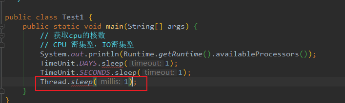
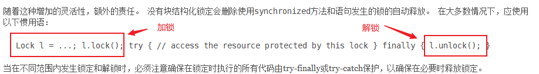
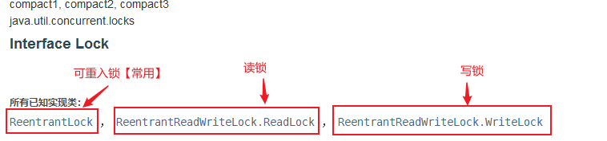
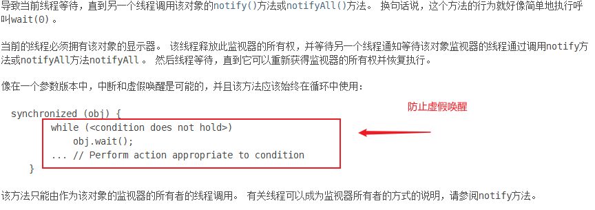
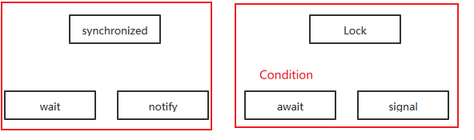

# JUC

[TOC]


## 什么是juc

`JUC`就是`java.util .concurrent`工具包的简称。这是一个处理线程的工具包，JDK 1.5开始出现的。【面试高频】【源码+官方文档进行学习】

【业务：普通的线程代码 Thread】
【Runnable 没有返回值、效率相比入 Callable 相对较低！】

## 线程和进程

> 进程是处于运行过程中的**程序**，并且具有一定的独立功能，**进程是系统进行资源分配和调度的一个独立单位**。

**进程**：一个程序，QQ.exe Music.exe 程序的集合；
一个进程往往可以包含多个线程，至少包含一个！
Java默认有几个线程？ 【2 个  mian和GC】
**线程**：开了一个进程 Typora，写字，自动保存（线程负责的）
对于Java而言：Thread、Runnable、Callable

Java 真的可以开启线程吗？ 【开不了】

```java
  public synchronized void start() {
        /**
         * This method is not invoked for the main method thread or "system"
         * gro up threads created/set up by the VM. Any new functionality added
         * to this method in the future may have to also be added to the VM.
         *
         * A zero status value corresponds to state "NEW".
         */
        if (threadStatus != 0)
            throw new IllegalThreadStateException();
        /* Notify the group that this thread is about to be started
         * so that it can be added to the group's list of threads
         * and the group's unstarted count can be decremented. */

        group.add(this);
        boolean started = false;
        try {
            start0();
            started = true;
        } finally {
            try {
                if (!started) {
                    group.threadStartFailed(this);
                }
            } catch (Throwable ignore) {
    /* do nothing. If start0 threw a Throwable then
    it will be passed up the call stack */
            }
        }
    }

    // 本地方法，底层的C++ ，Java 无法直接操作硬件
    private native void start0();
```

详细定义查看 [多线程](../Java多线程.md)

## 并发与并行

> **并行：**指在同一时刻，有多条指令在**多个处理器**上**同时执行**；
>
> **并发：**指在同一时刻只能有一条指令执行，但多个进程指令被快速轮换执行，使得在**宏观上**具有多个进程同时执行的效果。


并发（多线程操作同一个资源）

- CPU 一核 ，模拟出来多条线程，快速交替

并行（多个线程同时进行）

- CPU 多核 ，多个线程可以同时执行； 线程池

```java
package com.zimo.demo01;

/**
 * @author shensr
 * @date 2020/5/14
 **/

public class Test1 {
    public static void main(String[] args) {
        // 获取cpu的核数
        // CPU 密集型，IO密集型
        System.out.println(Runtime.getRuntime().availableProcessors());
    }
}
```

**并发编程的本质**：充分利用CPU的资源

### 线程的状态

`Thread.State` 

```java
    /**
     * 省略...
     * @since   1.5
     */
    public enum State {
        // 新生
        NEW,

        // 运行
        RUNNABLE,

        // 阻塞
        BLOCKED,

        // 等待，死死的等
        WAITING,

        // 超时等待
        TIMED_WAITING,

        // 终止
        TERMINATED;
    }

```

### wait/sleep 区别

**1、来自不同的类**

wait => Object类

sleep => Thread类 【企业中不会使用】

```java
TimeUnit.DAYS.sleep(1);
TimeUnit.SECONDS.sleep(1);
```

**2、关于锁的释放**

wait 会释放锁，sleep 睡觉了，抱着锁睡觉，不会释放！

**3、使用的范围是不同的**

wait 必须在同步代码块中使用

sleep 可以再任何地方使用

**4、是否需要捕获异常**

wait 不需要捕获异常【也有中断异常`InterruptedException`需要捕获】

sleep 必须要捕获异常



## Lock锁（重点）

> 注意：真正的多线程开发，公司中的开发，为了降低耦合性，**线程就是一个单独的资源类，没有任何附属的操作！**只包含1.属性 2.方法

**并发：多线程操作同一个资源类, 把资源类丢入线程**

**锁主要是锁两个东西：1.对象 2.Class**

```java
/**
 * 基本的买票例子
 * 真正的多线程开发，公司中的开发，降低耦合性
 * 线程就是一个单独的资源类，没有任何附属的操作！
 * 1、 属性、方法
 *
 * @author shensr
 * @date 2020/5/14
 **/
public class SaleTicketDemo01 {

    public static void main(String[] args) {
        // 并发：多线程操作同一个资源类, 把资源类丢入线程
        Ticket ticket = new Ticket();
        // @FunctionalInterface 函数式接口，jdk1.8 lambda表达式 (参数)->{ 代码 }
        new Thread(() -> {
            for (int i = 1; i < 40; i++) {
                ticket.sale();
            }
        }, "A").start();
        new Thread(() -> {
            for (int i = 1; i < 40; i++) {
                ticket.sale();
            }
        }, "B").start();
        new Thread(() -> {
            for (int i = 1; i < 40; i++) {
                ticket.sale();
            }
        }, "C").start();
    }

}

/**
 * 资源类
 * OOP思想
 */
class Ticket {
    /**
     * 属性
     */
    private int number = 30;

    /**
     * 方法
     * 卖票的方式
     * synchronized 本质: 队列，锁
     */
    public synchronized void sale() {
        if (number > 0) {
            System.out.println(Thread.currentThread().getName() + "卖出了" + (number--) + "票,剩余：" + number);
        }
    }
}
```

**输出**

```text
A卖出了30票,剩余：29
A卖出了29票,剩余：28
A卖出了28票,剩余：27
A卖出了27票,剩余：26
A卖出了26票,剩余：25
A卖出了25票,剩余：24
A卖出了24票,剩余：23
B卖出了23票,剩余：22
B卖出了22票,剩余：21
B卖出了21票,剩余：20
A卖出了20票,剩余：19
A卖出了19票,剩余：18
A卖出了18票,剩余：17
A卖出了17票,剩余：16
A卖出了16票,剩余：15
A卖出了15票,剩余：14
A卖出了14票,剩余：13
A卖出了13票,剩余：12
A卖出了12票,剩余：11
A卖出了11票,剩余：10
A卖出了10票,剩余：9
A卖出了9票,剩余：8
A卖出了8票,剩余：7
A卖出了7票,剩余：6
A卖出了6票,剩余：5
A卖出了5票,剩余：4
A卖出了4票,剩余：3
A卖出了3票,剩余：2
A卖出了2票,剩余：1
A卖出了1票,剩余：0
```

### Lock **接口**

#### **如何使用**



#### **实现类**

Lock接口有三个实现类。



#### **公平锁与非公平锁**


**公平锁**：十分公平，可以先来后到
**非公平锁**：十分不公平，可以插队 （**默认**） synchronized也是非公平的

#### **使用**

```java

public class SaleTicketDemo02 {

    public static void main(String[] args) {
        // 并发：多线程操作同一个资源类, 把资源类丢入线程
        Ticket01 ticket = new Ticket01();
        // @FunctionalInterface 函数式接口，jdk1.8 lambda表达式 (参数)->{ 代码 }
        new Thread(() -> { for (int i = 1; i < 40; i++) ticket.sale(); }, "A").start();
        new Thread(() -> { for (int i = 1; i < 40; i++) ticket.sale(); }, "B").start();
        new Thread(() -> { for (int i = 1; i < 40; i++) ticket.sale(); }, "C").start();
    }

}

/**
 * 资源类
 * Lock三部曲
 * 1、 new ReentrantLock();
 * 2、 lock.lock(); // 加锁
 * 3、 finally=> lock.unlock(); // 解锁
 */
class Ticket01 {
    /**
     * 属性
     */
    private int number = 30;

    Lock lock = new ReentrantLock();

    /**
     * 方法
     * 卖票的方式
     */
    public void sale() {
        // 加锁
        lock.lock();

        try {
            // 业务代码
            if (number > 0) {
                System.out.println(Thread.currentThread().getName() + "卖出了" + (number--) + "票,剩余：" + number);
            }
        } finally {
            // 解锁
            lock.unlock();
        }
    }
}

```

**输出**

结果和使用synchronized 一样

### Synchronized 和 Lock 区别

1、Synchronized 内置的Java关键字， Lock 是一个Java类
2、Synchronized 无法判断获取锁的状态，Lock 可以判断是否获取到了锁
3、Synchronized 在发生异常时候会自动释放锁，**Lock 必须要手动释放锁**，如果不释放锁==>死锁
4、Synchronized 线程 1（获得锁，阻塞）、线程2（等待，傻傻的等）；Lock锁就不一定会等待下
去【`lock.tryLock()`】；
5、Synchronized **可重入锁，不可以中断的，非公平**；Lock ，可重入锁，可以 判断锁，非公平（可以
设置为公平）
6、Synchronized 适合锁少量的代码同步问题，Lock 适合锁大量的同步代码！
**详细区别**：[synchronized 和Lock区别](https://blog.csdn.net/hefenglian/article/details/82383569)

## 生产者和消费者问题【面试高频】

> 生产者和消费者问题 Synchronized 版

**核心**：1、判断等待，2、业务，3、通知

```java
/**
 * 线程之间的通信问题：生产者和消费者问题！ 等待唤醒，通知唤醒
 * 线程交替执行 生产者 消费者操作同一个变量 num = 0
 * 生产者 num+1
 * 消费者 num-1
 */
public class A {
    public static void main(String[] args) {
        Data data = new Data();
        new Thread(() -> {
            for (int i = 0; i < 10; i++) {
                try {
                    data.increment();
                } catch (InterruptedException e) {
                    e.printStackTrace();
                }
            }
        }, "生产者").start();
        new Thread(() -> {
            for (int i = 0; i < 10; i++) {
                try {
                    data.decrement();
                } catch (InterruptedException e) {
                    e.printStackTrace();
                }
            }
        }, "消费者").start();
    }
}

/**
 * 判断等待，业务，通知
 */
class Data {
    // 数字 资源类
    private int number = 0;

    //生产 +1
    public synchronized void increment() throws InterruptedException {
        if (number != 0) {
            // 0 等待
            this.wait();
        }
        number++;
        System.out.println(Thread.currentThread().getName() + "=>" + number);
        // 通知其他线程，我+1完毕了
        this.notifyAll();
    }

    //消费 -1
    public synchronized void decrement() throws InterruptedException {
        if (number == 0) {
            // 1 等待
            this.wait();
        }
        number--;
        System.out.println(Thread.currentThread().getName() + "=>" + number);
        // 通知其他线程，我-1完毕了
        this.notifyAll();
    }
}
```

**输出**

```text
生产者=>1
消费者=>0
生产者=>1
消费者=>0
生产者=>1
消费者=>0
生产者=>1
消费者=>0
生产者=>1
消费者=>0
生产者=>1
消费者=>0
生产者=>1
消费者=>0
生产者=>1
消费者=>0
生产者=>1
消费者=>0
生产者=>1
消费者=>0
```

如果有两个消费者和两个生产者就会出现问题



**改进**：if 改为 while 判断

```java

/**
 * 判断等待，业务，通知
 */
class Data {
    // 数字 资源类
    private int number = 0;

    //生产 +1
    public synchronized void increment() throws InterruptedException {
        while (number != 0) {
            // 0 等待
            this.wait();
        }
        number++;
        System.out.println(Thread.currentThread().getName() + "=>" + number);
        // 通知其他线程，我+1完毕了
        this.notifyAll();
    }

    //消费 -1
    public synchronized void decrement() throws InterruptedException {
        while (number == 0) {
            // 1 等待
            this.wait();
        }
        number--;
        System.out.println(Thread.currentThread().getName() + "=>" + number);
        // 通知其他线程，我-1完毕了
        this.notifyAll();
    }
}
```

> 生产者和消费者问题 JUC版




```java
/**
 * 判断等待，业务，通知
 */
class Data2 {
    // 数字 资源类
    private int number = 0;
    Lock lock = new ReentrantLock();
    Condition condition = lock.newCondition();

    //生产 +1
    public void increment() throws InterruptedException {

        lock.lock();

        try {
            // 业务代码
            while (number != 0) {
                // 0 等待
                condition.await();
            }
            number++;
            System.out.println(Thread.currentThread().getName() + "=>" + number);
            // 通知其他线程，我+1完毕了
            condition.signalAll();
        } finally {
            lock.unlock();
        }

    }

    //消费 -1
    public void decrement() throws InterruptedException {
        lock.lock();
        try {
            while (number == 0) {
                // 1 等待
                condition.await();
            }
            number--;
            System.out.println(Thread.currentThread().getName() + "=>" + number);
            // 通知其他线程，我-1完毕了
            condition.signalAll();
        } finally {
            lock.unlock();
        }
    }
}
```

> Condition 精准的通知和唤醒线程 实现按照此顺序进行 A`==>`B`==>`C

```java

/**
 * A 执行完调用B，B执行完调用C，C执行完调用A
 */
public class C {
    public static void main(String[] args) {

        Data3 data = new Data3();
        new Thread(()->{
            for (int i = 0; i <10 ; i++) {
                data.printA();
            }
        },"线程A").start();
        new Thread(()->{
            for (int i = 0; i <10 ; i++) {
                data.printB();
            }
        },"线程B").start();
        new Thread(()->{
            for (int i = 0; i <10 ; i++) {
                data.printC();
            }
        },"线程C").start();

    }

}

/**
 * 判断等待，业务，通知
 */
class Data3 {
    private int number = 1;
    private Lock lock = new ReentrantLock();
    private Condition condition = lock.newCondition();
    private Condition condition2 = lock.newCondition();
    private Condition condition3 = lock.newCondition();

    public void printA() {
        lock.lock();
        try {
            while (number != 1) {
                // 等待
                condition.await();
            }
            System.out.println(Thread.currentThread().getName() + "====A");
            // 唤醒 B
            number = 2;
            condition2.signal();
        } catch (InterruptedException e) {
            e.printStackTrace();
        } finally {
            lock.unlock();
        }


    }


    public void printB() {
        lock.lock();
        try {
            while (number != 2) {
                // 等待
                condition2.await();
            }
            System.out.println(Thread.currentThread().getName() + "====B");
            // 唤醒 C
            number = 3;
            condition3.signal();

        } catch (InterruptedException e) {
            e.printStackTrace();
        } finally {
            lock.unlock();
        }

    }

    public void printC() {
        lock.lock();
        try {
            while (number != 3) {
                // 等待
                condition3.await();
            }
            System.out.println(Thread.currentThread().getName() + "====C");
            // 唤醒 A
            number = 1;
            condition.signal();

        } catch (InterruptedException e) {
            e.printStackTrace();
        } finally {
            lock.unlock();
        }

    }

}
```

**输出**

```text
线程A====A
线程B====B
线程C====C
线程A====A
线程B====B
线程C====C
线程A====A
线程B====B
线程C====C
线程A====A
线程B====B
线程C====C
线程A====A
线程B====B
线程C====C
线程A====A
线程B====B
线程C====C
线程A====A
线程B====B
线程C====C
线程A====A
线程B====B
线程C====C
线程A====A
线程B====B
线程C====C
线程A====A
线程B====B
线程C====C
```

## 8锁现象

### **1. 多个线程使用同一把锁-顺序执行**

多个线程使用同一个对象，多个线程就是使用一把锁，先调用的先执行！

```java

/**
 * 8锁，就是关于锁的8个问题
 * 1、标准情况下，两个线程先打印 发短信还是 打电话？ 1/发短信 2/打电话
 */
public class Test1 {
    public static void main(String[] args) {
        Phone phone = new Phone();
        //锁的存在
        new Thread(() -> phone.sendSms(), "A").start();
        // 捕获
        try {
            TimeUnit.SECONDS.sleep(1);
        } catch (InterruptedException e) {
            e.printStackTrace();
        }
        new Thread(() -> phone.call(), "B").start();
    }
}

class Phone {

    /**
     * synchronized 锁的对象是方法的调用者！
     * 两个方法用的是同一个锁，谁先拿到谁执行！
     */
    public synchronized void sendSms() {
        System.out.println("发短信");
    }

    public synchronized void call() {
        System.out.println("打电话");
    }
}
```

### **2. 多个线程使用同一把锁，其中某个线程里面还有阻塞-顺序先执行**

多个线程使用同一个对象，多个线程就是使用一把锁，先调用的先执行,即使在某方法中设置了阻塞。

```java
/**
 * 8锁，就是关于锁的8个问题
 * 1、sendSms延迟4秒，两个线程先打印 发短信还是 打电话？ 1/发短信 2/打电话
 */
public class Test1 {
    public static void main(String[] args) {
        Phone phone = new Phone();
        //锁的存在
        new Thread(() -> phone.sendSms(), "A").start();
        // 捕获
        try {
            TimeUnit.SECONDS.sleep(1);
        } catch (InterruptedException e) {
            e.printStackTrace();
        }
        new Thread(() -> phone.call(), "B").start();
    }
}

class Phone {


    /**
     * synchronized 锁的对象是方法的调用者！
     * 两个方法用的是同一个锁，谁先拿到谁执行！
     */
    public synchronized void sendSms() {
        try {
            TimeUnit.SECONDS.sleep(4);
        } catch (InterruptedException e) {
            e.printStackTrace();
        }
        System.out.println("发短信");
    }

    public synchronized void call() {
        System.out.println("打电话");
    }	
}
```

### 多个线程有锁与没锁-随机执行

```java

/**
 * 3、 增加了一个普通方法后！先执行发短信还是Hello？ 普通方法
 */
public class Test2 {
    public static void main(String[] args) {
        // 两个对象，两个调用者，两把锁！
        Phone2 phone = new Phone2();
        //锁的存在
        new Thread(() -> phone.sendSms(), "A").start();
        // 捕获
        try {
            TimeUnit.SECONDS.sleep(1);
        } catch (InterruptedException e) {
            e.printStackTrace();
        }
        new Thread(() -> phone.hello(), "B").start();
    }
}

class Phone2 {
    // synchronized 锁的对象是方法的调用者！
    public synchronized void sendSms() {
        try {
            TimeUnit.SECONDS.sleep(4);
        } catch (InterruptedException e) {
            e.printStackTrace();
        }
        System.out.println("发短信");
    }

    public synchronized void call() {
        System.out.println("打电话");
    }

    // 这里没有锁！不是同步方法，不受锁的影响
    public void hello() {
        System.out.println("hello");
    }
}
```


## 参考资料

1. [狂神说开源课程]([https://gitee.com/kuangstudy/openclass/tree/master/%E7%8B%82%E7%A5%9E%E8%81%8AJUC%E5%B9%B6%E5%8F%91%E7%BC%96%E7%A8%8B](https://gitee.com/kuangstudy/openclass/tree/master/狂神聊JUC并发编程))