# JVM探究

[TOC]

### JVM的位置

JVM在操作系统之上

###  JVM体系结构

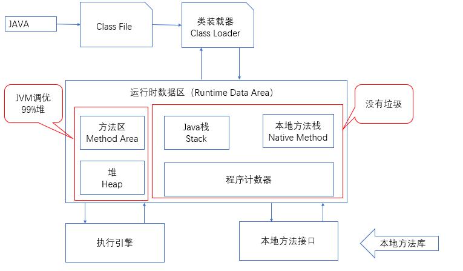

###  类加载器

作用：加载Class文件  new student();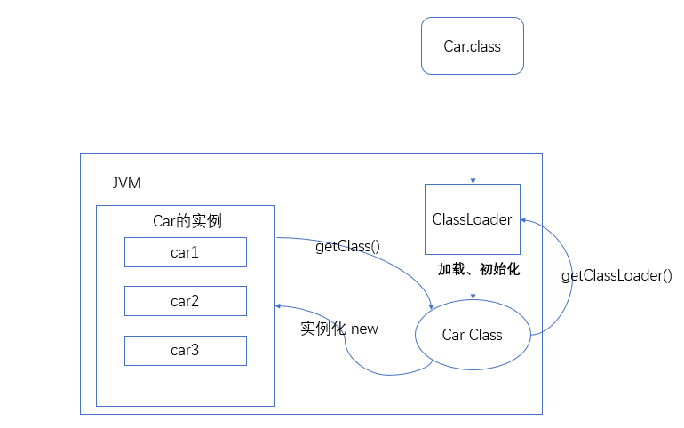

1. 虚拟机自带的加载器

2. 启动类（根）加载器

3. 扩展类加载器

4. 应用程序（系统类)加载器

5. 双亲委派机制

   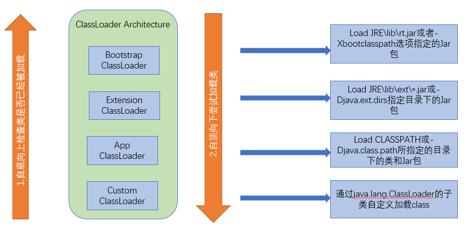

   - 在双亲委托机制中，各个加载器按照父子关系形成了树形结构，除了根加载器之外，其余的类加载器都有一个父加载器
   - **Bootstrap ClassLoader/****启动类加载器**：$JAVA_HOME中**jre/lib/rt.jar**里所有的class，由C++实现，不是ClassLoader子类
   - **Extension ClassLoader/****扩展类加载器**：负责加载Java平台中扩展功能的一些Jar包，包括$JAVA_HOME中**jre/lib/*.jar**或者-Djava.ext.dirs指定目录下的Jar包
   - **App ClassLoader/****系统类加载器**：负责加载classpath中指定的jar包及目录中的class

### 沙箱安全机制（了解）

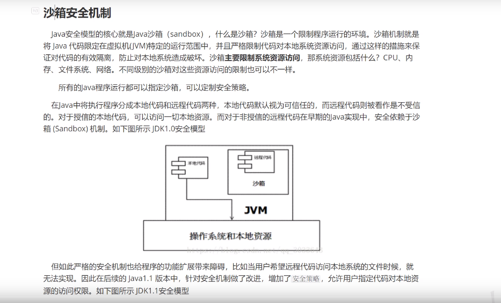

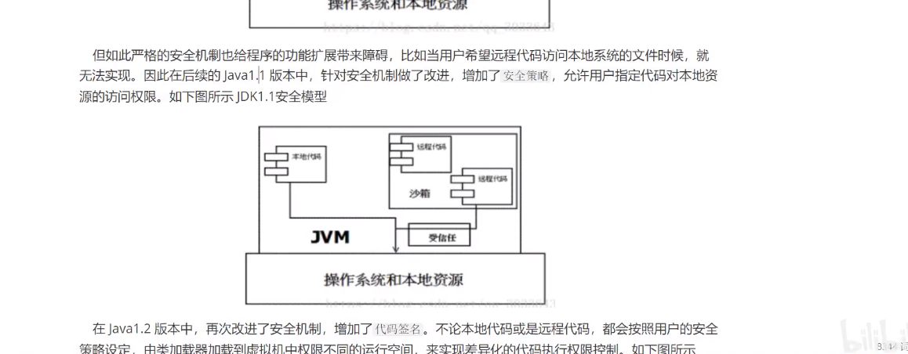

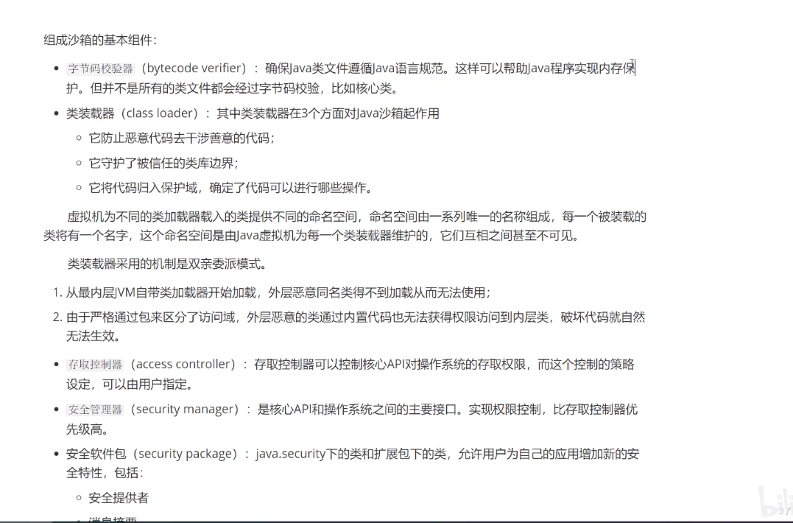

### Native关键字

JNI：java Native Interface

JNI作用：扩展Java的使用，融合不同编程语言为Java所用。最初为：C/C++

Java诞生的时候C/C++横行，想要立足，必须要想C/C++妥协，于是java在内存区域中专门开辟了一块标记区域：Native Method Area ,用来登记Native方法，在最终执行的时候，通过JNI加载本地方法库中的方法

调用其他的接口的方法：Socket、Webservice、Http....

### PC寄存器

程序计数器：Program Counter Register

每个线程都有一个程序计数器，是**线程私有的，**就是一个指针，指向方法区中的方法字节码（用来指向一条指令的地址，也就是将要执行的指令代码），在执行引擎读取下一条指令**，是一个非常小的内存空间，几乎可以忽略不计。**

### 方法区

Method Area 方法区

**方法区是被所有线程共享的**，所有字段和方法字节码，以及一些特殊方法，如构造函数、接口代码也在此定义，简单说，**所有定义的方法的信息都保存在该区域，此区域属于共享区间。**

**静态变量、常量、类信息（构造方法、接口定义）、运行时的常量池存在方法区中，但是实力变量存在堆内存中，和方法区无关**

### Java堆

一个JVM只有一个堆内存，堆的大小是可以调节的。类加载器读取了类文件后，一般会把类，方法，常量，变量等放在堆中，保存我们所有引用类型的真实对象。堆内存分为三个区域：新生区、养老区、永久区。

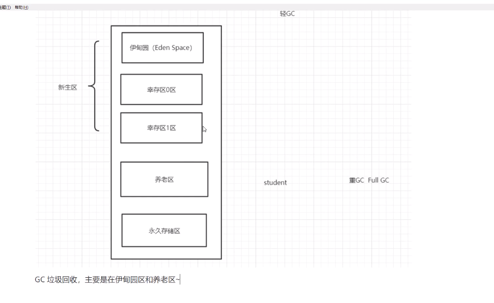

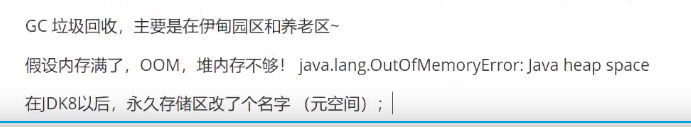

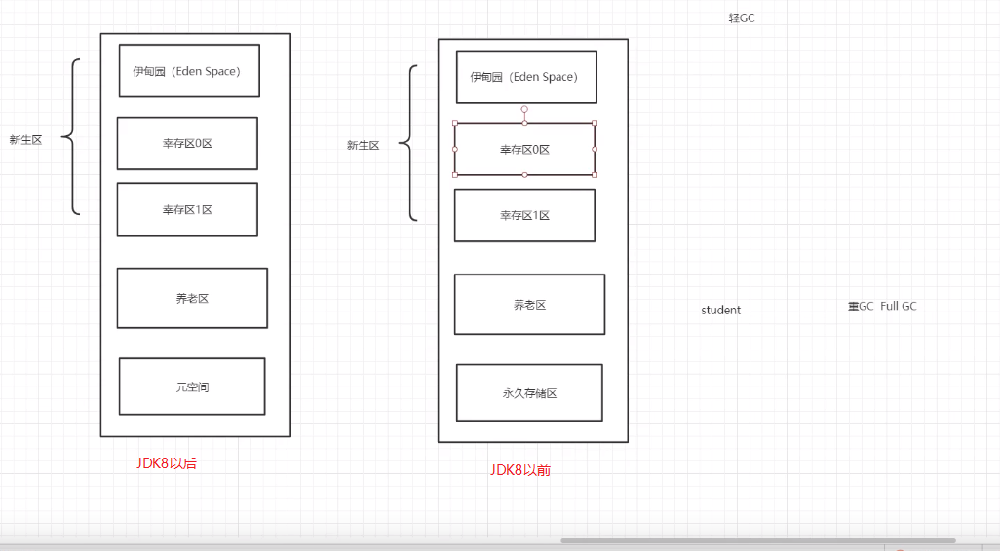

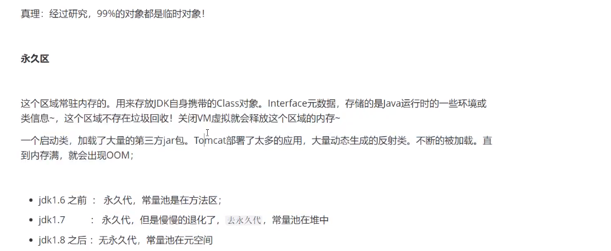

元空间：逻辑上存在，物理上不存在。

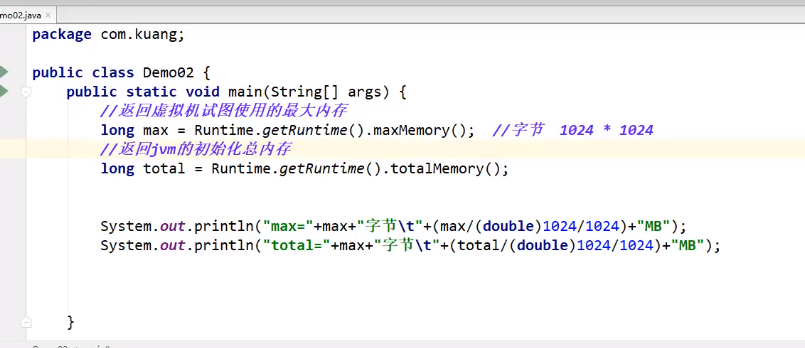

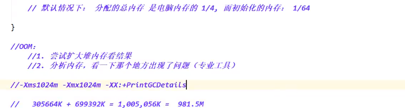

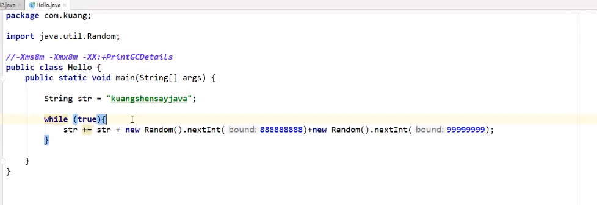

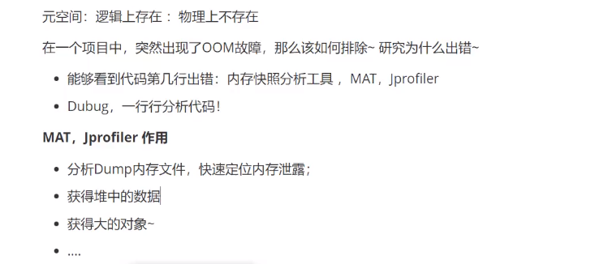

JVM在运行GC时，并不是对这三个区域统一回收。大部分时候，回收都是新生代

- 新生代
- 幸存区(form 、to)
- 老年区

GC两种分类：轻GC（普通的GC） 重GC（全局GC、Full GC）

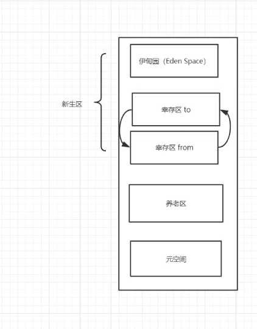

题目：

- JVM的内存模型和分区 详细到每个分区放什么？
- 堆里面的分区有哪些？Eden form to 老年区 说说他们的特点
- GC算法有哪些？标记清除法，标记压缩，复制算法，引用计数器，怎么用的？
- 轻GC和重GC分别在什么时候发生？

#### 引用计数法

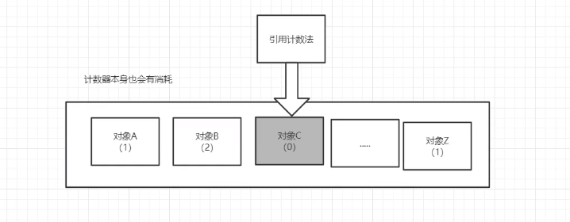

#### 复制算法

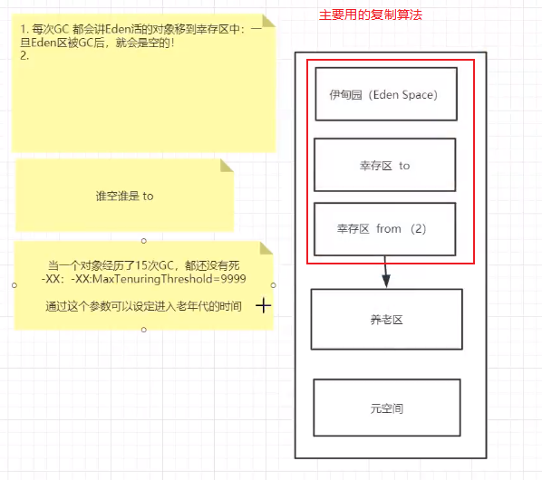

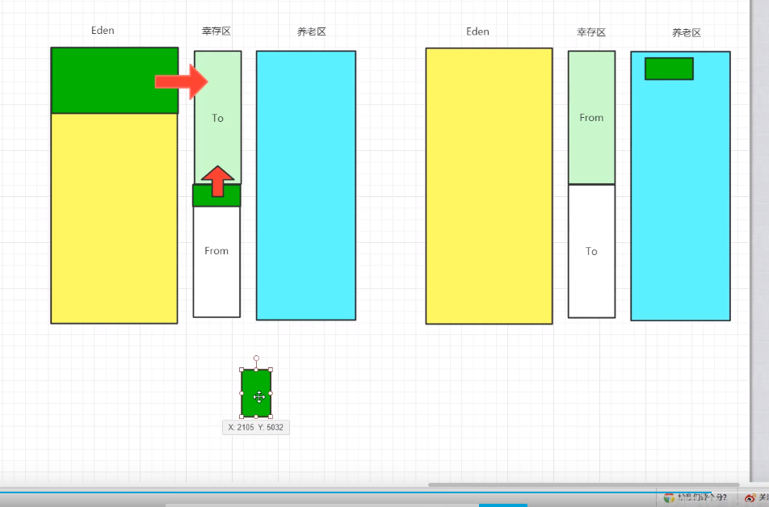

- 好处：没有内存碎片
- 坏处：浪费了内存空间 （多了一半空间永远是空的 To区）假设对象100%存活（极端情况）

复制算法最佳使用场景：对象存活度较低的时候；  新生区

标记清除算法

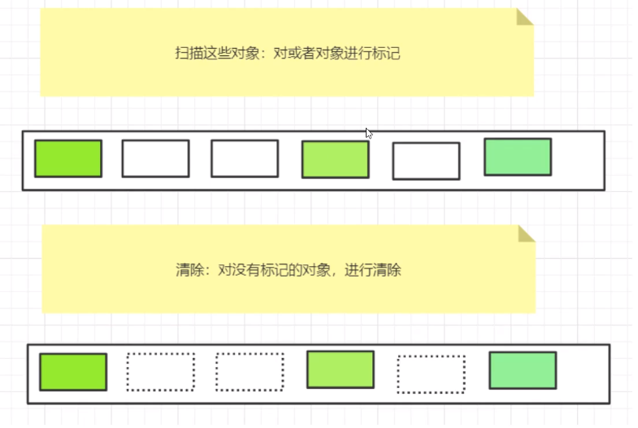

优点：

缺点：两次扫描，严重浪费时间，会产生内存碎片

#### 标记压缩

再优化

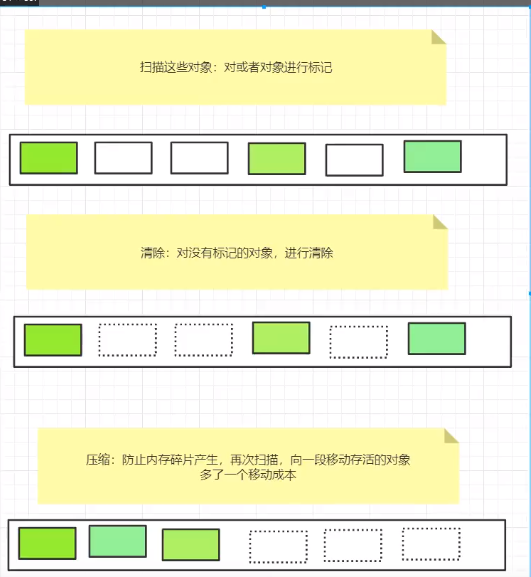

总结：

内存效率：复制算法>标记清除算法>标记压缩算法（时间复杂度）

内存整齐度：复制算法=标记压缩算法>标记清除算法

内存利用率：标记压缩算法=标记清除算法>复制算法

难道没有最优的算法吗？？？？？？？

没有最好的算法，只有最合适的算法---->分代收集算法

年轻代：

- 存活率低
- 复制算法

老年代：

- 区域大：存活率高
- 标记清除（内存碎片不是太多）+标记压缩混合实现

### JproFiler工具使用

下载JProFiler，并安装，IDEA安装JProFiler插件

# JMM ：Java Memory Model（Java内存模型）

1. 什么是JMM

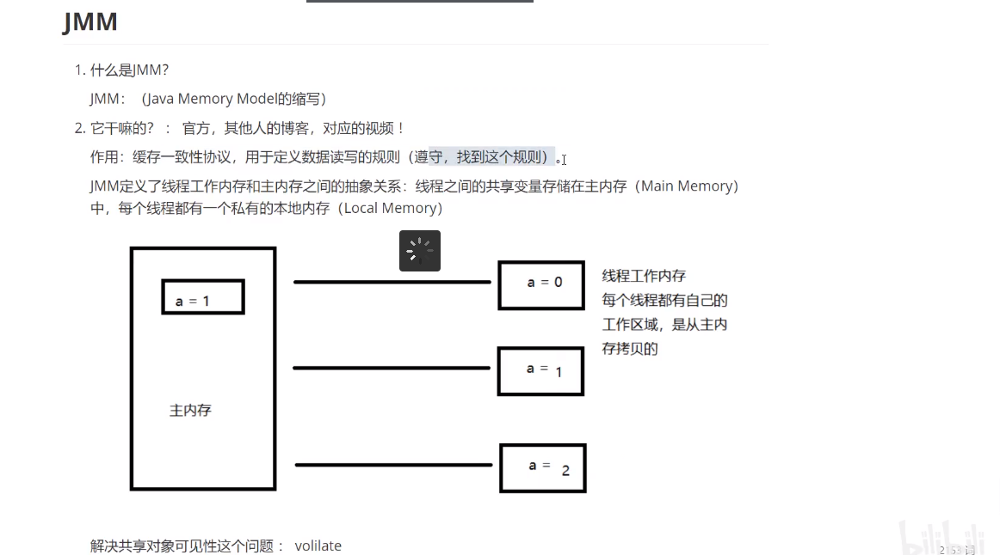

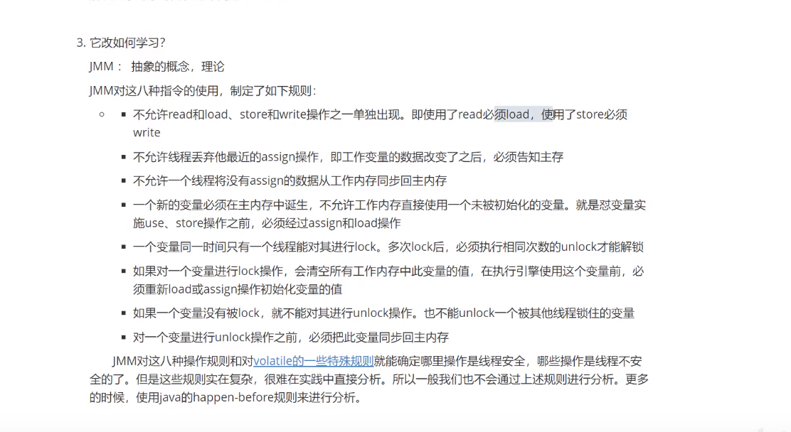