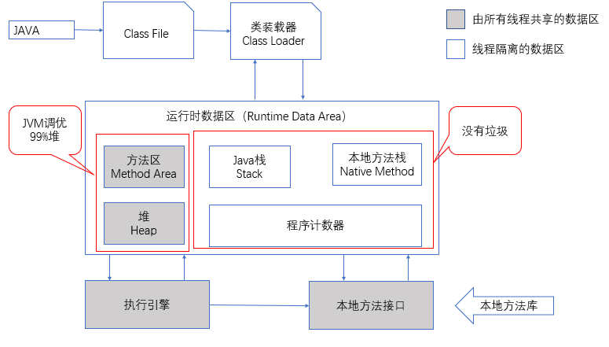
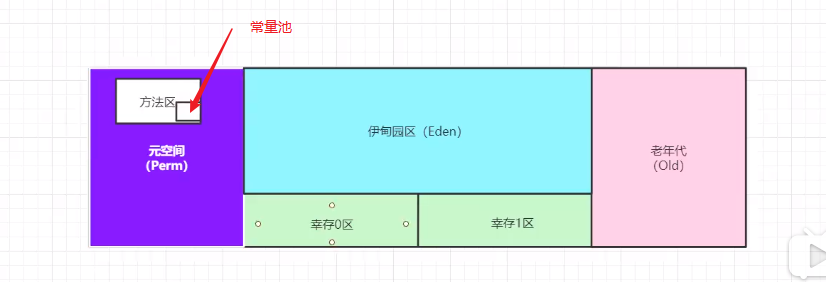
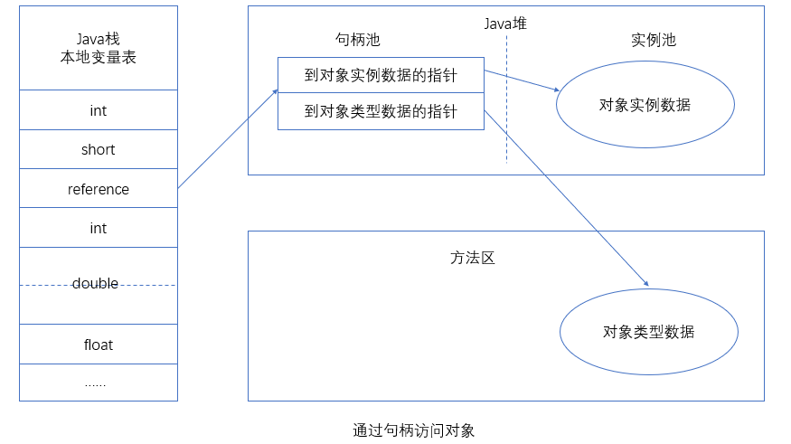
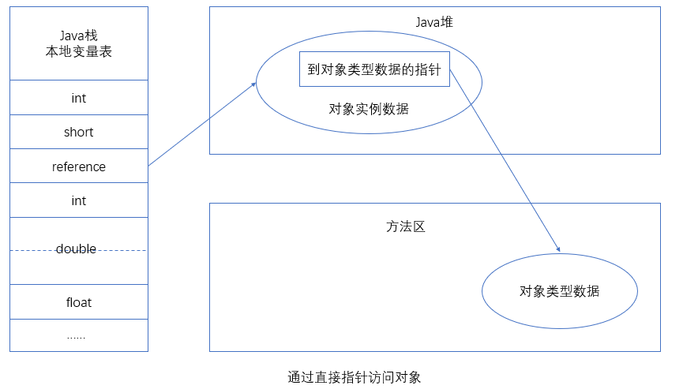
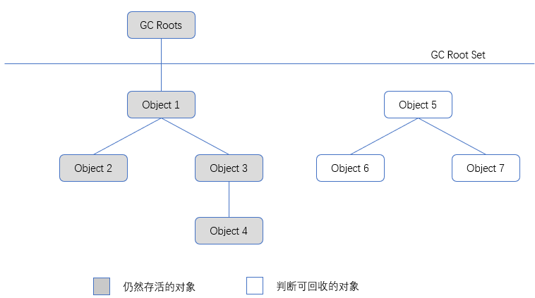
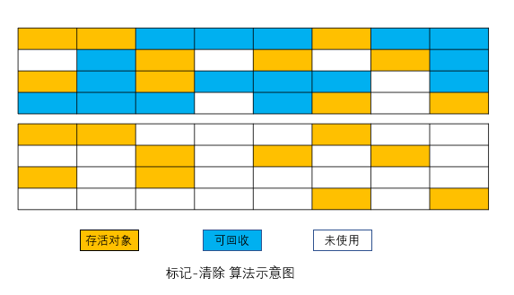
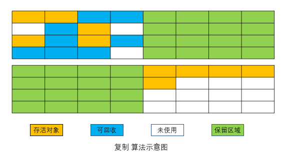
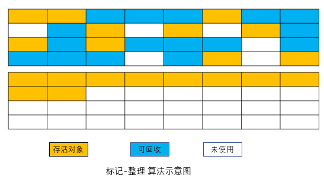
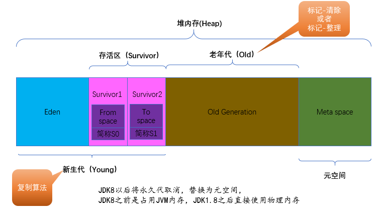
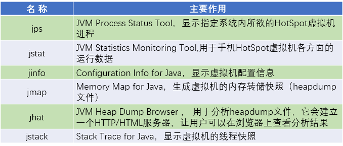

目录

[TOC]


### Java内存区域与内存溢出异常

#### 运行时数据区域



##### 程序计数器

程序计数器（Program Counter Register）是一块**较小的内存空间**，它可以看作是当前线程所执行的字节码的行号指示器。

每条线程都需要有一个独立的程序计数器，各条线程之间计数器互不影响，独立存储，我们称这类内存区域为“**线程私有”**的内存。

如果线程正在执行的是一个Java方法，这个计数器记录的是正在执行的虚拟机字节码指令的地址；如果正在执行的是Native方法，这个计数器值则为空（Undefined）。**此内存区域是唯一一个在Java虚拟机规范中没有规定任何OutOfMemoryError情况的区域。**

##### Java虚拟机栈

Java虚拟机栈（Java Virtual Machine Stacks）也是**线程私有的**，**它的生命周期与线程相同**。虚拟机栈描述的是Java方法执行的内存模型：**每个方法在执行的同时都会创建一个栈帧（Stack Frame ）用于存储局部变量表、操作数栈、动态链接、方法出口等信息**。每一个方法从调用直至执行完成的过程，就对应着一个栈帧在虚拟机栈中入栈到出栈的过程。

**平时我们说的“栈”就是现在讲的虚拟机栈**，或者说是虚拟机栈中局部变量表部分。

局部变量表存放了编译期可知的各种**基本数据类型**、**对象引用**和**returnAddress类型**（指向了一条字节码指令的地址）。

其中64位长度的long和double类型的数据会占用2个局部变量空间（Slot），其余的数据类型只占用1个。局部变量表所需的内存空间在编译期间完成分配，当进入一个方法时，这个方法需要在帧中分配多大的局部变量空间是完全确定的，在方法运行期间不会改变局部变量表的大小。

在Java虚拟机规范中，对这个区域规定了两种异常状况：如果线程请求的栈深度大于虚拟机所允许的深度，将抛出StackOverflowError异常；如果虚拟机栈可以动态扩展（当前大部分的Java虚拟机都可动态扩展，只不过Java虚拟机规范中也允许固定长度的虚拟机栈），如果扩展时无法申请到足够的内存，就会抛出OutOfMemoryError异常。

**理解：栈:栈内存，主管程序运行，生命周期与线程同步；线程结束，对应的栈内存就释放，不会存在垃圾回收问题** 主要存储8大数据类型+对象引用+实例的方法

##### 本地方法栈

本地方法栈（Native Method Stack）与虚拟机栈所发挥的作用是非常相似的。

虚拟机栈为虚拟机执行Java方法（也就是字节码）服务，而本地方法栈则为虚拟机使用到的Native方法服务。

在虚拟机规范中对本地方法栈中方法使用的语言、使用方式与数据结构并没有强制规定，因此具体的虚拟机可以自由实现它。甚至有的虚拟机（Sun HotSpot虚拟机）直接就把本地方法栈和虚拟机栈合二为一。与虚拟机栈一样，本地方法栈区域也会抛出StackOverflowError和OutOfMemoryError异常。

##### Java堆

对于大多数应用来说，Java堆（Java Heap）是**Java虚拟机所管理的内存中最大的一块**。Java堆是被**所有线程共享**的一块内存区域，在虚拟机启动时创建。此内存区域的唯一目的就是存放对象实例，**几乎所有的对象**实例都在这里分配内存。

**Java堆是垃圾收集器管理的主要区域**，也被称做“GC堆”（Garbage Collected Heap）。从内存回收的角度来看，由于现在收集器基本都**采用分代收集算法**，所以Java堆中还可以细分为：新生代和老年代；再细致一点的有**Eden空间、From Survivor空间、To Survivor空间**等。从内存分配的角度来看，线程共享的Java堆中可能划分出多个线程私有的分配缓冲区（Thread Local Allocation Buffer,TLAB）。

理解：一个JVM只有一个堆内存，堆的大小是可以调节的。类加载器读取了类文件后，一般会把类，方法，常量，变量等放在堆中，保存我们所有引用类型的真实对象。堆内存分为三个区域：新生区、养老区、永久区。

##### 方法区

方法区（Method Area）与Java堆一样，是**各个线程共享的内存区域**，它用于存储已被虚拟机加载的**类信息**、**常量**、**静态变量**、**即时编译器编译后的代码**等数据。虽然Java虚拟机规范把方法区描述为**堆的一个逻辑部分**，但是它却有一个别名叫做Non-Heap（非堆），目的应该是与Java堆区分开来。

Java虚拟机规范对方法区的限制非常宽松，除了和Java堆一样不需要连续的内存和可以选择固定大小或者可扩展外，还可以选择不实现垃圾收集。

根据Java虚拟机规范的规定，当方法区无法满足内存分配需求时，将抛出OutOfMemoryError异常。

##### 运行时常量池

**运行时常量池（Runtime Constant Pool）是方法区的一部分**。Class文件中除了有类的版本、字段、方法、接口等描述信息外，还有一项信息是常量池（Constant Pool Table），用于存放编译期生成的各种字面量和符号引用，这部分内容将在类加载后进入方法区的运行时常量池中存放。

Java虚拟机对Class文件每一部分（自然也包括常量池）的格式都有严格规定，每一个字节用于存储哪种数据都必须符合规范上的要求才会被虚拟机认可、装载和执行，但对于运行时常量池，Java虚拟机规范没有做任何细节的要求，不同的提供商实现的虚拟机可以按照自己的需要来实现这个内存区域。不过，一般来说，除了保存Class文件中描述的符号引用外，还会把翻译出来的直接引用也存储在运行时常量池中 。

运行时常量池相对于Class文件常量池的另外一个重要特征是具备**动态性**，Java语言并不要求常量一定只有编译期才能产生，也就是并非预置入Class文件中常量池的内容才能进入方法区运行时常量池，运行期间也可能将新的常量放入池中，这种特性被开发人员利用得比较多的便是String类的intern（）方法。

既然运行时常量池是方法区的一部分，自然受到方法区内存的限制，当常量池无法再申请到内存时会抛出OutOfMemoryError异常。



##### 直接内存

**直接内存（Direct Memory）并不是虚拟机运行时数据区的一部分，也不是Java虚拟机规范中定义的内存区域。**但是这部分内存也被频繁地使用，而且也可能导致OutOfMemoryError异常出现，所以我们放到这里一起讲解。

### HotSpot虚拟机对象探秘

#### 对象的创建

#### 对象的内存布局

#### 对象的访问定位

建立对象是为了使用对象，我们的Java程序需要通过栈上的reference数据来操作堆上的具体对象。由于reference类型在Java虚拟机规范中只规定了一个指向对象的引用，并没有定义这个引用应该通过何种方式去定位、访问堆中的对象的具体位置，所以对象访问方式也是取决于虚拟机实现而定的。**目前主流的访问方式有使用句柄和直接指针两种。**

如果使用**句柄访问**的话，那么Java堆中将会划分出一块内存来作为句柄池，reference中存储的就是对象的句柄地址，而句柄中包含了对象实例数据与类型数据各自的具体地址信息。



如果使用**直接指针**访问，那么Java堆对象的布局中就必须考虑如何放置访问类型数据的相关信息，而reference中存储的直接就是对象地址。



使用句柄来访问的最大好处就是reference中存储的是稳定的句柄地址，在对象被移动（垃圾收集时移动对象是非常普遍的行为）时只会改变句柄中的实例数据指针，而reference本身不需要修改。

使用直接指针访问方式的最大好处就是速度更快，它节省了一次指针定位的时间开销，由于对象的访问在Java中非常频繁，因此这类开销积少成多后也是一项非常可观的执行成本。就本书讨论的**主要虚拟机Sun HotSpot而言，它是使用直接指针访问方式进行对象访问的**，但从整个软件开发的范围来看，各种语言和框架使用句柄来访问的情况也十分常见。

#### 实战：OutOfMemoryError异常

**除了程序计数器外，虚拟机内存的其他几个运行时区域都有发生OutOfMemoryError（下文称OOM）异常的可能**

##### Java堆溢出

Java堆用于存储对象实例，只要不断地创建对象，并且保证GC Roots到对象之间有可达路径来避免垃圾回收机制清除这些对象，那么在对象数量到达最大堆的容量限制后就会产生内存溢出异常。

注意：VM args后边的参数要复制到VM options之后在运行。

```java
package com.zhou.jvm;

import java.util.ArrayList;
import java.util.List;

/**
 * VM Args：-Xms20m -Xmx20m -XX:+HeapDumpOnOutOfMemoryError
 *
 * @author zzm
 */
public class HeapOOM {
    static class OOMObject {
    }

    public static void main(String[] args) {
        List<OOMObject> list = new ArrayList<>();
        while (true) {
            list.add(new OOMObject());
        }
    }
}
```

运行结果：

```java
java.lang.OutOfMemoryError: Java heap space
Dumping heap to java_pid3508.hprof ...
Heap dump file created [28252448 bytes in 0.091 secs]
Exception in thread "main" java.lang.OutOfMemoryError: Java heap space
```

##### 虚拟机栈和本地方法栈溢出

由于在HotSpot虚拟机中并不区分虚拟机栈和本地方法栈，因此，对于HotSpot来说，虽然-Xoss参数（设置本地方法栈大小）存在，但实际上是无效的，**栈容量只由-Xss参数设定**。关于虚拟机栈和本地方法栈，在Java虚拟机规范中描述了两种异常：

- 如果线程请求的栈深度大于虚拟机所允许的最大深度，将抛出**StackOverflowError**异常。

- 如果虚拟机在扩展栈时无法申请到足够的内存空间，则抛出**OutOfMemoryError**异常。

定义了大量的本地变量，增大此方法帧中本地变量表的长度。结果：抛出StackOverflowError异常时输出的堆栈深度相应缩小。

```java
package com.zhou.jvm;

/**
 * 设置栈容量为128k
 * VM Args：-Xss128k
 *
 * @author zzm
 */
public class JavaVMStackSOF {
    private int stackLength = 1;

    public void stackLeak() {
        {
            stackLength++;
            stackLeak();
        }
    }
    public static void main(String[] args) {
        JavaVMStackSOF oom = new JavaVMStackSOF();
        try {
            oom.stackLeak();
        } catch (Throwable e) {
            System.out.println("stack length：" + oom.stackLength);
            throw e;
        }
    }
}
```

运行结果：

```java
stack length：987
Exception in thread "main" java.lang.StackOverflowError
	at com.zhou.jvm.JavaVMStackSOF.stackLeak(JavaVMStackSOF.java:14)
	at com.zhou.jvm.JavaVMStackSOF.stackLeak(JavaVMStackSOF.java:15)
    .......
```

##### 方法区和运行时常量池溢出

String.intern（）是一个Native方法，它的作用是：如果字符串常量池中已经包含一个等于此String对象的字符串，则返回代表池中这个字符串的String对象；否则，将此String对象包含的字符串添加到常量池中，并且返回此String对象的引用。在JDK 1.6及之前的版本中，由于常量池分配在永久代内，我们可以通过-XX：PermSize和-XX：MaxPermSize限制方法区大小，从而间接限制其中常量池的容量，如代码清单2-6所示。

### 垃圾收集器与内存分配策略

#### 垃圾回收器

##### 引用计数算法

给对象中添加一个引用计数器，每当有一个地方引用它时，计数器值就加1；当引用失效时，计数器值就减1；任何时刻计数器为0的对象就是不可能再被使用的。

**它很难解决对象之间相互循环引用的问题。**

##### 可达性分析算法

**基本思路**就是通过一系列的称为“GC Roots”的对象作为起始点，从这些节点开始向下搜索，搜索所走过的路径称为引用链（Reference Chain），当一个对象到GC Roots没有任何引用链相连（用图论的话来说，就是从GC Roots到这个对象不可达）时，则证明此对象是不可用的。

如下图所示，对象object 5、object 6、object 7虽然互相有关联，但是它们到GC Roots是不可达
的，所以它们将会被判定为是可回收的对象。



在Java语言中，可作为GC Roots的对象包括下面几种：

- 虚拟机栈（栈帧中的本地变量表）中引用的对象。
- 方法区中类静态属性引用的对象。
- 方法区中常量引用的对象。
- 本地方法栈中JNI（即一般说的Native方法）引用的对象。

##### 再谈引用

在JDK 1.2以前，Java中的引用的定义很传统：**如果reference类型的数据中存储的数值代表的是另外一块内存的起始地址，就称这块内存代表着一个引用。**

在JDK 1.2之后，Java对引用的概念进行了扩充，将引用分为**强引用（Strong Reference）、软引用（Soft Reference）、弱引用（Weak Reference）、虚引用（Phantom Reference）**4种，这4种引用强度**依次逐渐减弱。**

##### 回收方法区

很多人认为方法区（或者HotSpot虚拟机中的永久代）是没有垃圾收集的，Java虚拟机规范中确实说过可以不要求虚拟机在方法区实现垃圾收集，而且在方法区中进行垃圾收集的“性价比”一般比较低：在堆中，尤其是在新生代中，常规应用进行一次垃圾收集一般可以回收70%～95%的空间，而永久代的垃圾收集效率远低于此。

永久代的垃圾收集主要回收两部分内容：**废弃常量和无用的类**。回收废弃常量与回收Java堆中的对象非常类似。以常量池中字面量的回收为例，假如一个字符串“abc”已经进入了常量池中，但是当前系统没有任何一个String对象是叫做“abc”的，换句话说，就是没有任何String对象引用常量池中的“abc”常量，也没有其他地方引用了这个字面量，如果这时发生内存回收，而且必要的话，这个“abc”常量就会被系统清理出常量池。常量池中的其他类（接口）、方法、字段的符号引用也与此类似。

判定一个常量是否是“废弃常量”比较简单，而要判定一个类是否是“无用的类”的条件则相对苛刻许多。类需要同时满足下面3个条件才能算是“无用的类”：

- 该类所有的实例都已经被回收，也就是Java堆中不存在该类的任何实例。
- 加载该类的ClassLoader已经被回收。
- 该类对应的java.lang.Class对象没有在任何地方被引用，无法在任何地方通过反射访问该
  类的方法。

#### 垃圾收集算法

##### 标记-清除算法

算法分为“标记”和“清除”两个阶段：**首先标记出所有需要回收的对象，在标记完成后统一回收所有被标记的对象。**

**它的主要不足有两个**：

**缺点：**

- 一个是**效率**问题，标记和清除两个过程的效率都不高；
- 另一个是空间问题，标记清除之后会产生大量不连续的**内存碎片**，空间碎片太多可能会导致以后在程序运行过程中需要分配较大对象时，无法找到足够的连续内存而不得不提前触发另一次垃圾收集动作。

标记—清除算法的执行过程如下图所示。



##### 复制算法

为了解决效率问题，一种称为“复制”（Copying）的收集算法出现了，它将可用内存按容量划分为大小相等的两块，每次只使用其中的一块。**当这一块的内存用完了，就将还存活着的对象复制到另外一块上面，然后再把已使用过的内存空间一次清理掉**。这样使得每次都是对整个半区进行内存回收，内存分配时也就不用考虑内存碎片等复杂情况，只要移动堆顶指针，按顺序分配内存即可，实现简单，运行高效。

**优点：**

- 没有内存碎片

**缺点：**

- 浪费存储空间（将内存缩小为了原来的一半【两个Survivor】，未免太高了一点。）

**最佳使用场景：**

- 对象存活度较低的时候，即最适合于回收新生代

复制算法的执行过程如下图所示。



现在的商业虚拟机都采用这种收集算法来**回收新生代**，IBM公司的专门研究表明，新生代中的对象98%是“朝生夕死”的，所以并不需要按照1:1的比例来划分内存空间，而是**将内存分为一块较大的Eden空间和两块较小的Survivor空间，每次使用Eden和其中一块Survivor**  。当回收时，将Eden和Survivor中还存活着的对象一次性地复制到另外一块Survivor空间上，最后清理掉Eden和刚才用过的Survivor空间。**HotSpot虚拟机默认Eden和Survivor的大小比例是8:1，也就是每次新生代中可用内存空间为整个新生代容量的90%（80%+10%），只有10%的内存会被“浪费”**。当然，98%的对象可回收只是一般场景下的数据，我们没有办法保证每次回收都只有不多于10%的对象存活，当Survivor空间不够用时，需要依赖其他内存（这里指老年代）进行分配担保（Handle Promotion）。

##### 标记-整理算法

复制收集算法在对象存活率较高时就要进行较多的复制操作，效率将会变低。更关键的是，如果不想浪费50%的空间，就需要有额外的空间进行分配担保，以应对被使用的内存中所有对象都100%存活的极端情况，所以在老年代一般不能直接选用这种算法。

根据**老年代**的特点，有人提出了另外一种“标记-整理”（Mark-Compact）算法，标记过程仍然与“标记-清除”算法一样，但**后续步骤不是直接对可回收对象进行清理，而是让所有存活的对象都向一端移动，然后直接清理掉端边界以外的内存**，“标记-整理”算法的示意图下图所示。

**最佳使用场景：**

- 对象存活率高的时候，即适合于老年代



##### 分代收集算法

根据对象存活周期的不同将内存划分为几块。一般是把Java堆分为**新生代和老年代**，这样就可以根据各个年代的特点采用最适当的收集算法。在新生代中，每次垃圾收集时都发现有大批对象死去，只有少量存活，那就选用复制算法，只需要付出少量存活对象的复制成本就可以完成收集。而老年代中因为对象存活率高、没有额外空间对它进行分配担保，就必须使用“标记—清理”或者“标记—整理”算法来进行回收。



#### HotSpot的算法实现

##### 枚举根节点

##### 安全点

##### 安全区域

#### 垃圾收集器

##### Serial收集器

##### ParNew收集器

##### Parallel Scavenge收集器

##### Serial Old收集器

##### Parallel Old收集器

##### CMS收集器

##### G1收集器

#### 内存分配与回收策略

##### 对象优先在Eden分配

大多数情况下，对象在新生代Eden区中分配。当Eden区没有足够空间进行分配时，虚拟机将发起一次Minor GC。

虚拟机提供了-XX：+PrintGCDetails这个收集器日志参数，告诉虚拟机在发生垃圾收集行为时打印内存回收日志，并且在进程退出的时候输出当前的内存各区域分配情况。

新生代GC（Minor GC）：指发生在新生代的垃圾收集动作，因为Java对象大多都具备朝生夕灭的特性，所以Minor GC非常频繁，一般回收速度也比较快。

老年代GC（Major GC/Full GC）：指发生在老年代的GC，出现了Major GC，经常会伴随至少一次的Minor GC（但非绝对的，在Parallel Scavenge收集器的收集策略里就有直接进行Major GC的策略选择过程）。Major GC的速度一般会比Minor GC慢10倍以上。

```java
package com.zhou.jvm;

/**
 * 通过-Xms20M、-Xmx20M、-Xmn10M这3个参数限制了Java堆大小为20MB，不可扩展，其中10MB分配给新生代，剩下的10MB分配给老年代。
 * -XX：SurvivorRatio=8决定了新生代中Eden区与一个Survivor区的空间比例是8:1
 * <p>
 * VM参数： -Xms20M -Xmx20M -Xmn10M -XX:+PrintGCDetails -XX:SurvivorRatio=8
 *
 * @author shensr
 * @since 2019/12/10
 **/

public class MinorGC {
    private static final int _1MB = 1024 * 1024;

    public static void testAllocation() {
        byte[] allocation1, allocation2, allocation3, allocation4;
        allocation1 = new byte[2 * _1MB];
        allocation2 = new byte[2 * _1MB];
        allocation3 = new byte[2 * _1MB];
        allocation4 = new byte[4 * _1MB]; //出现一次Minor GC
    }

    public static void main(String[] args) {
        MinorGC.testAllocation();
    }
}
```

运行结果：

```java
[GC (Allocation Failure) [PSYoungGen: 6279K->760K(9216K)] 6279K->4864K(19456K), 0.0048200 secs] [Times: user=0.00 sys=0.00, real=0.01 secs] 
Heap
 PSYoungGen      total 9216K, used 7141K [0x00000000ff600000, 0x0000000100000000, 0x0000000100000000)
  eden space 8192K, 77% used [0x00000000ff600000,0x00000000ffc3b610,0x00000000ffe00000)
  from space 1024K, 74% used [0x00000000ffe00000,0x00000000ffebe030,0x00000000fff00000)
  to   space 1024K, 0% used [0x00000000fff00000,0x00000000fff00000,0x0000000100000000)
 ParOldGen       total 10240K, used 4104K [0x00000000fec00000, 0x00000000ff600000, 0x00000000ff600000)
  object space 10240K, 40% used [0x00000000fec00000,0x00000000ff002020,0x00000000ff600000)
 Metaspace       used 3472K, capacity 4496K, committed 4864K, reserved 1056768K
  class space    used 381K, capacity 388K, committed 512K, reserved 1048576K
```

##### 大对象直接进入老年代

所谓的大对象是指，需要大量连续内存空间的Java对象，最典型的大对象就是那种很长的字符串以及数组（笔者列出的例子中的byte[]数组就是典型的大对象）。大对象对虚拟机的内存分配来说就是一个坏消息（替Java虚拟机抱怨一句，比遇到一个大对象更加坏的消息就是遇到一群“朝生夕灭”的“短命大对象”，写程序的时候应当避免），经常出现大对象容易导致内存还有不少空间时就提前触发垃圾收集以获取足够的连续空间来“安置”它们。

```java
    /**
     * VM参数：-Xms20M -Xmx20M -Xmn10M -XX:+PrintGCDetails -XX:SurvivorRatio=8 -XX:PretenureSizeThreshold=3145728
     */
    public static void testPretenureSizeThreshold() {
        byte[] allocation;
        allocation = new byte[9 * _1MB];//直接分配在老年代中
    }
```

运行结果：

```java
Heap
 PSYoungGen      total 9216K, used 2347K [0x00000000ff600000, 0x0000000100000000, 0x0000000100000000)
  eden space 8192K, 28% used [0x00000000ff600000,0x00000000ff84acd0,0x00000000ffe00000)
  from space 1024K, 0% used [0x00000000fff00000,0x00000000fff00000,0x0000000100000000)
  to   space 1024K, 0% used [0x00000000ffe00000,0x00000000ffe00000,0x00000000fff00000)
 ParOldGen       total 10240K, used 9216K [0x00000000fec00000, 0x00000000ff600000, 0x00000000ff600000)
  object space 10240K, 90% used [0x00000000fec00000,0x00000000ff500010,0x00000000ff600000)
 Metaspace       used 3475K, capacity 4496K, committed 4864K, reserved 1056768K
  class space    used 381K, capacity 388K, committed 512K, reserved 1048576K
```

##### 长期存活的对象将进入老年代

既然虚拟机采用了分代收集的思想来管理内存，那么内存回收时就必须能识别哪些对象应放在新生代，哪些对象应放在老年代中。为了做到这点，虚拟机给每个对象定义了一个对象年龄（Age）计数器。如果对象在Eden出生并经过第一次Minor GC后仍然存活，并且能被Survivor容纳的话，将被移动到Survivor空间中，并且对象年龄设为1。对象在Survivor区中每“熬过”一次Minor GC，年龄就增加1岁，当它的年龄增加到一定程度（默认为15岁），就将会被晋升到老年代中。对象晋升老年代的年龄阈值，可以通过参数-XX：
MaxTenuringThreshold设置。

读者可以试试分别以-XX：MaxTenuringThreshold=1和-XX：MaxTenuringThreshold=15两种设置来执行代码清单3-7中的testTenuringThreshold（）方法，此方法中的allocation1对象需要256KB内存，Survivor空间可以容纳。当MaxTenuringThreshold=1时，allocation1对象在第二次GC发生时进入老年代，新生代已使用的内存GC后非常干净地变成0KB。而MaxTenuringThreshold=15时，第二次GC发生后，allocation1对象则还留在新生代Survivor空间，这时新生代仍然有404KB被占用。

##### 动态对象年龄判定

为了能更好地适应不同程序的内存状况，虚拟机并不是永远地要求对象的年龄必须达到了MaxTenuringThreshold才能晋升老年代，如果在Survivor空间中相同年龄所有对象大小的总和大于Survivor空间的一半，年龄大于或等于该年龄的对象就可以直接进入老年代，无须等到MaxTenuringThreshold中要求的年龄。

##### 空间分配担保

### 虚拟机性能监控与故障处理工具

#### JDK的命令行工具




