# 注解与反射

[TOC]


### 什么是注解

Annotation是从JDK1.5开始引入的新技术

1. Annotation的作用：


- 不是程序本身，可以对程序作出解释（这一点和注释（comment）没有什么区别）

- **可以被其他程序（比如：编译器等）读取。**

2. Annotation的格式：

- 注解以“@注解名”在代码中存在，还可以添加一些参数值，例如：
  - @SupperssWarings(value="unchecked")

3. Annotatioin在哪里使用？

- 可以附加在package、class、method、field等上面，相当于给他们添加了额外的辅助信息，我们可以通过反射机制编程实现对这些元数据的访问

### 元注解

1. 元注解的作用就是负责注解其他注解，Java定义了4个标准的meta-annotation类型，它们被用来提供对其他annotation类型做说明。
2. 这些类型和它们所支持的类在java.lang.annotation包中可以找到。
   - @Target：用于描述注解的使用范围
   - @Retention:表示需要在什么级别保存注解信息，用于描述注解的生命周期
     - （SOURCE<CLASS<RUNTIME）
   - @Document:说明该注解将被包含在javadoc中
   - @Inherited：说明子类可以**继承**父类中的该注解

### 自定义注解

1. 使用**@interface**自定义注解时，自动继承了java.lang.annotation.Annotation接口
2. 分析：
   - @interface用来声明一个注解。格式：public @interface 注解名{定义内容}
   - **其中的每一个方法实际是声明了一个配置参数**
   - 方法的名称就是参数的名称
   - 返回值类型就是参数的类型（返回值只能是基本类型，Class，String，enum）
   - 可以荣国default来声明阐述的默认值
   - 如果只有一个参数成员，一般参数名为value
   - 注解元素必须要有值，我们定义注解元素时，经常使用空字符串，0作为默认值

### 静态语言VS动态语言

1. 动态语言
   - 是一类在运行时可以改变其结构的语言：例如新的函数、对象、甚至是代码可以被引进，已有的函数可以被删除或是其他结构上的变化。通俗点说就是在运行时期代码可以根据某些条件改变自身结构。
   - 主要动态语言有Object-c、C#、JavaScript、PHP、Python等
2. 静态语言
   - 与动态语言相对应，运行时结构不可变的语言就是静态语言，如C/C++、JAVA
   - Java不是动态语言，但是Java可以称之为“动态语言”。即Java有一定的动态性，我们可以利用反射机制获取类似动态语言的特征。Java的动态性让编程的时候更加灵活。

### Java Reflection

1. Reflection(反射)是Java被视为动态语言的关键，反射机制允许程序在执行期借助于Reflection API获取任何类的内部信息，并能直接操作任意对象的内部属性及方法。

   ```java
   Class clazz = Class.forName("java.lang.String");
   ```

2. 加载完类之后，在堆内存的方法区中就产生了一个Class类型的对象（**一个类只有一个Class对象**），这个对象就包含了完整的类的结构信息。我们可以通过这个对象看到类的结构。这个对象就像一面镜子，通过这个镜子看到类的结构，所以，我们形象的称之为：反射。

   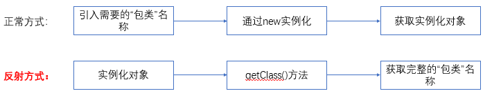


### Java反射机制研究及应用

1. Java反射机制提供的功能

   - 在运行时判断任意一个对象所属的类

   - 在运行时判断任意一个类的对象

   - 在运行时判断任意一个类所具有的成员变量和方法

   - 在运行时获取泛型信息

   - 在运行时调用任意一个对象的成员变量和方法

   - 在运行时处理注解

   - 生成动态代理

     

### Java反射的优点和缺点

1. 优点：
   - 可以实现动态创建对象和编译，体现出很大的灵活性
2. 缺点
   - 对性能有影响。使用反射基本上是一种解释操作，我们可以告诉JVM，我们希望做什么并且它满足我们的要求。这类操作慢于直接执行相同的操作。

### 反射相关的API

- java.lang.Class：代表一个类
- java.lang.reflect.Method：代表类的方法
- java.lang.reflect.Field：代表类的成员变量
- java.lang.reflect.Constructor：代表类的构造器
- ..........

### Class类

在Object类中定义了以下的方法，此方法将被所有子类继承：

```java
public final Class getClass()
```

以上的方法返回值的类型是一个Class类，此类是Java反射的源头，实际上所谓反射从程序的运行结果来看也很好理解，即：**可以通过对象反射求出类的名称。**

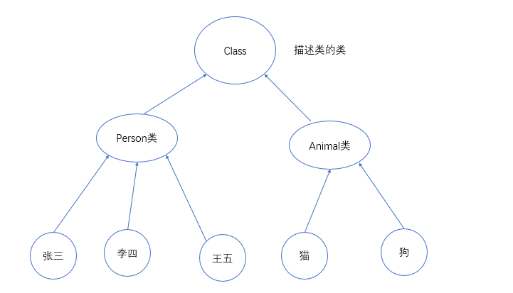


对象照镜子后可以得到的信息：某个类的属性、方法和构造器、某个类到底实现了哪些接口。对于每个类而言，JRE都为其保留了一个不变的Class类型的对象。一个Class对象包含了特定某个结构（class/interface/annotation/primitive type/void/[]）的有关信息。

- Class本身也是一个类
- Class对象只能由西戎建立对象
- 一个加载的类在JVM中只会有一个Class实例
- 一个Class对象对应的是一个加载到JVM中的.class文件
- 每个类的实例都会记得自己是由哪一个Class实例所生成
- 通过Class可以完整地得到一个中所有的被加载的结构
- Class类时Reflection的根源，针对任何你想动态加载、运行的类，唯有先获取响应的Class对象


### Class类的常用方法

| 方法名                                          | 功能说明                                                  |
| ----------------------------------------------- | --------------------------------------------------------- |
| public static Class<?> forName(String name)     | 返回指定类名name的Class对象                               |
| public T newInstance()                          | 调用空参构造函数，返回Class对象的一个实例                 |
| public String getName()                         | 返回Class对象所表示的实体（类、接口、数组类或void）的名称 |
| public native Class<? super T> getSuperclass(); | 返回当前Class对象的父类Class对象                          |
| public Class<?>[] getInterfaces()               | 获取当前Class对象的接口                                   |
| public ClassLoader getClassLoader()             | 返回该类的类加载器                                        |


### 获取Class类的实例

1. 若已知具体的**类**，通过类的class属性获取，**该方法最为安全可靠，程序性能最高**。

   ```java
   Class clazz = Person.class;
   ```

2. 已知某个类的**实例**，调用该实例的getClass()方法获取Class对象；

   ```java
   Class clazz = person.getClass();
   ```

3. 已知一个类的全类名，且该类在类路径在，可以通过Class类的静态方法forName()获取；

   ```java
   Class clazz = Class.forName("java.lang.String");
   ```

4. 内置基本类型可以直接用 类名.TYPE获取

   ```java
    Class<Integer> clazz = Integer.TYPE;
   ```

5. 利用ClassLoader获取

### 哪些类型可以有Class对象

- class：外部类、成员（成员内部类、静态内部类），局部内部类、匿名内部类
- interface：接口
- []：数组
- enum：枚举
- annotation：注解@interface
- primitive type：基本数据类型
- void

### Java内存分析


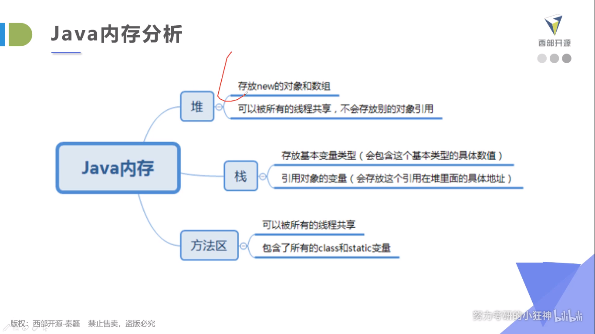

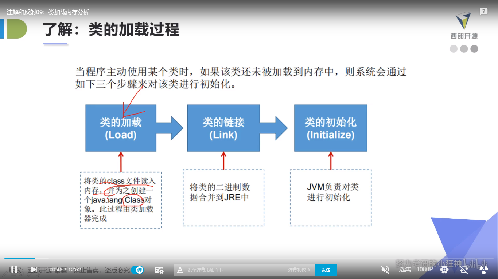


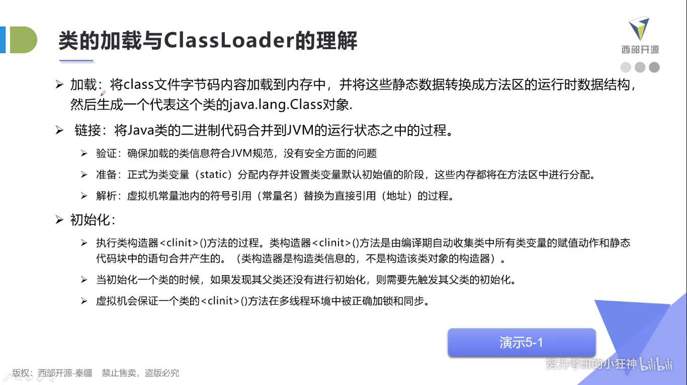


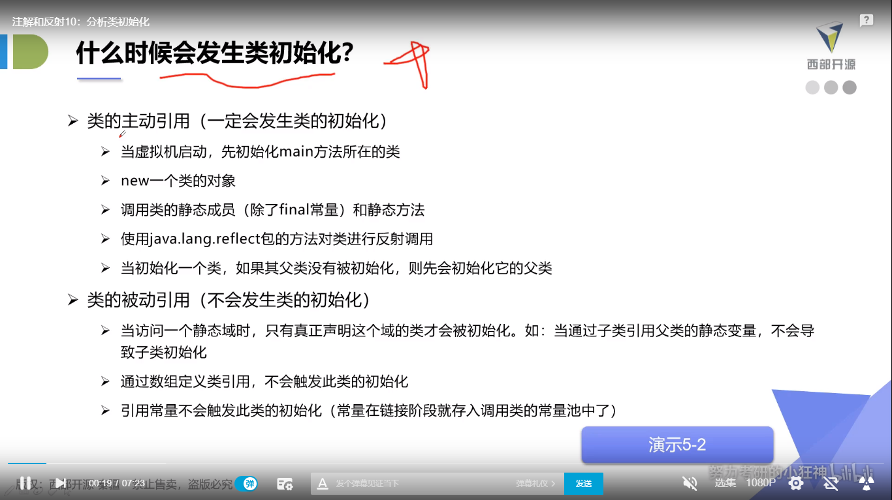

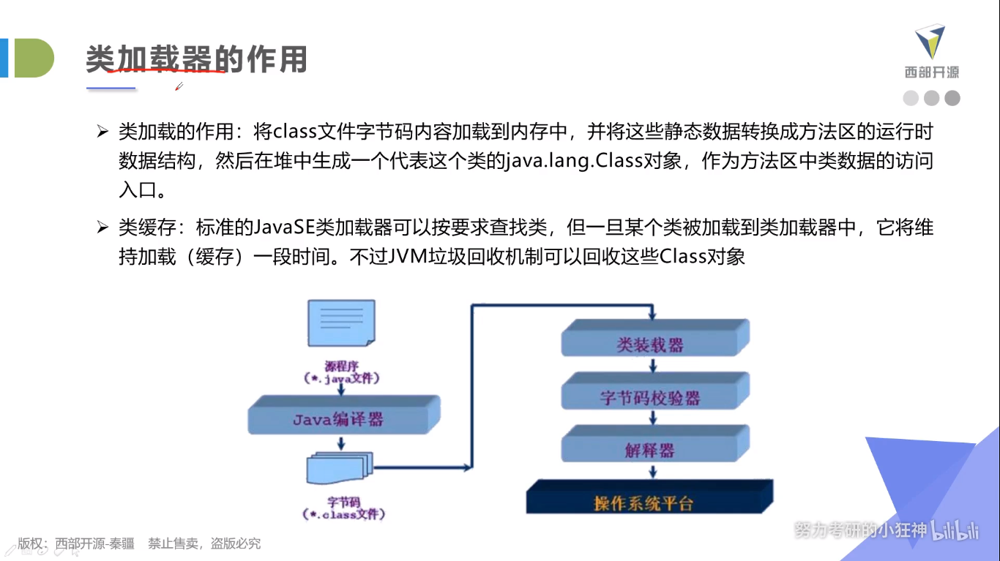


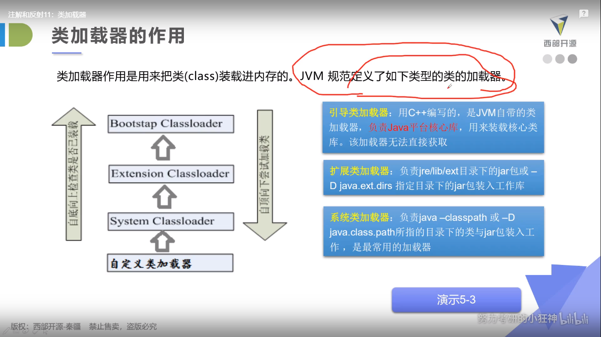


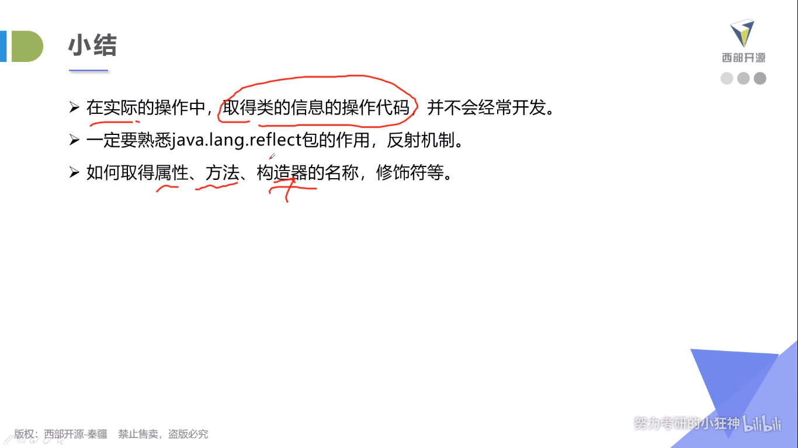


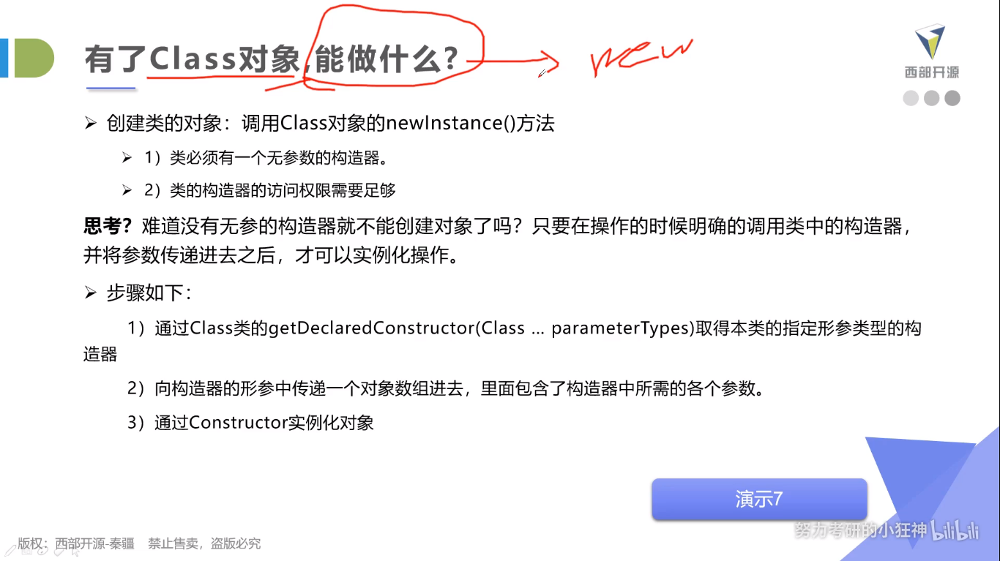


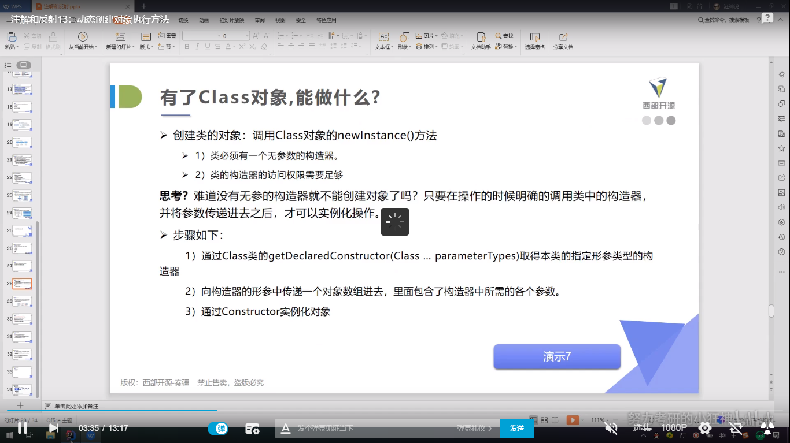


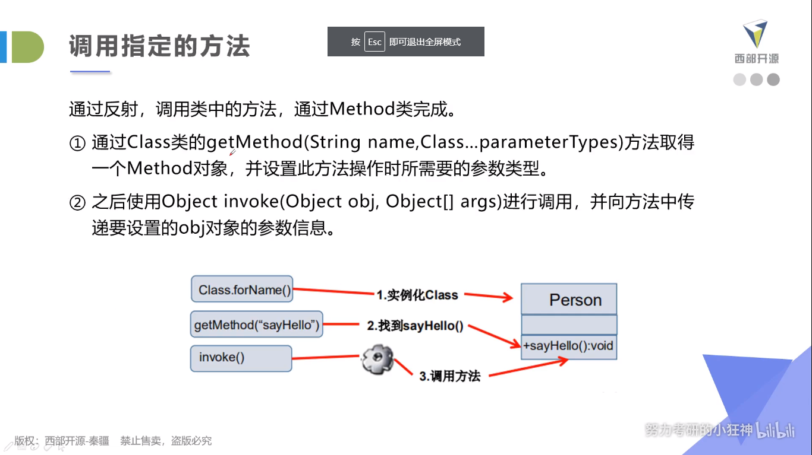

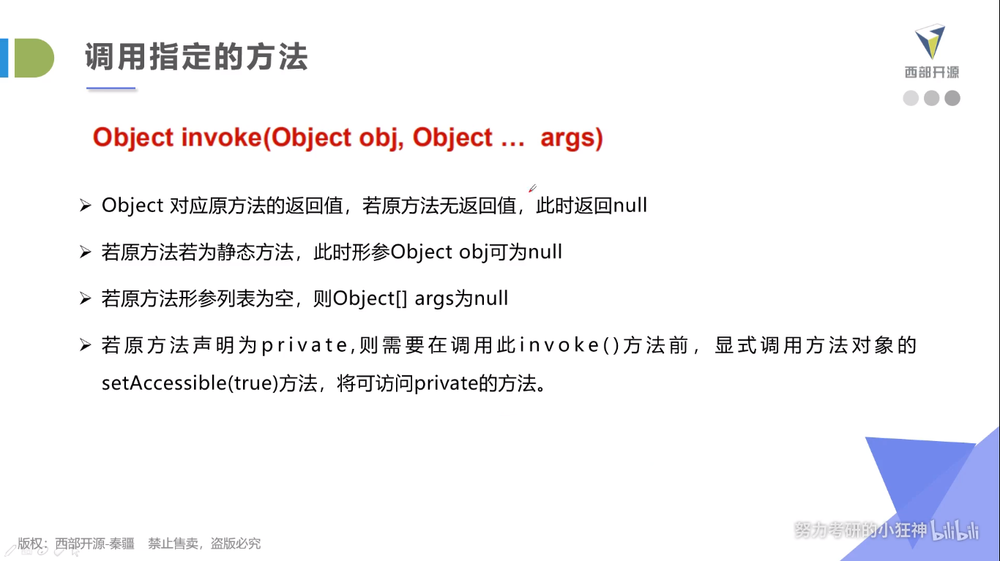

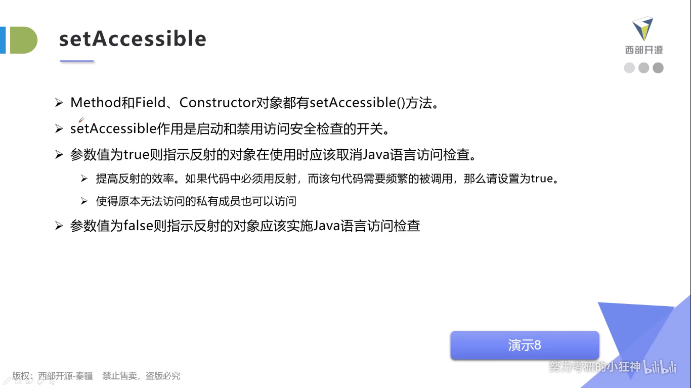


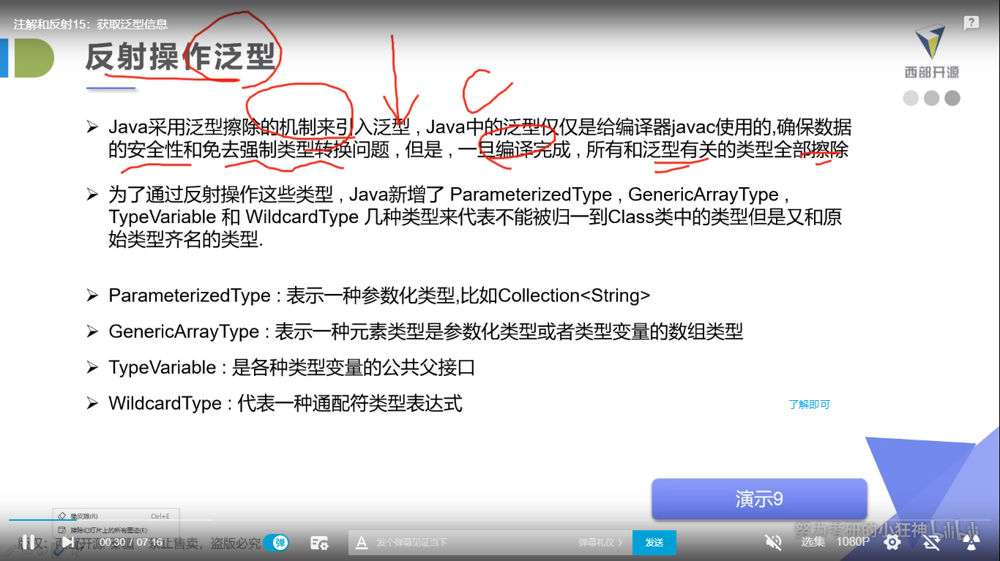


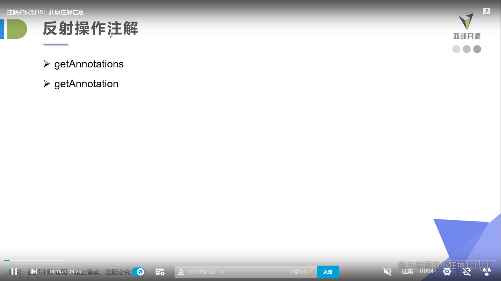


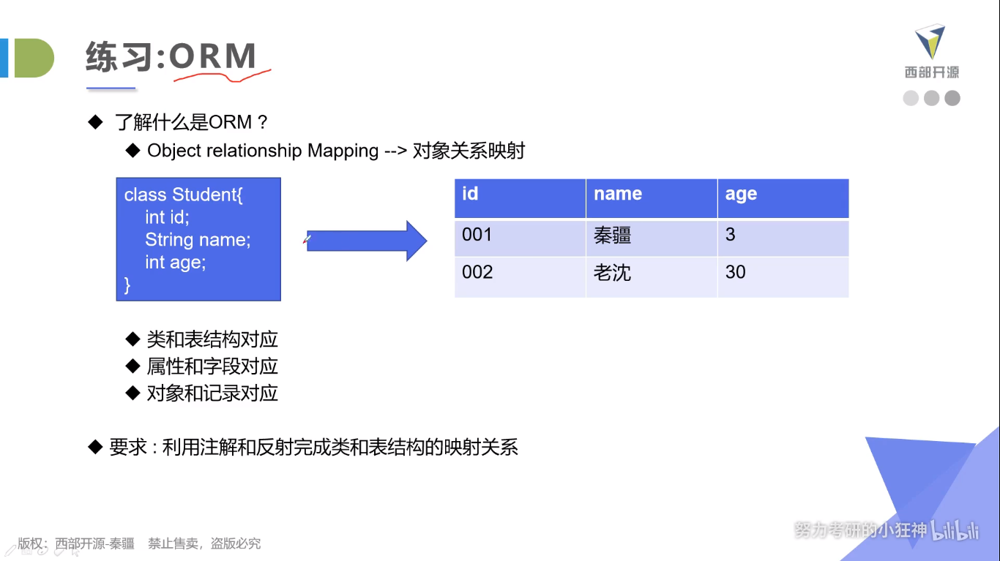

