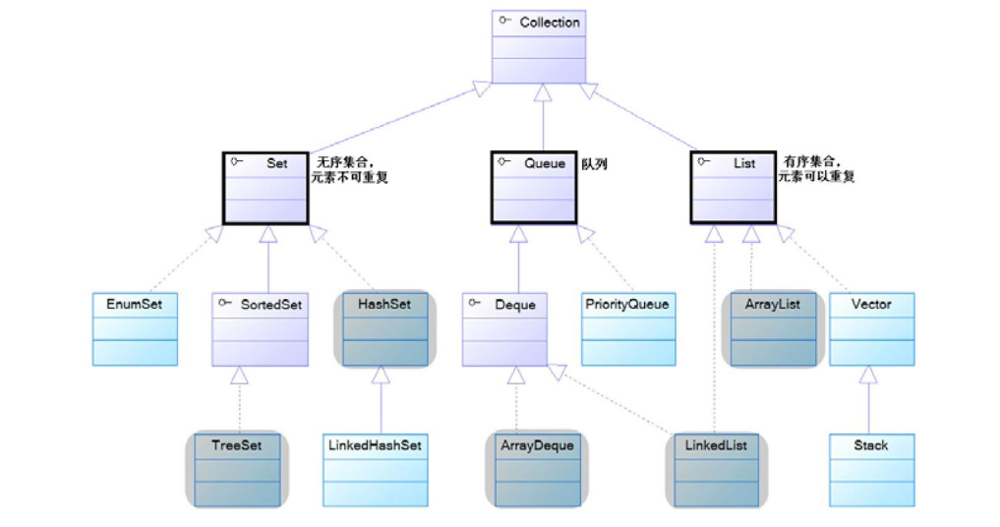

# 集合

## 目录
- 集合的概念和作用
- Java的集合体系
- Collection集合的常规用法
- 使用Iterator和foreach循环遍历Collection集合
- HashSet、LinkedHashSet的用法
- TreeSet的用法
- EnumSet的用法
- List集合的常规用法
- ArrayList和Vector
- 固定长度的List集合
- Queue接口与Deque接口
- PriorityQueue的用法
- ArrayDeque的用法
- LinkedList集合的用法
- Map的概念和常规用法
- HashMap和Hashtable
- TreeMap的用法
- 几种特殊的Map实现类
- Hash算法对HashSet、HashMap性能的影响
- Collections工具类的用法
- Enumeration迭代器的用法
## 概述

集合类和数组不一样，数组元素既可以是基本类型的值，也可以是对象（实际上保存的是对象的引用变量）；而集合里只能保存对象（实际上只是保存对象的引用变量，但通常习惯上认为集合里保存的是对象）。`Java`的集合类主要由两个接口派生而出：`Collection`和`Map`，`Collection`和`Map`是`Java`集合框架的根接口，这两个接口又包含了一些子接口或实现类。

Collection接口是List、Set和Queue接口的父接口，该接口里定义的方法既可用于操作Set集合，也可用于操作List和Queue集合。

-  boolean add(Object o)：该方法用于向集合里添加一个元素。如果集合对象被添加操作改变了，则返回true。
- boolean addAll(Collection c)：该方法把集合c里的所有元素添加到指定集合里。如果集合对象被添加操作改变了，则返回true。
-  void clear()：清除集合里的所有元素，将集合长度变为0。
- boolean contains(Object o)：返回集合里是否包含指定元素。
- boolean containsAll(Collection c)：返回集合里是否包含集合c里的所有元素。
- boolean isEmpty()：返回集合是否为空。当集合长度为0时返回true，否则返回false。
- Iterator iterator()：返回一个Iterator对象，用于遍历集合里的元素。
- boolean remove(Object o)：删除集合中的指定元素o，当集合中包含了一个或多个元素o时，这些元素将被删除，该方法将返回true。
- boolean removeAll(Collection c)：从集合中删除集合c里包含的所有元素（相当于用调用该方法的集合减集合c），如果删除了一个或一个以上的元素，则该方法返回true。
- boolean retainAll(Collection c)：从集合中删除集合c里不包含的元素（相当于把调用该方法的集合变成该集合和集合c的交集），如果该操作改变了调用该方法的集合，则该方法返回true。
- int size()：该方法返回集合里元素的个数。
- Object[] toArray()：该方法把集合转换成一个数组，所有的集合元素变成对应的数组元素。

注意：Iterator必须依附于Collection对象，若有一个Iterator对象，则必然有一个与之关联的Collection对象。Iterator提供了两个方法来迭代访问Collection集合里的元素，并可通过remove()方法来删除集合中上一次next()方法返回的集合元素。当使用Iterator对集合元素进行迭代时，Iterator并不是把集合元素本身传给了迭代变量，而是把集合元素的值传给了迭代变量，所以修改迭代变量的值对集合元素本身没有任何影响。当使用Iterator迭代访问Collection集合元素时，Collection集合里的元素不能被改变，只有通过Iterator的remove方法删除上一次next方法返回的集合元素才可以；否则将会引发java.util.Concurrent ModificationException异常。当使用foreach循环迭代访问集合元素时，该集合也不能被改变，否则将引发ConcurrentModificationException异常。

Set集合与Collection基本上完全一样，它没有提供任何额外的方法。实际上Set就是Collection，只是行为略有不同（Set不允许包含重复元素）

Set集合不允许包含相同的元素，如果试图把两个相同的元素加入同一个Set集合中，则添加操作失败，add方法返回false，且新元素不会被加入。

HashSet具有以下特点。[插图] 不能保证元素的排列顺序，顺序有可能发生变化。[插图] HashSet不是同步的，如果多个线程同时访问一个HashSet，假设有两个或者两个以上线程同时修改了HashSet集合时，则必须通过代码来保证其同步。[插图] 集合元素值可以是null。当向HashSet集合中存入一个元素时，HashSet会调用该对象的hashCode()方法来得到该对象的hashCode值，然后根据该HashCode值决定该对象在HashSet中的存储位置。如果有两个元素通过equals()方法比较返回true，但它们的hashCode()方法返回值不相等，HashSet将会把它们存储在不同的位置，依然可以添加成功。简单地说，HashSet集合判断两个元素相等的标准是两个对象通过equals()方法比较相等，并且两个对象的hashCode()方法返回值也相等。

注意：当把一个对象放入HashSet中时，如果需要重写该对象对应类的equals()方法，则也应该重写其hashCode()方法。其规则是：如果两个对象通过equals()方法比较返回true，这两个对象的hashCode值也应该相同。

注意：如果需要把某个类的对象保存到HashSet集合中，重写这个类的equals()方法和hashCode()方法时，应该尽量保证两个对象通过equals()方法比较返回true时，它们的hashCode()方法返回值也相等。

重写hashCode()方法的基本规则。[插图] 在程序运行过程中，同一个对象多次调用hashCode()方法应该返回相同的值。[插图] 当两个对象通过equals()方法比较返回true时，这两个对象的hashCode()方法应返回相等的值。[插图] 对象中用作equals()方法比较标准的Field，都应该用来计算hashCode值。下面给出重写hashCode()方法的一般规则。

（1）把对象内每个有意义的Field（即每个用做equals()方法比较标准的Field）计算出一个int类型的hashCode值。计算方式如表8.1所示。

## 源码分析

## 总结

