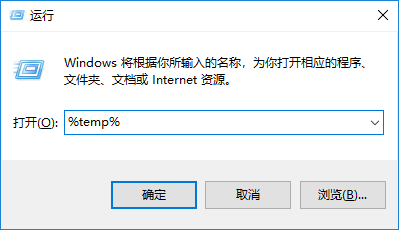

# windows常用的命令

> 作者：子墨同学
>
> 时间：2020-04-15

[TOC]

## Windows运行常用命令（win+R）

**如何打开Windows运行命令框？您需要按Win + R（按住Windows按钮，然后按R）**

### 常用

`cmd`

> 此命令将打开Windows DOS命令提示符。 按 `Shift+Ctrl+Enter`以管理员模式启动

 `regedit`

> 打开Windows注册表。

`powershell`

> 打开Windows PowerShell。只需在“运行”对话框中键入此命令，并且您的PowerShell将无需管理员权限即可打开。

`notepad`

> 打开记事本

`control`

> 打开控制面板。控制面板用于管理所有系统设置和程序。

`calc`

> 启动计算器 

`write`

> 写字板 

`mspaint`

> 画图板 

`snippingtool`

> 截图工具，支持无规则截图 

`mstsc`

>  远程桌面连接 

`logoff`

>  注销命令 

`control`

> 控制面板 

`shutdown -s -t 0`

> 立刻关机（时间t参数为0-300秒） 

`shutdown -r -t 0`

> 立刻重启 

`shutdown -l`

> 注销 

### 其他

`%temp%`

> 进入计算机临时文件夹目录（C:\Users\username\AppData\Local\Temp）。这是从计算机中清除临时文件的最快方法。它可以节省临时文件浪费的大量空间。

`msconfig`

> Windows系统配置
> 此命令将打开Windows系统配置，您可以在其中编辑不同的内容，如启动选项，启动选项，服务等。

`.`

> 打开当前用户的主文件夹，其中托管所有其他本地文件夹，如下载，文档，桌面，图片等。

`..`

> 打开直接位于C盘上的“用户”文件夹。

`taskmgr`

> 打开任务管理器，也可以选择Ctrl+Alt+del来选择打开任务管理器。

`mplayer2`

> 打开widnows media player 

`Sndvol`

>  音量控制程序 

`osk`

> 打开屏幕键盘 

`cleanmgr`

>  打开磁盘清理工具 

`compmgmt.msc`

>  计算机管理 

`gpedit.msc`

> 组策略

`mmc`

>  打开控制台 

`services.msc`

>  本地服务设置 

`winver`

>  检查Windows版本 

`devmgmt.msc`

> 设备管理器 

`diskmgmt.msc`

> 磁盘管理实用程序 

`msconfig`

> 系统配置实用程序（工具选项卡里面可以查看一些命令的使用） 

`magnify`

> 放大镜实用程序 

`utilman`

>  设置的主页（win10）

## DOS命令

### 常用

`dir` 

> (directory)列出当前目录下的文件以及文件夹

`md`

>  (make directory) 创建目录

`rd`

>  (remove directory)删除目录

`cd`

>  (change directory)进入指定目录（跨盘符要加`/d`  例如：C:\Users\ssr>cd /d D:\IdeaProjects） 

`cd..`

>  退回到上一级目录

## 参考资料

1. [Windows 15个重要运行命令](https://blog.csdn.net/u012562943/article/details/78312396)

2. [Windows运行常用命令（win+R）](https://www.cnblogs.com/leeego-123/p/10655693.html)

3. [windows dos 常用命令行](https://blog.csdn.net/ternence_hsu/article/details/70739002)