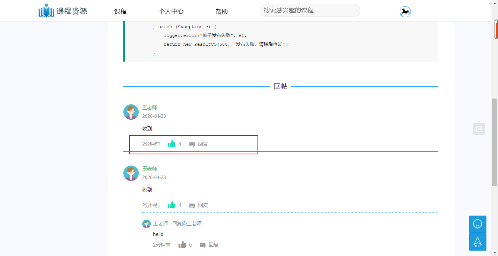
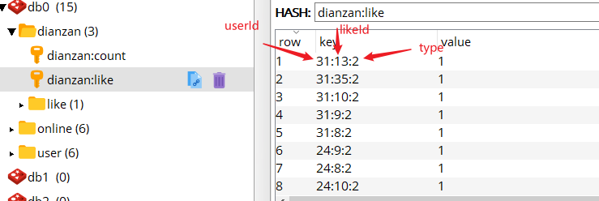
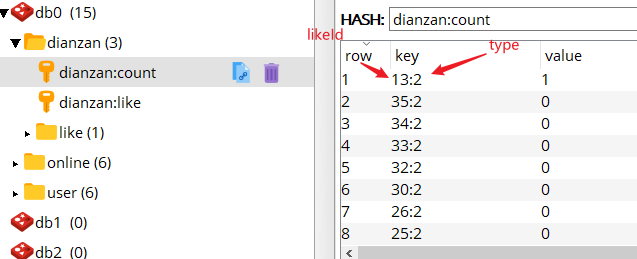
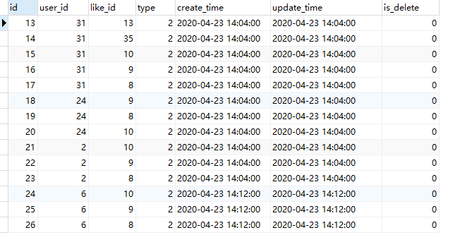
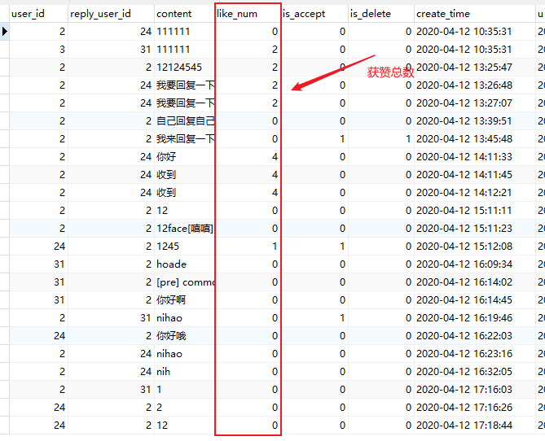
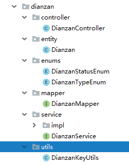

# Spring Boot+Redis实现点赞功能

> 作者：子墨同学
>
> 时间：2020-04-23

[TOC]

## 背景

在课程资源管理系统中，在每一个课程中可以发布帖子，回复帖子，现在需要对帖子的回复添加点赞和取消点赞功能，其中要包括该条回复的总的获赞数量。



**点赞、取消点赞是高频次的操作，若每次都读写数据库，大量的操作会影响数据库性能，所以需要做缓存。**

为了该功能的可扩展性，我们使用redis存储每个点赞的点赞人、被点赞的资源（用户、帖子、回复等），以及被点赞资源的获赞总数。

## 总体思路

### Redis中存储数据格式

用 Redis 存储两种数据，一种是记录点赞人、被点赞的资源（用户、帖子、回复等）、点赞状态的数据，另一种是被点赞的资源被点赞了多少次，做个简单的计数。

**由于需要记录点赞人和被点赞人，还有点赞状态（点赞、取消点赞），还要固定时间间隔取出 Redis 中所有点赞数据，分析了下 Redis 数据格式中 Hash 最合适。**

因为 Hash 里的数据都是存在一个键里，可以通过这个键很方便的把所有的点赞数据都取出。这个键里面的数据还可以存成键值对的形式，方便存入点赞人、被点赞的资源和点赞状态。

设点赞人的 id 为 userId，被点赞的资源的 id 为 likeId ，点赞时状态为 1，取消点赞状态为 0，点赞的类型为type，可以使用户、帖子、回复等。两个 id 中间用`:`隔开，点赞状态作为值。例如：用户1给评论ID为2的点赞，type为2表示点赞类型为评论，那么存入redis中的key就是 `1:2:2`。

所以如果用户点赞，存储的键为：`userId:likeId:type`，对应的值为 1 。取消点赞，存储的键为：`userId:likeId:type`，对应的值为 0 。取数据时把键用 `:` 切开就得到了两个 id和type。

- 记录用户点赞信息



- 记录获赞总数



### 数据持久化的mysql

这里使用springboot的定时任务，每隔两小时将redis中的数据同步到数据库，仅仅同步点赞状态为1的数据，数据库中不存储没有点赞的用户数据，减少数据量。

### 前端获取数据

在项目启动和运行过程中，查询点赞数据的时候，先去redis查询，redis没有数据再去数据库查询并将结果放入redis中。

## 数据库设计

MySQL版本 `5.7.23`

- 记录用户点赞表【仅仅记录点赞的用户】

主要包含两个字段：被点赞资源 id，点赞用户 id。再加上主键 id，创建时间，修改时间就行了。

```sql
CREATE TABLE `dianzan`  (
  `id` int(11) NOT NULL AUTO_INCREMENT COMMENT 'ID',
  `user_id` int(11) NOT NULL COMMENT '用户ID',
  `like_id` int(11) NOT NULL COMMENT '被点赞的文章、讨论、回复或者用户ID',
  `type` int(5) NOT NULL COMMENT '被点赞的类型',
  `create_time` datetime(0) NOT NULL COMMENT '创建时间',
  `update_time` datetime(0) NOT NULL COMMENT '更新时间',
  `is_delete` tinyint(1) NOT NULL DEFAULT 0 COMMENT '删除标记',
  PRIMARY KEY (`id`) USING BTREE
) ENGINE = InnoDB AUTO_INCREMENT = 27 CHARACTER SET = utf8mb4 COLLATE = utf8mb4_general_ci COMMENT = '点赞' ROW_FORMAT = Dynamic;
```



- 帖子回复列表【包含了获赞总数】

```sql
CREATE TABLE `course_discuss_reply`  (
  `id` int(11) NOT NULL AUTO_INCREMENT COMMENT '唯一ID',
  `p_id` int(11) NULL DEFAULT NULL COMMENT '父Id',
  `discuss_id` int(11) NULL DEFAULT NULL COMMENT '帖子ID',
  `user_id` int(11) NULL DEFAULT NULL COMMENT '用户ID',
  `reply_user_id` int(11) NULL DEFAULT NULL COMMENT '回复对象的UserID',
  `content` longtext CHARACTER SET utf8mb4 COLLATE utf8mb4_general_ci NULL COMMENT '回复内容',
  `like_num` int(11) NULL DEFAULT 0 COMMENT '点赞数量',
  `is_accept` tinyint(1) NULL DEFAULT 0 COMMENT '是否被采纳',
  `is_delete` tinyint(1) NULL DEFAULT NULL COMMENT '是否删除',
  `create_time` datetime(0) NULL DEFAULT NULL COMMENT '创建时间',
  `update_time` datetime(0) NULL DEFAULT NULL COMMENT '更新时间',
  PRIMARY KEY (`id`) USING BTREE
) ENGINE = InnoDB AUTO_INCREMENT = 38 CHARACTER SET = utf8mb4 COLLATE = utf8mb4_general_ci COMMENT = '帖子回复列表' ROW_FORMAT = Dynamic;
```



## 具体实现

### 项目结构



### 具体代码

#### 实体类

- Dianzan 

```java
/**
 * 点赞
 * @since 2020-04-22
 */
@Data
@EqualsAndHashCode(callSuper = false)
@Accessors(chain = true)
public class Dianzan implements Serializable {

    private static final long serialVersionUID=1L;

    /**
     * ID
     */
    @TableId(value = "id", type = IdType.AUTO)
    private Integer id;

    /**
     * 用户ID
     */
    private Integer userId;

    /**
     * 被点赞的文章、讨论、回复或者用户ID
     */
    private Integer likeId;

    /**
     * 被点赞的类型
     */
    private Integer type;


    /**
    * 点赞的状态 0 或1
    */
    @TableField(exist = false)
    private Integer liked;

    /**
     * 创建时间
     */
    private Date createTime;

    /**
     * 更新时间
     */
    private Date updateTime;

    /**
     * 删除标记
     */
    @TableField("is_delete")
    private Boolean deleted;


}

```

#### 枚举类和工具类

- DianzanStatusEnum

```java
/**
 * 点赞状态
 * @since 2020/4/22
 **/
public enum DianzanStatusEnum {
    /**
     * 点赞
     */
    LIKE(1,"点赞"),
    /**
     * 取消点赞
     */
    UNLIKE(2,"取消点赞");
    private Integer id;
    private String msg;

    DianzanStatusEnum(Integer id, String msg) {
        this.id = id;
        this.msg = msg;
    }

    public Integer getId() {
        return id;
    }

    public void setId(Integer id) {
        this.id = id;
    }

    public String getMsg() {
        return msg;
    }

    public void setMsg(String msg) {
        this.msg = msg;
    }
}

```

- DianzanTypeEnum

```java
/**
 * 点赞类型
 * @since 2020/4/22
 **/

public enum DianzanTypeEnum {
    /**
     * 点赞类型：给讨论点赞
     */
    DISCUSS(1,"给讨论点赞"),
    /**
     * 点赞类型：给讨论回复点赞
     */
    DISCUSS_REPLY(2,"给讨论回复点赞"),
    /**
     * 点赞类型：给用户点赞
     */
    USER(3,"给用户点赞"),
    /**
     * 点赞类型：给课程评价点赞
     */
    COURSE_EVALUATE(4,"给课程评价点赞");

    private Integer type;

    private String msg;

    DianzanTypeEnum(Integer typeNum, String type) {
        this.type = typeNum;
        this.msg = type;
    }

    public Integer getType() {
        return type;
    }

    public void setType(Integer type) {
        this.type = type;
    }

    public String getMsg() {
        return msg;
    }

    public void setMsg(String msg) {
        this.msg = msg;
    }
}

```

- DianzanKeyUtils

```java

/**
 * 工具类：获取key
 * @since 2020/4/22
 **/

public class DianzanKeyUtils {

    public static final String DIANZAN_USER_LIKE = "dianzan:like";
    public static final String DIANZAN_USER_LIKE_COUNT = "dianzan:count";

    /**
     * 拼接被点赞的用户id、点赞的id以及点赞类型作为key。格式 222222:333333:1
     *
     * @param userId 用户ID
     * @param likeId 被点赞的ID
     * @param type   点赞类型
     */
    public static String getLikeKey(Integer userId, Integer likeId, Integer type) {

        StringBuffer key = new StringBuffer();
        key.append(userId)
                .append(":")
                .append(likeId)
                .append(":")
                .append(type);
        return key.toString();
    }

    /**
     * 拼接点赞的id以及点赞类型作为key。格式 333333:1
     *
     * @param likeId 被点赞的ID
     * @param type   点赞类型
     */
    public static String getLikeCountKey(Integer likeId, Integer type) {
        StringBuffer key = new StringBuffer();
        key.append(likeId)
                .append(":")
                .append(type);
        return key.toString();
    }

}

```

- RedisUtils

```java
/**
 * redisTemplate封装
 */
@Component
public class RedisUtils {

    @Resource
    private RedisTemplate<String, Object> redisTemplate;
    //================================Map=================================
    /**
     * HashGet
     * @param key 键 不能为null
     * @param item 项 不能为null
     * @return 值
     */
    public Object hget(String key,String item){
        return redisTemplate.opsForHash().get(key, item);
    }

    /**
     * 获取hashKey对应的所有键值
     * @param key 键
     * @return 对应的多个键值
     */
    public Map<Object,Object> hmget(String key){
        return redisTemplate.opsForHash().entries(key);
    }

    /**
     * HashSet
     * @param key 键
     * @param map 对应多个键值
     * @return true 成功 false 失败
     */
    public boolean hmset(String key, Map<String,Object> map){
        try {
            redisTemplate.opsForHash().putAll(key, map);
            return true;
        } catch (Exception e) {
            e.printStackTrace();
            return false;
        }
    }

    /**
     * HashSet 并设置时间
     * @param key 键
     * @param map 对应多个键值
     * @param time 时间(秒)
     * @return true成功 false失败
     */
    public boolean hmset(String key, Map<String,Object> map, long time){
        try {
            redisTemplate.opsForHash().putAll(key, map);
            if(time>0){
                expire(key, time);
            }
            return true;
        } catch (Exception e) {
            e.printStackTrace();
            return false;
        }
    }

    /**
     * 向一张hash表中放入数据,如果不存在将创建
     * @param key 键
     * @param item 项
     * @param value 值
     * @return true 成功 false失败
     */
    public boolean hset(String key,String item,Object value) {
        try {
            redisTemplate.opsForHash().put(key, item, value);
            return true;
        } catch (Exception e) {
            e.printStackTrace();
            return false;
        }
    }

    /**
     * 向一张hash表中放入数据,如果不存在将创建
     * @param key 键
     * @param item 项
     * @param value 值
     * @param time 时间(秒)  注意:如果已存在的hash表有时间,这里将会替换原有的时间
     * @return true 成功 false失败
     */
    public boolean hset(String key,String item,Object value,long time) {
        try {
            redisTemplate.opsForHash().put(key, item, value);
            if(time>0){
                expire(key, time);
            }
            return true;
        } catch (Exception e) {
            e.printStackTrace();
            return false;
        }
    }

    /**
     * 删除hash表中的值
     * @param key 键 不能为null
     * @param item 项 可以使多个 不能为null
     */
    public void hdel(String key, Object... item){
        redisTemplate.opsForHash().delete(key,item);
    }

    /**
     * 判断hash表中是否有该项的值
     * @param key 键 不能为null
     * @param item 项 不能为null
     * @return true 存在 false不存在
     */
    public boolean hHasKey(String key, String item){

        return redisTemplate.opsForHash().hasKey(key, item);
    }

    /**
     * hash递增 如果不存在,就会创建一个 并把新增后的值返回
     * @param key 键
     * @param item 项
     * @param by 要增加几(大于0)
     * @return
     */
    public double hincr(String key, String item,double by){
        return redisTemplate.opsForHash().increment(key, item, by);
    }

    /**
     * hash递减
     * @param key 键
     * @param item 项
     * @param by 要减少记(小于0)
     * @return
     */
    public double hdecr(String key, String item,double by){
        return redisTemplate.opsForHash().increment(key, item,-by);
    }

    /**
     * 获取全部
     * @param key 键
     * @return
     */
    public Cursor<Map.Entry<Object, Object>> hsan(String key){
        return redisTemplate.opsForHash().scan(key, ScanOptions.NONE);
    }
}
```

#### Service层

- DianzanService

```java
/**
 * 点赞  服务类
 * @since 2020-04-22
 */
public interface DianzanService extends IService<Dianzan> {
    
    /**
     * 点赞。状态为1
     *
     * @param userId 点赞用户ID
     * @param likeId 被点赞的资源ID【帖子ID、用户ID、回复ID、评论ID等】
     * @param type   点赞类型 【给帖子、用户、回复、评论等点赞】
     */

    void saveLikeToRedis(Integer userId, Integer likeId, Integer type);


    /**
     * 取消点赞。将状态改变为0
     *
     * @param userId 点赞用户ID
     * @param likeId 被点赞的资源ID【帖子ID、用户ID、回复ID、评论ID等】
     * @param type   点赞类型 【给帖子、用户、回复、评论等点赞】
     */

    void saveUnlikeToRedis(Integer userId, Integer likeId, Integer type);


    /**
     * 根据点赞用户 被点赞的ID 和点赞类型查找
     * @param userId 用户ID
     * @param likeId 被点赞的ID
     * @param type 点赞类型
     * @return 点赞
     */
    Dianzan getDianzan(Integer userId,Integer likeId,Integer type);


    /**
     * 根据被点赞的ID 和点赞类型统计获赞总数
     * @param likeId 被点赞的ID
     * @param type 点赞类型
     * @param likeNum 数据库中的获赞总数
     * @return 点赞总数
     */
    Integer getDianzanCount(Integer likeId,Integer type,Integer likeNum);

    /**
     * 保存或更新点赞数据
     * @param dianzans
     */
    void saveOrUpdateDianzan(List<Dianzan> dianzans);
}

```


- DianzanServiceImpl

```java
/**
 * 点赞 服务实现类
 * @since 2020-04-22
 */
@Service
public class DianzanServiceImpl extends ServiceImpl<DianzanMapper, Dianzan> implements DianzanService {

    @Autowired
    private RedisUtils redisUtils;

    /**
     * 点赞。状态为1
     *
     * @param userId 点赞用户ID
     * @param likeId 被点赞的资源ID【帖子ID、用户ID、回复ID、评论ID等】
     * @param type   点赞类型 【给帖子、用户、回复、评论等点赞】
     */
    @Override
    public void saveLikeToRedis(Integer userId, Integer likeId, Integer type) {
        redisUtils.hset(DianzanKeyUtils.DIANZAN_USER_LIKE, DianzanKeyUtils.getLikeKey(userId, likeId, type), DianzanStatusEnum.LIKE.getId());
        redisUtils.hincr(DianzanKeyUtils.DIANZAN_USER_LIKE_COUNT, DianzanKeyUtils.getLikeCountKey(likeId, type), 1);
    }

    /**
     * 取消点赞。将状态改变为0
     *
     * @param userId 点赞用户ID
     * @param likeId 被点赞的资源ID【帖子ID、用户ID、回复ID、评论ID等】
     * @param type   点赞类型 【给帖子、用户、回复、评论等点赞】
     */
    @Override
    public void saveUnlikeToRedis(Integer userId, Integer likeId, Integer type) {
        redisUtils.hset(DianzanKeyUtils.DIANZAN_USER_LIKE, DianzanKeyUtils.getLikeKey(userId, likeId, type), DianzanStatusEnum.UNLIKE.getId());
        redisUtils.hdecr(DianzanKeyUtils.DIANZAN_USER_LIKE_COUNT, DianzanKeyUtils.getLikeCountKey(likeId, type), 1);

    }

    /**
     * 根据点赞用户 被点赞的ID 和点赞类型查找
     *
     * @param userId 用户ID
     * @param likeId 被点赞的ID
     * @param type   点赞类型
     * @return 点赞
     */
    @Override
    public Dianzan getDianzan(Integer userId, Integer likeId, Integer type) {

        // 先查Redis中有没有数据
        Dianzan dianzan = null;
        Integer like = (Integer) redisUtils.hget(DianzanKeyUtils.DIANZAN_USER_LIKE, DianzanKeyUtils.getLikeKey(userId, likeId, type));

        if (like == null) {
            // redis中没有数据查数据库，并存入redis
            dianzan = baseMapper.getDianzan(userId, likeId, type);
            if (dianzan != null) {
                redisUtils.hset(DianzanKeyUtils.DIANZAN_USER_LIKE, DianzanKeyUtils.getLikeKey(userId, likeId, type), DianzanStatusEnum.LIKE.getId());
            }
        } else {
            dianzan = new Dianzan();
        }
        return dianzan;
    }

    /**
     * 根据被点赞的ID 和点赞类型统计获赞总数
     *
     * @param likeId  被点赞的ID
     * @param type    点赞类型
     * @param likeNum 数据库中的获赞总数
     * @return 点赞总数
     */
    @Override
    public Integer getDianzanCount(Integer likeId, Integer type, Integer likeNum) {
        // 先查Redis中有没有数据
        Integer count = (Integer) redisUtils.hget(DianzanKeyUtils.DIANZAN_USER_LIKE_COUNT, DianzanKeyUtils.getLikeCountKey(likeId, type));
        if (count == null) {
            // redis中没有数据查数据库，并存入redis
            redisUtils.hset(DianzanKeyUtils.DIANZAN_USER_LIKE_COUNT, DianzanKeyUtils.getLikeCountKey(likeId, type), likeNum);
            count = likeNum;
        }
        return count;
    }

    @Transactional(rollbackFor = Exception.class)
    @Override
    public void saveOrUpdateDianzan(List<Dianzan> dianzans) {
        for (Dianzan dianzan : dianzans) {
            QueryWrapper<Dianzan> wrapper = new QueryWrapper<>();

            wrapper.eq("user_id", dianzan.getUserId())
                    .eq("like_id", dianzan.getLikeId())
                    .eq("type", dianzan.getType());
            Dianzan one = getOne(wrapper);
            // 数据库中有数据 redis中点赞状态为取消点赞 则删除表中数据
            if (one != null && 0 == dianzan.getLiked()) {
                remove(wrapper);
            }
            // 数据库中没有 redis中点赞状态为点赞 则添加数据到数据库
            if(one==null&& 0!=dianzan.getLiked()){
                save(dianzan);
            }
            // 表中有数据 redis中点赞状态为点赞 不做任何操作
            // if (one != null && 1 == dianzan.getLiked()) {
            //     update(dianzan,wrapper);
            // }

            // 数据库中没有 redis中点赞状态为取消点赞 不进行操作

        }
    }
}
```

#### Controller层

- DianzanController

```java
/**
 * 点赞 前端控制器
 * @since 2020-04-22
 */
@Slf4j
@RestController
@RequestMapping("/dianzan")
public class DianzanController {

    @Autowired
    private DianzanService dianzanService;

    /**
     * 点赞
     *
     * @param likeId 回复ID
     */
    @GetMapping("/like/discussReply")
    public ResultVO likeDiscussReply(@RequestParam("id") Integer likeId) {
        Integer userId = SysWebUtils.getUserId();
        try {
            dianzanService.saveLikeToRedis(userId, likeId, DianzanTypeEnum.DISCUSS_REPLY.getType());
            return new ResultVO(200, "点赞成功");
        } catch (Exception e) {
            log.error("用户[{}]给回复列表[{}]点赞失败", userId, likeId, e);
            return new ResultVO(500, "点赞失败");
        }
    }
    /**
     * 取消点赞
     *
     * @param likeId 回复ID
     */
    @GetMapping("/unlike/discussReply")
    public ResultVO unlikeDiscussReply(@RequestParam("id") Integer likeId) {
        Integer userId = SysWebUtils.getUserId();
        try {
            dianzanService.saveUnlikeToRedis(userId, likeId, DianzanTypeEnum.DISCUSS_REPLY.getType());
            return new ResultVO(200, "取消点赞成功");
        } catch (Exception e) {
            log.error("取消用户[{}]给回复列表[{}]点赞失败", userId, likeId, e);
            return new ResultVO(500, "取消点赞失败");
        }
    }

}


```

#### 定时任务

由于定时任务比较简单，直接采用springboot的Scheduled定时任务器实现。

定时任务可查看 [SpringBoot定时任务](/springboot/scheduled/SpringBoot定时任务)

```java
/**
 * 定时任务
 * @since 2020/4/16
 **/
@Component
@Slf4j
public class ScheduledJob {

    @Autowired
    private CourseDiscussReplyService courseDiscussReplyService;

    @Autowired
    private DianzanService dianzanService;

    @Autowired
    private RedisUtils redisUtils;
    /**
     * 两小时同步一次点赞数据到数据库
     * cron 属性： cron表达式：定时任务触发事件的一个字符串表达形式
     * 0 0 0/2 * * ? 每隔2小时同步一次数据到数据库
     * 0 0/2 * * * ? 没两分钟更新一次
     */

    @Scheduled(cron = "0 0 0/2 * * ?")
    public void saveDianzanToMysql() {
        try {

            // 更新获赞总数
            Cursor<Map.Entry<Object, Object>> likeNumCursor = redisUtils.hsan(DianzanKeyUtils.DIANZAN_USER_LIKE_COUNT);
            List<CourseDiscussReply> courseDiscussReplies = new ArrayList<>();

            while (likeNumCursor.hasNext()) {
                Map.Entry<Object, Object> next = likeNumCursor.next();
                // 得到key
                String key = (String) next.getKey();
                Integer LikeNum = (Integer) next.getValue();
                String[] keys = key.split(":");
                Integer likeId = Integer.valueOf(keys[0]);
                Integer type = Integer.valueOf(keys[1]);
                if (type.equals(DianzanTypeEnum.DISCUSS_REPLY.getType())) {
                    CourseDiscussReply courseDiscussReply = new CourseDiscussReply();
                    courseDiscussReply.setId(likeId)
                            .setLikeNum(LikeNum)
                            .setUpdateTime(new Date());
                    courseDiscussReplies.add(courseDiscussReply);
                }

            }
            //批量更新获赞数量
            courseDiscussReplyService.updateBatchById(courseDiscussReplies);


            // 更新用户点赞情况
            Cursor<Map.Entry<Object, Object>> likeCursor = redisUtils.hsan(DianzanKeyUtils.DIANZAN_USER_LIKE);
            List<Dianzan> dianzans = new ArrayList<>();
            while (likeCursor.hasNext()) {
                Map.Entry<Object, Object> next = likeCursor.next();
                // 得到key
                String key = (String) next.getKey();
                Integer isLiked = (Integer) next.getValue();
                String[] keys = key.split(":");
                Integer userId = Integer.valueOf(keys[0]);
                Integer likeId = Integer.valueOf(keys[1]);
                Integer type = Integer.valueOf(keys[2]);
                if (type.equals(DianzanTypeEnum.DISCUSS_REPLY.getType())) {

                    Dianzan dianzan = new Dianzan();
                    dianzan.setUserId(userId)
                            .setLikeId(likeId)
                            .setType(type)
                            .setLiked(isLiked)
                            .setCreateTime(new Date())
                            .setUpdateTime(new Date())
                            .setDeleted(Constants.IS_NOT_DELETE);
                    dianzans.add(dianzan);

                }

            }
            //批量更新获赞数量
            dianzanService.saveOrUpdateDianzan(dianzans);

            log.info("[定时任务] 每隔2小时同步一次数据到数据库");
        } catch (Exception e) {
            log.error("定时同步点赞数据异常", e);
        }

    }
}

```

#### 数据查询

在获取评论页面数据的时候，先查redis再查数据库。

```java
/**
* 获取帖子回复的点赞信息
*
* @param userId     用户ID
* @param secondItem 帖子列表
*/
private void getDianzanInfo(Integer userId, List<CourseDiscussReplyVO> secondItem) {
    for (CourseDiscussReplyVO secondReplyVO : secondItem) {
        // 2.2.1 查询当前用户是否点赞了
        Dianzan dianzan = dianzanService.getDianzan(userId, secondReplyVO.getId(), DianzanTypeEnum.DISCUSS_REPLY.getType());
        if (null != dianzan) {
            secondReplyVO.setIsLiked(true);
        }
        // 2.2.2 查询当前回复的获赞总数
        Integer count = dianzanService.getDianzanCount(secondReplyVO.getId(), DianzanTypeEnum.DISCUSS_REPLY.getType(), secondReplyVO.getLikeNum());
        secondReplyVO.setLikeNum(count);
    }
}
```

#### 前端点赞与取消点赞

- Html


```html
<span class="solve-zan zanok" type="zan">
    <i th:value="${item.header.id}" class="iconfont  icon-zan "                                 th:classappend="${item.header.isLiked==true}?'dianzan-liked'"></i>
    <em th:text="${item.header.likeNum}">66</em>
</span>
```

- JS


```js
 $(".icon-zan").on("click", function () {
        var zan = $(this);
        var likeId = $(this).attr("value");
        // console.log(likeId);
        var url = "";
        var count = $(this).next().text();
        var likeNum = parseInt(count);
        var countDisplay = $(this).next();
        if ($(this).hasClass("dianzan-liked")) {
            //取消点赞
            url = "/dianzan/unlike/discussReply?id=" + likeId;
            $.get(url, function (res) {
                if (res.code == 200) {
    
                    likeNum = likeNum - 1;
                    countDisplay.text(likeNum);
                    zan.removeClass("dianzan-liked");
                } else {
                    layer.msg(res.msg, {icon: 5})
                }
            })
        } else {
            //点赞
            url = "/dianzan/like/discussReply?id=" + likeId;
            $.get(url, function (res) {
                if (res.code == 200) {
                    likeNum = likeNum + 1;
                    countDisplay.text(likeNum);
                    zan.addClass("dianzan-liked");
                } else {
                    layer.msg(res.msg, {icon: 5})
                }
            })
        }
    
    
    })
```

## 参考资料

1. [Redis 是如何实现点赞、取消点赞的？](https://mp.weixin.qq.com/s/4DRi7lG0vjD3sSfHz0rA4g)
