Spring Cloud学习笔记

# 摘要

## Spring Boot与Spring Cloud版本选择

**Spring Cloud** : Hoxton.SR1

**Spring Boot**   :2.2.2RELEASE

**Cloud alibaba**: 2.1.0.RELWASE

**Java**               : Java8

**Maven **           : 3.5及以上

## SpringCloud升级，部分组件停用

1. 注册中心：Eureka停用，可以使用zookeeper、Consul作为服务注册中心，强烈推荐使用`Nacos`

2. 服务调用：Ribbon准备停更,代替为LoadBalancer

3. 服务调用2：Feign改为OpenFeign

4. 服务降级：Hystrix停更，改为resilence4j（国外）或者阿里巴巴的sentienl（国内），sentienl推荐使用

5. 服务网关：Zuul改为gateway

6. 服务配置：Config改为`Nacos`

7. 服务总线：Bus改为`Nacos`

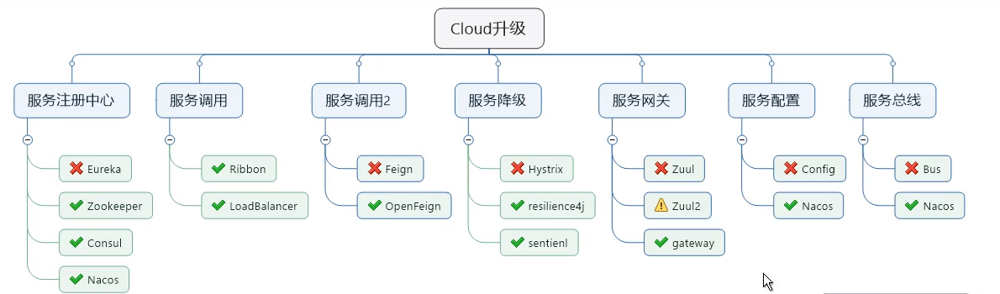

# 环境搭建


### 1. 创建Maven父工程，pom依赖

```xml
<?xml version="1.0" encoding="UTF-8"?>
<project xmlns="http://maven.apache.org/POM/4.0.0"
         xmlns:xsi="http://www.w3.org/2001/XMLSchema-instance"
         xsi:schemaLocation="http://maven.apache.org/POM/4.0.0 http://maven.apache.org/xsd/maven-4.0.0.xsd">
    <modelVersion>4.0.0</modelVersion>

    <groupId>com.zimo.springcloud</groupId>
    <artifactId>springcloud_study</artifactId>
    <version>1.0-SNAPSHOT</version>
    <packaging>pom</packaging> <!--表示这个pom是一个总的父工程-->

    <!--统一管理jar包版本-->
    <properties>
        <project.build.sourceEncoding>UTF-8</project.build.sourceEncoding>
        <maven.compiler.source>1.8</maven.compiler.source>
        <maven.compiler.target>1.8</maven.compiler.target>
        <junit.version>4.12</junit.version>
        <log4j.version>1.2.17</log4j.version>
        <lombok.version>1.16.18</lombok.version>
        <mysql.version>5.1.47</mysql.version>
        <druid.version>1.1.16</druid.version>
        <mybatis.spring.boot.version>2.1.1</mybatis.spring.boot.version>
    </properties>
    <!--子模块继承以后，提供作用：锁定版本；字模块不用写groupId和version-->
    <dependencyManagement>
        <dependencies>
            <!--spring boot 2.2.2-->
            <dependency>
                <groupId>org.springframework.boot</groupId>
                <artifactId>spring-boot-dependencies</artifactId>
                <version>2.2.2.RELEASE</version>
                <type>pom</type>
                <scope>import</scope>
            </dependency>
            <!--spring cloud Hoxton.SR1-->
            <dependency>
                <groupId>org.springframework.cloud</groupId>
                <artifactId>spring-cloud-dependencies</artifactId>
                <version>Hoxton.SR1</version>
                <type>pom</type>
                <scope>import</scope>
            </dependency>

            <!--spring cloud alibaba 2.1.0.RELEASE-->
            <dependency>
                <groupId>com.alibaba.cloud</groupId>
                <artifactId>spring-cloud-alibaba-dependencies</artifactId>
                <version>2.1.0.RELEASE</version>
                <type>pom</type>
                <scope>import</scope>
            </dependency>
            <!--mysql-->
            <dependency>
                <groupId>mysql</groupId>
                <artifactId>mysql-connector-java</artifactId>
                <version>${mysql.version}</version>
                <!--<scope>runtime</scope>-->
            </dependency>
            <!-- druid-->
            <dependency>
                <groupId>com.alibaba</groupId>
                <artifactId>druid</artifactId>
                <version>${druid.version}</version>
            </dependency>

            <!--mybatis-->
            <dependency>
                <groupId>org.mybatis.spring.boot</groupId>
                <artifactId>mybatis-spring-boot-starter</artifactId>
                <version>${mybatis.spring.boot.version}</version>
            </dependency>
            <!--junit-->
            <dependency>
                <groupId>junit</groupId>
                <artifactId>junit</artifactId>
                <version>${junit.version}</version>
            </dependency>
            <!--log4j-->
            <dependency>
                <groupId>log4j</groupId>
                <artifactId>log4j</artifactId>
                <version>${log4j.version}</version>
            </dependency>
        </dependencies>
    </dependencyManagement>
</project>
```


> 注意：
>
> Maven使用dependencyManagement元素来提供了一个管理依赖版本号的方式。
>
> `通常会在一个组织或者项目的最顶层的父POM中看到dependencyManagement元素`。
>
> 使用pom.xml中的dependencyManagement元素能够让所有在子项目中引用一个依赖而不用显式的列出版本号。
>
> Maven会沿着府项目层次向上走，直到找到一个拥有dependencyManageMent元素的项目，然后它使用功能这个dependencyManagement元素中指定的版本号。
>
> **好处：**如果有多个子项目都引用一样的依赖，则可以避免在每个子项目中声明版本号，这样当想升级或者切换到另一个版本也很方便。如果某个子项目需要另一个版本，只需要声明version即可。
>
> **！！！！**`dependencyManagement里只声明依赖，并不实现引入，因此子项目需要显示的声明需要用的依赖。`
>
> 如果不在子项目中依赖，是不会从父项目中继承下来的；只有在子项目中邪了该依赖，并且没有指定具体的版本号，才会从父项目中继承该项，并且version和scope都读取自父pom
>
> 如果子项目中制定了版本号，那么会使用子项目中指定的版本


### 2. 创建子模块，pay模块


**步骤**

1. 建module
2. 改写pom
3. 写yml
4. 主启动类
5. 业务类

#### 2.1 子模块名字:

​	cloud-provider-payment8001

#### 2.2 pom依赖

```xml
<?xml version="1.0" encoding="UTF-8"?>
<project xmlns="http://maven.apache.org/POM/4.0.0"
         xmlns:xsi="http://www.w3.org/2001/XMLSchema-instance"
         xsi:schemaLocation="http://maven.apache.org/POM/4.0.0 http://maven.apache.org/xsd/maven-4.0.0.xsd">
    <parent>
        <artifactId>springcloud_study</artifactId>
        <groupId>com.zimo.springcloud</groupId>
        <version>1.0-SNAPSHOT</version>
    </parent>
    <modelVersion>4.0.0</modelVersion>

    <artifactId>cloud-provider-payment8001</artifactId>


    <dependencies>
        <!--web-->
        <dependency>
            <groupId>org.springframework.boot</groupId>
            <artifactId>spring-boot-starter-web</artifactId>
        </dependency>
        <!--监控-->
        <dependency>
            <groupId>org.springframework.boot</groupId>
            <artifactId>spring-boot-starter-actuator</artifactId>
        </dependency>
        <dependency>
            <groupId>org.mybatis.spring.boot</groupId>
            <artifactId>mybatis-spring-boot-starter</artifactId>
        </dependency>
        <dependency>
            <groupId>com.alibaba</groupId>
            <artifactId>druid-spring-boot-starter</artifactId>
            <version>1.1.10</version>
            <!--如果没写版本,从父层面找,找到了就直接用,全局统一-->
        </dependency>

        <!--mysql-connector-java-->
        <dependency>
            <groupId>mysql</groupId>
            <artifactId>mysql-connector-java</artifactId>
        </dependency>
        <!--jdbc-->
        <dependency>
            <groupId>org.springframework.boot</groupId>
            <artifactId>spring-boot-starter-jdbc</artifactId>
        </dependency>
        <!--eureka client-->
        <dependency>
            <groupId>org.springframework.cloud</groupId>
            <artifactId>spring-cloud-starter-netflix-eureka-client</artifactId>
        </dependency>
        <!--热部署-->
        <dependency>
            <groupId>org.springframework.boot</groupId>
            <artifactId>spring-boot-devtools</artifactId>
            <scope>runtime</scope>
            <optional>true</optional>
        </dependency>
        <dependency>
            <groupId>org.projectlombok</groupId>
            <artifactId>lombok</artifactId>
            <optional>true</optional>
        </dependency>
        <dependency>
            <groupId>org.springframework.boot</groupId>
            <artifactId>spring-boot-starter-test</artifactId>
            <scope>test</scope>
        </dependency>

        <!-- 包含了sleuth zipkin 数据链路追踪-->
        <dependency>
            <groupId>org.springframework.cloud</groupId>
            <artifactId>spring-cloud-starter-zipkin</artifactId>
        </dependency>
        <!--<dependency>&lt;!&ndash; 引用自己定义的api通用包，可以使用Payment支付Entity &ndash;&gt;-->
        <!--    <groupId>com.eiletxie.springcloud</groupId>-->
        <!--    <artifactId>cloud-api-commons</artifactId>-->
        <!--    <version>${project.version}</version>-->
        <!--</dependency>-->
    </dependencies>

</project>
```


#### 2.3 创建application.yml

```yml
server:
  port: 8001
spring:
  application:
    name: cloud-payment-service
  datasource:
    # 当前数据源操作类型
    type: com.alibaba.druid.pool.DruidDataSource
    # mysql驱动类
    driver-class-name: com.mysql.jdbc.Driver
    url: jdbc:mysql://localhost:3306/db2019?useUnicode=true&characterEncoding=UTF-8&useSSL=false&serverTimezone=GMT%2B8
    username: root
    password: 12345
mybatis:
  mapper-locations: classpath:mapper/*.xml
  #它一般对应我们的实体类所在的包，这个时候会自动取对应包中不包括包名的简单类名作为包括包名的别名。多个package之间可以用逗号或者分号等来进行分隔（value的值一定要是包的全）
  type-aliases-package: com.zimo.springcloud.entities

```

#### 2.4 主启动类    

```java
@SpringBootApplication
public class PaymentMain8001 {
    public static void main(String[] args) {
        SpringApplication.run(PaymentMain8001.class, args);
    }
}

```

#### 2.5业务类

##### (1) sql

```sql
DROP TABLE IF EXISTS `payment`;
CREATE TABLE `payment`  (
  `id` bigint(20) NOT NULL AUTO_INCREMENT COMMENT 'ID',
  `serial` varchar(255) CHARACTER SET utf8mb4 COLLATE utf8mb4_general_ci NULL DEFAULT NULL,
  PRIMARY KEY (`id`) USING BTREE
) ENGINE = InnoDB AUTO_INCREMENT = 1 CHARACTER SET = utf8mb4 COLLATE = utf8mb4_general_ci ROW_FORMAT = Dynamic;

```


##### (2)实体类


##### (3)entity类

##### (4)dao层:

##### (5)mapper配置文件类

​	**在resource下,创建mapper/PayMapper.xml**

##### (6)写service和serviceImpl

##### (7)controller

### 3. 热部署

#### （1）Adding devtools to your project

```xml
<!--热部署-->
<dependency>
    <groupId>org.springframework.boot</groupId>
    <artifactId>spring-boot-devtools</artifactId>
    <scope>runtime</scope>
    <optional>true</optional>
</dependency>
```

#### （2）Adding plugin to your pom.xml

父工程中添加

```xml
<build>
    <finalName>spring cloud study</finalName>
    <plugins>
        <plugin>
            <groupId>org.springframework.boot</groupId>
            <artifactId>spring-boot-maven-plugin</artifactId>
            <configuration>
                <fork>true</fork>
                <addResources>true</addResources>
            </configuration>
        </plugin>
    </plugins>
</build>
```

（3）Enabling automatic build

IDEA->setting 

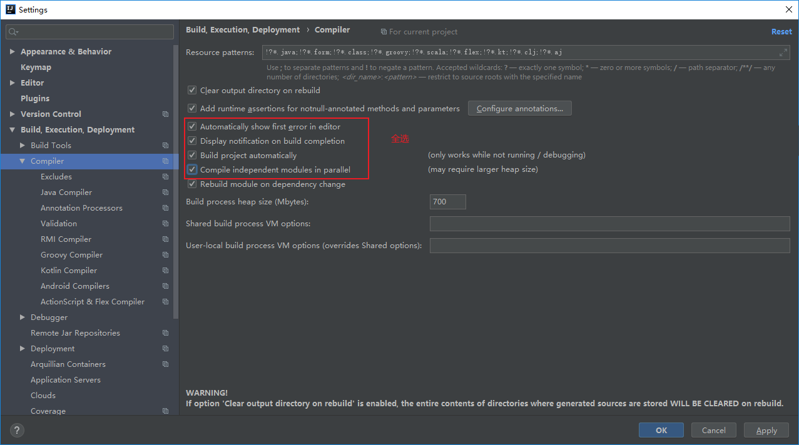

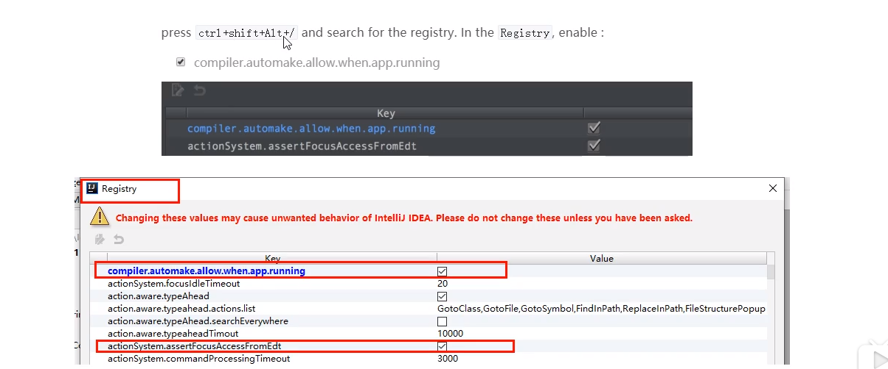


### 4. 创建子模块，order模块

**步骤**

1. 建module
2. 改写pom
3. 写yml
4. 主启动类
5. 业务类

#### 4.1. pom		

#### 4.2. yml配置文件

#### 4.3. 主启动类

#### 4.4. 复制pay模块的实体类,entity类

#### 4.5. 写controller类

​		因为这里是消费者类,主要是消费,那么就没有service和dao,需要调用pay模块的方法

​		并且这里还没有微服务的远程调用,那么如果要调用另外一个模块,则需要使用基本的api调用

使用RestTemplate调用pay模块,

​	


​	将restTemplate注入到容器


编写controller:


### 5. 重构

新建一个模块,将重复代码抽取到一个公共模块中

#### 5.1 创建commons模块

#### 5.2 pom

```xml
<?xml version="1.0" encoding="UTF-8"?>
<project xmlns="http://maven.apache.org/POM/4.0.0"
         xmlns:xsi="http://www.w3.org/2001/XMLSchema-instance"
         xsi:schemaLocation="http://maven.apache.org/POM/4.0.0 http://maven.apache.org/xsd/maven-4.0.0.xsd">
    <parent>
        <artifactId>springcloud_study</artifactId>
        <groupId>com.zimo.springcloud</groupId>
        <version>1.0-SNAPSHOT</version>
    </parent>
    <modelVersion>4.0.0</modelVersion>

    <artifactId>cloud-api-commons</artifactId>

    <dependencies>
        <dependency>
            <groupId>org.springframework.boot</groupId>
            <artifactId>spring-boot-devtools</artifactId>
            <scope>runtime</scope>
            <optional>true</optional>
        </dependency>
        <dependency>
            <groupId>org.projectlombok</groupId>
            <artifactId>lombok</artifactId>
            <optional>true</optional>
        </dependency>
        <!--工具包-->
        <dependency>
            <groupId>cn.hutool</groupId>
            <artifactId>hutool-all</artifactId>
            <version>5.1.0</version>
        </dependency>
    </dependencies>


</project>
```


####  5.3 entity和实体类放入commons中


#### 5.4 使用mavne,将commons模块打包(install)

先跳过test，在clean，最后install

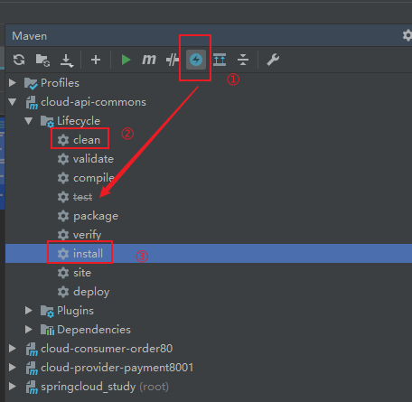

引入坐标到pay模块和order模块中

```xml
<!--引入公用的commons的jar包-->
<dependency>
    <groupId>com.zimo.springcloud</groupId>
    <artifactId>cloud-api-commons</artifactId>
    <version>${project.version}</version>
</dependency>
```

# 服务注册与发现

## Eureka服务注册与发现

### 1.Eureka基础概念

#### **（1）服务治理**

Spring Cloud分装了Netflix公司开发的Eureka模块来实现服务治理

在传统的rpc远程调用框架中，管理每个服务于服务之间依赖关系比较复杂，管理比较复杂，所以需要使用服务治理，管理服务于服务之间依赖关系，可以实现服务调用、负债均衡、容错等，实现服务发现与注册。

#### **（2）服务注册与发现**

Eureka采用了CS的设计架构，Eureka Server作为服务注册功能的服务器，它是服务注册中心，二系统中的其他微服务，使用Eureka的客户端连接到Eureka Server并维持心跳连接。这样系统的维护人员就可以通过Eureka Server来监控系统中各个微服务是否正常运行。

在服务注册与发现中，有一个注册中心，当服务器启动的时候，会把当前自己服务器的信息，比如：服务器通讯地址等以别名方式注册到注册中心上，另一方（消费者|服务提供者），以该别名的方式去注册中心上获取到实际的服务通讯地址，然后再实现本地RPC调用。RPC远程调用框架核心设计思想：在与注册中心，因为注册中心管理每个服务于服务之间的一个依赖关系（服务治理概念）。在任何RPC远程框架中，都会有一个注册中心（存放服务地址相关信息【接口地址】）


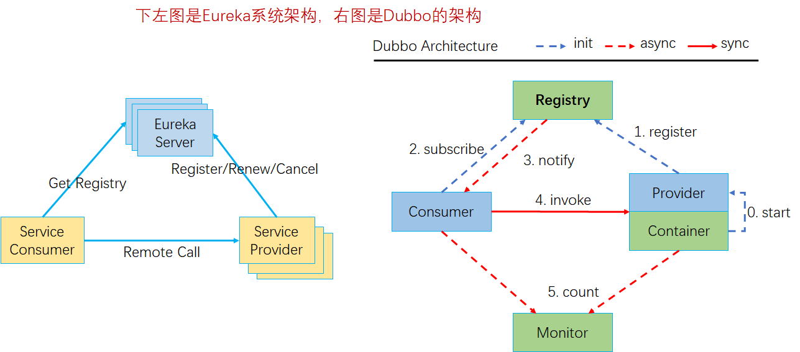

#### **（3）Eureka的两个组件：Eureka Server和Eureka Client**

- **`Eureka Server`提供服务注册服务**
  - 各个微服务节点通过配置启动后，会在Eureka Server中进行注册，这样 Eureka Server中的服务注册表中将会存储所有可用服务节点的信息，服务节点的信息可以在界面中直观看到。
- **`Eureka Client`通过诺注册中心进行访问**
  - 是一个Java客户端，用于简化Eureka Server的交互，客户端同时也具备一个内置的、使用轮询（round-robin)负载算法的负载均衡器。在应用启动后，将会向Eureka Server发送心跳（默认周期为30秒）。如果Eureka Server在多个心跳周期内没有接收到某个节点的心跳，Eureka Server将会从服务注册表汇总把这个服务节点移除（默认90秒）

前面我们没有服务注册中心,也可以服务间调用,为什么还要服务注册?

当服务很多时,单靠代码手动管理是很麻烦的,需要一个公共组件,统一管理多服务,包括服务是否正常运行,等

Eureka用于**==服务注册==**,目前官网**已经停止更新**

​	


### 2. 单机版eureka构建步骤

#### 2.1 创建项目cloud_eureka_server_7001

#### 2.2引入pom依赖

​		eurka最新的依赖变了

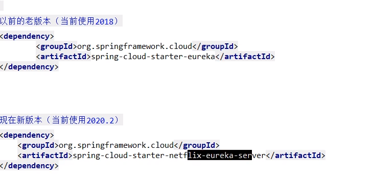

```xml
<?xml version="1.0" encoding="UTF-8"?>
<project xmlns="http://maven.apache.org/POM/4.0.0"
         xmlns:xsi="http://www.w3.org/2001/XMLSchema-instance"
         xsi:schemaLocation="http://maven.apache.org/POM/4.0.0 http://maven.apache.org/xsd/maven-4.0.0.xsd">
    <parent>
        <artifactId>springcloud_study</artifactId>
        <groupId>com.zimo.springcloud</groupId>
        <version>1.0-SNAPSHOT</version>
    </parent>
    <modelVersion>4.0.0</modelVersion>

    <artifactId>cloud-eureka-server7001</artifactId>

    <dependencies>
        <!--eureka server-->
        <dependency>
            <groupId>org.springframework.cloud</groupId>
            <artifactId>spring-cloud-starter-netflix-eureka-server</artifactId>
        </dependency>
        <!--引入自定义的api通用包-->
        <dependency>
            <groupId>com.zimo.springcloud</groupId>
            <artifactId>cloud-api-commons</artifactId>
            <version>${project.version}</version>
        </dependency>
        <!--boot web-->
        <dependency>
            <groupId>org.springframework.boot</groupId>
            <artifactId>spring-boot-starter-web</artifactId>
        </dependency>
        <!--boot actuator-->
        <dependency>
            <groupId>org.springframework.boot</groupId>
            <artifactId>spring-boot-starter-actuator</artifactId>
        </dependency>
        <!--通用配置-->
        <dependency>
            <groupId>org.springframework.boot</groupId>
            <artifactId>spring-boot-devtools</artifactId>
            <scope>runtime</scope>
        </dependency>
        <dependency>
            <groupId>org.projectlombok</groupId>
            <artifactId>lombok</artifactId>
        </dependency>
        <dependency>
            <groupId>org.springframework.boot</groupId>
            <artifactId>spring-boot-starter-test</artifactId>
        </dependency>
    </dependencies>

</project>
```


#### 2.3 配置文件

```yaml
server:
  port: 7001

eureka:
  instance:
    hostname: localhost #eureka服务端的实例名称
  client:
    register-with-eureka: false #false表示不向注册中心注册自己
    fetch-registry: false #false 表示自己端就是注册中心，职责就是维护服务实例，并不需要去检索服务
    service-url:
      # 设置与Eureka Server交互的地址查询服务和注册服务都需要依赖这个地址
      defaultZone: http://${eureka.instance.hostname}:${server.port}/eureka/

```

#### 2.4 主启动类	

```java
package com.zimo.springcloud;

import org.springframework.boot.SpringApplication;
import org.springframework.boot.autoconfigure.SpringBootApplication;
import org.springframework.cloud.netflix.eureka.server.EnableEurekaServer;

/**
 * @author shensr
 * @date 2020/7/16
 **/
@SpringBootApplication
@EnableEurekaServer //启动Eureka Server
public class EurekaMain7001 {
    public static void main(String[] args) {
        SpringApplication.run(EurekaMain7001.class, args);
    }
}

```

#### 2.5 启动项目

启动成功，浏览器访问：http://localhost:7001

#### 2.6 其他服务注册到eureka

比如此时pay模块加入eureka:

##### (1) 主启动类上，加注解，表示当前是eureka客户端

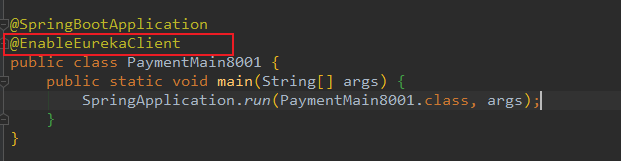

##### （2）修改pom，引入client

```xml
<dependency>
    <groupId>org.springframework.cloud</groupId>
    <artifactId>spring-cloud-starter-netflix-eureka-client</artifactId>
</dependency>
```

##### （3）修改配置文件

添加内容

```yaml
eureka:
  client:
    # 表示是否将自己注册进EurekaServer 默认为true
    register-with-eureka: true
    # 是否从EurekaServer抓取已有的注册信息，默认为true。
    # 单节点无所谓，集群必须设置为true才能配合ribbon使用负载均衡
    fetch-registry: true
    service-url:
      defaultZone: http://localhost:7001/eureka

```

##### （4）pay模块重启，就可以注册到eureka中了


> **order模块的注册是一样的**


### 3. 集群版eureka

#### 3.1 集群原理

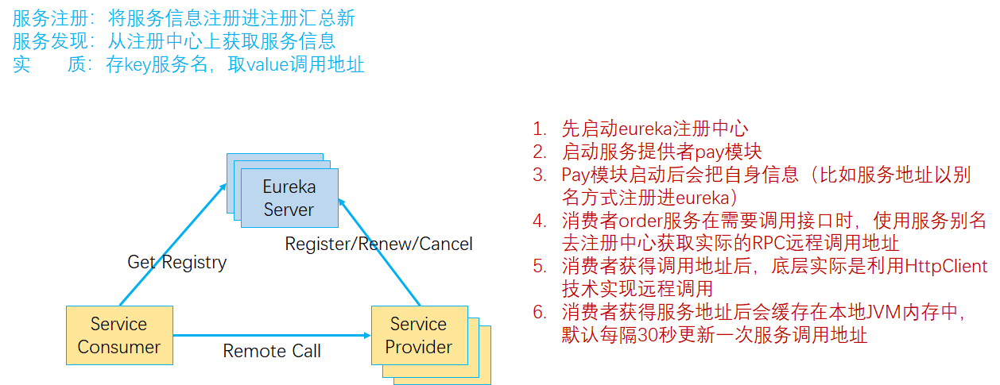

> 1,就是pay模块启动时,注册自己,并且自身信息也放入eureka
> 2.order模块,首先也注册自己,放入信息,当要调用pay时,先从eureka拿到pay的调用地址
> 3.通过HttpClient调用
>  	并且还会缓存一份到本地,每30秒更新一次

**问题：微服务RPC远程调用最核心的 是什么？**

`高可用`。单个注册中心会导致单点故障

解决办法：搭建Eureka注册中心集群，实现`负载均衡+故障容错`


**集群构建原理**

​		`互相注册，相互守望`


#### 3.2 构建新erueka项目

名字:cloud_eureka_server_7002

##### （1）pom文件

​		粘贴7001的即可

##### （2）配置文件

​		在写配置文件前,修改一下主机的hosts文件（C:\Windows\System32\drivers\etc\hosts)


首先修改之前的7001的eureka项目,因为多个eureka需要互相注册


然后修改7002  7002也是一样的,只不过端口和地址改一下

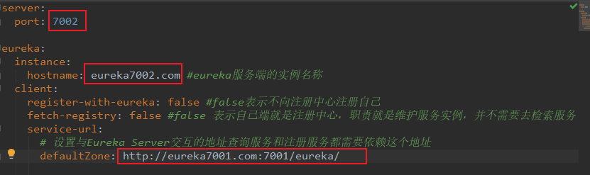

##### （3）主启动类

​		复制7001的即可

##### （4）然后启动7001,7002即可

**


##### （5）将pay,order模块注册到eureka集群中

①只需要修改配置文件即可

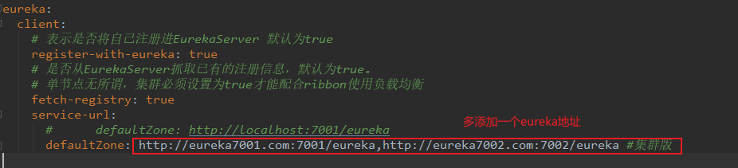

②两个模块都修改上面的都一样即可

​			然后启动两个模块

​			要先启动7001，7002 --> 然后是pay模块8001 --> 然后是order(80)


#### 3.3将pay模块也配置为集群模式:

##### （1）创建新模块，端口8002

​	名称: cloud-provider-payment8002

##### （2）pom文件，复制8001的

##### （3）application.yml配置文件复制8001的

​		端口修改一下,改为8002

​		服务名称不用改,用一样的

##### （4）主启动类,复制8001的

​		修改名称为：PaymentMain8002

##### （5）mapper,service,controller都复制一份

​		然后就启动服务即可

​		此时访问order模块，发现并没有负载均衡到两个pay模块中,而是只访问8001

​		虽然我们是使用RestTemplate访问的微服务，但是也可以负载均衡的

​		我们在order服务（80端口）中修改controller和ApplicationContextConfig两个类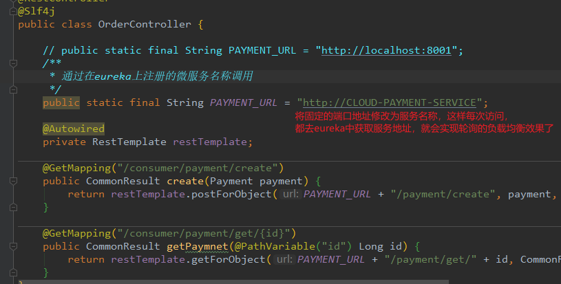

**注意这样还不可以,需要让RestTemplate开启负载均衡注解,还可以指定负载均衡算法,默认轮询**

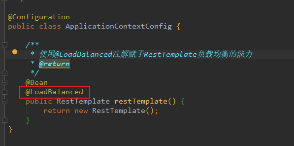


### 4. actuator微服务信息完善

 修改服务主机名和ip在eureka的web上显示，比如修改pay模块，修改配置文件即可


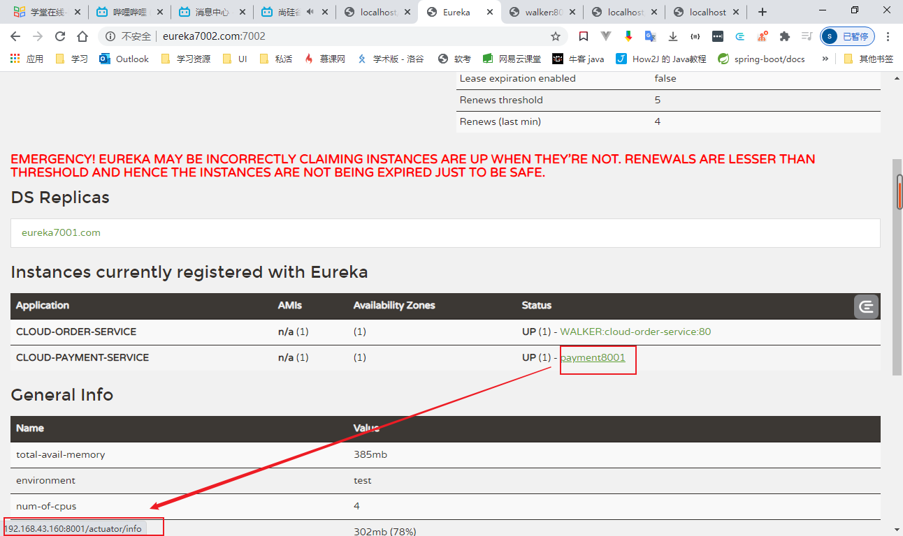


### 5. eureka服务发现Discovery

**功能：**对于注册进Eureka里边的微服务，可以通过服务发现来获得该服务的信息。

以Cloud-provider-payment8001模块为例

#### 5.1 首先添加一个注解，在controller中


#### 5.2 在主启动类上添加一个注解


**然后重启8001.访问/payment/discovery**

### 6. Eureka自我保护

#### 6.1 故障现象

保护模式主要用于一组客户端和Eureka Server之间存在网络分区场景下的保护。一旦进入保护模式，**Eureka Server将会尝试保护其服务注册表上的信息，不再删除服务注册表中的数据，也就是不会注销任何微服务。**

如果在Eureka Server的首页看到了一下这段提示，则说明Eureka进入了保护模式：

`EMERGENCY! EUREKA MAY BE INCORRECTLY CLAIMING INSTANCES ARE UP WHEN THEY'RE NOT. RENEWALS ARE LESSER THAN THRESHOLD AND HENCE THE INSTANCES ARE NOT BEING EXPIRED JUST TO BE SAFE.`

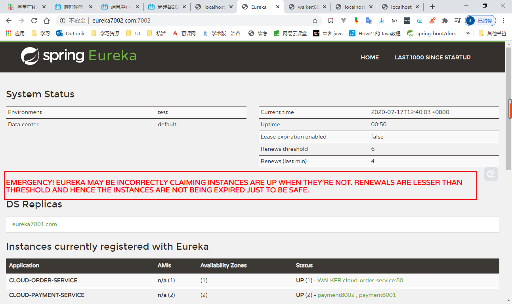

#### 6.2 导致原因

`某时刻某一个微服务不可用了，Eureka不会立即清除，依旧会对该微服务的信息进行保存`

**属于CAP里边的AP分支**


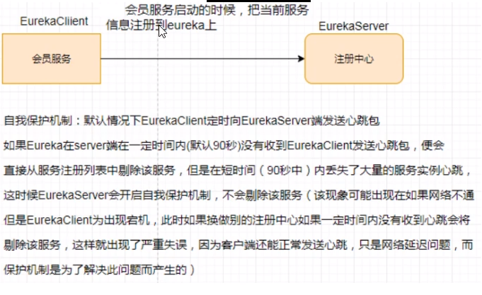


**关闭自我保护机制**

**eureka服务端配置:**


​			**设置接受心跳时间间隔**


**客户端(比如pay模块):**


**此时启动erueka和pay.此时如果直接关闭了pay,那么erueka会直接删除其注册信息**


## Zookeeper服务注册与发现（用的比较少）

### 1. 启动zookeeper，到linux上

进入zookeeper的bin目录，

```shell
#启动
./zkServer.sh start
#停止
./zkServer.sh stop
```

### 2. 创建新的pay模块

单独用于注册到zk中  

名字 : cloud-provider-payment8004

#### 2.1 pom依赖

```xml
<?xml version="1.0" encoding="UTF-8"?>
<project xmlns="http://maven.apache.org/POM/4.0.0"
         xmlns:xsi="http://www.w3.org/2001/XMLSchema-instance"
         xsi:schemaLocation="http://maven.apache.org/POM/4.0.0 http://maven.apache.org/xsd/maven-4.0.0.xsd">
    <parent>
        <artifactId>springcloud_study</artifactId>
        <groupId>com.zimo.springcloud</groupId>
        <version>1.0-SNAPSHOT</version>
    </parent>
    <modelVersion>4.0.0</modelVersion>

    <artifactId>cloud-provider-payment8004</artifactId>

    <dependencies>
        <!--引入公用的commons的jar包-->
        <dependency>
            <groupId>com.zimo.springcloud</groupId>
            <artifactId>cloud-api-commons</artifactId>
            <version>${project.version}</version>
        </dependency>
        <!--web-->
        <dependency>
            <groupId>org.springframework.boot</groupId>
            <artifactId>spring-boot-starter-web</artifactId>
        </dependency>
        <!--监控-->
        <dependency>
            <groupId>org.springframework.boot</groupId>
            <artifactId>spring-boot-starter-actuator</artifactId>
        </dependency>
        <!--mybatis-->
        <dependency>
            <groupId>org.mybatis.spring.boot</groupId>
            <artifactId>mybatis-spring-boot-starter</artifactId>
        </dependency>
        <dependency>
            <groupId>com.alibaba</groupId>
            <artifactId>druid-spring-boot-starter</artifactId>
            <version>1.1.10</version>
            <!--如果没写版本,从父层面找,找到了就直接用,全局统一-->
        </dependency>

        <!--mysql-connector-java-->
        <dependency>
            <groupId>mysql</groupId>
            <artifactId>mysql-connector-java</artifactId>
        </dependency>
        <!--jdbc-->
        <dependency>
            <groupId>org.springframework.boot</groupId>
            <artifactId>spring-boot-starter-jdbc</artifactId>
        </dependency>

        <!--热部署-->
        <dependency>
            <groupId>org.springframework.boot</groupId>
            <artifactId>spring-boot-devtools</artifactId>
            <scope>runtime</scope>
            <optional>true</optional>
        </dependency>
        <dependency>
            <groupId>org.projectlombok</groupId>
            <artifactId>lombok</artifactId>
            <optional>true</optional>
        </dependency>
        <dependency>
            <groupId>org.springframework.boot</groupId>
            <artifactId>spring-boot-starter-test</artifactId>
            <scope>test</scope>
        </dependency>
        <!--zookeeper-->
        <dependency>
            <groupId>org.springframework.cloud</groupId>
            <artifactId>spring-cloud-starter-zookeeper-discovery</artifactId>
            <!--排除自带的3.5.3.beta版本-->
            <exclusions>
                <exclusion>
                    <groupId>org.apache.zookeeper</groupId>
                    <artifactId>zookeeper</artifactId>
                </exclusion>
            </exclusions>
        </dependency>
        <!--添加zookeeper3.4.13版本-->
        <dependency>
            <groupId>org.apache.zookeeper</groupId>
            <artifactId>zookeeper</artifactId>
            <version>3.4.13</version>
        </dependency>
    </dependencies>

</project>
```


#### 2.2 配置文件


```yaml
# 8004表示注册到zookeeper服务器的支付服务提供者端口号
server:
  port: 8004


spring:
  application:
    name: cloud-payment-service
  datasource:
    # 当前数据源操作类型
    type: com.alibaba.druid.pool.DruidDataSource
    # mysql驱动类
    driver-class-name: com.mysql.jdbc.Driver
    url: jdbc:mysql://localhost:3306/db2019?useUnicode=true&characterEncoding=UTF-8&useSSL=false&serverTimezone=GMT%2B8
    username: root
    password: 123456
  # zookeeper
  cloud:
    zookeeper:
      connect-string: 112.74.166.69:2181

mybatis:
  mapper-locations: classpath:mapper/*.xml
  #它一般对应我们的实体类所在的包，这个时候会自动取对应包中不包括包名的简单类名作为包括包名的别名。多个package之间可以用逗号或者分号等来进行分隔（value的值一定要是包的全）
  type-aliases-package: com.zimo.springcloud.entities

```

#### 2.3 主启动类

```java
/**
 * 注解@EnableDiscoveryClient用于向使用consul或zookeeper作为注册中心时注册服务
 * @author shensr
 * @date 2020/7/17
 **/

@SpringBootApplication
@EnableDiscoveryClient
public class PaymentMain8004 {
    public static void main(String[] args) {
        SpringApplication.run(PaymentMain8004.class,args);
    }
}
```

#### 2.4 controller

```java
@RestController
@Slf4j
public class PaymentController {

    @Value("${server.port}")
    private String serverPort;


    @RequestMapping("/payment/zk")
    public String paymentZookeeper() {
        return "Spring Cloud with zookeeper:" + serverPort + "\t" + UUID.randomUUID().toString();
    }


}
```

#### 2.5 然后就可以启动

**此时启动,会报错,因为jar包与我们的zk版本不匹配**

解决:
		修改pom文件,改为与我们zk版本匹配的jar包

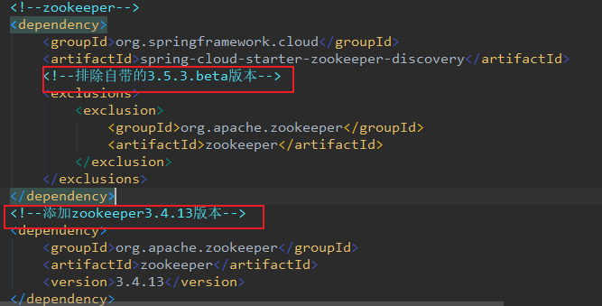

**此时8003就注册到zk中了**

> 我们在zk上注册的node是临时节点,当我们的服务一定时间内没有发送心跳
>   	那么zk就会`将这个服务的node删除了

## Consul服务注册与发现

### 1.  简介

#### 1.1是什么

consul是一套开源的分布式服务发现和配置管理系统，由HashiCorp公司用Go语言开发

提供了微服务系统中的服务治理、配置中心、控制总线等功能。这些功能中的`每一个都可以根据需要单独使用`，也可以一起使用来构建全方位的服务网络，总之Consul提供了一种完整的服务网络解决方案。

它具有很多优点。包括：基于raft协议，比较简洁；支持健康检查，同时支持http和DNS协议；支持跨数据中心的WAN集群；提供图形界面；跨平台，支持Linux、Mac、Windows

#### 1.2 能干什么

**服务发现** 提供HTTP和DNS两种发现方式

**健康监测** 支持多种方式，HTTP、TCP、Docker、Shell脚本定制化

**KV存储**     Key、Value的存储方式

**多数据中心** Consul支持多数据中心

**可视化Web界面** 

#### 1.2 在哪下载

[https://www.consul.io/downloads.html](https://www.consul.io/downloads.html)

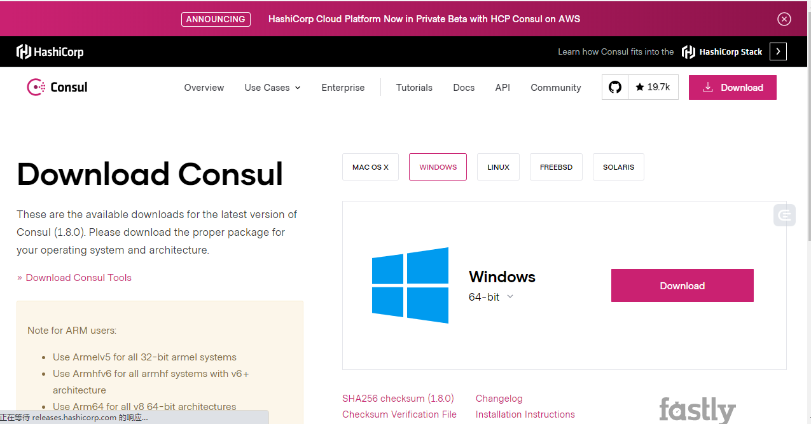

#### 1.4 怎么玩

中文教程哦

[https://www.springcloud.cc/spring-cloud-consul.html](https://www.springcloud.cc/spring-cloud-consul.html)

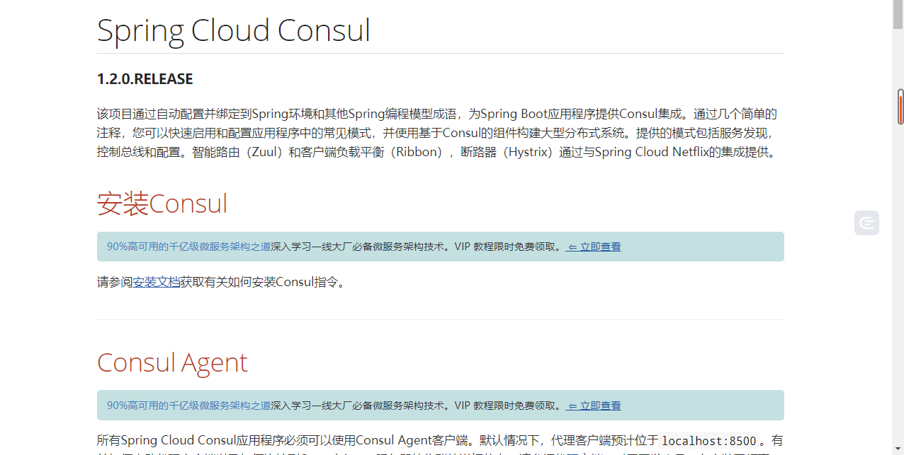

### 2. 安装并运行Consul

#### 2.1 官网安装说明

[https://learn.hashicorp.com/consul/getting-started/install.html](https://learn.hashicorp.com/consul/getting-started/install.html)

在`1.2`下载完毕后只有一个`consul.exe`文件，硬盘路径下双击运行，查看版本信息

`consul -version` 

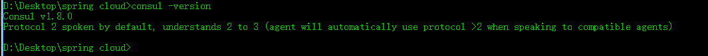

#### 2.2 使用开发模式启动

启动：`consul agent -dev` 

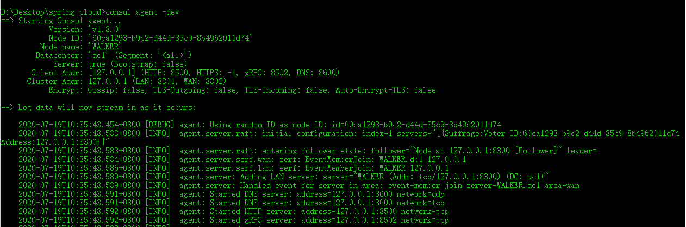

通过以下地址可以访问Consul的首页：http://localhost:8500

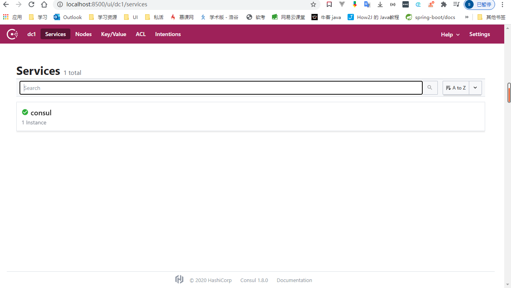

### 3. 创建新的pay模块，端口8006

#### 3.1项目名字

cloud-provider-consul-payment8006

#### 3.2 pom依赖

```xml
<?xml version="1.0" encoding="UTF-8"?>
<project xmlns="http://maven.apache.org/POM/4.0.0"
         xmlns:xsi="http://www.w3.org/2001/XMLSchema-instance"
         xsi:schemaLocation="http://maven.apache.org/POM/4.0.0 http://maven.apache.org/xsd/maven-4.0.0.xsd">
    <parent>
        <artifactId>springcloud_study</artifactId>
        <groupId>com.zimo.springcloud</groupId>
        <version>1.0-SNAPSHOT</version>
    </parent>
    <modelVersion>4.0.0</modelVersion>

    <artifactId>cloud-provider-consul-payment8006</artifactId>
    <dependencies>
        <!--SpringCloud consul server-->
        <dependency>
            <groupId>org.springframework.cloud</groupId>
            <artifactId>spring-cloud-starter-consul-discovery</artifactId>
        </dependency>
        <!--引入公用的commons的jar包-->
        <dependency>
            <groupId>com.zimo.springcloud</groupId>
            <artifactId>cloud-api-commons</artifactId>
            <version>${project.version}</version>
        </dependency>
        <!--web-->
        <dependency>
            <groupId>org.springframework.boot</groupId>
            <artifactId>spring-boot-starter-web</artifactId>
        </dependency>
        <!--监控-->
        <dependency>
            <groupId>org.springframework.boot</groupId>
            <artifactId>spring-boot-starter-actuator</artifactId>
        </dependency>

        <!--热部署-->
        <dependency>
            <groupId>org.springframework.boot</groupId>
            <artifactId>spring-boot-devtools</artifactId>
            <scope>runtime</scope>
            <optional>true</optional>
        </dependency>
        <dependency>
            <groupId>org.projectlombok</groupId>
            <artifactId>lombok</artifactId>
            <optional>true</optional>
        </dependency>
        <dependency>
            <groupId>org.springframework.boot</groupId>
            <artifactId>spring-boot-starter-test</artifactId>
            <scope>test</scope>
        </dependency>
    </dependencies>


</project>
```


#### 3.3 配置文件

```yaml
#consul服务端口号
server:
  port: 8006

spring:
  application:
    name: consul-provider-payment
  cloud:
    consul:
      host: localhost
      port: 8500
      discovery:
        service-name: ${spring.application.name}

```

#### 3.4 主启动类

```java
@SpringBootApplication
@EnableDiscoveryClient
public class PaymentMain8006 {
    public static void main(String[] args) {
        SpringApplication.run(PaymentMain8006.class,args);
    }
}

```

#### 3.5 controller

```java
@RestController
@Slf4j
public class PaymentController {

    @Value("${server.port}")
    private String serverPort;


    @RequestMapping("/payment/consul")
    public String paymentZookeeper() {
        return "Spring Cloud with consul:" + serverPort + "\t" + UUID.randomUUID().toString();
    }
}
```

#### 3.6 启动服务

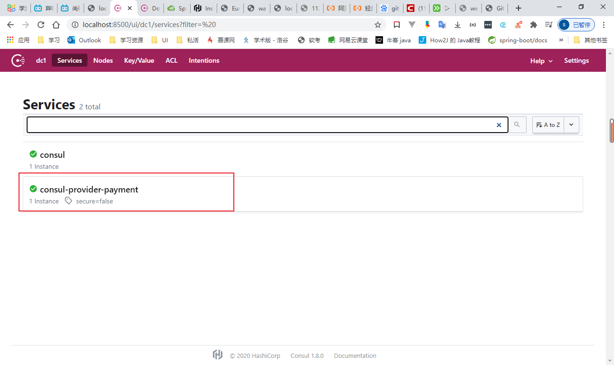


### 4. 创建新order模块

cloud-consul-order-80


#### 4.1 pom文件

同`3.2`

#### 4.2 配置文件

```yaml
server:
  port: 80
  
spring:
  application:
    name: cloud-consumer-order
  cloud:
    consul:
      host: localhost
      port: 8500
      discovery:
        service-name: ${spring.application.name}

```


#### 4.3 主启动类

```java
@SpringBootApplication
@EnableDiscoveryClient
public class OrderMain80 {
    public static void main(String[] args) {
        SpringApplication.run(OrderMain80.class, args);
    }
}
```

#### 4.4 RestTemplate注册

```java
@Component
public class ApplicationContextConfig {

    @Bean
    @LoadBalanced
    public RestTemplate restTemplate(){
        return new RestTemplate();
    }
}

```

#### 4.5 controller


#### 4.6 启动服务，测试

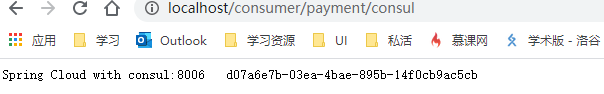

## 三个注册中心的异同

| 组件名    | 语言 | CAP  | 服务健康检查 | 对外暴露接口 | Spring Cloud集成 |
| --------- | ---- | ---- | ------------ | ------------ | ---------------- |
| Eureka    | Java | AP   | 可配支持     | HTTP         | 已集成           |
| Consul    | Go   | CP   | 支持         | HTTP/DNS     | 已集成           |
| Zookeeper | Java | CP   | 支持         | 客户端       | 已集成           |

#### 1. AP架构

当网络分区出现后，为了保证可用性，系统B`可以返回旧值`，保证系统的可用性。

`结论：违背了一致性C的要求，只满足可用性和分区容错性，即AP`

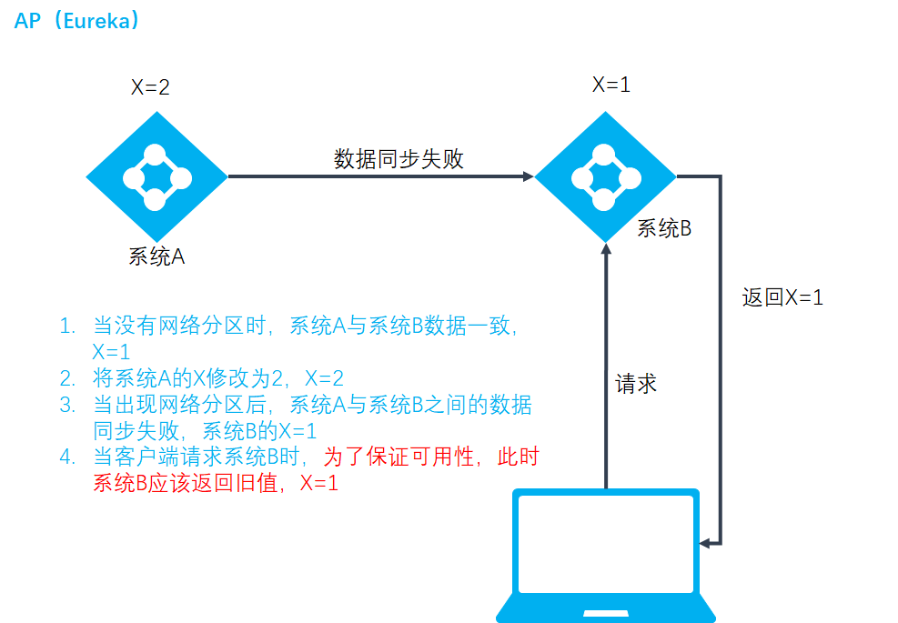

#### 2. CP架构

当网络分区出现后，为了保证一致性，就必须拒绝请求，否则无法保证一致性

`结论：违背了可用性A的要求，只要满足一致性和分区容错性，即CP`

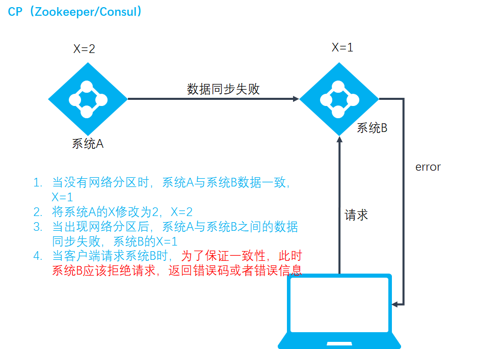


补充：

**CAP**

`C：COnsistency（强一致性）`

`A：Availability（可用性）`

`P：Partition tolerance（分区容错性）`

CAP理论 关注粒度是数据，而不是整体系统设计的策略

分布式系统，P永远都要保证，即要么是AP要么是CP，RDBMS是AC

# 服务调用

## 1. Ribbon负载均衡服务调用

### 1.1 概述

##### 是什么

Spring Cloud Ribbon是基于Netflix Ribbon实现的一套`客户端 负载均衡的工具`。

Ribbon是Net发离线发布的开源项目，主要功能是提供`客户端的软件负载均衡算法和服务调用`。Ribbon客户端组件提供一系列完善的配置项如连接超时、重试等。简单的说，就是在配置文件中列出Load Balancer(简称LB)后面所有的机器，Ribbon会自动的帮助你基于某种规则（如简单轮询，随机连接等）去连接这些机器。我们很容易使用Ribbon实现自定义的负载均衡算法。

##### 官网资料

[https://github.com/Netflic/ribbon/wiki/Getting-Started](https://github.com/Netflic/ribbon/wiki/Getting-Started)


`Ribbon目前也进入维护,基本上不准备更新了`

未来替换方案： Spring Cloud Loadbalancer

##### 能干嘛

- LB（负载均衡）

  - 集中式LB

    即在服务的消费方和提供方之间使用独立的LB设施（可以是硬件，如F5，也可以是软件，如Nginx），由该设施负责把访问请求通过某种策略发至服务的提供方

  - 进程内LB（本地负载均衡）

    将LB逻辑集成到消费方，消费方从服务注册中心获知有哪些地址可用，然后自己再从这些地址中选择出一个合适的服务器。

    `Ribbon就属于进程内LB`，它只是一个类库，集成与消费方进程，消费方通过它来获取服务提供方的地址。

`负载均衡+RestTemplate调用`

#### 补充

`LB负载均衡（Load Balance）是什么`

将用户请求平摊的分配到多个服务上，从而达到系统的HA（高可用）

常见的负载均衡软件有Nginx、LVS，硬件F5等

`Ribbon本地负载均衡客户端 VS Nginx服务端负载均衡`

- Nginx是服务器说负载均衡，客户端所有请求都会交给nginx，然后由nginx实现转发请求。即负载均衡是由服务端实现的。
- Ribbon本地负载均衡，在调用微服务接口的时候，会在注册中心上获取注册信息服务列表之后缓存到JVM本地，从而在本地实现RPC远程服务调用技术。

### 1.2Ribbon负载均衡演示

#### 架构说明

Ribbon就是一个软负载均衡的客户端组件，他可以和其他所需请求的客户端结合使用，和eureka结合只是其中的一个实例。

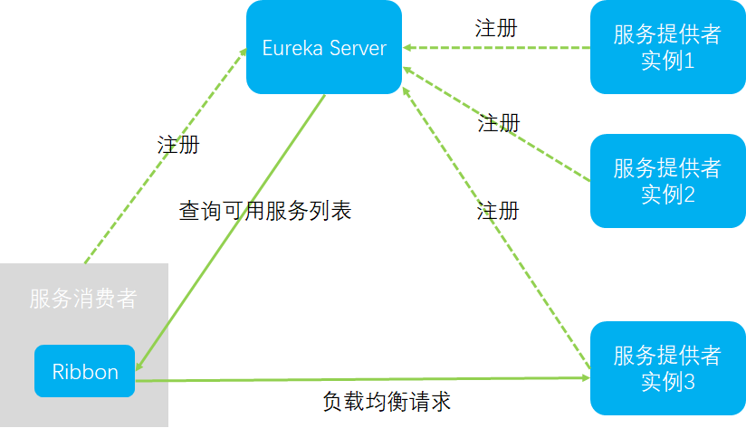


Ribbon在工作时分两步

- 第一步选择EurekaServer，它优先选择在同一个区域内负载少的Server。
- 第二步在根据用户指定的策略，在从server取到的服务注册列表中选择一个地址。其中Ribbon提供了多种策略：比如轮询、随机和根据相应时间加权。

#### Ribbon坐标说明

##### 默认我们使用eureka的新版本时,它默认集成了ribbon

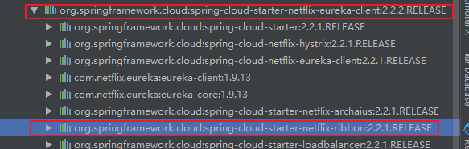


##### 我们也可以手动引入ribbon

**放到order模块中,因为只有order访问pay时需要负载均衡**


#### RestTemplate类的使用

getForObject方法/getForEntity方法

- `getForObject`：返回对象为响应体中数据转化成的对象，基本上可以理解为Json
- `getForEntity`：返回对象为ResponseEntity对象，包含了相应中的一些重要信息，比如响应头，响应状态码，响应体等

postForObject方法/postForEntity方法

GET请求方法

POST请求方法

> RestTemplate的:
> 		xxxForObject()方法,返回的是响应体中的数据
>     xxxForEntity()方法.返回的是entity对象,这个对象不仅仅包含响应体数据,还包含响应体信息(状态码等)
>
> is2xxSuccessful()等方法用来判断是否成功等


#### Ribbon核心组件IRule

##### IRule接口,Riboon使用该接口,根据特定算法从所有服务中,选择一个服务

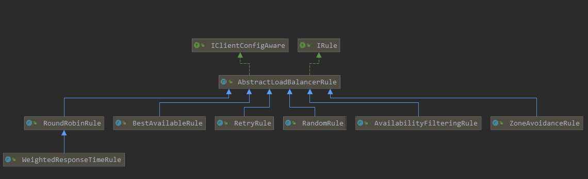

**Rule接口有7个实现类,每个实现类代表一个负载均衡算法**

- `com.netflix.loadbalancer.RoundRobinRule` 轮询
- `com.netflix.loadbalancer.RandomRule` 随机
- `com.netflix.loadbalancer.RetryRule` 先按照RoundRObinRule(轮询)的策略获取服务，如果获取服务失败则在指定时间内会进行重试，获取可用的服务
- `WeightedResponseTimeRule` 对RoundRobinRule的扩展，响应速度快的实例选择权重越大，越容易被选择
- `com.netflix.loadbalancer.BestAvailableRule` 会先过滤掉由于次数访问故障而处于断路器跳闸状态的服务，然后选择一个并发量最小的服务
- `com.netflix.loadbalancer.AvailabilityFilteringRule` 先过滤掉故障实例，在选择并发量较小的实例
- `com.netflix.loadbalancer.ZoneAvoidanceRule` 默认规则，复合判断server所在区域的性能和server的可用性选择服务器

##### 如何替换

`注意配置细节`

官方文档明确给出了警告：

**这个自定义配置类不能放在`@ComponentScan`所扫描的当前包下以及子包下，否则我们弟子你故意的这个配置类就会被所有的Ribbon客户端所共享，达不到特殊化定制的目的，`也就是不能放在主启动类所在的包及子包下`**

(1)修改order模块


(2)额外创建一个包，不能在OrderMain80所在的包及其子包下，因为@SpringBootApplication注解中包含了@ComponentScan注解

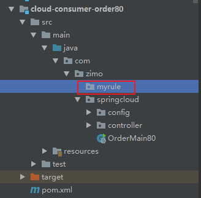

（3）在myrule包下创建配置类，指定负载均衡算法

```java
@Configuration
public class MySelfRule {
    /**
     * 定义为随机
     *
     * @return
     */
    @Bean
    public IRule myRule() {
        return new RandomRule();
    }
}
```


（4）在主启动类上加一个注解@RibbonClient

```java
@SpringBootApplication
@EnableEurekaClient
@RibbonClient(name = "CLOUD-PAYMENT-SERVICE",configuration = MySelfRule.class)
public class OrderMain80 {
    public static void main(String[] args) {
        SpringApplication.run(OrderMain80.class, args);
    }
}
```


**`@RibbonClient(name = "CLOUD-PAYMENT-SERVICE",configuration = MySelfRule.class)`表示,访问CLOUD_PAYMENT_SERVICE的服务时,使用我们自定义的负载均衡算法**

启动


#### 自定义负载均衡算法:

##### 1,ribbon的轮询算法原理


##### 2,自定义负载均衡算法:

**1,给**pay模块(8001,8002),的controller方法添加一个方法,返回当前节点端口


**2,修改order模块**

去掉@LoadBalanced


##### 3,自定义接口


​					==具体的算法在实现类中实现==

##### 4,接口实现类


##### 5,修改controller:


##### 6,启动服务,测试即可	


## 11,OpenFeign


**是一个声明式的web客户端,只需要创建一个接口,添加注解即可完成微服务之间的调用**


==就是A要调用B,Feign就是在A中创建一个一模一样的B对外提供服务的的接口,我们调用这个接口,就可以服务到B==


### **Feign与OpenFeign区别**


### 使用OpenFeign

```java
之前的服务间调用,我们使用的是ribbon+RestTemplate
		现在改为使用Feign
```

#### 1,新建一个order项目,用于feign测试

名字cloud_order_feign-80

#### 2,pom文件

#### 3,配置文件


#### 4,主启动类


#### 5,fegin需要调用的其他的服务的接口


#### 6,controller


#### 7测试:

启动两个erueka(7001,7002)

启动两个pay(8001,8002)

启动当前的order模块


**Feign默认使用ribbon实现负载均衡**


### OpenFeign超时机制:

==OpenFeign默认等待时间是1秒,超过1秒,直接报错==

#### 1,设置超时时间,修改配置文件:

**因为OpenFeign的底层是ribbon进行负载均衡,所以它的超时时间是由ribbon控制**


### OpenFeign日志:


**OpenFeign的日志级别有:**


#### 	1,使用OpenFeign的日志:

**实现在配置类中添加OpenFeign的日志类**


#### 2,为指定类设置日志级别:


**配置文件中:**


#### 	3,启动服务即可

