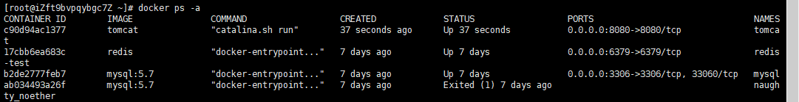
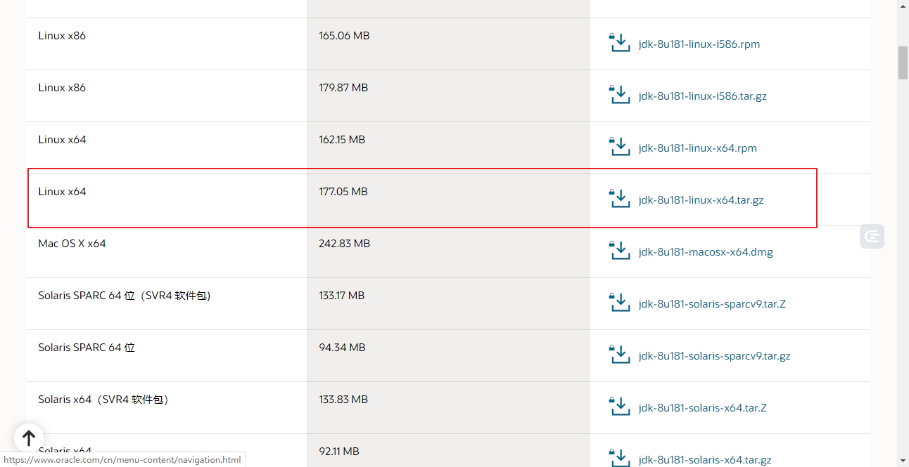
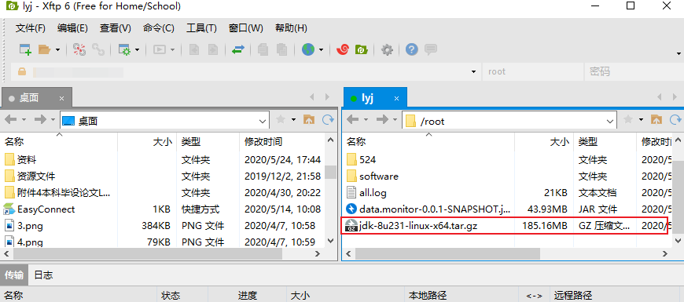

# 常用软件安装

[TOC]

## Docker安装

### 确定是centos7的版本

```shell
[root@iz2zebtgnlb4lh8uipvu6uz ~]# cat /etc/redhat-release 
CentOS Linux release 7.3.1611 (Core) 

```

### yum安装gcc相关

```shell
1，确定centos7能上外网
2，yum -y install gcc
3，yum -y install gcc-c++
```

### 卸载旧版本

```shell

$ sudo yum remove docker \
                  docker-client \
                  docker-client-latest \
                  docker-common \
                  docker-latest \
                  docker-latest-logrotate \
                  docker-logrotate \
                  docker-engine

```

### 安装方法

```shell
yum install docker
```

### 启动docker

```shell
systemctl start docker
```

### 停止docker

```shell
systemctl stop docker
```

### 查看版本

```shell
docker version
```

### 卸载docker

```shell
systemctl stop docker
yum -y remove docker
rm -rf /var/lib/docker
```


### 查看容器

```shell
docker ps -a
```



### 移除容器

```shell
docker rm e8f0e6dd3b90 #e8f0e6dd3b90 为 docker ps -a 中CONTAINER ID
```

### 进入容器

```shell
docker exec -it app bash #app 为容器的名称  如mysql等 --name 设置的
```


## JDK安装

### 下载JDK

[http://www.oracle.com/technetwork/java/javase/downloads/jdk8-downloads-2133151.html](http://www.oracle.com/technetwork/java/javase/downloads/jdk8-downloads-2133151.html)



### 使用XFTP工具导入linux



### 解压到/root/software目录

```shell
mkdir /root/software   #在root下面创建software目录
tar -zxvf  jdk-8u181-linux-x64.tar.gz -C /root/software #解压到指定目录
```

### 配置环境变量并测试

打开控制台，运行`$ sudo vi /etc/profile`，**在最后插入下面要配置的内容** ，按Esc键 ，输入( :wq 保存并退出)  

```shell
JAVA_HOME=/root/software/jdk1.8.0_231
PATH=$JAVA_HOME/bin:$PATH
CLASSPATH=.:$JAVA_HOME/lib/dt.jar:$JAVA_HOME/lib/tools.jar
export JAVA_HOME
export PATH
export CLASSPATH
```

让环境变量生效，执行下面的命令

```shell
source /etc/profile
```

验证

```shell
[root@iZft9bvpqybgc7Z log]# java -version
java version "1.8.0_231"
Java(TM) SE Runtime Environment (build 1.8.0_231-b11)
Java HotSpot(TM) 64-Bit Server VM (build 25.231-b11, mixed mode)
```


## Tomcat安装

### Docker安装

docker hub上查找tomcat镜像  docker search tomcat