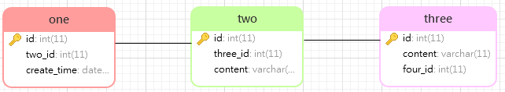

# Explain笔记


[TOC]


## Explain作用

当`Explain` 与 `SQL`语句一起使用时，`MySQL` 会显示来自优化器关于SQL执行的信息。也就是说，`MySQL`解释了它将如何处理该语句，包括如何连接表以及什么顺序连接表等。

- 表的加载顺序
- `sql` 的查询类型
- 可能用到哪些索引，哪些索引又被实际使用
- 表与表之间的引用关系
- 一个表中有多少行被优化器查询 .....

## Explain字段信息

`Explain` 执行计划包含字段信息如下：分别是 `id`、`select_type`、`table`、`partitions`、`type`、`possible_keys`、`key`、`key_len`、`ref`、`rows`、`filtered`、`Extra` 12个字段。


### 以5.7.23版本为例

```sql
mysql> select version() from dual;
+-----------+
| version() |
+-----------+
| 5.7.23    |
+-----------+
1 row in set (0.00 sec)
```

### 字段详解

我们创建三张表 `one`、`two`、`three`，表之间的关系 `one.two_id = two.two_id AND two.three_id = three.three_id`。建表语句在文字末尾



### **1. id**

`id` ：表示查询中执行select子句或者操作表的顺序，**`id`的值越大，代表优先级越高，越先执行**。`id`大致会出现 3种情况

#### 1.1  `id`相同

看到三条记录的`id`都相同，可以理解成这三个表为一组，具有同样的优先级，执行顺序由上而下，具体顺序由优化器决定。

```sql
mysql> EXPLAIN SELECT * FROM one o,two t, three r WHERE o.two_id = t.id AND t.three_id = r.id;
+----+-------------+-------+------------+--------+---------------+---------+---------+--------------------------+------+----------+-------------+
| id | select_type | table | partitions | type   | possible_keys | key     | key_len | ref                      | rows | filtered | Extra       |
+----+-------------+-------+------------+--------+---------------+---------+---------+--------------------------+------+----------+-------------+
|  1 | SIMPLE      | o     | NULL       | ALL    | NULL          | NULL    | NULL    | NULL                     |    1 |   100.00 | Using where |
|  1 | SIMPLE      | t     | NULL       | eq_ref | PRIMARY       | PRIMARY | 4       | explain_study.o.two_id   |    1 |   100.00 | Using where |
|  1 | SIMPLE      | r     | NULL       | eq_ref | PRIMARY       | PRIMARY | 4       | explain_study.t.three_id |    1 |   100.00 | NULL        |
+----+-------------+-------+------------+--------+---------------+---------+---------+--------------------------+------+----------+-------------+
3 rows in set, 1 warning (0.01 sec)
```

#### 1.2 `id`不同

如果我们的 `SQL` 中存在子查询，那么 `id`的序号会递增，`id`值越大优先级越高，越先被执行 。当三个表依次嵌套，发现最里层的子查询 `id`最大，最先执行。

```sql
mysql> EXPLAIN select * from one o where o.two_id = (select t.id from two t where t.three_id = (select r.id  from three r where r.content='我是第三表'));
+----+-------------+-------+------------+------+---------------+------+---------+------+------+----------+-------------+
| id | select_type | table | partitions | type | possible_keys | key  | key_len | ref  | rows | filtered | Extra       |
+----+-------------+-------+------------+------+---------------+------+---------+------+------+----------+-------------+
|  1 | PRIMARY     | o     | NULL       | ALL  | NULL          | NULL | NULL    | NULL |    1 |   100.00 | Using where |
|  2 | SUBQUERY    | t     | NULL       | ALL  | NULL          | NULL | NULL    | NULL |    1 |   100.00 | Using where |
|  3 | SUBQUERY    | r     | NULL       | ALL  | NULL          | NULL | NULL    | NULL |    1 |   100.00 | Using where |
+----+-------------+-------+------------+------+---------------+------+---------+------+------+----------+-------------+
3 rows in set, 1 warning (0.01 sec)
```

#### 1.3 以上两种同时存在

将上边的 `SQL` 稍微修改一下，增加一个子查询，发现 `id`的以上两种同时存在。相同`id`划分为一组，这样就有三个组，**同组的从上往下顺序执行，即本例中先执行 o**，不同组 `id`值越大，优先级越高，越先执行。

```sql
mysql> EXPLAIN select * from one o where o.two_id = (select t.id from two t where t.three_id = (select r.id  from three r where r.content='我是第三表')) AND o.id in(select id from one where o.content="我是第一表");
+----+-------------+-------+------------+--------+---------------+---------+---------+--------------------+------+----------+-------------+
| id | select_type | table | partitions | type   | possible_keys | key     | key_len | ref                | rows | filtered | Extra       |
+----+-------------+-------+------------+--------+---------------+---------+---------+--------------------+------+----------+-------------+
|  1 | PRIMARY     | o     | NULL       | ALL    | PRIMARY       | NULL    | NULL    | NULL               |    1 |   100.00 | Using where |
|  1 | PRIMARY     | one   | NULL       | eq_ref | PRIMARY       | PRIMARY | 4       | explain_study.o.id |    1 |   100.00 | Using index |
|  2 | SUBQUERY    | t     | NULL       | ALL    | NULL          | NULL    | NULL    | NULL               |    1 |   100.00 | Using where |
|  3 | SUBQUERY    | r     | NULL       | ALL    | NULL          | NULL    | NULL    | NULL               |    1 |   100.00 | Using where |
+----+-------------+-------+------------+--------+---------------+---------+---------+--------------------+------+----------+-------------+
4 rows in set, 2 warnings (0.01 sec)
```

### 2. select_type

`select_type`：表示 `select` 查询的类型，主要是用于区分各种复杂的查询，例如：`普通查询`、`联合查询`、`子查询`等。

*常见的取值有SIMPLE（简单表，即不使用表连接或者子查询）、PRIMARY（主查询，即外层的查询）、UNION（UNION中的第二个或者后面的查询语句）、SUBQUERY（子查询中的第一个SELECT）等。*

##### 2.1 SIMPLE

`SIMPLE`：最简单的 select 查询语句，不包含`子查询`或者 `union`交并差集等操作。

##### 2.2 PRIMARY

`PRIMARY`：当查询语句中包含任何复杂的子部分，最外层查询则被标记为`PRIMARY`。

##### 2.3 SUBQUERY

`SUBQUERY`：当 `select` 或 `where` 列表中包含了子查询，该子查询被标记为：`SUBQUERY` 。

##### 2.4 DERIVED

`DERIVED`：表示包含在`from`子句中的子查询的select，在我们的 `from` 列表中包含的子查询会被标记为`derived` 。

##### 2.5 UNION

`UNION`：如果`union`后边又出现的`select` 语句，则会被标记为`union`；若 `union` 包含在`from` 子句的子查询中，外层 `select` 将被标记为 `derived`。

##### 2.6 UNION RESULT

`UNION RESULT`：代表从`union`的临时表中读取数据，而`table`列的``表示用第一个和第四个`select`的结果进行`union`操作。

```sql
mysql> EXPLAIN select t.content, ( select one.id from one) o from (select id as two_id,content from two where content ='') t  union (select r.content,r.id from three r);
+----+--------------+------------+------------+-------+---------------+---------+---------+------+------+----------+-----------------+
| id | select_type  | table      | partitions | type  | possible_keys | key     | key_len | ref  | rows | filtered | Extra           |
+----+--------------+------------+------------+-------+---------------+---------+---------+------+------+----------+-----------------+
|  1 | PRIMARY      | two        | NULL       | ALL   | NULL          | NULL    | NULL    | NULL |    1 |   100.00 | Using where     |
|  2 | SUBQUERY     | one        | NULL       | index | NULL          | PRIMARY | 4       | NULL |    1 |   100.00 | Using index     |
|  4 | UNION        | r          | NULL       | ALL   | NULL          | NULL    | NULL    | NULL |    1 |   100.00 | NULL            |
| NULL | UNION RESULT | <union1,4> | NULL       | ALL   | NULL          | NULL    | NULL    | NULL | NULL |     NULL | Using temporary |
+----+--------------+------------+------------+-------+---------------+---------+---------+------+------+----------+-----------------+
4 rows in set, 1 warning (0.00 sec)
```

### 3. table

查询的表名，并不一定是真实存在的表，有别名显示别名，也可能为临时表，例如上边的`DERIVED`、 ` <union1,4>`等。

### 4. partitions

查询时匹配到的分区信息，对于非分区表值为`NULL`，当查询的是分区表时，`partitions`显示分区表命中的分区情况。

### 5. type

`type`：查询使用了何种类型，它在 `SQL`优化中是一个**非常重要的指标**，以下性能从好到坏依次是：`system` > `const` > `eq_ref` > `ref` > `ref_or_null` > `index_merge` > `unique_subquery` > `index_subquery` > `range` > `index` > `ALL`

常见的：`NULL`>`system` > `const` > `eq_ref` > `ref` > `range` > `index` > `ALL`

##### **NULL** 

type=NULL ，MySQL不用访问表或者索引，直接就能够得到数据

```sql
mysql> explain select 1 from dual ;
+----+-------------+-------+------------+------+---------------+------+---------+------+------+----------+----------------+
| id | select_type | table | partitions | type | possible_keys | key  | key_len | ref  | rows | filtered | Extra          |
+----+-------------+-------+------------+------+---------------+------+---------+------+------+----------+----------------+
|  1 | SIMPLE      | NULL  | NULL       | NULL | NULL          | NULL | NULL    | NULL | NULL |     NULL | No tables used |
+----+-------------+-------+------------+------+---------------+------+---------+------+------+----------+----------------+
1 row in set, 1 warning (0.00 sec)
```


##### **5.1 system**

`system`：当表仅有一行记录时(系统表)，数据量很少，往往不需要进行磁盘IO，速度非常快。

##### **5.2 const**

`const`：表示查询时命中 `primary key` 主键或者 `unique` 唯一索引，或者被连接的部分是一个常量(`const`)值。这类扫描效率极高，返回数据量少，速度非常快。

```sql
mysql> explain select id from one where id =1;
+----+-------------+-------+------------+-------+---------------+---------+---------+-------+------+----------+-------------+
| id | select_type | table | partitions | type  | possible_keys | key     | key_len | ref   | rows | filtered | Extra       |
+----+-------------+-------+------------+-------+---------------+---------+---------+-------+------+----------+-------------+
|  1 | SIMPLE      | one   | NULL       | const | PRIMARY       | PRIMARY | 4       | const |    1 |   100.00 | Using index |
+----+-------------+-------+------------+-------+---------------+---------+---------+-------+------+----------+-------------+
1 row in set, 1 warning (0.00 sec)
```

##### **5.3 eq_ref**

`eq_ref`：通过唯一性索引，查询时命中主键`primary key` 或者 `unique key`索引， `type` 就是 `eq_ref`。

```sql
mysql> EXPLAIN select o.id from one o ,two t where o.id = t.id;
+----+-------------+-------+------------+--------+---------------+---------+---------+--------------------+------+----------+-------------+
| id | select_type | table | partitions | type   | possible_keys | key     | key_len | ref                | rows | filtered | Extra       |
+----+-------------+-------+------------+--------+---------------+---------+---------+--------------------+------+----------+-------------+
|  1 | SIMPLE      | o     | NULL       | index  | PRIMARY       | PRIMARY | 4       | NULL               |    1 |   100.00 | Using index |
|  1 | SIMPLE      | t     | NULL       | eq_ref | PRIMARY       | PRIMARY | 4       | explain_study.o.id |    1 |   100.00 | Using index |
+----+-------------+-------+------------+--------+---------------+---------+---------+--------------------+------+----------+-------------+
2 rows in set, 1 warning (0.00 sec)
```

##### **5.4 ref**

`ref`：区别于`eq_ref` ，`ref`表示使用非唯一性索引或者唯一索引的前缀扫描，会找到很多个符合条件的行。

```sql
mysql> select o.id from one o where o.content = "表一" ;
+----+
| id |
+----+
|  1 |
|  2 |
+----+
2 rows in set (0.00 sec)

mysql> explain select o.id from one o where o.content = "表一" ;
+----+-------------+-------+------------+------+---------------+-------------+---------+-------+------+----------+-------------+
| id | select_type | table | partitions | type | possible_keys | key         | key_len | ref   | rows | filtered | Extra       |
+----+-------------+-------+------------+------+---------------+-------------+---------+-------+------+----------+-------------+
|  1 | SIMPLE      | o     | NULL       | ref  | idx_content   | idx_content | 1023    | const |    2 |   100.00 | Using index |
+----+-------------+-------+------------+------+---------------+-------------+---------+-------+------+----------+-------------+
1 row in set, 1 warning (0.00 sec)
```

##### 5.5 ref_or_null

`ref_or_null`：这种连接类型类似于 ref，区别在于 `MySQL`会额外搜索包含`NULL`值的行。

```sql
mysql> EXPLAIN select o.id from one o where o.content = "表一" OR o.content IS NULL;
+----+-------------+-------+------------+-------------+---------------+-------------+---------+-------+------+----------+--------------------------+
| id | select_type | table | partitions | type        | possible_keys | key         | key_len | ref   | rows | filtered | Extra                    |
+----+-------------+-------+------------+-------------+---------------+-------------+---------+-------+------+----------+--------------------------+
|  1 | SIMPLE      | o     | NULL       | ref_or_null | idx_content   | idx_content | 1023    | const |    3 |   100.00 | Using where; Using index |
+----+-------------+-------+------------+-------------+---------------+-------------+---------+-------+------+----------+--------------------------+
1 row in set, 1 warning (0.00 sec)
```

##### 5.6 index_merge

`index_merge`：使用了索引合并优化方法，查询使用了两个以上的索引。

下边示例中同时使用到主键`one.id` 和 字段`content`的`idx_content` 索引 。

```sql
mysql> EXPLAIN select * from one o where o.id >1 and o.content ='表一';
+----+-------------+-------+------------+-------------+---------------------+---------------------+---------+------+------+----------+---------------------------------------------------+
| id | select_type | table | partitions | type        | possible_keys       | key                 | key_len | ref  | rows | filtered | Extra                                             |
+----+-------------+-------+------------+-------------+---------------------+---------------------+---------+------+------+----------+---------------------------------------------------+
|  1 | SIMPLE      | o     | NULL       | index_merge | PRIMARY,idx_content | idx_content,PRIMARY | 1027,4  | NULL |    1 |   100.00 | Using intersect(idx_content,PRIMARY); Using where |
+----+-------------+-------+------------+-------------+---------------------+---------------------+---------+------+------+----------+---------------------------------------------------+
1 row in set, 1 warning (0.00 sec)
```

##### 5.7 unique_subquery

`unique_subquery`：in的后面是是一个查询主键字段的子查询，替换下面的 `IN`子查询，**子查询返回不重复的集合。**

```sql
value IN (SELECT primary_key FROM single_table WHERE some_expr)
```

##### 5.8 index_subquery

`index_subquery`：与`unique_subquery`类似，区别在于in的后面是查询非唯一索引字段的子查询。区别于`unique_subquery`，用于非唯一索引，**可以返回重复值。**

```sql
value IN (SELECT key_column FROM single_table WHERE some_expr)
```

##### **5.9 range**

`range`：索引范围扫描，仅检索给定范围内的行。简单点说就是针对一个有索引的字段，给定范围检索数据。在`where`语句中使用 `bettween...and`、`<`、`>`、`<=`、`in` 等条件查询 `type` 都是 `range`。

举个栗子：`three`表中`id`为唯一主键，`four_id`普通字段未建索引。

```sql
mysql> EXPLAIN SELECT * from three where id BETWEEN 2 AND 3;
+----+-------------+-------+------------+-------+---------------+---------+---------+------+------+----------+-------------+
| id | select_type | table | partitions | type  | possible_keys | key     | key_len | ref  | rows | filtered | Extra       |
+----+-------------+-------+------------+-------+---------------+---------+---------+------+------+----------+-------------+
|  1 | SIMPLE      | three | NULL       | range | PRIMARY       | PRIMARY | 4       | NULL |    1 |   100.00 | Using where |
+----+-------------+-------+------------+-------+---------------+---------+---------+------+------+----------+-------------+
1 row in set, 1 warning (0.01 sec)
```

从结果中看到只有对设置了索引的字段，做范围检索 `type` 才是 `range`。

```sql
mysql> EXPLAIN SELECT * from three where four_id BETWEEN 2 AND 3;
+----+-------------+-------+------------+------+---------------+------+---------+------+------+----------+-------------+
| id | select_type | table | partitions | type | possible_keys | key  | key_len | ref  | rows | filtered | Extra       |
+----+-------------+-------+------------+------+---------------+------+---------+------+------+----------+-------------+
|  1 | SIMPLE      | three | NULL       | ALL  | NULL          | NULL | NULL    | NULL |    1 |   100.00 | Using where |
+----+-------------+-------+------------+------+---------------+------+---------+------+------+----------+-------------+
1 row in set, 1 warning (0.00 sec)
```

从结果中看到只有对没有索引的字段`four_id`，做范围检索 `type` 才是 `ALL`。

##### **5.10 index**

`index`：索引全扫描，`Index` 与`ALL` 其实都是**读全表**，区别在于`index`是遍历索引树读取，而`ALL`是从硬盘中读取。

下边示例：`three.id` 为主键，不带 `where` 条件全表查询 ，`type`结果为`index` 。

```mysql
mysql> EXPLAIN SELECT id from three ;
+----+-------------+-------+------------+-------+---------------+---------+---------+------+------+----------+-------------+
| id | select_type | table | partitions | type  | possible_keys | key     | key_len | ref  | rows | filtered | Extra       |
+----+-------------+-------+------------+-------+---------------+---------+---------+------+------+----------+-------------+
|  1 | SIMPLE      | three | NULL       | index | NULL          | PRIMARY | 4       | NULL |    1 |   100.00 | Using index |
+----+-------------+-------+------------+-------+---------------+---------+---------+------+------+----------+-------------+
1 row in set, 1 warning (0.00 sec)
```

##### **5.11 ALL**

`ALL`：全表扫描，MySQL遍历全表以找到匹配的行，性能最差。

```sql
mysql> EXPLAIN SELECT * from two ;
+----+-------------+-------+------------+------+---------------+------+---------+------+------+----------+-------+
| id | select_type | table | partitions | type | possible_keys | key  | key_len | ref  | rows | filtered | Extra |
+----+-------------+-------+------------+------+---------------+------+---------+------+------+----------+-------+
|  1 | SIMPLE      | two   | NULL       | ALL  | NULL          | NULL | NULL    | NULL |    1 |   100.00 | NULL  |
+----+-------------+-------+------------+------+---------------+------+---------+------+------+----------+-------+
1 row in set, 1 warning (0.00 sec)
```

### 6. possible_keys

`possible_keys`：**查询时可能用到的索引**。具体请参考上边的例子。

### 7. key

`key`：**实际使用到的索引**，若没有使用索引，显示为`NULL`。具体请参考上边的例子。

> 当 `type` 为 `index_merge` 时，可能会显示多个索引。

### 8. key_len

`key_len`：表示查询用到的索引长度（字节数），**原则上长度越短越好** 。

- 单列索引，那么需要将整个索引长度算进去；
- 多列索引，不是所有列都能用到，需要计算查询中实际用到的列。

> 注意：`key_len`只计算`where`条件中用到的索引长度，而排序和分组即便是用到了索引，也不会计算到`key_len`中。

### 9. ref

`ref`：常见的有：`const`，`func`，`null`，字段名。

- 当使用常量等值查询，显示`const`，
- 当关联查询时，会显示相应关联表的`关联字段`
- 如果查询条件使用了`表达式`、`函数`，或者条件列发生内部隐式转换，可能显示为`func`
- 其他情况`null`

### 10. rows

`rows`：扫描行的数量。

**这是评估`SQL` 性能的一个比较重要的数据，`mysql`需要扫描的行数，很直观的显示 `SQL`性能的好坏，一般情况下 `rows` 值越小越好。**

```sql
mysql> EXPLAIN SELECT * from three;
+----+-------------+-------+------------+------+---------------+------+---------+------+------+----------+-------+
| id | select_type | table | partitions | type | possible_keys | key  | key_len | ref  | rows | filtered | Extra |
+----+-------------+-------+------------+------+---------------+------+---------+------+------+----------+-------+
|  1 | SIMPLE      | three | NULL       | ALL  | NULL          | NULL | NULL    | NULL |    1 |   100.00 | NULL  |
+----+-------------+-------+------------+------+---------------+------+---------+------+------+----------+-------+
1 row in set, 1 warning (0.00 sec)
```

### 11. filtered

`filtered` 这个是一个百分比的值，表里符合条件的记录数的百分比。简单点说，这个字段表示存储引擎返回的数据在经过过滤后，剩下满足条件的记录数量的比例。

在`MySQL.5.7`版本以前想要显示`filtered`需要使用`explain extended`命令。`MySQL.5.7`后，默认`explain`直接显示`partitions`和`filtered`的信息。

### 12. Extra

`Extra` ：执行情况的说明和描述，不适合在其他列中显示的信息，`Explain` 中的很多额外的信息会在 `Extra` 字段显示。

##### 12.1 Using index

`Using index`：我们在相应的 `select` 操作中使用了`覆盖索引`，通俗一点讲就是查询的列被索引覆盖，使用到覆盖索引查询速度会非常快，`SQl`优化中理想的状态。

什么又是覆盖索引?

一条 `SQL`只需要通过索引就可以返回，我们所需要查询的数据（一个或几个字段），而不必通过二级索引，查到主键之后再通过主键查询整行数据（`select *` ）。

`one.id`表为主键

```sql

mysql> EXPLAIN SELECT id from one ;
+----+-------------+-------+------------+-------+---------------+-------------+---------+------+------+----------+-------------+
| id | select_type | table | partitions | type  | possible_keys | key         | key_len | ref  | rows | filtered | Extra       |
+----+-------------+-------+------------+-------+---------------+-------------+---------+------+------+----------+-------------+
|  1 | SIMPLE      | one   | NULL       | index | NULL          | idx_content | 1023    | NULL |    3 |   100.00 | Using index |
+----+-------------+-------+------------+-------+---------------+-------------+---------+------+------+----------+-------------+
1 row in set, 1 warning (0.00 sec)
```

> **注意**：想要使用到覆盖索引，我们在 `select` 时只取出需要的字段，不可`select *`，而且该字段建了索引。

```sql
mysql> EXPLAIN SELECT * from one ;
+----+-------------+-------+------------+------+---------------+------+---------+------+------+----------+-------+
| id | select_type | table | partitions | type | possible_keys | key  | key_len | ref  | rows | filtered | Extra |
+----+-------------+-------+------------+------+---------------+------+---------+------+------+----------+-------+
|  1 | SIMPLE      | one   | NULL       | ALL  | NULL          | NULL | NULL    | NULL |    3 |   100.00 | NULL  |
+----+-------------+-------+------------+------+---------------+------+---------+------+------+----------+-------+
1 row in set, 1 warning (0.00 sec)
```

##### 12.2 Using where

`Using where`：查询时未找到可用的索引，进而通过`where`条件过滤获取所需数据，但要注意的是并不是所有带`where`语句的查询都会显示`Using where`。

下边示例`create_time` 并未用到索引，`type` 为 `ALL`，即`MySQL`通过全表扫描后再按`where`条件筛选数据。

```sql
mysql> EXPLAIN SELECT content from one where create_time ='2020-05-18';
+----+-------------+-------+------------+------+---------------+------+---------+------+------+----------+-------------+
| id | select_type | table | partitions | type | possible_keys | key  | key_len | ref  | rows | filtered | Extra       |
+----+-------------+-------+------------+------+---------------+------+---------+------+------+----------+-------------+
|  1 | SIMPLE      | one   | NULL       | ALL  | NULL          | NULL | NULL    | NULL |    3 |    33.33 | Using where |
+----+-------------+-------+------------+------+---------------+------+---------+------+------+----------+-------------+
1 row in set, 1 warning (0.01 sec)

```

##### 12.3 Using temporary

`Using temporary`：表示查询后结果需要使用临时表来存储，一般在排序或者分组查询时用到。

```sql
mysql> EXPLAIN SELECT content from one where id in (1,2) group by content;
+----+-------------+-------+------------+------+---------------+------+---------+------+------+----------+-------------+
| id | select_type | table | partitions | type | possible_keys | key  | key_len | ref  | rows | filtered | Extra       |
+----+-------------+-------+------------+------+---------------+------+---------+------+------+----------+-------------+
|  1 | SIMPLE      | one   | NULL       | range| NULL          | NULL | NULL    | NULL |    3 |    33.33 | Using where; Using temporary; Using filesort |
+----+-------------+-------+------------+------+---------------+------+---------+------+------+----------+-------------+
```

##### 12.4 Using filesort

`Using filesort`：表示无法利用索引完成的排序操作，也就是`ORDER BY`的字段没有索引，**通常这样的SQL都是需要优化的。**

```sql
mysql> EXPLAIN SELECT id from one  ORDER BY create_time;
+----+-------------+-------+------------+------+---------------+------+---------+------+------+----------+----------------+
| id | select_type | table | partitions | type | possible_keys | key  | key_len | ref  | rows | filtered | Extra          |
+----+-------------+-------+------------+------+---------------+------+---------+------+------+----------+----------------+
|  1 | SIMPLE      | one   | NULL       | ALL  | NULL          | NULL | NULL    | NULL |    4 |   100.00 | Using filesort |
+----+-------------+-------+------------+------+---------------+------+---------+------+------+----------+----------------+
1 row in set, 1 warning (0.00 sec)
```

如果`ORDER BY`字段有索引就会用到覆盖索引，相比执行速度快很多。

```sql
mysql>  EXPLAIN SELECT id from one  ORDER BY id;
+----+-------------+-------+------------+-------+---------------+---------+---------+------+------+----------+-------------+
| id | select_type | table | partitions | type  | possible_keys | key     | key_len | ref  | rows | filtered | Extra       |
+----+-------------+-------+------------+-------+---------------+---------+---------+------+------+----------+-------------+
|  1 | SIMPLE      | one   | NULL       | index | NULL          | PRIMARY | 4       | NULL |    4 |   100.00 | Using index |
+----+-------------+-------+------------+-------+---------------+---------+---------+------+------+----------+-------------+
1 row in set, 1 warning (0.00 sec)

```

##### 12.5 Using join buffer

`Using join buffer`：在我们联表查询的时候，如果表的连接条件没有用到索引，需要有一个连接缓冲区来存储中间结果。

先看一下有索引的情况：连接条件 `one.content` 、`two.content` 都用到索引。

```sql
mysql>  EXPLAIN SELECT o.content from one o,two t where o.content = t.content;
+----+-------------+-------+------------+-------+---------------+-------------+---------+-------------------------+------+----------+--------------------------+
| id | select_type | table | partitions | type  | possible_keys | key         | key_len | ref                     | rows | filtered | Extra                    |
+----+-------------+-------+------------+-------+---------------+-------------+---------+-------------------------+------+----------+--------------------------+
|  1 | SIMPLE      | t     | NULL       | index | idx_content   | idx_content | 1023    | NULL                    |    1 |   100.00 | Using where; Using index |
|  1 | SIMPLE      | o     | NULL       | ref   | idx_content   | idx_content | 1023    | explain_study.t.content |    1 |   100.00 | Using index              |
+----+-------------+-------+------------+-------+---------------+-------------+---------+-------------------------+------+----------+--------------------------+
2 rows in set, 1 warning (0.00 sec)
```

接下来删掉 连接条件 `one.content` 、`two.content` 的字段索引。发现`Extra` 列变成 `Using join buffer`，`type`均为全表扫描，**这也是`SQL`优化中需要注意的地方**。

```sql
mysql>  EXPLAIN SELECT o.content from one o,two t where o.content = t.content;
+----+-------------+-------+------------+------+---------------+------+---------+------+------+----------+----------------------------------------------------+
| id | select_type | table | partitions | type | possible_keys | key  | key_len | ref  | rows | filtered | Extra                                              |
+----+-------------+-------+------------+------+---------------+------+---------+------+------+----------+----------------------------------------------------+
|  1 | SIMPLE      | t     | NULL       | ALL  | NULL          | NULL | NULL    | NULL |    1 |   100.00 | NULL                                               |
|  1 | SIMPLE      | o     | NULL       | ALL  | NULL          | NULL | NULL    | NULL |    3 |    33.33 | Using where; Using join buffer (Block Nested Loop) |
+----+-------------+-------+------------+------+---------------+------+---------+------+------+----------+----------------------------------------------------+
2 rows in set, 1 warning (0.01 sec)
```

##### 12.6 Impossible where

`Impossible where`：表示在我们用不太正确的`where`语句，导致没有符合条件的行。

```sql
mysql> EXPLAIN SELECT content from one WHERE 1=2;
+----+-------------+-------+------------+------+---------------+------+---------+------+------+----------+------------------+
| id | select_type | table | partitions | type | possible_keys | key  | key_len | ref  | rows | filtered | Extra            |
+----+-------------+-------+------------+------+---------------+------+---------+------+------+----------+------------------+
|  1 | SIMPLE      | NULL  | NULL       | NULL | NULL          | NULL | NULL    | NULL | NULL |     NULL | Impossible WHERE |
+----+-------------+-------+------------+------+---------------+------+---------+------+------+----------+------------------+
1 row in set, 1 warning (0.00 sec)
```

##### 12.7 No tables used

`No tables used`：我们的查询语句中没有`FROM`子句，或者有 `FROM DUAL`子句。

```sql
mysql> EXPLAIN select now();
+----+-------------+-------+------------+------+---------------+------+---------+------+------+----------+----------------+
| id | select_type | table | partitions | type | possible_keys | key  | key_len | ref  | rows | filtered | Extra          |
+----+-------------+-------+------------+------+---------------+------+---------+------+------+----------+----------------+
|  1 | SIMPLE      | NULL  | NULL       | NULL | NULL          | NULL | NULL    | NULL | NULL |     NULL | No tables used |
+----+-------------+-------+------------+------+---------------+------+---------+------+------+----------+----------------+
1 row in set, 1 warning (0.00 sec)
```

`Extra`列的信息非常非常多，这里就不再一一列举了，详见 `MySQL`官方文档 ：

[https://dev.mysql.com/doc/refman/5.7/en/explain-output.html#jointype_index_merge](https://dev.mysql.com/doc/refman/5.7/en/explain-output.html#jointype_index_merge)


## 附录

sql

```sql
/*
 Navicat Premium Data Transfer

 Source Server         : 本地root
 Source Server Type    : MySQL
 Source Server Version : 50723
 Source Host           : localhost:3306
 Source Schema         : explain_study

 Target Server Type    : MySQL
 Target Server Version : 50723
 File Encoding         : 65001

 Date: 24/05/2020 12:05:53
*/

SET NAMES utf8mb4;
SET FOREIGN_KEY_CHECKS = 0;

-- ----------------------------
-- Table structure for one
-- ----------------------------
DROP TABLE IF EXISTS `one`;
CREATE TABLE `one`  (
  `id` int(11) NOT NULL AUTO_INCREMENT COMMENT 'id',
  `two_id` int(11) NULL DEFAULT NULL COMMENT '表2的ID',
  `content` varchar(255) CHARACTER SET utf8mb4 COLLATE utf8mb4_general_ci NULL DEFAULT NULL COMMENT '内容',
  `create_time` datetime(0) NULL DEFAULT NULL,
  PRIMARY KEY (`id`) USING BTREE
) ENGINE = InnoDB AUTO_INCREMENT = 5 CHARACTER SET = utf8mb4 COLLATE = utf8mb4_general_ci ROW_FORMAT = Dynamic;

-- ----------------------------
-- Records of one
-- ----------------------------
INSERT INTO `one` VALUES (1, 1, '表一', NULL);
INSERT INTO `one` VALUES (2, 2, '表一', NULL);
INSERT INTO `one` VALUES (3, 3, NULL, NULL);
INSERT INTO `one` VALUES (4, 4, '内容', NULL);

-- ----------------------------
-- Table structure for three
-- ----------------------------
DROP TABLE IF EXISTS `three`;
CREATE TABLE `three`  (
  `id` int(11) NOT NULL AUTO_INCREMENT COMMENT 'id',
  `four_id` int(11) NULL DEFAULT NULL,
  `content` varchar(11) CHARACTER SET utf8mb4 COLLATE utf8mb4_general_ci NULL DEFAULT NULL,
  PRIMARY KEY (`id`) USING BTREE
) ENGINE = InnoDB AUTO_INCREMENT = 2 CHARACTER SET = utf8mb4 COLLATE = utf8mb4_general_ci ROW_FORMAT = Dynamic;

-- ----------------------------
-- Records of three
-- ----------------------------
INSERT INTO `three` VALUES (1, NULL, '表3');

-- ----------------------------
-- Table structure for two
-- ----------------------------
DROP TABLE IF EXISTS `two`;
CREATE TABLE `two`  (
  `id` int(11) NOT NULL AUTO_INCREMENT COMMENT 'id',
  `three_id` int(11) NULL DEFAULT NULL COMMENT '表3的ID',
  `content` varchar(255) CHARACTER SET utf8mb4 COLLATE utf8mb4_general_ci NULL DEFAULT NULL COMMENT '内容',
  PRIMARY KEY (`id`) USING BTREE
) ENGINE = InnoDB AUTO_INCREMENT = 2 CHARACTER SET = utf8mb4 COLLATE = utf8mb4_general_ci ROW_FORMAT = Dynamic;

-- ----------------------------
-- Records of two
-- ----------------------------
INSERT INTO `two` VALUES (1, 1, '表2');

SET FOREIGN_KEY_CHECKS = 1;

```


## 参考资料

1. [面试官：不会看 Explain执行计划，简历敢写 SQL 优化？](https://mp.weixin.qq.com/s/4DUZfYc8VVfAAD6277YyOQ)