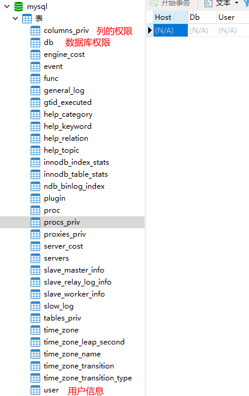
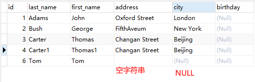
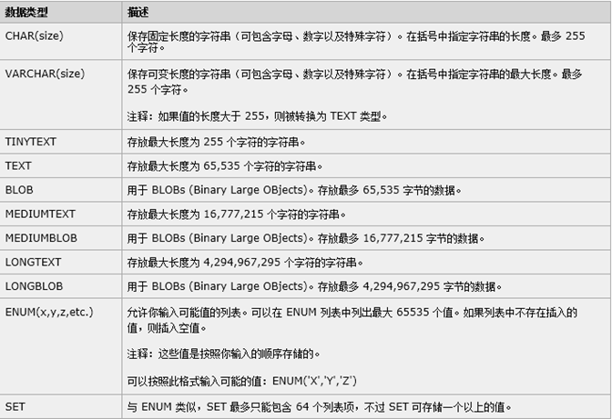
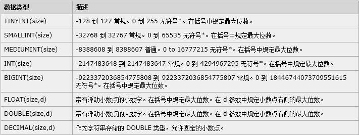

[TOC]


## 为什么学习MySQL？

- 功能完善（事务，可编程）
- 优化SQL查询速度
- 支持多种存储引擎（MyISAM，InnoDB，BDB，Memory）
- 开源
- 集群支持
- 采用GPL协议，你可以修改源码来开发自己的MySQL系统（开源的AliSQL）
- 索引支持

## MySQL各类版本的新特性

MYSQL5.6新特性

| 特性                    | 描述                     |
| ----------------------- | ------------------------ |
| 主从复制-GTID复制       |                          |
| 无损复制                | 对标同步复制，半同步复制 |
| 延迟复制                | 可从Slave上恢复数据      |
| 基于库级别的并行复制    | 多线程复制，提高速度     |
| Online DDL              | ALTER操作不再阻塞DML     |
| 全文索引                |                          |
| InnoDB Memcached plugin |                          |

MYSQL5.7特性

| 特性                                   | 描述 |
| -------------------------------------- | ---- |
| 组复制                                 |      |
| InnoDB Cluster                         |      |
| 多源复制                               |      |
| 增强半同步（AFTER_SYNC）               |      |
| 基于WRITESET的并行复制。               |      |
| 在线开启GTID复制                       |      |
| 原生支持JSON类型，并引入了众多JSON函数 |      |

MYSQL8.0特性

| 特性                         | 描述 |
| ---------------------------- | ---- |
| **文档存储**                 |      |
| 原生的，基于InnoDB的数据字典 |      |
| Atomic DDL                   |      |
| 不可见索引                   |      |
| 直方图。                     |      |
| 快速加列                     |      |
| 公用表表达式                 |      |
| 窗口函数                     |      |

## MySQL知识列表

- MySQL的安装与配置
- 权限管理
- SQL常用语法
- 存储过程和触发器
- SQL优化
- 备份与恢复
- 日志管理
- 复制
- 作业

## Mysql权限管理

- ### 权限管理的两个验证阶段

  - 连接检查
  - 权限检查

> 第一阶段：服务器首先会检查你是否允许连接。因为创建用户的时候会加上主机限制，可以限制成本地、某个IP、某个IP段、以及任何地方等，只允许你从配置的指定地方登陆。
>
> 第二阶段：如果你能连接，Mysql会检查你发出的每个请求，看你是否有足够的权限实施它。比如你要更新某个表、或者查询某个表，Mysql会查看你对哪个表或者某个列是否有权限。再比如，你要运行某个存储过程，Mysql会检查你对存储过程是否有执行权限等。

*命令*

`mysql -h localhost -u root -p password`


### MYSQL权限管理经验

- 只授予能满足需要的最小权限（Insert，Select…）
- 创建用户的时候限制用户的登录主机，一般是限制成指定IP或者内网IP段。
- 初始化数据库的时候删除没有密码的用户。
- 为每个用户设置满足密码复杂度的密码。
- 定期清理不需要的用户。回收权限或者删除用户。

### MYSQL权限管理实例

```sql
grant all privileges on *.* to jack@'localhost' identified by "jack" with grant option; -- 给Jack用户分配全部权限，-- 注意：这里的*.* 后期没有办法删除某一个权限的，只能分配一次
flush privileges; -- 刷新权限
show grants;  -- 查询权限
show grants for 'jack'@'%';  -- %表示其他IP可以访问，localhost表示本地可以访问
revoke delete on *.* from 'jack'@'localhost'; 
drop user 'jack'@'localhost'; -- 删除用户
rename user 'jack'@'%' to 'jim'@'%'; -- 重命名
SET PASSWORD FOR 'root'@'localhost' = PASSWORD('新密码'); -- 修改用户密码
```



> *注意*：`grant all privileges on *.* to jack@'localhost' identified by "jack" with grant option;` -- 给Jack用户分配全部权限，-- 注意：这里的`*.*` 后期没有办法删除某一个权限的，只能分配一次

*其他示例*

###### 1.远程登录mysql

```mysql
mysql -h ip -u username -p password
```

###### 2.创建用户

*格式*：`grant 权限 on 数据库.* to 用户名@登录主机 identified by “密码”;`

*例1*：增加一个test1用户，密码为123456，可以在任何主机上登录，并对所有数据库有查询，增加，修改和删除的功能。**需要在mysql的root用户下进行**

```mysql
grant select, insert, update, delete on *.* to test1@'%' identified by '123456';
flush privileges;
```

*例2*：增加一个test2用户，密码为123456，只能在192.168.2.12上登录，并对数据库student有查询，增加，修改和删除的功能。**需要在mysql的root用户下进行**

```mysql
grant select,insert,update,delete on student.* to test2@192.168.2.12 identified by '123456';
flush privileges;
```

*例3*：授权用户test3拥有数据库student的所有权限

```mysql
 grant all privileges on student.* to test3@localhost identified by '123456';
 flush privileges;
```

###### 3.修改用户密码

```mysql
update mysql.user set password=password(’123456′) where User='test1' and Host='localhost';
flush privileges;
```

###### 4.删除用户

```mysql
delete from user where user='test2' and host='localhost';
flush privileges;
```

###### 5.删除数据库和删除表

```mysql
drop database 数据库名;
drop table 表名;
```

######  6.删除账户及权限

```mysql
drop user 用户名@'%’
drop user 用户名@localhost
-- 同一个用户名可能Host不一样，所以要用用户用.Host的形式来确定用户
```

*grant相关示例*

**MySQL** **赋予用户权限命令的简单格式可概括为：**
 `grant 权限 on 数据库对象 to 用户`

###### 1.grant普通数据用户，查询、插入、更新、删除 数据库中所有表数据的权利。

```mysql
 grant select on testdb.* to common_user@’%’
 grant insert on testdb.* to common_user@’%’
 grant update on testdb.* to common_user@’%’
 grant delete on testdb.* to common_user@’%’
 -- 或者，用一条 MySQL 命令来替代：
 grant select, insert, update, delete on testdb.* to common_user@’%’
```

###### 2.grant 数据库开发人员，创建表、索引、视图、存储过程、函数等权限。

```mysql
 -- grant 创建、修改、删除 MySQL 数据表结构权限。
 grant create on testdb.* to developer@’192.168.0.%’;
 grant alter on testdb.* to developer@’192.168.0.%’;
 grant drop on testdb.* to developer@’192.168.0.%’;
 -- grant 操作 MySQL 外键权限。
 grant references on testdb.* to developer@’192.168.0.%’;
 -- grant 操作 MySQL 临时表权限。
 grant create temporary tables on testdb.* to developer@’192.168.0.%’;
 -- grant 操作 MySQL 索引权限。
 grant index on testdb.* to developer@’192.168.0.%’;
 -- grant 操作 MySQL 视图、查看视图源代码 权限。
 grant create view on testdb.* to developer@’192.168.0.%’;
 grant show view on testdb.* to developer@’192.168.0.%’;
 -- grant 操作 MySQL 存储过程、函数 权限。
 grant create routine on testdb.* to developer@’192.168.0.%’; — now, can show procedure status
 grant alter routine on testdb.* to developer@’192.168.0.%’; — now, you can drop a procedure
 grant execute on testdb.* to developer@’192.168.0.%’;
```


######  3.grant 普通 DBA 管理某个 MySQL 数据库的权限。

```mysql
grant all privileges on testdb to dba@’localhost’
-- 其中，关键字 “privileges” 可以省略。
```

######  4.grant 高级 DBA 管理 MySQL 中所有数据库的权限。

```mysql
grant all on *.* to dba@’localhost’
```

######  5.MySQL grant 权限，分别可以作用在多个层次上。


```mysql
-- 1.grant 作用在整个 MySQL 服务器上：
grant select on *.* to dba@localhost; -- dba 可以查询 MySQL 中所有数据库中的表。
grant all on *.* to dba@localhost;-- dba 可以管理 MySQL 中的所有数据库
-- 2.grant 作用在单个数据库上：
grant select on testdb.* to dba@localhost; -- dba 可以查询 testdb 中的表。
-- 3.grant 作用在单个数据表上：
grant select, insert, update, delete on testdb.orders to dba@localhost; -- dba可以对表orders进行增删查改
-- 4. grant 作用在表中的列上：
grant select(id, se, rank) on testdb.apache_log to dba@localhost;
 -- 5. grant 作用在存储过程、函数上：
grant execute on procedure testdb.pr_add to ‘dba’@’localhost’
grant execute on function testdb.fn_add to ‘dba’@’localhost’
```

######  6.查看 MySQL 用户权限

```mysql
-- 查看当前用户（自己）权限：
show grants;
-- 查看其他 MySQL 用户权限：
show grants for dba@localhost;
```

###### 7.撤销已经赋予给 MySQL 用户权限的权限。

```mysql
-- revoke 跟 grant 的语法差不多，只需要把关键字 “to” 换成 “from” 即可：
grant all on *.* to dba@localhost;
revoke all on *.* from dba@localhost;
```

 

######  8.MySQL grant、revoke 用户权限注意事项

-  grant, revoke 用户权限后，该用户只有重新连接 MySQL 数据库，权限才能生效。

-  如果想让授权的用户，也可以将这些权限 grant 给其他用户，需要选项 “grant option“
   `grant select on testdb.* to dba@localhost with grant option;`
   这个特性一般用不到。实际中，数据库权限最好由 DBA 来统一管理。
   Category: Post
   You can follow any responses to this entry via RSS.
   Comments are currently closed, but you can trackback from your own site.

*总结*

###### 1.创建用户并授权

grant语句的语法:
 `grant privileges (columns) on what to user identified by “password” with grant option`
 要使用该句型，需确定字段有：
 `privileges` 权限指定符权限允许的操作
 `alter` 修改表和索引
 `create` 创建数据库和表
 `delete` 删除表中已有的记录
 `drop` 抛弃（删除）数据库和表
 `index` 创建或抛弃索引
 `insert` 向表中插入新行
 `reference` 未用
 `select` 检索表中的记录
 `update` 修改现存表记录
 `file` 读或写服务器上的文件
 `process` 查看服务器中执行的线程信息或杀死线程
 `reload` 重载授权表或清空日志、主机缓存或表缓存。
 `shutdown` 关闭服务器
 `all` 所有；
 `all privileges` all的同义词
 `usage` 特殊的“无权限”权限
 以上权限分三组:
 *第一组*：适用于数据库、表和列如:alter create delete drop index insert select update
 *第二组*:数管理权限 它们允许用户影响服务器的操作 需严格地授权 如:file process reload shut*
 *第三组*:权限特殊 all意味着“所有权限” uasge意味着无权限，即创建用户，但不授予权限
 `columns`
权限运用的列(可选)并且你只能设置列特定的权限。如果命令有多于一个列，应该用逗号分开它们。
`what`
 权限运用的级别。权限可以是全局,定数据库或特定表.
 `user`
 权限授予的用户，由一个用户名和主机名组成,许两个同名用户从不同地方连接.缺省:mysql用户password
 赋予用户的口令(可选),如果你对用户没有指定identified by子句,该用户口令不变.
 用identified by时，口令字符串用改用口令的字面含义,grant将为你编码口令.
 注:set password使用password()函数
 *with grant option*
 用户可以授予权限通过grant语句授权给其它用户(可选)

## 如何保证密码信息的安全

```mysql
SELECT password('mypass'); -- 查询mypass加密后的密码
CREATE user 'tom'@'localhost' identified BY password'*6C8989366EAF75BB670AD8EA7A7FC1176A95CEF4'; -- 创建用户用加密的密码
SELECT * FROM `mysql`.`user` WHERE `User` ='tom';

```

> 先查出你的密码的哈希值，然后在新建用户的时候输入哈希值
>
> 那么在日志里面就只能看到哈希值
>
> ~/.mysql_history 这意味着对这些文件有读取权限的人，都可以读取到新添加用户的明文密码

##### 忘记密码怎么办？？？？

###### 方法1： 用SET PASSWORD命令 

​	首先登录MySQL（记住密码的前提下） 
*格式*：`mysql> set password for 用户名@localhost = password('新密码');` 
*例子*：`mysql> set password for root@localhost = password('123');` 

######  方法2：用mysqladmin 

 *格式*：`mysqladmin -u用户名 -p旧密码 password 新密码` 
 *例子*：`mysqladmin -uroot -p123456 password 123` 

######  方法3：用UPDATE直接编辑user表 

​	 首先登录MySQL。 

```mysql
mysql> use mysql; 
mysql> update user set password=password('123') where user='root' and host='localhost'; 
mysql> flush privileges; 
```

######  方法4：在忘记root密码的时候，可以这样（5.7以下没有password（"123"）这个方法）

​	 以windows为例： 

1. 关闭正在运行的MySQL服务。 

2. 打开DOS窗口，转到mysql\bin目录。 

3. 输入mysqld --skip-grant-tables 回车。--skip-grant-tables 的意思是启动MySQL服务的时候跳过权限表认证。 

4. 再开一个DOS窗口（因为刚才那个DOS窗口已经不能动了），转到mysql\bin目录。 

5. 输入mysql回车，如果成功，将出现MySQL提示符 >。 

6. 连接权限数据库： use mysql; 。 

7. 改密码：update user set password=password("123") where user="root";（别忘了最后加分号） 。 

8. > 注意：5.7以下要使用update mysql.user set authentication_string=password('root') where user='root';

9. 刷新权限（必须步骤）：flush privileges;　。 

10. 退出 quit。 

11. 注销系统，再进入，使用用户名root和刚才设置的新密码123登录。 

## MySQL语法

### 数据查询字段顺序

> *数据查询字段顺序*
> `select from… where… group by… having… order by… limit…`

### SQL 分为两个部分

​	**数据操作语言 (DML)**

- *SELECT* - 从数据库表中获取数据
- *UPDATE* - 更新数据库表中的数据
- *DELETE* - 从数据库表中删除数据
- *INSERT INTO* - 向数据库表中插入数据

​	**数据定义语言 (DDL)**

- *CREATE DATABASE* - 创建新数据库
- *ALTER DATABASE* - 修改数据库
- *CREATE TABLE* - 创建新表
- *ALTER TABLE* - 变更（改变）数据库表
- *DROP TABLE* - 删除表
- *CREATE INDEX* - 创建索引（搜索键）
- *DROP INDEX* - 删除索引

### MySQL基本语法

- SELECT 列名称 FROM 表名称
- SELECT DISTINCT 列名称 FROM 表名称
- SELECT 列名称 FROM 表名称 WHERE 列 运算符 值
- **AND** **和** **OR** **运算符**
- **ORDER BY** **语句**
- INSERT INTO 表名称 VALUES (值1, 值2,....)
- UPDATE 表名称 SET 列名称 = 新值 WHERE 列名称 = 某值
- DELETE FROM 表名称 WHERE 列名称 = 值

### MySQL高级语法

- TOP 子句&Limit子句（分页）
- Like操作符
- SQL通配符`（%， _,  [charlist], [^charlist], [!charlist]）`
- SELECT column_name(s) FROM table_name WHERE column_name IN (value1,value2,...)
- SELECT column_name(s) FROM table_name WHERE column_name BETWEEN value1 AND value2
- 表的 SQL Alias 语法
- SQL INNER JOIN ,Join关键字
- Left Join;
- Rigth Join;
- Full Join（MySQL不支持，SQLServer支持）;
- Cross Join；（笛卡尔积）
- SQL UNION ， Union All操作符
- SELECT INTO （MySQL不支持，MySQL有Insert Into）
- CREATE DATABASE 语句
- CREATE TABLE 语句
- Unique，PrimaryKey，ForeignKey，Default，Check；
- Create Index
- Drop Index
- Alter Table
- Create View
- NULL判断；（NULL用Is Null , is not null）
- IFNULL()
- 嵌套查询
- In和exists


##### *详解*

**SQL通配符**

`%`替代一个或多个字符

`_`仅替代一个字符

`[charlist]`字符列中的任何单一字符

`[^charlist]`或者`[!charlist]` mySQL不支持该语法

不在字符列中的任何单一字符

*例子*： `select * from t_student where city like '_bc%';`


**Left Join**

*LEFT JOIN* 关键字会从左表 (table_name1) 那里**返回所有的行**，即使在右表 (table_name2) 中没有匹配的行。

**Right Join**

*RIGHT JOIN* 关键字会从右表 (Orders) 那里返回所有的行，即使在左表 (Persons) 中没有匹配的行。

**View**

视图：虚表，不存在的

```mysql
CREATE VIEW aa AS SELECT * FROM	t_student WHERE id = 1; -- 创建视图
DROP VIEW aa; -- 删除视图
```

**NULL**

NULL 与空字符串是不同的



**IFNULL()**

语法：`select IFNULL(param1,param2);` 

param1为空，返回Param2； param1不为空，返回param1

```mysql
SELECT IFNULL(city,'abc') from t_student;-- 如果city为NULL则返回abc字符串
```

**IN和EXISTS**

```mysql
SELECT * from t_persons where EXISTS(select * from t_order where t_persons.id = t_order.person_id);
SELECT * FROM t_persons WHERE id IN ( 1, 2 );
```


### MYSQL正则表达式

| 模式       | 描述                                                         |
| :--------- | :----------------------------------------------------------- |
| ^          | 匹配输入字符串的开始位置。如果设置了 RegExp 对象的 Multiline 属性，^ 也匹配 '\n' 或 '\r' 之后的位置。 |
| $          | 匹配输入字符串的结束位置。如果设置了RegExp 对象的 Multiline 属性，$ 也匹配 '\n' 或 '\r' 之前的位置。 |
| .          | 匹配除 "\n" 之外的任何单个字符。要匹配包括 '\n' 在内的任何字符，请使用像 '[.\n]' 的模式。 |
| [...]      | 字符集合。匹配所包含的任意一个字符。例如， '[abc]' 可以匹配 "plain" 中的 'a'。 |
| [^...]     | 负值字符集合。匹配未包含的任意字符。例如， '[^abc]' 可以匹配 "plain" 中的'p'。 |
| p1\|p2\|p3 | 匹配 p1 或 p2 或 p3。例如，'z\|food' 能匹配 "z" 或 "food"。'(z\|f)ood' 则匹配 "zood" 或 "food"。 |
| *          | 匹配前面的子表达式零次或多次。例如，zo* 能匹配 "z" 以及 "zoo"。* 等价于{0,}。 |
| +          | 匹配前面的子表达式一次或多次。例如，'zo+' 能匹配 "zo" 以及 "zoo"，但不能匹配 "z"。+ 等价于 {1,}。 |
| {n}        | n 是一个非负整数。匹配确定的 n 次。例如，'o{2}' 不能匹配 "Bob" 中的 'o'，但是能匹配 "food" 中的两个 o。 |
| {n,m}      | m 和 n 均为非负整数，其中n <= m。最少匹配 n 次且最多匹配 m 次。 |

*实例*

```mysql
-- 查询以Ad开头的所有数据
select * from t_persons where last_name REGEXP '^Ad'
-- 查询以sh结尾的所有数据
SELECT * FROM t_persons WHERE last_name REGEXP 'sh$';
-- 查询包含us的所有数据
SELECT * FROM t_persons WHERE last_name REGEXP 'us';
-- 查询以元音字符开头或以sh结尾的所有数据
SELECT * FROM t_persons WHERE last_name REGEXP '^[aeiou]|sh$';
```

## MYSQL事务

### 概述

1. 在 MySQL 中只有使用了 Innodb 数据库引擎的数据库或表才支持事务。

2. 事务处理可以用来维护数据库的完整性，保证成批的 SQL 语句要么全部执行，要么全部不执行。

3. 事务用来管理 `insert`,`update`,`delete` 语句

4. 事务是必须满足4个条件（ACID）：`原子性`（**A**tomicity，或称不可分割性）、`一致性`（**C**onsistency）、`隔离性`（**I**solation，又称独立性）、`持久性`（**D**urability）。

### 使用

- `BEGIN`或`START TRANSACTION;`显式地开启一个事务；
- `COMMIT;`也可以使用`COMMIT WORK`，不过二者是等价的。`COMMIT`会提交事务，并使已对数据库进行的所有修改称为永久性的；
- `ROLLBACK;`有可以使用`ROLLBACK WORK`，不过二者是等价的。回滚会结束用户的事务，并撤销正在进行的所有未提交的修改；
- `SAVEPOINT identifier;` `SAVEPOINT`允许在事务中创建一个保存点，一个事务中可以有多个`SAVEPOINT`；
- `RELEASE SAVEPOINT identifier;`删除一个事务的保存点，当没有指定的保存点时，执行该语句会抛出一个异常；
- `ROLLBACK TO identifier;`把事务回滚到标记点；

##### MYSQL 事务处理主要有两种方法：

###### 1、用 BEGIN, ROLLBACK, COMMIT来实现

`BEGIN` 开始一个事务

`ROLLBACK` 事务回滚

`COMMIT` 事务确认

2、直接用 SET 来改变 MySQL 的自动提交模式:

`SET AUTOCOMMIT=0` 禁止自动提交

`SET AUTOCOMMIT=1` 开启自动提交

> mysql如果开了set autocommit=0，那么所有的语句一定是在一个事务里，在这种情况下，如果使用连接池，并且在查询之前没有rollback或者set autocommit=1，那么你就杯具了。因为根据mysql的默认事务级别，一致性读，你永远也取不到这个事务被开户前的数据。另外一点set autocommit= 0，会自动提交前一个事务，因此正确的作法是rollback, set autocommit =0，完成之后再set autocommit = 1;

*示例*

```mysql
begin;
insert into t_transaction values(1, 'abc');
insert into t_transaction values(2, 'xyz');
commit;
```

### MySQL事务-隔离性级别

#### 隔离性遇到的三大问题

- 脏读，不可重复读，虚读(幻读)

1. **脏读**

   *脏读*是指在一个事务处理过程里读取了另一个未提交的事务中的数据。

​		当一个事务正在多次修改某个数据，而在这个事务中这多次的修改都还未提交，这时一个并发的事务来访问该数据，就会造成两个事务得到的数据不一致。例如：用户A向用户B转账100元，对应SQL命令如下

```mysql
update account set money=money+100 where name='B'; -- (此时A通知B)
update account set money=money - 100 where name='A';
```

　　当只执行第一条SQL时，A通知B查看账户，B发现确实钱已到账（此时即发生了脏读），而之后无论第二条SQL是否执行，只要该事务不提交，则所有操作都将回滚，那么当B以后再次查看账户时就会发现钱其实并没有转。

2. **不可重复读**

　　*不可重复读*是指在对于数据库中的某个数据，一个事务范围内多次查询却返回了不同的数据值，这是由于在查询间隔，被另一个事务修改并提交了。

　　例如事务T1在读取某一数据，而事务T2立马修改了这个数据并且提交事务给数据库，事务T1再次读取该数据就得到了不同的结果，发生了不可重复读。

　　不可重复读和脏读的区别是，脏读是某一事务读取了另一个事务未提交的脏数据，而不可重复读则是读取了前一事务提交的数据。

　　在某些情况下，不可重复读并不是问题，比如我们多次查询某个数据当然以最后查询得到的结果为主。但在另一些情况下就有可能发生问题，例如对于同一个数据A和B依次查询就可能不同，A和B就可能打起来了……

3. **虚读(幻读)**

　　*幻读*是事务非独立执行时发生的一种现象。例如事务T1对一个表中所有的行的某个数据项做了从“1”修改为“2”的操作，这时事务T2又对这个表中插入了一行数据项，而这个数据项的数值还是为“1”并且提交给数据库。而操作事务T1的用户如果再查看刚刚修改的数据，会发现还有一行没有修改，其实这行是从事务T2中添加的，就好像产生幻觉一样，这就是发生了幻读。

　　幻读和不可重复读都是读取了另一条已经提交的事务（这点就脏读不同），所不同的是不可重复读查询的都是同一个数据项，而幻读针对的是一批数据整体（比如数据的个数）。

#### MYSQL隔离性几个级别

- `Serializable` (串行化)：可避免脏读、不可重复读、幻读的发生。
- `Repeatable` read (可重复读)：可避免脏读、不可重复读的发生。
- `Read committed` (读已提交)：可避免脏读的发生。
- `Read uncommitted` (读未提交)：最低级别，任何情况都无法保证。


查询隔离级别

`select @@tx_isolation;`

设置隔离级别

`set tx_isolation = 'read-uncommitted'`

`set tx_isolation = 'repeatable-read'`

注意点：

后记：隔离级别的设置只对当前链接有效。对于使用MySQL命令窗口而言，一个窗口就相当于一个链接，当前窗口设置的隔离级别只对当前窗口中的事务有效；对于JDBC操作数据库来说，一个Connection对象相当于一个链接，而对于Connection对象设置的隔离级别只对该Connection对象有效，与其他链接Connection对象无关。

## MYSQL 临时表

- MySQL 临时表在我们需要保存一些临时数据时是非常有用的。**临时表只在当前连接可见，当关闭连接时，Mysql会自动删除表并释放所有空间。** Navicat中新建一个窗口就是一个新的连接

- 临时表在MySQL 3.23版本中添加，如果你的MySQL版本低于 3.23版本就无法使用MySQL的临时表。不过现在一般很少有再使用这么低版本的MySQL数据库服务了。

*示例*

```mysql
CREATE TEMPORARY TABLE SalesSummary (product_name VARCHAR(50) NOT NULL,
    total_sales DECIMAL(12,2) NOT NULL DEFAULT 0.00,
    avg_unit_price DECIMAL(7,2) NOT NULL DEFAULT 0.00,
    total_units_sold INT UNSIGNED NOT NULL DEFAULT 0
);

INSERT INTO SalesSummary
    (product_name, total_sales, avg_unit_price, total_units_sold)
    VALUES
    ('cucumber', 100.25, 90, 2);

SELECT * FROM SalesSummary;
-- 在当前连接下可以删除临时表
DROP TABLE SalesSummary;

```

## MYSQL复制表

- 如果我们需要完全的复制MySQL的数据表，包括表的结构，索引，默认值等。 如果仅仅使用**CREATE TABLE ... SELECT** 命令，是无法实现的。
- 使用 **SHOW CREATE TABLE** 命令获取创建数据表(**CREATE TABLE**) 语句，该语句包含了原数据表的结构，索引等。
- 复制以下命令显示的SQL语句，修改数据表名，并执行SQL语句，通过以上命令 将完全的复制数据表结构。
- 如果你想复制表的内容，你就可以使用 **INSERT INTO ... SELECT** 语句来实现。

```mysql
CREATE TABLE t_person_test1 LIKE t_persons; -- 复制表结构
INSERT INTO t_person_test1 SELECT * FROM t_persons; -- 复制表数据

-- 其他扩展方法

-- 可以拷贝一个表中其中的一些字段:
CREATE TABLE newadmin AS (SELECT username, password FROM admin )
-- 可以将新建的表的字段改名:
CREATE TABLE newadmin AS (SELECT id, username AS uname, password AS pass FROM admin )
-- 可以拷贝一部分数据:
CREATE TABLE newadmin AS (SELECT * FROM admin WHERE LEFT(username,1) = 's' )
-- 可以在创建表的同时定义表中的字段信息:
CREATE TABLE newadmin ( id INTEGER NOT NULL AUTO_INCREMENT PRIMARY KEY ) AS ( SELECT * FROM admin ) 
```

## MYSQL元数据

- **查询结果信息：** SELECT, UPDATE 或 DELETE语句影响的记录数。
- **数据库和数据表的信息：** 包含了数据库及数据表的结构信息。
- **MySQL****服务器信息：** 包含了数据库服务器的当前状态，版本号等。
- 在MySQL的命令提示符中，我们可以很容易的获取以上服务器信息。

SELECT VERSION( )

SELECT DATABASE( )

SELECT USER( )

SHOW STATUS

SHOW VARIABLES

## MYSQL序列使用

- MySQL序列是一组整数：1, 2, 3, ...，如果你想实现其他字段也实现自动增加，就可以使用MySQL序列来实现。
- **AUTO_INCREMENT**
- LAST_INSERT_ID( )
- **重置序列**
- **设置序列的开始值**

## MYSQL数据类型



CHAR(SIZE)占用的存储空间为Size；



时间戳

如果要在navicat下操作的话，将字段设置为timestamp ，然后默认值写上CURRENT_TIMESTAMP即可

> Create table t(x int(3) zerofill)，这个Int(3)是做什么用的？
>
> 用0填充

## SQL中的常见函数

- Avg;
- Count;
- Max，
- Min，
- Sum，
- Mid，（字段， Index，Count）
- Length;
- Round（字段， 四舍五入位数）;四舍五入；
- Now;
- DATE_FORMAT;
- Ucase,Lcase
- Group By, Having;

### 问题：Where和Having的区别

- HAVING用于GroupBy之后的数据筛选。
- Having执行优先级低于Where；

### count(*),count(1), cout(列名)区别

- Count(*)需要做回表操作（不建议使用）；
- Count（1）不需要做回表操作（建议使用）；
- Count(列名)只返回不为空的数量（特殊场景下使用）

## MySQL优化

- 查询频繁的列需要建立索引；
- 少用类似select * from t where xx is null（放弃索引全局扫描）
- 尽量避免在 where 子句中使用 != 或 <> 操作符（放弃索引全局扫描）
- 尽量避免在 where 子句中使用 or 来连接条件（任何一个条件列没有索引，将放弃索引全局扫描）
- 尽量避免使用in 和 not in ，否则会导致全表扫描
- 连续的数值，能用 between 就不要用 in 
- 尽量用Exits代替In，（Exits会使用索引，In不会使用索引）
- like ‘%abc%’不使用索引
- 尽量避免在 where 子句中对字段进行表达式操作
- select id from t where num/**2** = **100->** select id from t where num = **100*****2**
- 避免在where子句中对字段进行函数操作，这将导致引擎放弃使用索引而进行全表扫描
- select id from t where datediff(day,createdate,’**2005**-**11**-**30**′) = **0**
- select id from t where name like 'abc%' select id from t where createdate >= '2005-11-30' and createdate < '2005-12-1‘
- 对于多张大数据量（这里几百条就算大了）的表JOIN，要先分页再JOIN，否则逻辑读会很高，性能很差。
- 尽量用Count（1）代替Count(*)
- 索引列最好不要超过6个；
- 尽量使用数字类型代替字符类型（数字类型只比较一次，字符类型逐个字符对比）
- 尽可能的使用 varchar/nvarchar 代替 char/nchar ，因为首先变长字段存储空间小，可以节省存储空间，其次对于查询来说，在一个相对较小的字段内搜索效率显然要高些。
- 任何地方都不要使用 select * from t ，用具体的字段列表代替“*”，不要返回用不到的任何字段
- 尽量避免使用游标，因为游标的效率较差，如果游标操作的数据超过1万行，那么就应该考虑改写。
- 尽量避免大事务操作，提高系统并发能力。
- 尽量避免向客户端返回大数据量，若数据量过大，应该考虑相应需求是否合理。

## MySQL备份

数据库备份

mysqldump -u root -h localhost -p testbackup > c:\mysql.sql

备份单个数据表

mysqldump -u root -h localhost -p testbackup t_user > c:\mysql.sql

备份多个数据库

mysqldump -u root -h localhost -p --database testbackup db > c:\mysql.sql

备份所有数据库

mysqldump -u root -h localhost -p --all-databases> c:\mysql.sql

## MySQL还原

mysql -u root -h localhost -p testbackup< C:\mysql.sql

注意：备份前应先创建数据库名

也可以登录到数据库中，使用Source命令 

source C:\mysql.sql

## MySql日志管理

**BinLog配置**

log-bin="C:\Mysql\log"

expire_logs_days=10

max_binlog_size=100M

重启MySQL服务


**通过变量查询可以查看配置的日志是否开启**

show VARIABLES LIKE '%log_%';

查看二进制文件命令

SHOW BINARY LOGS;

查看二进制操作记录，Insert，Update语句

show binlog events;

