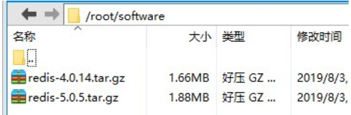
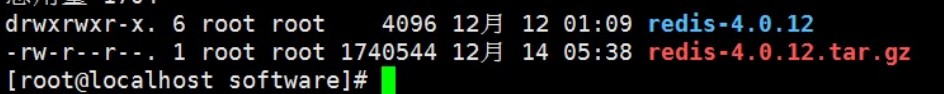
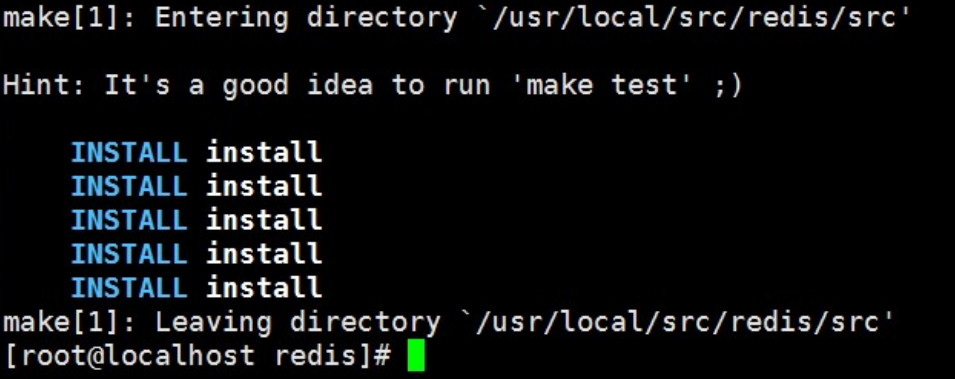
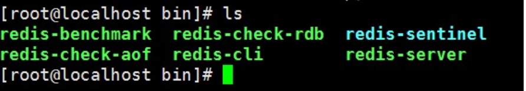
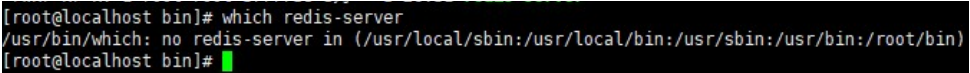
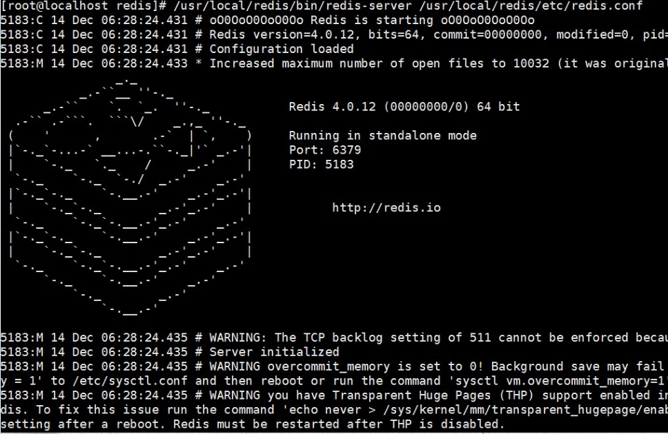
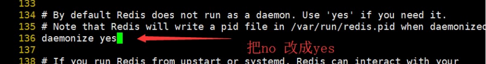
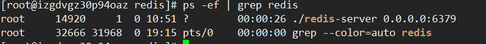
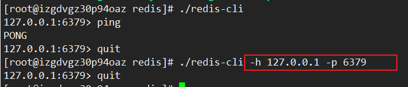

# Redis

[TOC]

官网教程：https://www.redis.net.cn/tutorial/3504.html

## Redis简介

### Redis简介

Redis:REmote DIctionary Server(远程字典服务器)

Redis是当前比较热门的NOSQL系统之一，它是一个开源的使用ANSI c语言编写的`key-value`存储系统（区别于MySQL的二维表格的形式存储），和Memcache类似，但很大程度补偿了Memcache的不足。和Memcache一样，Redis数据都是缓存在计算机内存中，不同的是，Memcache只能将数据缓存到内存中，无法自动定期写入硬盘，这就表示，一断电或重启，内存清空，数据丢失。所以Memcache的应用场景适用于缓存无需持久化的数据。而Redis不同的是它会周期性的把更新的数据写入磁盘或者把修改操作写入追加的记录文件，实现数据的持久化。

### Redis的特点

1. **Redis读取的速度是110000次/s，写的速度是81000次/s**
2. **原子性**。Redis的所有操作都是原子性的，同时Redis还支持对几个操作全并后的原子性执行。
3. 支持多种数据结构：string（字符串）；list（列表）；hash（哈希），set（集合）；zset(有序集合)
4. 持久化，主从复制（集群）
5. 支持过期时间，支持事务，消息订阅。
6. 官方不支持window,但是又第三方版本。

### Redis的应用场景

**1、数据缓存（提高访问性能）** 

将一些数据**在短时间之内不会发生变化**，而且它们还要被频繁访问，为了提高用户的请求速度和降低网站的负载，降低数据库的读写次数，就把这些数据放到缓存中。

**2、会话缓存**

（session cache，保存web会话信息）

**3、排行榜/计数器**

（NGINX+lua+redis计数器进行IP自动封禁）

**4、消息队列**

（构建实时消息系统，聊天，群聊）

### Redis与其他key-value存储有什么不同？

- Redis有着更为复杂的数据结构并且提供对他们的原子性操作，这是一个不同于其他数据库的进化路径。Redis的数据类型都是基于基本数据结构的同时对程序员透明，无需进行额外的抽象。
- Redis运行在内存中但是可以持久化到磁盘，所以在对不同数据集进行高速读写时需要权衡内存，应为数据量不能大于硬件内存。在内存数据库方面的另一个优点是， 相比在磁盘上相同的复杂的数据结构，在内存中操作起来非常简单，这样Redis可以做很多内部复杂性很强的事情。  同时，在磁盘格式方面他们是紧凑的以追加的方式产生的，因为他们并不需要进行随机访问。

## Redis安装与启动停止

Windows安装可参考：https://www.runoob.com/redis/redis-install.html 

安装教程：http://www.imooc.com/article/295555

下载地址：https://redis.io/download  官网也有安装步骤

### **Linux安装**

### 常规方式

#### 下载Redis4

**从官网下载对应的版本，放在/root/software目录中。**



#### 开始安装

**如果机器上没有gcc,请先安装gcc。安装gcc 目地是编译软件**

```shell
yum install gcc-c++
```

**解压**

```
tar -zxvf redis-4.0.12.tar.gz
```



**把解压的文件copy到/usr/local/src里面**

```shell
cp -r /root/software/redis-4.0.12 /usr/local/src/redis
```

**打开/usr/local/src/redis/deps进行编译依赖项**

```shell
cd /usr/local/src/redis/deps
make hiredis lua jemalloc linenoise
```

**打开/usr/local/src/redis进行编译**

```shell
cd /usr/local/src/redis
make
```

**在上面的Redis目录安装把它安装到/usr/local/redis里面**

```shell
mkdir /usr/local/redis
make install PREFIX=/usr/local/redis
```



如上图，说明安装成功了

**验证安装是否成功**

```shell
cd /usr/local/redis/bin
ls
```

看到如下启动文件就可以了



使用which命令查看系统里面是否有redis的服务【which用于查看命令的路径】

```shell
which redis-server
```

​	

显示为没有

**把配置文件移动到/usr/local/redis/etc目录[目录可以自定义] 可以为/usr/myredis**

使用which命令查看系统里面是否有redis的服务

```shell
mkdir /usr/myredis
cp /usr/local/src/redis/redis.conf /usr/myredis
```

**启动Redis**

```shell
cd /usr/local/redis/bin
./redis-server /usr/myredis/redis.conf
```



**默认情况，Redis不是在后台运行，我们需要把redis放在后台运行**

修改redis.conf配置文件 把`deamonize no`改为 `deamonize yes`

```shell
vi /usr/myredis/redis.conf
```



**再次启动查看进程**

```shell
./redis-server /usr/myredis/redis.conf #启动
#查看进程
ps -ef|grep redis
```



可以看到在6379端口号已启动了redis

**客户端链接和退出**

```shell
./redis-cli #连接
quit #退出
```

可以指定IP和端口号



**开机自启Redis的配置**

```shell
vim /etc/rc.local
加入一下配置
/usr/local/redis/bin/redis-server /usr/myredis/redis-conf
```

**bin目录的文件说明**

> redis-benchmark：redis性能测试工具
> redis-check-aof：检查aof日志的工具
> redis-check-dump：检查rdb日志的工具
> redis-cli：连接用的客户端
> redis-server：redis服务进程

### redis配置文件

> `daemonize`：如需要在后台运行，把该项的值改为yes
> pdifile：把pid文件放在/var/run/redis.pid，可以配置到其他地址
> `bind`：指定redis只接收来自该IP的请求，如果不设置，那么将处理所有请求，在生产环节中最好设置该项
> `port`：监听端口，默认为6379
> `timeout`：设置客户端连接时的超时时间，`单位为秒`
> loglevel：等级分为4级，debug，revbose，notice和warning。`生产环境下一般开启notice`
> logfile：配置log文件地址，默认使用标准输出，即打印在命令行终端的端口上
> database：设置数据库的个数，默认使用的数据库是0
> save：设置redis进行数据库镜像的频率
> rdbcompression：在进行镜像备份时，是否进行压缩
> dbfilename：镜像备份文件的文件名
> dir：数据库镜像备份的文件放置的路径
> slaveof：设置该数据库为其他数据库的从数据库
> masterauth：当主数据库连接需要密码验证时，在这里设定
> requirepass：设置客户端连接后进行任何其他指定前需要使用的密码
> maxclients：限制同时连接的客户端数量
> maxmemory：设置redis能够使用的最大内存
> appendonly：开启appendonly模式后，redis会把每一次所接收到的写操作都追加到appendonly.aof
> appendfsync：设置appendonly.aof文件进行同步的频率
> vm_enabled：是否开启虚拟内存支持


### 官网给出安装方式

**首先要确保本机是否有gcc,没有则先安装，否则会出错**

```shell
yum install gcc-c++
```

**使用以下命令下载，提取和编译Redis：**

```
$ wget http://download.redis.io/releases/redis-5.0.8.tar.gz
$ tar xzf redis-5.0.8.tar.gz
$ cd redis-5.0.8
$ make
```


如果在在 /usr/local 目录下面操作的这些命令，也就是说 Redis 的安装目录为 /usr/local 。`src` 目录 中现在提供了已编译的二进制文件 。使用以下命令运行Redis：   

```
$ src/redis-server
```

您可以使用内置客户端与Redis进行交互：

```
$ src/redis-cli
redis> set foo bar
OK
redis> get foo
"bar"
```

您是Redis的新手吗？试试我们的 [在线交互式教程](http://try.redis.io/)。    

### **Window 下安装**

地址：https://www.redis.net.cn/tutorial/3503.html

**下载地址：**https://github.com/dmajkic/redis/downloads。

下载到的Redis支持32bit和64bit。根据自己实际情况选择，将64bit的内容cp到自定义盘符安装目录取名redis。 如 C:\reids

打开一个cmd窗口 使用cd命令切换目录到 C:\redis 运行 **redis-server.exe redis.conf** 。

如果想方便的话，可以把redis的路径加到系统的环境变量里，这样就省得再输路径了，后面的那个redis.conf可以省略，如果省略，会启用默认的。输入之后，会显示如下界面：


这时候另启一个cmd窗口，原来的不要关闭，不然就无法访问服务端了。

切换到redis目录下运行 **redis-cli.exe -h 127.0.0.1 -p 6379** 。

设置键值对 **set myKey abc**

取出键值对 **get myKey**


------

------


## 相关知识

### 单进程单线程

**采用多路 I/O 复用技术可以让单个线程高效的处理多个连接请求（尽量减少网络IO的时间消耗）** 

**why?**

- 多线程处理可能涉及到锁 
- 多线程处理会涉及到线程切换而消耗CPU
- 单进程不存在线程安全问题

**缺点：**

- 无法发挥多核CPU性能，不过可以通过在单机开多个Redis实例来完善

### 默认16个数据库

默认16个数据库，类似数组下表从**零**开始，初始默认使用零号库

### 切换数据库命令

select 命令切换数据库

### 常用基本命令

`dbsize` 查看当前数据库的key的数量

`flushdb` 清空当前库

`flushall` 通杀全部库

### 其它说明

统一密码管理，16个库都是同样密码，要么都OK要么一个也连接不上

**Redis索引都是从零开始**


------

## redis的数据类型

### **字符串类型**

字符串类型是编程语言和应用程序中最常见和最有用的数据类型，也是Redis的基本数据类型之一，事实上，**Redis中所有键都必须是字符串**。

------

### **list数据类型**

 列表是程序开发中非常有用的数据类型之一，列表能存储一组对象，因此它也可以**被用于栈或者队列**，在Redis中，与键相关的联的值可以是字符串组成的列表，Redis中的列表更像是数据结构中的双向链表。

### **hash数据类型**

`hash`表示**字段和值**之间的映射关系，与JAVA中的`Map`类似，Redis数据集本身就可以看做一个哈希，其中字符串类型的键关联到如字符串和列表之类的数据对象，而Reidis的数据对象也可以再次使用哈希，**其字段和值必须是字符串**。

### **set数据类型**

 **唯一**、**无序**对象的集合(collection)。它经常用于测试某个成员是集合中，重复项删除和集合运算（求并，交，差集），Redis的值对象可以是字符串集合。

### **zset(sortset)数据类型**

 有序集合是一个类似于set，但是是更复杂的数据类型，单词sorted意为着这种集合中的每个元素都有一个可用于排序的权重，并且我们可以按顺序从集合中得到元素在某些需要一个保持数据有序的场景中，使用这种原生的序的特性是很方便的。

## redis相关命令

关于命令的学习查询看这个网站http://www.redis.net.cn/order/ 

或者：http://redisdoc.com/

### 常用命令

```shell
keys * 获取所有的key
select 0 选择第一个库
move myString 1 将当前的数据库key移动到某个数据库,如果目标库有，则不能移动
flushdb 清除指定库
randomkey 从当前数据库中随机返回
type key 类型
del key1 删除key
exists key 判断是否存在key
expire key 10 10过期
pexpire key 1000 毫秒
persist key 删除过期时间
ttl key 查看还有多少秒过期，-1表示永不过期，-2表示已过期
```

### string类型相关命令

```shell
set name cxx
get name
getrange name 0 -1 字符串分段 0 -1是全部 0 -2 ==n-1
getset name new_cxx 设置值，返回旧值
mset key1 key2 批量设置
mget key1 key2 批量获取
setnx key value 不存在就插入（not exists）
setrange key index value 从index开始替换value
incr age 递增
incrby age 10 递增
decr age 递减
decrby age 10 递减
incrbyfloat 增减浮点数
append 追加
strlen 长度
object encoding key 得到key 的类型 string里面有三种编码
		int 用于能够副作用64位有符号整数表示的字符串
		embstr 用于长度小于或等于44字节 Redis3.x中是39字节，这种类型的编码在内存使用时性能更好
		raw 用于长度大于44字节的
```

### list类型相关命令

```shell
lpush mylist a b c 左插入
rpush mylist x y z 右插入
lrange mylist 0 -1 取出数据集合 0 -1是取出所有 0 1取第第一个和第二个
lpop mylist 弹出集合最后一个元素 弹出之后就没有了哦
rpop mylist 弹出第一个元素 弹出之后就没有了哦
llen mylist 长度
lrem mylist count value 删除
|-COUNT 的值可以是以下几种：
|--count > 0 : 从表头开始向表尾搜索，移除与 VALUE 相等的元素，数量为
|--count < 0 : 从表尾开始向表头搜索，移除与 VALUE 相等的元素，数量为
|--count = 0 : 移除表中所有与 VALUE 相等的值。
lindex mylist 2 指定索引的值
lset mylist 2 n 索引设值
ltrim mylist 0 4
|--对一个列表进行修剪(trim)，就是说，让列表只保留指定区间内的元素，不在指定区间之内的元素都将被删除。下标
linsert mylist before a 插入
linsert mylist after a 插入
|--命令用于在列表的元素前或者后插入元素。 当指定元素不存在于列表中时，不执行任何操作。
rpoplpush list list2 转移列表的数据
|--命令用于移除列表的最后一个元素，并将该元素添加到另一个列表并返回。
```

### hash类型相关命令

```shell
hset myhash name cxx
|--命令用于为哈希表中的字段赋值 。
|--如果哈希表不存在，一个新的哈希表被创建并进行 HSET 操作。
|--如果字段已经存在于哈希表中，旧值将被覆盖。
hget myhash name
hmset myhash name cxx age 25 note "i am notes"
hmget myhash name age note
hgetall myhash 获取所有的
hexists myhash name 是否存在
hsetnx myhash score 100 设置不存在的
hincrby myhash id 1 递增
hdel myhash name 删除
hkeys myhash 只取key
hvals myhash 只取value
hlen myhash 长度
```

### set类型相关命令

```shell
sadd myset redis
smembers myset 数据集合
srem myset set1 删除
sismember myset set1 判断元素是否在集合中
scard key_name 个数
sdiff | sinter | sunion 操作：集合间运算：差集 | 交集 | 并集
srandmember 随机获取集合中的元素
spop 从集合中弹出一个元素
```

### zset类型相关命令

```shell
zadd zset 1 one
zadd zset 2 two
zadd zset 3 three
zincrby zset 1 one 增长分数
zscore zset two 获取分数
zrange zset 0 -1 withscores 范围值
zrangebyscore zset 10 25 withscores 指定范围的值
zrangebyscore zset 10 25 withscores limit 1 2 分页
Zrevrangebyscore zset 10 25 withscores 指定范围的值
zcard zset 元素数量
Zcount zset 获得指定分数范围内的元素个数
Zrem zset one two 删除一个或多个元素
Zremrangebyrank zset 0 1 按照排名范围删除元素
Zremrangebyscore zset 0 1 按照分数范围删除元素
Zrank zset 0 -1 分数最小的元素排名为0
Zrevrank zset 0 -1 分数最大的元素排名为0
Zinterstore
zunionstore rank:last_week 7 rank:20150323 rank:20150324 rank:20150325 w
```

