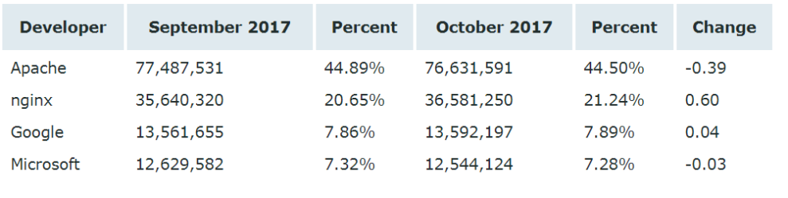
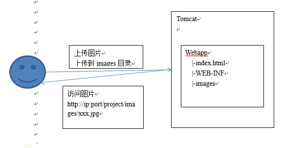
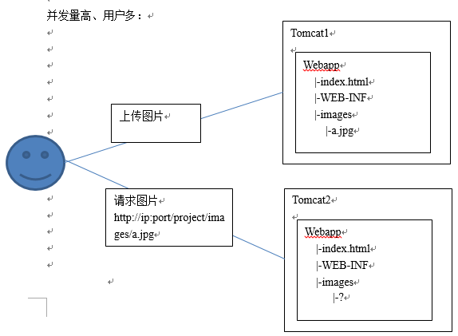
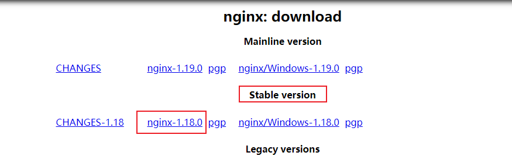

# Nginx

## 服务器概述

### 目前常见的web服务器

1，Apache([http://httpd.apache.org)](http://httpd.apache.org)/) 

它是世界上用的最多的web服务器，市场占有率达60%左右，模块非常丰富，系统非常稳定，可移植性好，但是比较消耗资源

2，lighttpd([http://www.lighttpd.net)](http://www.lighttpd.net)/) 

它是德国人开发的一个开源软件，目标是提供一个高性能的网站，它具有内存开销低，cpu占用低，效能好及模块丰富，Nginx的重要竞争对手之一

3，**tomcat**([http://tomcat.apache.org)](http://tomcat.apache.org)/) 

是一个开源的软件，运行servlet+jsp web应用软件，对静态文件，高并发的处理能力弱。

4，IBM websphere

  它功能完善，开放的Web应用程序服务器，是IBM电子商务计划的核心部分，它是基于java的应用环境，范围从简单到高级到企业级应用，相于对其它web服务器来说应该比较少

5，Microsoft IIS

   Microsoft的web服务器产品为Internet information Server (IIS)  IIS提供了图形界面管理工具，IIS是一种web服务器组件，其中有 web服务器，FTP服务器，nntp服务器，smtp服务器，因为有window2008和2012的支持，所以IIS也有一定的市场

### 各web服务器占有率

查询网站

https://news.netcraft.com/archives/2017/10/26/october-2017-web-server-survey-13.html



## Nginx概述

### 为什么使用Nginx？

在传统的Web项目中，并发量小，用户使用的少。所以在低并发的情况下，用户可以直接访问tomcat服务器，然后tomcat服务器返回消息给用户。比如，我们上传图片：



为了解决并发，可以使用负载均衡：也就是我们多增加几个tomcat服务器。当用户访问的时候，请求可以提交到空闲的tomcat服务器上。



但是这种情况下可能会有一种这样的问题：上传图片操作。我们把图片上传到了tomcat1上了，当我们要访问这个图片的时候，tomcat1正好在工作，所以访问的请求就交给其他的tomcat操作，而tomcat之间的数据没有进行同步，所以就发生了我们要请求的图片找不到。

为了解决这种情况，我们就想出了分布式。我们专门建立一个图片服务器，用来存储图片。这样当我们都把图片上传的时候，不管是哪个服务器接收到图片，都把图片上传到图片服务器。

图片服务器上需要安装一个http服务器，可以使用tomcat、apache、nginx。


看到这里大家可能会问，既然我们要选择的是http服务器，为什么不继续使用tomcat，而要使用Nginx？

原因如下：nginx常用做静态内容服务和代理服务器（不是你FQ那个代理），直面外来请求转发给后面的应用服务（tomcat，django等），tomcat更多用来做一个应用容器，让java web app跑在里面的东西，对应同级别的有jboss,jetty等东西。

### 什么是Nginx？

 Nginx是一个[http服务器](http://baike.baidu.com/link?url=a2dLY11NbWgcCzbX1s7JDyWLOh_QFjVlC2wys--TLKbZybTCA8oEP7c-5gEDCK35jFmQHG0YFRoAVEI8M7cbFcp74nDVgz1ckZiWAuntvCF_oxMSMDlDIWEGGN-63mTb)。是一个使用c语言开发的高性能的http服务器及反向代理服务器。Nginx是一款高性能的http 服务器/反向代理服务器及电子邮件（IMAP/POP3）代理服务器。由俄罗斯的程序设计师Igor Sysoev所开发，官方测试nginx能够支支撑5万并发链接，并且cpu、内存等资源消耗却非常低，运行非常稳定。

 **Nginx的应用场景**

   1、 http服务器。Nginx是一个http服务可以独立提供http服务。可以做网页静态服务器。

   2、 虚拟主机。可以实现在一台服务器虚拟出多个网站。例如个人网站使用的虚拟主机。

- 基于端口的，不同的端口
- 基于域名的，不同域名

   3、 反向代理，负载均衡。当网站的访问量达到一定程度后，单台服务器不能满足用户的请求时，需要用多台服务器集群可以使用nginx做反向代理。并且多台服务器可以平均分担负载，不会因为某台服务器负载高宕机而某台服务器闲置的情况。

## 安装Nginx

### Centos6下安装nginx

**下载Nginx**

 http://nginx.org/en/download.html 



### 安装

#### 2.1 环境要求

- Centos 6
- nginx-1.18.0.tar.gz

#### 2.2 先安装nginx依赖的包

nginx是C语言开发，建议在linux上运行，所以我们选择在linux上安装Nginx

- gcc

安装nginx需要先将官网下载的源码进行编译，编译依赖gcc环境，如果没有gcc环境，需要安装gcc

```shell
yum install gcc-c++ 
```

- PCRE

 PCRE(Perl Compatible Regular Expressions)是一个Perl库，包括 perl 兼容的正则表达式库。nginx的http模块使用pcre来解析正则表达式，所以需要在linux上安装pcre库。