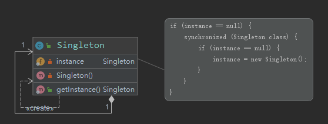
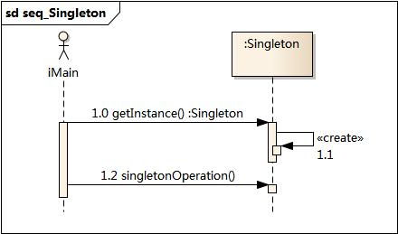

# 单例模式

> 作者：子墨同学
>
> 时间：2020-04-25

[TOC]

## 1. 模式背景

对于系统中的某些类来说，只有一个实例很重要。

**例如**

- 一个系统中可以存在多个打印任务，但是只能有一个正在工作的任务；
- 一个系统只能有一个窗口管理器或文件系统；

如何保证一个类只有一个实例并且这个实例易于被访问呢？定义一个全局变量可以确保对象随时都可以被访问，但不能防止我们实例化多个对象。

一个更好的解决办法是**让类自身负责保存它的唯一实例**。这个类可以保证没有其他实例被创建，并且它可以提供一个访问该实例的方法。这就是单例模式的模式背景。

## 2. 模式定义

**单例模式(Singleton Pattern)**：单例模式确保某一个类只有一个实例，而且**自行实例化并向整个系统提供这个实例**，这个类称为单例类，它提供全局访问的方法。

单例模式的要点有三个：

1) **单例类只能有一个实例**；

2) **单例类必须自己创建自己的唯一实例**；

3)**单例类必须给所有其他对象提供这一实例**。

单例模式是一种对象创建型模式。

## 3. 模式结构

单例模式包含如下角色：

•	`Singleton`：单例

### 3.1 类图




### 3.2 时序图



### 3.3 代码分析

**双检锁/双重校验锁（DCL，即 double-checked locking）**

```java
/**
 * 双重检查
 **/
public class Singleton {

    private static volatile Singleton instance;

    // 构造器私有化 -->外部不能new
    private Singleton() {
    }

    //  提供获取该对象的方法 线程安全 懒加载 提高效率
    public static Singleton getInstance() {
        if (instance == null) {
            synchronized (Singleton.class) {
                if (instance == null) {
                    instance = new Singleton();
                    /**
                     * new Singleton() 不是一个原子操作
                     * -> 可能发生指令重排
                     *
                     * 1. 分配内存空间
                     * 2. 执行构造方法，初始化对象
                     * 3. 把这个对象指向这个空间
                     *
                     * 正常的顺序 123 A线程
                     *  发生了指令重排
                     *  132  B线程  ->此时还没有完成对象的构造 instance还是指向一块空的区域，可能发生异常
                     *  
                     *  解决--> instance 加volatile关键字
                     *
                     */
                }
            }
        }
        return instance;
    }
}


```

## 4. 模式分析

单例模式的目的是保证一个类仅有一个实例，并提供一个访问它的全局访问点。

单例模式包含的角色只有一个，就是单例类——Singleton。

单例类拥有一个**私有构造函数**，确保用户无法通过new关键字直接实例化它。

除此之外，该模式中包含一个静态私有成员变量与静态公有的工厂方法，该工厂方法负责检验实例的存在性并实例化自己，然后存储在静态成员变量中，以确保只有一个实例被创建。

在单例模式的实现过程中，需要注意如下三点：

- **单例类的构造函数为私有**

- **提供一个自身的静态私有成员变量**

- **提供一个公有的静态工厂方法**。

## 5. 实例

在操作系统中，打印池(Print Spooler)是一个用于管理打印任务的应用程序，通过打印池用户可以删除、中止或者改变打印任务的优先级，在一个系统中只允许运行一个打印池对象，如果重复创建打印池则抛出异常。现使用单例模式来模拟实现打印池的设计。

## 6. 优点

- 在内存里只有一个实例，减少了内存的开销，尤其是频繁的创建和销毁实例。
- 避免对资源的多重占用。

## 7. 缺点

- 没有接口，不能继承，因此单例类的扩展有很大的困难。
- 一定程度上违背了“单一职责原则”。因为单例类既充当了工厂角色，提供了工厂方法，同时又充当了产品角色，包含一些业务方法，将产品的创建和产品的本身的功能融合到一起。

### 8. 适用环境

**在以下情况下可以使用单例模式**：

- 系统只需要一个实例对象，如系统要求提供一个唯一的序列号生成器，或者需要考虑资源消耗太大而只允许创建一个对象。
- 创建的一个对象需要消耗的资源过多。
- 在一个系统中要求一个类只有一个实例时才应当使用单例模式。

## 9. 其他7种实现方式

- **懒汉式，线程不安全**

  这种方式是最基本的实现方式，这种实现最大的问题就是不支持多线程。因为没有加锁 synchronized，所以严格意义上它并不算单例模式。

```java
/**
 *  饿汉式（静态常量）
 **/
public class SingletonDemo1 {
    // 1. 构造器私有化 -->外部不能new
    private SingletonDemo1(){

    }
    // 2. 类初始化的时候，立即加载对象
    private  final static  SingletonDemo1 instance = new SingletonDemo1();
    // 3. 提供获取该对象的方法
    public static SingletonDemo1 getInstance(){
        return instance;
    }
}
```


```java
/**
 *  饿汉式（静态代码块）
 **/
public class SingletonDemo2 {
    // 1. 构造器私有化 -->外部不能new
    private SingletonDemo2(){

    }
    // 2. 类初始化的时候
    private static SingletonDemo2 instance;
    // 在静态代码块中，创建单例对象
    static {
        instance= new SingletonDemo2();
    }
    // 3. 提供获取该对象的方法
    public static SingletonDemo2 getInstance(){
        return instance;
    }
}


```

**懒汉式**

```java
/**
 * 懒汉式（线程不安全）
 **/
public class SingletonDemo3 {
    //  构造器私有化 -->外部不能new
    private SingletonDemo3(){
    }

    private static SingletonDemo3 instance;
    //  提供获取该对象的方法,使用该方法采取创建对象
    public static SingletonDemo3 getInstance(){
        if(instance==null){
            instance=new SingletonDemo3();
        }
        return instance;
    }
}


```


```java
/**
 * 懒汉式（线程安全，同步方法）
 **/
public class SingletonDemo4 {
    //  构造器私有化 -->外部不能new
    private SingletonDemo4(){
    }

    private static SingletonDemo4 instance;
    // 提供获取该对象的方法,使用该方法采取创建对象 线程安全
    public static synchronized SingletonDemo4 getInstance(){
        if(instance==null){
            instance=new SingletonDemo4();
        }
        return instance;
    }
}


```


```java
/**
 *  懒汉式（线程不安全，同步代码块）
 **/
public class SingletonDemo5 {
    //  构造器私有化 -->外部不能new
    private SingletonDemo5() {
    }

    private static SingletonDemo5 instance;

    //  提供获取该对象的方法,使用该方法采取创建对象 线程不安全
    public static SingletonDemo5 getInstance() {

        if (instance == null) {
            // 在多线程环境下 还可能创建多个实例
            synchronized (SingletonDemo5.class) {
                instance = new SingletonDemo5();
            }
        }
        return instance;
    }
}


```


**静态内部类**

```java
/**
 *  静态内部类
 **/
public class SingletonDemo7 {

    private static volatile SingletonDemo7 instance;

    // 构造器私有化 -->外部不能new
    private SingletonDemo7() {
    }
    // 静态内部类 有一个instance属性
    private static class SingletonInstance{
        private static final SingletonDemo7 INSTANCE =new SingletonDemo7();
    }
    public static SingletonDemo7 getInstance(){
        return SingletonInstance.INSTANCE;
    }
}


```


**枚举**

反射也不能破坏单例模式

```java
/**
 * 枚举
 **/

public enum SingletonDemo8 {
    INSTANCE;
    public  void toDo(){
        System.out.println("hello");
    }
}
```


### 11. 总结

单例模式确保某一个类只有一个实例，而且自行实例化并向整个系统提供这个实例，这个类称为单例类，它提供全局访问的方法。

单例模式的要点有三个：1) **单例类只能有一个实例**；2) **单例类必须自己创建自己的唯一实例**；3)**单例类必须给所有其他对象提供这一实例**。例模式是一种对象创建型模式。

单例模式最主要的：**构造器私有化**

单例模式的主要优点在于提供了对唯一实例的受控访问并可以节约系统资源；其主要缺点在于因为缺少抽象层而难以扩展，且单例类职责过重。

单例模式适用情况包括：系统只需要一个实例对象；客户调用类的单个实例只允许使用一个公共访问点。

**很重要！！！**

## 参考资料

1. [图说设计模式](https://design-patterns.readthedocs.io/zh_CN/latest/index.html)

2. [单例模式 | 菜鸟教程](https://www.runoob.com/design-pattern/singleton-pattern.html)