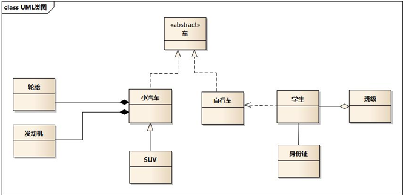
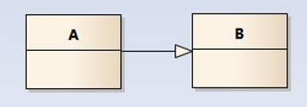
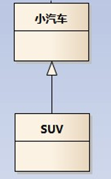
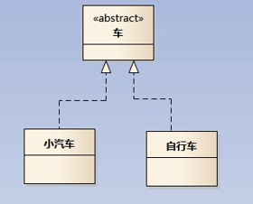
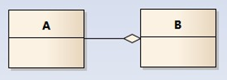
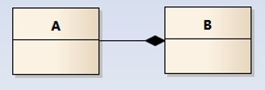
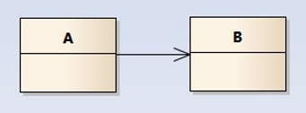
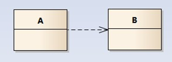

# 设计模式

> 作者：子墨同学
>
> 时间：2020-04-15

[TOC]

`软件模式`是将模式的一般概念应用于软件开发领域，即软件开发的总体指导思路或参照样板。

软件模式并非仅限于设计模式，还包括架构模式、分析模式和过程模式等，实际上，在软件生存期的每一个阶段都存在着一些被认同的模式。

在系统的学习设计模式之后，我们需要**达到3个层次**：

1. 能在白纸上画出所有的`模式结构`和`时序图`；

2. 能用代码实现；如果模式的代码都没有实现过，是用不出来的；即所谓，看得懂，不会用；

3. 灵活应用到工作中的项目中；

## 1. 设计模式的目的

编写软件过程中，程序员面临着来自**耦合性，内聚性以及可维护性，可扩展性，重用性，灵活性** 等多方面的挑战，设计模式是为了让程序(软件)，具有更好代码重用性 、可读性、 可扩展性、可靠性，呈现高内聚，低耦合的特性。

- 代码重用性 (即：相同功能的代码，不用多次编 写）
- 可读性 (即：编程规范性, 便于其他程序员的阅读和理解） 
- 可扩展性 (即：当需要增加新的功能时，非常的方便，称为可 维护）
- 可靠性 (即：当我们增加新的功能后，对原来的功能没有影响）
- 使程序呈现高内聚，低耦合的特性

## 2. 设计模式七大原则

设计模式原则，其实就是**程序员在编程时，应当遵守的原则**，也是各种**设计模式的基础**(即：**设计模式为什么这样设计的依据**)

设计模式常用的七大原则有:

- `单一职责原则`
- `接口隔离原则`
- `依赖倒转(倒置)原则`
- `里氏替换原则`
- `开闭原则`
- `迪米特法则`
- `合成复用原则`

### 2.1 单一职责原则

#### 2.1.1 介绍

对类来说的，**即一个类应该只负责一项职责**。如类 A 负责两个不同职责：职责 1，职责 2。当职责 1 需求变更而改变 A 时，可能造成职责 2 执行错误，所以需要将类 A 的粒度分解为 A1，A2

#### 2.1.2 单一职责原则注意事项和细节

- 降低类的复杂度，一个类只负责一项职责。
- 提高类的可读性，可维护性
- 降低变更引起的风险
- 通常情况下，我们应当遵守单一职责原则，只有逻辑足够简单，才可以在代码级违反单一职责原则；只有类中方法数量足够少，可以在方法级别保持单一职责原则

### 2.2 接口隔离原则(Interface Segregation Principle)

#### 2.2.1 介绍

客户端不应该依赖它不需要的接口，即**一个类对另一个类的依赖应该建立在最小的接口上**

### 2.3 依赖倒转原则

#### 2.3.1 介绍

依赖倒转原则(Dependence Inversion Principle)是指：

- 高层模块不应该依赖低层模块，二者都应该依赖其抽象
- **抽象不应该依赖细节，细节应该依赖抽象**
- 依赖倒转(倒置)的中心思想是**面向接口编程**
- 依赖倒转原则是基于这样的设计理念：相对于细节的多变性，抽象的东西要稳定的多。以抽象为基础
- 搭建的架构比以细节为基础的架构要稳定的多。在 java 中，抽象指的是接口或抽象类，细节就是具体的实现类
- 使用**接口或抽象类**的目的是制定好**规范**，而不涉及任何具体的操作，把**展现细节的任务交给他们的实现类**去完成

### 2.4 里氏替换原则

#### 2.4.1 中的继承性的思考和说明

- 继承包含这样一层含义：父类中凡是已经实现好的方法，实际上是在设定规范和契约，虽然它不强制要求所有的子类必须遵循这些契约，但是如果子类对这些已经实现的方法任意修改，就会对整个继承体系造成破坏。
-  **继承在给程序设计带来便利的同时，也带来了弊端**。比如使用继承会给程序带来**侵入性**，程序的可移植性降低，增加对象间的耦合性，如果一个类被其他的类所继承，则当这个类需要修改时，必须考虑到所有的子类，并且父类修改后，所有涉及到子类的功能都有可能产生故障
- 问题提出：**在编程中，如何正确的使用继承**? => **里氏替换**原则

#### 2.4.2 介绍

- 里氏替换原则(Liskov Substitution Principle)在 1988 年，由麻省理工学院的以为姓里的女士提出的。

- 如果对每个类型为 T1 的对象 o1，都有类型为 T2 的对象 o2，使得以 T1 定义的所有程序 P 在所有的对象 o1 都代换成 o2 时，程序 P 的行为没有发生变化，那么类型 T2 是类型 T1 的子类型。**换句话说，所有引用基类的地方必须能透明地使用其子类的对象**。

- 在使用继承时，遵循里氏替换原则，在**子类中尽量不要重写父类的方法**
- 里氏替换原则告诉我们，继承实际上让两个类耦合性增强了，在适当的情况下，可以通过**聚合，组合，依赖 来解决问题**。.

### 2.5 开闭原则

#### 2.5.1 基本介绍

- 开闭原则（Open Closed Principle）是编程中**最基础、最重要**的设计原则
- 一个软件实体如类，模块和函数应该**对扩展开放(对提供方)**，对**修改关闭(对使用方)**。用抽象构建框架，用实现扩展细节。
- **当软件需要变化时，尽量**通过扩展软件**实体的行为来实现变化，而不是**通过修改**已有的代码来实现变化。
-  编程中遵循其它原则，以及使用设计模式的目的就是遵循开闭原则。

### 2.6 迪米特法则

#### 2.6.1 基本介绍

- 一个对象应该对其他对象保持最少的了解
- 类与类关系越密切，耦合度越大
-  迪米特法则(Demeter Principle)又叫**最少知道原则**，即一个类**对自己依赖的类知道的越少越好**。也就是说，对于被依赖的类不管多么复杂，都尽量将逻辑封装在类的内部。对外除了提供的 public 方法，不对外泄露任何信息
- 迪米特法则还有个更简单的定义：只与直接的朋友通信
   **直接的朋友**：每个对象都会与其他对象有**耦合关系**，只要两个对象之间有耦合关系，我们就说这两个对象之间是朋友关系。耦合的方式很多，依赖，关联，组合，聚合等。其中，我们称出现**成员变量**，**方法参数**，**方法返回值**中的类为直接的朋友，而出现在**局部变量中的类不是直接的朋友**。也就是说，陌生的类最好不要以局部变量的形式出现在类的内部。

#### 2.6.2 迪米特法则注意事项和细节

- 
  迪米特法则的核心是降低类之间的耦合

- 但是注意：由于每个类都减少了不必要的依赖，因此迪米特法则只是要求降低类间(对象间)耦合关系， 并不是要求完全没有依赖关系

### 2.7 合成复用原则（Composite Reuse Principle）

#### 2.7.1 基本介绍

原则是尽量使用合成/聚合的方式，而不是使用继承

#### 2.7.2 设计原则核心思想

- 找出应用中可能需要变化之处，把它们独立出来，不要和那些不需要变化的代码混在一起。
  针对接口编程，而不是针对实现编程。
- 为了交互对象之间的**松耦合设计而努**力

##  2. 看懂UML类图和时序图

### 2.1  从一个示例开始

请看以下这个类图，类之间的关系是我们需要关注的：

- 车的类图结构为<<abstract>>，表示车是一个抽象类；

- 它有两个继承类：小汽车和自行车；它们之间的关系为**实现**关系，使用带空心箭头的虚线表示；

- 小汽车为与SUV之间也是继承关系，它们之间的关系为**泛化**关系，使用带空心箭头的实线表示；

- 小汽车与发动机之间是**组合**关系(强依赖关系)，使用带实心箭头的实线表示；

- 学生与班级之间是**聚合**关系（弱依赖关系），使用带空心箭头的实线表示；

- 学生与身份证之间为关联关系，使用一根实线表示；

- 学生上学需要用到自行车，与自行车是一种依赖关系，使用带箭头的虚线表示；

#### 2.1.1  类之间的关系

##### 泛化关系(generalization)

类的继承结构表现在UML中为：泛化(generalize)与实现(realize)

继承关系为 is-a的关系；两个对象之间如果可以用 is-a 来表示，就是继承关系：（..是..）

eg：自行车是车、猫是动物

泛化关系用一条带空心箭头的直接表示；如下图表示（A继承自B）；

 

eg：汽车在现实中有实现，可用汽车定义具体的对象；汽车与SUV之间为泛化关系；

 

注：最终代码中，泛化关系表现为继承**非抽象类**；

##### 实现关系(realize)

实现关系用一条带空心箭头的虚线表示；

eg：”车”为一个抽象概念，在现实中并无法直接用来定义对象；只有指明具体的子类(汽车还是自行车)，才 可以用来定义对象（”车”这个类在C++中用抽象类表示，在JAVA中有接口这个概念，更容易理解）

 

注：最终代码中，实现关系表现为继承抽象类；

##### 聚合关系(aggregation)

聚合关系用一条带空心菱形箭头的直线表示，如下图表示A聚合到B上，或者说B由A组成；

 

聚合关系用于表示实体对象之间的关系，表示整体由部分构成的语义；例如一个部门由多个员工组成；

与组合关系不同的是，整体和部分不是强依赖的，即使整体不存在了，部分仍然存在；例如：部门撤销了，人员不会消失，他们依然存在；

##### 组合关系(composition)

组合关系用一条带实心菱形箭头直线表示，如下图表示A组成B，或者B由A组成；

 

与聚合关系一样，组合关系同样表示整体由部分构成的语义；比如公司由多个部门组成；

但组合关系是一种**强依赖的特殊聚合关系**，如果整体不存在了，则部分也不存在了；例如：公司不存在了，部门也将不存在了；

##### 关联关系(association)

关联关系是用一条直线表示的；它描述不同类的对象之间的结构关系；它是一种静态关系， 通常与运行状态无关，一般由常识等因素决定的；它一般用来定义对象之间静态的、天然的结构； 所以，**关联关系是一种“强关联”的关系**；

比如，乘车人和车票之间就是一种关联关系；学生和学校就是一种关联关系；

关联关系默认不强调方向，表示对象间相互知道；如果**特别强调方向**，如下图，表示A知道B，但 B不知道A；

 

注：**在最终代码中，关联对象通常是以成员变量的形式实现的；**

##### 依赖关系(dependency)

依赖关系是用一套带箭头的虚线表示的；如下图表示A依赖于B；他描述一个对象在运行期间会用到另一个对象的关系；

 

与关联关系不同的是，它是一种**临时性**的关系，通常在运行期间产生，并且随着运行时的变化； 依赖关系也可能发生变化；

显然，依赖也有方向，双向依赖是一种非常糟糕的结构，我们总是应该保持单向依赖，杜绝双向依赖的产生；

注：在最终代码中，依赖关系体现为**类构造方法及类方法的传入参数**，箭头的指向为调用关系；依赖关系除了临时知道对方外，还是“使用”对方的方法和属性；

#### 2) 时序图

为了展示对象之间的交互细节，后续对设计模式解析的章节，都会用到时序图；

时序图（Sequence Diagram）是显示对象之间交互的图，这些对象是按时间顺序排列的。时序图中显示的是参与交互的对象及其对象之间消息交互的顺序。

时序图包括的建模元素主要有：对象（Actor）、生命线（Lifeline）、控制焦点（Focus of control）、消息（Message）等等。

## 3. 分类

### 3.1 创建型模式

**创建型模式**(Creational Pattern)对类的实例化过程进行了抽象，能够**将软件模块中对象的创建和对象的使用分离。**为了使软件的结构更加清晰，外界对于这些对象只需要知道它们共同的接口，而不清楚其具体的实现细节，使整个系统的设计更加符合单一职责原则。

**创建型模式在创建什么(What)，由谁创建(Who)，何时创建(When)**等方面都为软件设计者提供了尽可能大的灵活性。创建型模式隐藏了类的实例的创建细节，通过隐藏对象如何被创建和组合在一起达到使整个系统独立的目的。

#### 3.1.1 包含模式

- **简单工厂模式（Simple Factory）**:purple_heart::purple_heart::purple_heart::purple_heart:
- **工厂方法模式（Factory Method）**:purple_heart::purple_heart::purple_heart::purple_heart::purple_heart:
- 
  **抽象工厂模式（Abstract Factory）**:purple_heart::purple_heart::purple_heart::purple_heart::purple_heart:

- **建造者模式（Builder）**:purple_heart::purple_heart:

- **原型模式（Prototype）**:purple_heart::purple_heart::purple_heart:

- **单例模式（Singleton）**:purple_heart::purple_heart::purple_heart::purple_heart::purple_heart:

### 3.2 结构型模式

结构型模式(Structural Pattern)描述如何将类或者对象结合在一起形成更大的结构，就像搭积木，可以通过简单积木的组合形成复杂的、功能更为强大的结构。

结构型模式可以分为**类结构型模式和对象结构型模式**：

·      类结构型模式关心类的组合，由多个类可以组合成一个更大的系统，在类结构型模式中一般只存在继承关系和实现关系。 - 对象结构型模式关心类与对象的组合，通过关联关系使得在一个类中定义另一个类的实例对象，然后通过该对象调用其方法。 根据“合成复用原则”，在系统中尽量使用关联关系来替代继承关系，因此**大部分结构型模式都是对象结构型模式。**

#### 3.2.1 包含模式

**适配器模式(Adapter)**:purple_heart::purple_heart::purple_heart::purple_heart:

**桥接模式(Bridge)**:purple_heart::purple_heart::purple_heart:

**组合模式(Composite)**:purple_heart::purple_heart::purple_heart::purple_heart:

**装饰模式(Decorator)**:purple_heart::purple_heart::purple_heart:

**外观模式(Facade)**:purple_heart::purple_heart::purple_heart::purple_heart::purple_heart:

**享元模式(Flyweight)**:purple_heart:

**代理模式(Proxy)**:purple_heart::purple_heart::purple_heart::purple_heart::purple_heart:

### 3.3 行为型模式

行为型模式(Behavioral Pattern)是对在不同的对象之间划分责任和算法的抽象化。

行为型模式不仅仅关注类和对象的结构，而且重点关注它们之间的相互作用。

通过行为型模式，可以更加清晰地划分类与对象的职责，并研究系统在运行时实例对象 之间的交互。在系统运行时，对象并不是孤立的，它们可以通过相互通信与协作完成某些复杂功能，一个对象在运行时也将影响到其他对象的运行。

行为型模式分为类行为型模式和对象行为型模式两种：

·      类行为型模式：类的行为型模式使用继承关系在几个类之间分配行为，类行为型模式主要通过多态等方式来分配父类与子类的职责。

·      对象行为型模式：对象的行为型模式则使用对象的聚合关联关系来分配行为，对象行为型模式主要是通过对象关联等方式来分配两个或多个类的职责。根据“合成复用原则”，系统中要尽量使用关联关系来取代继承关系，因此大部分行为型设计模式都属于对象行为型设计模式。

#### 3.3.1 包含模式

**职责链模式(Chain of Responsibility)**:purple_heart::purple_heart::purple_heart:

**命令模式(Command)**:purple_heart::purple_heart::purple_heart::purple_heart:

**解释器模式(Interpreter)**:purple_heart:

**迭代器模式(Iterator)**:purple_heart::purple_heart::purple_heart::purple_heart::purple_heart:

**中介者模式(Mediator)**:purple_heart::purple_heart:

**备忘录模式(Memento)**:purple_heart::purple_heart:

**观察者模式(Observer)**:purple_heart::purple_heart::purple_heart::purple_heart::purple_heart:

**状态模式(State)**:purple_heart::purple_heart::purple_heart:

**策略模式(Strategy)**:purple_heart::purple_heart::purple_heart::purple_heart:

**模板方法模式(Template Method)**:purple_heart::purple_heart::purple_heart:

**访问者模式(Visitor)**:purple_heart:

## 参考资料

1. [图说设计模式](https://design-patterns.readthedocs.io/zh_CN/latest/index.html)