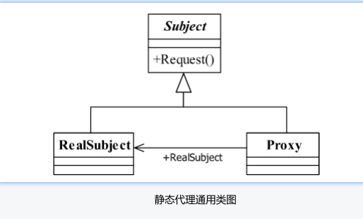
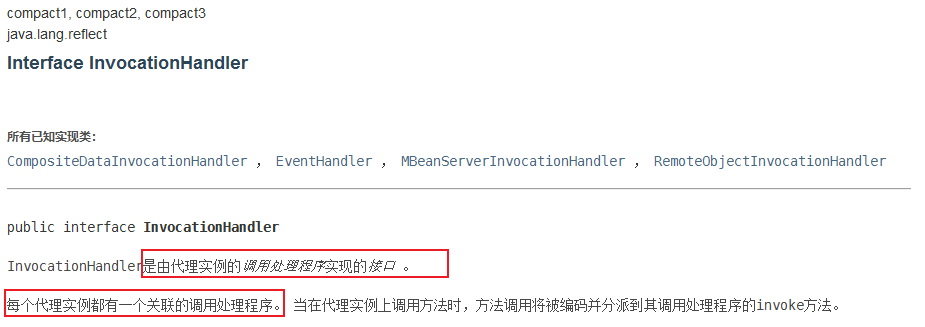
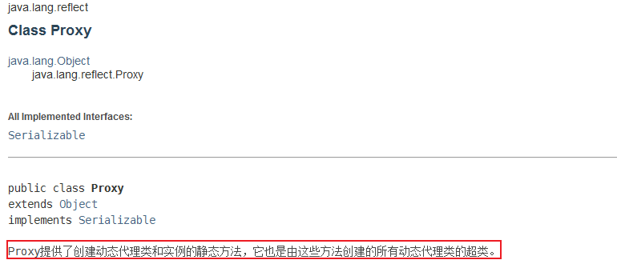
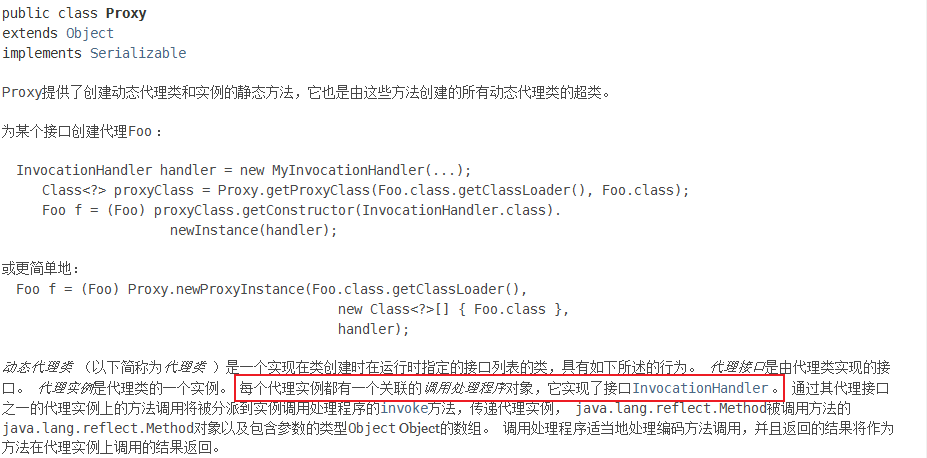
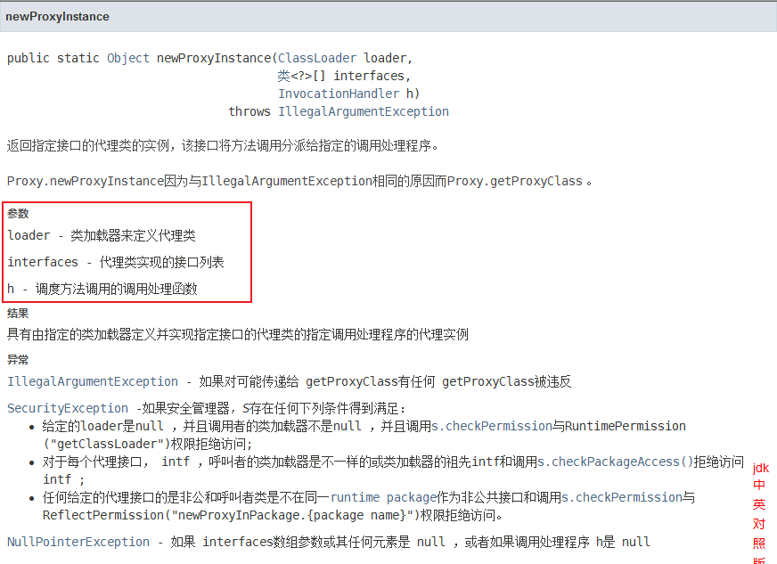

# 代理模式

[TOC]


## 简介

### 定义

**Provide a surrogate or placeholder for another object to controller access to it.(为其他对象提供一种代理，以控制对这个对象的访问。)**

即*通过代理对象访问目标对象*。这样做的好处是：可以在目标对象实现的基础上,增强额外的功能操作,即扩展目标对象的功能

### 分类

- 静态代理

  静态工厂方法在重复调用中能够返回相同对象，这样的能力允许类在任何时候都能严格控制存在的实例。这样做的类被称为*实例控制（ instance-controlled）*。编写实例控制类的原因有很多。实例控制允许一个类来保证它是一个单例的或不可实例化的。同时,它允许一个不可变的值类保证不存在两个相同的实例：当且仅当`a== b`时`a.equals(b)`。这是享元模式的基础。`Enum`类型提供了这个保证。

  


## 静态代理

### 简介

静态代理在使用时,需要定义接口或者父类,被代理对象(即目标对象)与代理对象**一起实现相同的接口或者是继承相同父类**

### 静态代理模式角色分析

`Subject`: 抽象主题角色（**一般使用接口或者抽象类来实现**）

`Proxy`: 代理主题角色 （**代理真实角色， 在真实主题角色处理完毕前后做预处理和善后处理工作。**）

`RealSubject`: 真实主题角色 （**被代理的角色，业务的具体执行者**）

`Client`：客户 (使用代理角色来进行一些操作 )



### 代码实现

**抽象主题类**

```java
public interface Subject {
     //定义一个方法
     public void request();
}
```

**真实主题类**

```java
public class RealSubject implements Subject {
     //实现方法
     public void request() {
             //业务逻辑处理
     }
}
```

**代理类**

```java
public class Proxy implements Subject {
     //要代理哪个实现类
     private Subject subject = null;
     //默认被代理者
     public Proxy(){
             this.subject = new Proxy();
     }
     //通过构造函数传递代理者
     public Proxy(Object...objects ){
     }
     //实现接口中定义的方法
     public void request() {
             this.before();
             this.subject.request();
             this.after();
     }
     //预处理
     private void before(){
             //do something
     }
     //善后处理
     private void after(){
             //do something
     }
}
```

**静态代理的好处:**

- 可以使得我们的真实角色更加纯粹 . 不再去关注一些公共的事情 .
- 公共的业务由代理来完成 ，实现了业务的分工 。
- 公共业务发生扩展时变得更加集中和方便 。

**缺点 :**

- 类的数量增加了 , 多了代理类 , 工作量变大了 。 开发效率降低 。

我们想要静态代理的好处，又不想要静态代理的缺点，所以 , 就有了**动态代理** !

#### 实际开发的例子

我们要为每一个方法添加一个日志，来记录用户的操作。怎么实现呢？我们可以在具体实现类上来完成，但是如果系统中的方法太多，就显得非常麻烦。我们也可以使用代理来实现，在不改变原来的业务情况下，就可以实现此功能了。

> 禁忌：在实际开发过程中，修改代码他人代码。
>

1. 创建一个抽象角色，抽象起来就是增删改查功能

```java
//抽象角色：增删改查业务
public interface UserService {   
    void add();   
    void delete();   
    void update();   
    void query();
}
```

2. 我们需要一个真实对象来完成这些增删改查操作

```java
//真实对象，完成增删改查操作的人
public class UserServiceImpl implements UserService {   
    public void add() {       
        System.out.println("增加了一个用户");  
    }   
    public void delete() {       
        System.out.println("删除了一个用户");  
    }   
    public void update() {       
        System.out.println("更新了一个用户");  
    }   
    public void query() {       
        System.out.println("查询了一个用户");  
    }
}
```

3. 设置一个代理类来处理日志，实际就是代理角色

```java
//代理角色，在这里面增加日志的实现
public class UserServiceProxy implements UserService {   
    private UserServiceImpl userService;   
    public void setUserService(UserServiceImpl userService) {
        this.userService = userService;  
    }   
    public void add() {
        log("add");       
        userService.add();  
    }   
    public void delete() {
        log("delete");    
        userService.delete(); 
    }   
    public void update() {  
        log("update");    
        userService.update(); 
    }   
    public void query() {
        log("query");     
        userService.query(); 
    }   
    public void log(String msg){  
        System.out.println("执行了"+msg+"方法"); 
    }
}
```

4. 测试访问类

```java
public class Client {   
    public static void main(String[] args) {
        //真实业务       
        UserServiceImpl userService = new UserServiceImpl(); 
        //代理类       
        UserServiceProxy proxy = new UserServiceProxy(); 
        //使用代理类实现日志功能！    
        proxy.setUserService(userService);       
        proxy.add();  
    }
}
```

## 动态代理

- 动态代理的角色和静态代理的一样 

- `动态代理的代理类是动态生成的` ， `静态代理的代理类是我们提前写好的`

- 动态代理分为两类 : **一类是基于接口动态代理 , 一类是基于类的动态代理**

- - 基于接口的动态代理----JDK动态代理
  - 基于类的动态代理----cglib
  - 现在用的比较多的是 javasist 来生成动态代理 。[javasist ](https://baike.baidu.com/item/JAVAssist/6039181?fr=aladdin)
  - 我们这里使用JDK的原生代码来实现，其余的道理都是一样的！

### JDK的动态代理需要了解两个类

核心 : `InvocationHandler`   和   `Proxy`  ， 打开JDK帮助文档看看

#### 【InvocationHandler：调用处理程序】



> `Object invoke(Object proxy, Method method, Object[] args) throws Throwable`
>
> 处理代理实例上的方法调用并返回结果。  当在与之关联的代理实例上调用方法时，将在调用处理程序中调用此方法。 
>
> 参数 
>
> `proxy` - 调用该方法的代理实例 
>
> `method` -所述`方法`对应于调用代理实例上的接口方法的实例。  `方法`对象的声明类将是该方法声明的接口，它可以是代理类继承该方法的代理接口的超级接口。 
>
> `args`  -包含的方法调用传递代理实例的参数值的对象的阵列，或`null`如果接口方法没有参数。  原始类型的参数包含在适当的原始包装器类的实例中，例如`java.lang.Integer`或`java.lang.Boolean`  。 


#### 【Proxy  : 代理】








```java
//生成代理类
public Object getProxy(){   
    return Proxy.newProxyInstance(this.getClass().getClassLoader(),         rent.getClass().getInterfaces(),this);
}
```

### 代码实现 

抽象角色和真实角色和之前的一样！

**抽象角色**

```java
//抽象角色：租房
public interface Rent {  
    public void rent();
}
```

**真实角色**

```java
//真实角色: 房东，房东要出租房子
public class Host implements Rent{
    public void rent() {      
        System.out.println("房屋出租");  
    }
}
```

**代理角色**

```java
public class ProxyInvocationHandler implements InvocationHandler {   
    private Rent rent;   
    public void setRent(Rent rent) {
        this.rent = rent;  
    }   
    //生成代理类，重点是第二个参数，获取要代理的抽象角色！之前都是一个角色，现在可以代理一类角色   
    public Object getProxy(){  
        return Proxy.newProxyInstance(this.getClass().getClassLoader(),               rent.getClass().getInterfaces(),this);  
    }  
    // proxy : 代理类 method : 代理类的调用处理程序的方法对象.   // 处理代理实例上的方法调用并返回结果  
    @Override 
    public Object invoke(Object proxy, Method method, Object[] args) throws Throwable {       
        seeHouse();       
        //核心：本质利用反射实现！      
        Object result = method.invoke(rent, args);     
        fare();       
        return result;  
    }  
    //看房   
    public void seeHouse(){
        System.out.println("带房客看房");  
    }   
    //收中介费  
    public void fare(){ 
        System.out.println("收中介费");
    }
}
```

**客户端调用**

```java
//租客
public class Client {   
    public static void main(String[] args) {  
        //真实角色       
        Host host = new Host();    
        //代理实例的调用处理程序     
        ProxyInvocationHandler pih = new ProxyInvocationHandler();   
        pih.setRent(host); 
        //将真实角色放置进去！      
        Rent proxy = (Rent)pih.getProxy(); 
        //动态生成对应的代理类！      
        proxy.rent(); 
    }
}
```

核心：**一个动态代理 , 一般代理某一类业务 , 一个动态代理可以代理多个类，代理的是接口！**

### 深化理解

使用动态代理实现上边的日志功能。

编写一个通用的动态代理实现的类，所有的代理对象设置为Object即可！

```java

public class ProxyInvocationHandler implements InvocationHandler {
    private Object target;

    public void setTarget(Object target) {
        this.target = target;
    }

    //生成代理类
    public Object getProxy(){
        return Proxy.newProxyInstance(this.getClass().getClassLoader(),
                target.getClass().getInterfaces(),this);
    }

    // proxy : 代理类
    // method : 代理类的调用处理程序的方法对象.
    public Object invoke(Object proxy, Method method, Object[] args) throws Throwable {
        log(method.getName());
        Object result = method.invoke(target, args);
        return result;
    }

    public void log(String methodName){
        System.out.println("执行了"+methodName+"方法");
    }

}
```

测试！

```java
public class Test {
   public static void main(String[] args) {
       //真实对象
       UserServiceImpl userService = new UserServiceImpl();
       //代理对象的调用处理程序
       ProxyInvocationHandler pih = new ProxyInvocationHandler();
       pih.setTarget(userService); //设置要代理的对象
       UserService proxy = (UserService)pih.getProxy(); //动态生成代理类！
       proxy.delete();
  }
}
```

结果

```java
执行了delete方法
删除了一个用户
```

### 动态代理的好处

静态代理有的它都有，静态代理没有的，它也有！

- 可以使得我们的真实角色更加纯粹 ，不再去关注一些公共的事情 
- 公共的业务由代理来完成 ，实现了业务的分工 
- 公共业务发生扩展时变得更加集中和方便 
- 一个动态代理 , 一般代理某一类业务
- 一个动态代理可以代理多个类，代理的是接口

## 参考资料

1. [狂神说Spring06：静态/动态代理模式](https://mp.weixin.qq.com/s/McxiyucxAQYPSOaJSUCCRQ)

2. [图说设计模式](https://design-patterns.readthedocs.io/zh_CN/latest/index.html)