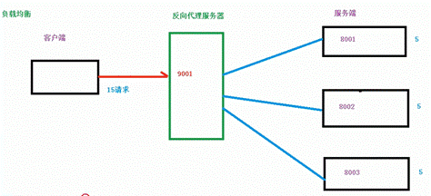
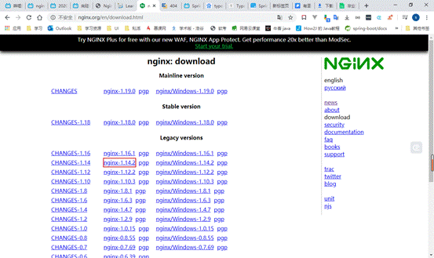
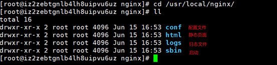
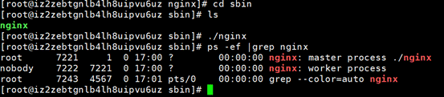
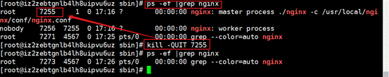
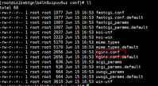

# 内容介绍

**1、nginx基本概念**

(1) nginx是什么，能做什么事情

(2) 反向代理

(3) 负载均衡

(4) 动静分离

**2、nginx 安装、常用命令和配置文件(掌握）**

(1) 在liunx系统中安装nginx

(2) nginx常用命令

(3) nginx 配置文件

**3****、nginx 配置实例 ---- 反向代理**

**4****、nginx 配置实例 ---- 负载均衡**

**5****、nginx 配置实例 ---- 动静分离**

**6****、nginx配置高可用集群**

**7****、nginx 原理**

 

## 第 1 章 Nginx 简介

###  1.1 Nginx 概述

Nginx ("engine x") 是**一个高性能的 HTTP 和反向代理服务器**,特点是占有内存少，并发能力强，事实上nginx的并发能力确实在同类型的网页服务器中表现较好，中国大陆使用nginx网站用户有：百度、京东、新浪、网易、腾讯、淘宝等

###  1.2 Nginx 作为 web 服务器

Nginx 可以作为静态页面的 web 服务器，同时还支持 CGI 协议的动态语言，比如 perl、php等。但是不支持 java。Java 程序只能通过与 tomcat 配合完成。Nginx 专为性能优化而开发，性能是其最重要的考量,实现上非常注重效率 ，能经受高负载的考验,有报告表明能支持高达 50,000 个并发连接数。

https://lnmp.org/nginx.html

###  1.3 正向代理

Nginx 不仅可以做反向代理，实现负载均衡，还能用作正向代理来进行上网等功能。

正向代理：如果把局域网外的 Internet 想象成一个巨大的资源库，则局域网中的客户端要访问 Internet，则需要通过代理服务器来访问，这种代理服务就称为正向代理。**（需要在客户端中配置代理服务器）**

###  1.4 反向代理

反向代理，其实客户端对代理是无感知的，因为**客户端不需要任何配置就可以访问**，我们只需要将请求发送到**反向代理服务器**，由反向代理服务器去选择目标服务器获取数据后，在返回给客户端，此时反向代理服务器和目标服务器对外就是一个服务器，暴露的是**代理服务器地址**，隐藏了真实服务器 IP 地址。

###  1.5 负载均衡

客户端发送多个请求到服务器，服务器处理请求，有一些可能要与数据库进行交互，服务器处理完毕后，再将结果返回给客户端。

这种架构模式对于早期的系统相对单一，并发请求相对较少的情况下是比较适合的，成本也低。但是随着信息数量的不断增长，访问量和数据量的飞速增长，以及系统业务的复杂度增加，这种架构会造成服务器相应客户端的请求日益缓慢，并发量特别大的时候，还容易造成服务器直接崩溃。很明显这是由于服务器性能的瓶颈造成的问题，那么如何解决这种情况呢？

我们首先想到的可能是升级服务器的配置，比如提高 CPU 执行频率，加大内存等提高机器的物理性能来解决此问题，但是我们知道摩尔定律的日益失效，硬件的性能提升已经不能满足日益提升的需求了。最明显的一个例子，天猫双十一当天，某个热销商品的瞬时访问量是极其庞大的，那么类似上面的系统架构，将机器都增加到现有的顶级物理配置，都是不能够满足需求的。那么怎么办呢？

上面的分析我们去掉了增加服务器物理配置来解决问题的办法，也就是说纵向解决问题的办法行不通了，那么横向增加服务器的数量呢？这时候集群的概念产生了，单个服务器解决不了，我们增加服务器的数量，然后将请求分发到各个服务器上，将原先请求集中到单个服务器上的情况改为将请求分发到多个服务器上，将负载分发到不同的服务器，也就是我们所说的**负载均衡。**

 

###  1.6 动静分离

为了加快网站的解析速度，可以把**动态页面**和**静态页面**由不同的服务器来解析，加快解析速度。降低原来单个服务器的压力。

## 第 2 章 Nginx 安装

###  2.1 进入 nginx 官网，下载

http://nginx.org/

###  2.2 准备

Nginx的安装需要确定Linux安装了相关的几个库，否则配置和编译都会出现错误，具体检查安装过程为：

（1）gcc编译器是否安装

yum list installed | grep gcc #检查是否安装 yum install gcc -y #执行安装

（2）openssl库是否安装

yum list installed | grep openssl #检查是否安装 yum install openssl openssl-devel -y #执行安装

（3）pcre库是否安装

yum list installed | grep pcre #检查是否安装 yum install pcre pcre-devel -y #执行安装

（4）zlib库是否安装

yum list installed |grep zlib #检查是否安装 yum install zlib zlib-devel -y #执行安装

（5）一次性安装，执行命令如下：

yum install gcc openssl openssl-devel pcre pcre-devel zlib zlib-devel -y

###  2.3 正式安装

安装好以上的库就可以正式安装Nginx了

（1）上传下载的nginx到服务器，解压 

[root@walker software]# tar -zxvf nginx-1.14.2.tar.gz

（2）切换至解压后的目录

[root@walker software]# cd nginx-1.14.2

（3）在nginx主目录 nginx-1.14.2下执行

[root@walker nginx-1.14.2]# ./configure --prefix=/usr/local/nginx

（4）执行命令进行编译

[root@walker nginx-1.14.2]# make

（5）执行命令进行安装

[root@walker nginx-1.14.2]# make install

安装成功后，可以切换到/usr/local/nginx目录下查看内容

## 第 3 章 章 nginx 常用的命令和配置文件

###  3.1 nginx 常用的命令 

（1）启动命令

**普通启动**

在/usr/local/nginx/sbin 目录下执行 ./nginx

访问http://47.94.99.146 nginx的默认端口是80端口

**通过指定配置文件启动**

./nginx -c /usr/local/nginx/conf/nginx.conf /usr/local/nginx/sbin/nginx -c /usr/local/nginx/conf/nginx.conf [-t]

其中-c是指定配置文件（绝对路径）-t参数是可选的，可以用于检查配置文件是否出错

通过 ps -ef|grep nginx 命令检查是否启动

（2）关闭命令

在/usr/local/nginx/sbin 目录下执行 ./nginx -s stop

**优雅的关闭**

找出nginx的进程号：ps -ef|grep nginx

执行命令：kill -QUIT 主pid

**注意：**

l 其中pid是主进程号的pid（master process），其他为子进程的pid（worker process)

l 这种关闭方式会处理完请求后在关闭

**快速关闭**

找出nginx的进程号：ps -ef|grep nginx

执行命令：kill -TERM 主pid

**注意：**

l 其中pid是主进程号的pid（master process），其他为子进程的pid（worker process)

l 这种关闭方式不管请求是否处理完成，直接关闭

强制关闭进程，子进程是不会被关闭的 所以尽量少用kill -9 

 

（3）重新加载命令（修改配置的时候使用）

在/usr/local/nginx/sbin 目录下执行 ./nginx -s reload  

###  3.2 nginx.conf 配置文件

nginx 安装目录下，其默认的配置文件都放在这个目录的 conf 目录下，而主配置文件nginx.conf 也在其中，后续对 nginx 的使用基本上都是对此配置文件进行相应的修改

 