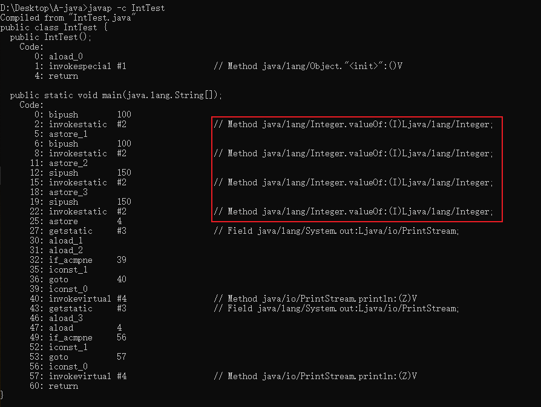

# Integer缓存问题

> 作者：子墨同学
>
> 时间：2020-04-24

[TOC]


#### 手册规约

> 7. 【强制】所有整型包装类对象之间`值的比较`，全部使用 equals 方法比较。
> 说明：对于 Integer var = ? 在`-128 至 127` 范围内的赋值，Integer 对象是在 IntegerCache.cache 产生，会复用已有对象，这个区间内的 Integer 值可以直接使用==进行判断，但是这个区间之外的所有数据，都会在堆上产生，并不会复用已有对象，这是一个大坑，推荐使用 equals 方法进行判断。

##### 代码示例

```java
public class IntTest {
	public static void main(String[] args) {
	    Integer a = 100, b = 100, c = 150, d = 150;
	    System.out.println(a == b);
	    System.out.println(c == d);
	}
}
```

##### 程序输出的结果分别为： `true` , `false`。

#### 源码

`Integer var = ?` 形式声明变量，会通过 `java.lang.Integer.valueOf(int)` 函数来构造 `Integer` 对象。

我们先看该函数源码：

```java
/**
 * Returns an {@code Integer} instance representing the specified
 * {@code int} value.  If a new {@code Integer} instance is not
 * required, this method should generally be used in preference to
 * the constructor {@link #Integer(int)}, as this method is likely
 * to yield significantly better space and time performance by
 * caching frequently requested values.
 *
 * This method will always cache values in the range -128 to 127,
 * inclusive, and may cache other values outside of this range.
 *
 * @param  i an {@code int} value.
 * @return an {@code Integer} instance representing {@code i}.
 * @since  1.5
 */
public static Integer valueOf(int i) {
    if (i >= IntegerCache.low && i <= IntegerCache.high)
        return IntegerCache.cache[i + (-IntegerCache.low)];
    return new Integer(i);
}
```

通过源码可以看出，如果用 `Ineger.valueOf(int)` 来创建整数对象，参数大于等于整数缓存的最小值（ `IntegerCache.low` ）并小于等于整数缓存的最大值（ `IntegerCache.high`）, 会直接从缓存数组 (`java.lang.Integer.IntegerCache.cache`) 中提取整数对象；否则会 `new` 一个整数对象。

**那么这里的缓存最大和最小值分别是 -128和127**

**那么为什么会缓存这一段区间的整数对象呢**？

通过注释我们可以得知：**如果不要求必须新建一个整型对象，这种方法一般应优先于构造函数中使用Integer(int)，缓存最常用的值（提前构造缓存范围内的整型对象），会更省空间，速度也更快。**

##### 启发

> 如果想减少内存占用，提高程序运行的效率，可以将常用的对象提前缓存起来，需要时直接从缓存中提取。

#####  `Integer` 缓存的区间是可以修改的

通过上述源码和注释我们还无法回答这个问题，接下来，我们继续看 `java.lang.Integer.IntegerCache` 的源码：

```java
/**
 * Cache to support the object identity semantics of autoboxing for values between
 * -128 and 127 (inclusive) as required by JLS.
 *
 * The cache is initialized on first usage.  The size of the cache
 * may be controlled by the {@code -XX:AutoBoxCacheMax=<size>} option.
 * During VM initialization, java.lang.Integer.IntegerCache.high property
 * may be set and saved in the private system properties in the
 * sun.misc.VM class.
 */
private static class IntegerCache {
    static final int low = -128;
    static final int high;
    static final Integer cache[];

    static {
        // high value may be configured by property
        int h = 127;
        String integerCacheHighPropValue =
            sun.misc.VM.getSavedProperty("java.lang.Integer.IntegerCache.high");
        if (integerCacheHighPropValue != null) {
            try {
                int i = parseInt(integerCacheHighPropValue);
                i = Math.max(i, 127);
                // Maximum array size is Integer.MAX_VALUE
                h = Math.min(i, Integer.MAX_VALUE - (-low) -1);
            } catch( NumberFormatException nfe) {
                // If the property cannot be parsed into an int, ignore it.
            }
        }
        high = h;

        cache = new Integer[(high - low) + 1];
        int j = low;
        for(int k = 0; k < cache.length; k++)
            cache[k] = new Integer(j++);

        // range [-128, 127] must be interned (JLS7 5.1.7)
        assert IntegerCache.high >= 127;
    }

    private IntegerCache() {}
}

```

通过 `IntegerCache` 代码和注释我们可以看到，最小值是固定值 -128， 最大值并不是固定值，缓存的最大值是可以通过虚拟机参数 `-XX:AutoBoxCacheMax=<size>` 或 `-Djava.lang.Integer.IntegerCache.high=` 来设置的，未指定则为 127。

**为什么要缓存这个范围的数据？**

> **是为了自动装箱时可以复用这些对象** ，这也是 JLS[2](https://www.imooc.com/read/55/article/1139#fn2) 的要求。

我们可以参考 JLS 的 [Boxing Conversion 部分](https://docs.oracle.com/javase/specs/jls/se8/html/jls-5.html#jls-5.1.7)的相关描述。

> If the value`p`being boxed is an integer literal of type `int`between `-128`and `127`inclusive ([§3.10.1](https://docs.oracle.com/javase/specs/jls/se8/html/jls-3.html#jls-3.10.1)), or the boolean literal `true`or`false`([§3.10.3](https://docs.oracle.com/javase/specs/jls/se8/html/jls-3.html#jls-3.10.3)), or a character literal between `'\u0000'`and `'\u007f'`inclusive ([§3.10.4](https://docs.oracle.com/javase/specs/jls/se8/html/jls-3.html#jls-3.10.4)), then let `a`and `b`be the results of any two boxing conversions of `p`. It is always the case that `a`==`b`.
>
> 在 -128 到 127 （含）之间的 int 类型的值，或者 boolean 类型的 true 或 false， 以及范围在’\u0000’和’\u007f’ （含）之间的 char 类型的数值 p， 自动包装成 a 和 b 两个对象时， 可以使用 a == b 判断 a 和 b 的值是否相等。

#### 反编译

那么究竟 `Integer var = ?` 形式声明变量，是不是通过 `java.lang.Integer.valueOf(int)` 来构造 `Integer` 对象呢？ 我们可以通过对编译后的 class 文件进行反汇编来查看。

- 首先编译源代码：`javac IntTest.java`


- 然后需要对代码进行反汇编，执行：`javap -c IntTest`


> 如果想了解 `javap` 的用法，直接输入 `javap -help` 查看用法提示（很多命令行工具都支持 `-help` 或 `--help` 给出用法提示）。
>
> 

反编译后，我们得到以下代码：



可以明确得 "看到" 这四个 ``Integer var = ? `形式声明的变量的确是通过` java.lang.Integer.valueOf(int) `来构造` Integer` 对象的。

**对汇编后的代码进行详细分析**

https://www.imooc.com/read/55/article/1139

### Long 的缓存问题分析

####  源码分析

 `java.lang.Long#valueOf(long)` 的源码：

```java
/**
 * Returns a {@code Long} instance representing the specified
 * {@code long} value.
 * If a new {@code Long} instance is not required, this method
 * should generally be used in preference to the constructor
 * {@link #Long(long)}, as this method is likely to yield
 * significantly better space and time performance by caching
 * frequently requested values.
 *
 * Note that unlike the {@linkplain Integer#valueOf(int)
 * corresponding method} in the {@code Integer} class, this method
 * is <em>not</em> required to cache values within a particular
 * range.
 *
 * @param  l a long value.
 * @return a {@code Long} instance representing {@code l}.
 * @since  1.5
 */
public static Long valueOf(long l) {
    final int offset = 128;
    if (l >= -128 && l <= 127) { // will cache
        return LongCache.cache[(int)l + offset];
    }
    return new Long(l);
}
```

发现该函数的写法和 `Ineger.valueOf(int)` 非常相似。

我们同样也看到， `Long` 也用到了缓存。 使用 `java.lang.Long.valueOf(long)` 构造 `Long` 对象时，值在 **[-128, 127]** 之间的 `Long` 对象直接从缓存对象数组中提取。

而且注释同样也提到了：**缓存的目的是为了提高性能**。

但是通过注释我们发现这么一段提示：

> Note that unlike the {@linkplain Integer#valueOf(int) corresponding method} in the {@code Integer} class, this method is *not* required to cache values within a particular range.
>
> 注意：和 `Ineger.valueOf(int)` 不同的是，此方法并没有被要求缓存特定范围的值。

这也正是上面源码中缓存范围判断的注释为何用 `// will cache` 的原因（可以对比一下上面 `Integer` 的缓存的注释）。

因此我们可知，虽然此处采用了缓存，但应该不是 JLS 的要求。

**那么 `Long` 类型的缓存是如何构造的呢？**

我们查看缓存数组的构造：

```java
private static class LongCache {
    private LongCache(){}

    static final Long cache[] = new Long[-(-128) + 127 + 1];

    static {
        for(int i = 0; i < cache.length; i++)
            cache[i] = new Long(i - 128);
    }
}
```

可以看到，它是在静态代码块中填充缓存数组的。

####  反编译

同样地我们也编写一个示例片段：

```java
public class LongTest {

    public static void main(String[] args) {
        Long a = -128L, b = -128L, c = 150L, d = 150L;
        System.out.println(a == b);
        System.out.println(c == d);
    }
}
```

通过发编译我们可以发现 `Long var = ?` 的确是通过 `java.lang.Long.valueOf(long)` 来构造对象的。

####  总结

- 所有整型包装类对象之间`值的比较`，全部使用 equals 方法比较。
- 使用`Integer var = ?` 形式声明变量，会通过 `java.lang.Integer.valueOf(int)` 函数来构造 `Integer` 对象。
- `Integer`的缓存最大和最小值分别是 -128和127
- `Integer`缓存最小值是固定值 -128， 最大值并不是固定值，缓存的最大值是可以通过虚拟机参数 `-XX:AutoBoxCacheMax=<size>` 或 `-Djava.lang.Integer.IntegerCache.high=<size>` 来设置的，未指定则为 127。
- 使用`Long var = ?` 形式声明变量，会通过 `java.lang.Long.valueOf(long)` 函数来构造 `Long` 对象。
-  `Long` 也用到了缓存。 使用 `java.lang.Long.valueOf(long)` 构造 `Long` 对象时，值在 **[-128, 127]** 之间的 `Long` 对象直接从缓存对象数组中提取。


## 参考资料

1. [阿里巴巴Java开发手册]()
2. [解锁大厂思维：剖析《阿里巴巴 Java 开发手册》](https://www.imooc.com/read/55)